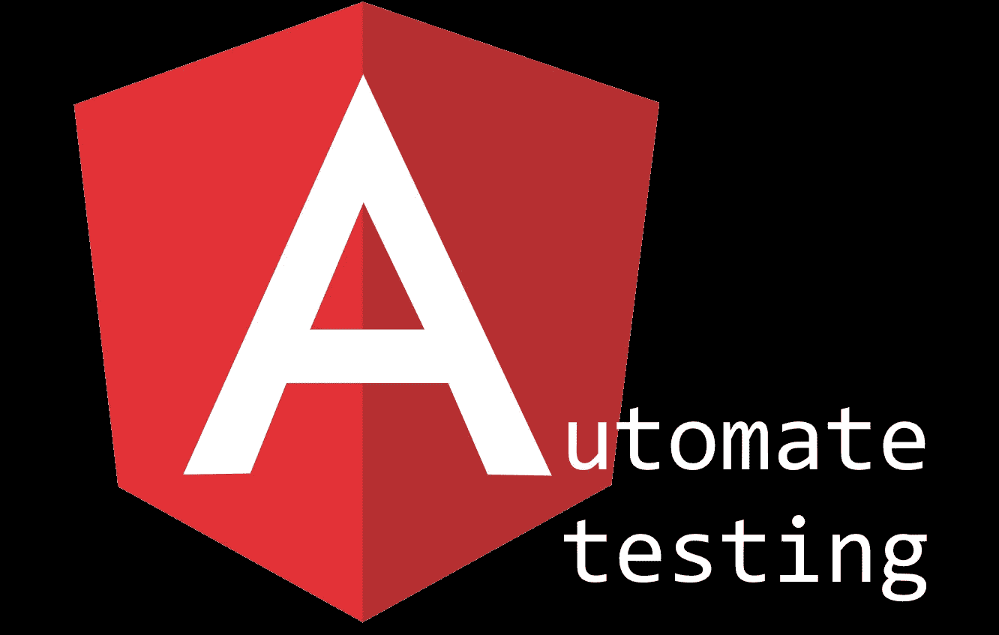
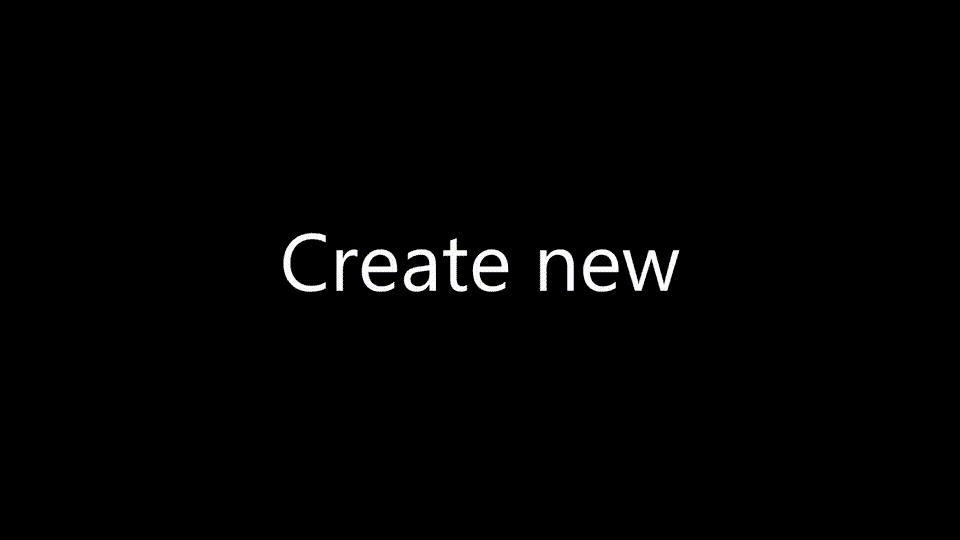
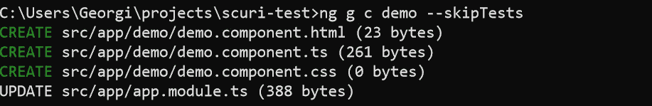
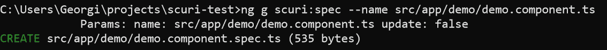
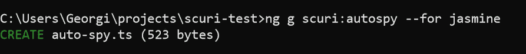
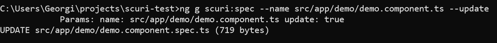

# 角度单元测试自动化

> 原文：<https://itnext.io/angular-unit-test-automation-8f6efcb1f1b6?source=collection_archive---------0----------------------->



我如何自动化我的单元测试创建和更新工作？

# 如果我告诉你我可以自动生成你的单元测试会怎么样？然后维护它们？

## TL；DR；

> 没有杂务。没有无聊的样板。只是测试。

安装 SCuri 和**创建**或**更新**一个**规格**文件通过:

```
**npm install scuri**
**ng g scuri:spec --name src/app/my.component.ts** 
*# OR to update an existing spec*
**ng g scuri:spec --name src/app/with-spec.component.ts --update**
```

> 这就需要 [**角度 CLI 6**](https://github.com/angular/angular-cli/releases/tag/v6.0.0) 。对于以前的版本，请参见自述文件中的[故障排除部分。](https://github.com/gparlakov/scuri#rule-result-function)



标题实际上使用了支持角度< 6 的[原理图 CLI](https://www.npmjs.com/package/@angular-devkit/schematics-cli)

它还带有一个 **VS 代码扩展**！[https://marketplace.visualstudio.com/items?itemName = gparlakov . scuri-code](https://marketplace.visualstudio.com/items?itemName=gparlakov.scuri-code)

# 哇，这看起来太棒了。但是有什么问题呢？

实际上只有一个:

1.  以特定的方式组织你的测试。*

**或者更确切地说，当工具生成它们时保留它*

SCuri 假设测试将有一个特定的**结构**。它**假设**有一个`**setup**` 函数(或者如果缺少的话创建一个)发生在**设置**规格**条件**的地方。并且测试的**名称**包括被测试类上的**公共方法**的名称。在本文的[中阅读更多相关信息(参见第 4 点和第](https://medium.com/ng-gotchas/an-opinionated-approach-to-testing-angular-4cf14ef7463f))。

这些假设**允许**it(SCuri)**自动化**为角度组件、服务和普通的旧类型脚本类创建和更新单元测试的**任务**。

## 但是等等，“`***ng generate component"***` 已经生成了一个 spec，对吧？为什么我需要另一个工具？

是的，确实如此。但是一旦第一个**依赖**被添加到那个生成的组件，并且**测试**需要被**更新**，那就是 Angular CLI 从**下降到**的地方。而这就是 SCuri **闪耀**的地方！

# 我们试试吧！

*假设 SCuri 安装在* `**npm install scuri**` *项目文件夹中，并且******CLI****是版本* ***6*** *或更高版本。***

****

**我已经创建了一个没有测试的演示组件**

**`ng g demo --skipTests`**

**`ng g scuri:spec --name src/app/demo/demo.component.ts`**

****

**嘣，你有了你的第一个魔法天赋！**

**这里有几件事需要注意:
1。`**setup**`功能。这是所有设置测试前提和依赖的地方。
2。`**autoSpy**`功能。这将为您的依赖项创建自动模拟。它将带**任意类**和**嘲弄**其**公共** **方法** (s *ee 详情见*[*scurie 自述*](https://github.com/gparlakov/scuri#autospy-path-in-tsconfigjson) )。并且可以通过工具**为你生成****！
`ng g scuri:autospy — for jasmine`:****

********

****现在是有趣的部分:****

****创建服务:****

****`ng g service my`****

********

****将它包含在组件依赖项中。让我们也添加一个公共事件处理方法来更好地衡量。****

****现在运行`ng g scuri:spec --name src/app/demo/demo.component.ts --update`****

********

****而现在**依赖**被**嘲讽**，在 **MyComponent build** 函数中**包含了**！并且**新方法**有一个**测试支架**供其使用！****

****剩下的就是逻辑，只有你这个人类可以创作。****

## ****我还可以用`setup`功能做什么？****

****对于每个测试用例，我们通常需要一些设置。并且把它留在`it`主体中会使它难以阅读。所以我们可以使用`setup`返回的 builder 并在上面附加方法来设置具体的细节。****

****例如，假设我们需要在`ngOnInit`中获取一些数据****

****我们再次运行`ng g scuri:spec --name src/app/demo/demo.component.ts --update`来更新依赖关系。现在我们可以在测试中使用由`autoSpy`创建的模拟:****

****或者，我们可以在设置生成器中移动模拟零件:****

****现在我们的测试是 **cleaner** 并调用一个方法，该方法的命名是为了让**告诉**读者**目标是什么，而不是期望他们**通读**模拟声明并**推断**作者的意思。名字承载了作者的**意图**！(这是一个虚构的琐碎例子——想想你的组件做了什么，以及你是如何嘲笑它的！)******

****注意我们如何在`default`构建器方法中调用`withHeroes`。这是因为每次我们调用`ngOnInit`时，我们都需要订阅一个可观察对象，否则我们会得到一个异常，即`undefined`上没有`subscribe`方法****

## ****让我们来测试一下 SCuri 吧！(:****

****让我们在现实世界的项目中尝试一下吧！还有什么比[现实世界的例子 App](https://github.com/gothinkster/angular-realworld-example-app) 更好的呢！这是一个示例中型克隆 Angular 应用程序，只是碰巧没有单元测试(截至今天)。****

```
****git clone [https://github.com/gothinkster/angular-realworld-example-app](https://github.com/gothinkster/angular-realworld-example-app)
cd angular-realworld-example-app
npm install scuri
ng g scuri:spec --name src/app/home/home.component.ts****
```

****现在`src/app/home/home.component.spec.ts`已经模拟并准备好了依赖项，公共方法测试也搭建好了。准备好让你做测试了，魔术师。****

****没有杂务。没有无聊的样板。只是测试。****