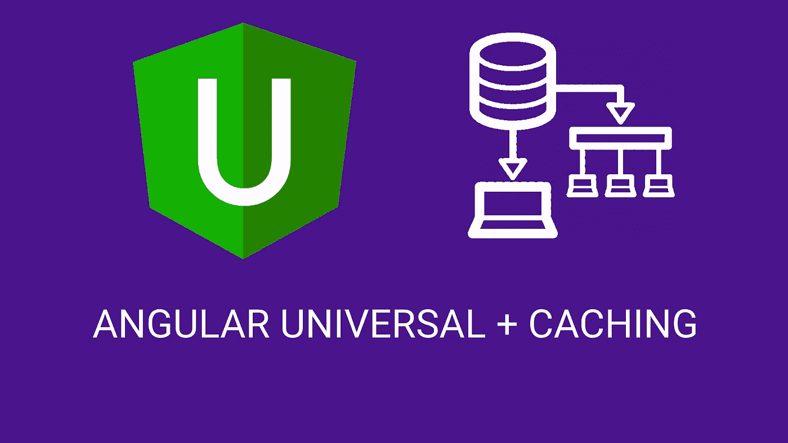
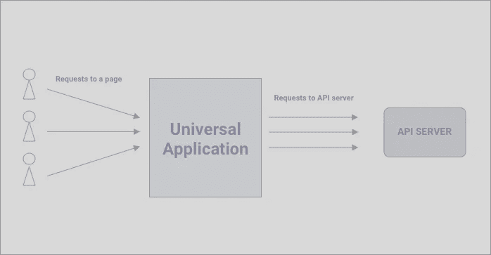

# 角度通用+缓存(传输状态)

> 原文：<https://itnext.io/angular-universal-caching-transferstate-96eaaa386198?source=collection_archive---------0----------------------->



Angular Universal 是服务器端渲染 Angular 应用程序的一个很好的解决方案。它允许我们为 SEO 设置元标签，在社交网络上共享，但最重要的是在服务器上呈现我们的页面，这样用户就可以获得已经呈现的页面，这意味着更快更流畅的性能。

然而，大多数时候开发者并没有利用 SSR 的所有优势。例如，在某些情况下，它们会阻止(isPlatFormBrowser) api 调用，因此，服务器会呈现一个没有数据的页面，而客户端会在前端再次呈现数据(数据在前端获取)，这导致了所谓的“闪烁”故障。在其他情况下，服务器(ssr)在呈现页面的同时向 API 发出请求，但是同样的请求也在前端发出，这意味着对已经从服务器获取的数据的双重请求。

相反，我们应该让服务器上的通用获取所有 GET 请求，将其存储在某个地方，当客户端(前端)发出请求时，它将获取已经获取的数据，而不会向 api 服务器发出任何额外的请求。

## 默认解决方案 *TransferHttpCacheModule*

是的，有一个专门的模块，`TransferHttpCacheModule` 正是我们想要的。它将注册一个拦截器，当 SSR 获取数据时，它将数据保存在状态中，前端将从状态中获取数据，而无需发出额外的请求。

你所需要做的就是将来自 **@nguniversal/common** 的`TransferHttpCacheModule`添加到你的 App 模块的 imports 数组中。

然后，在你的服务器模块中从**@ angular/platform-Server**导入`ServerTransferStateModule`。

在此之后，如果没有像服务器/浏览器检查这样的阻塞部分，您将看到页面得到渲染，但在网络选项卡中没有调用，因为 Angular Universal 已经获取了数据并作为状态传递给 fronted。然而，有一件事需要考虑。这就是它所做的一切，仅此而已。在许多情况下，我们希望编写自己的缓存机制，不幸的是，这在这个模块中是不可能的。然而，最好的部分是我们可以编写自己的拦截器并改变/获得状态。

## 问题是

作为一个例子(对我来说这是一个真正的问题),考虑下面的情况。当任何用户想要打开包含公共数据的公共页面时，SSR 将向 API 端点发出请求，获取数据，呈现数据并发送回用户。现在，假设您有一个非常大的用户群，同一页面在一秒钟内被请求 10-20 次。每隔一秒钟，SSR 就会发出一个请求，获得几乎相同的数据，并将其传递给 transferState。这已经很糟糕了，因为我们提出了太多的请求，即使我们知道数据很可能是相同的。现在认为 SSR 将尝试从第三方服务器获取一些公共数据。我们来说一份美国总统的名单。第三方服务器每秒只能从一个 IP 地址发出 10 个请求。现在，如果超过 10 个人同时试图打开该页面，SSR 将向第三方 api 发出 10+个请求，很可能会被禁止。事情是，当所有的请求都由服务器处理时，服务器本身只是一台有自己 IP 地址的计算机，所以所有的请求都来自同一个 IP 地址。



为了解决这个特殊的问题以及一次又一次请求相同的、未更改的数据的问题，我们需要为 transferstate 编写自己的逻辑。

**缓存和手动管理传输状态**

首先让我们编写与`TransferHttpCacheModule`中使用的相同(或非常相似)的拦截器。

1.  创建一个新文件`serverstate.interceptor.ts`

当 SSR 从 api 获得数据时，拦截器将使用请求 url 作为键，并将实际的响应体存储在一个特殊的对象中(transferState)。

2.在服务器模块中注册`serverstate.interceptor.ts`

```
providers: [{
  provide: HTTP_INTERCEPTORS,
  useClass: ServerStateInterceptor,
  multi: *true* }],
```

3.现在，来自 SSR 请求的所有响应都将存储在 transferState 中。我们需要创建另一个拦截器，这次是为前端创建的，这样它就可以从状态(如果存在的话)中获取数据，而不是重新获取数据。

创建新文件 browserstate.interceptor.ts

首先，我们检查请求方法是否是 GET，如果不是，我们将请求传递给下一个拦截器或 http 客户端。

然后，我们尝试从 transferState 获取保存的数据。如果有数据，我们用我们的数据创建一个新的 HttpResponse 对象并返回它，所以没有其他拦截器会拦截这个请求。如果对于给定的键(URL ), transferState 中没有任何内容，我们就将请求传递给下一个拦截器或 http 客户端来实际发出请求。

4.在您的应用模块中添加`BrowserStateInterceptor`

```
providers: [
  {
    provide: HTTP_INTERCEPTORS,
    useClass: BrowserStateInterceptor,
    multi: *true*,
  }
],
```

5.最后从应用程序模块中删除`TransferHttpCacheModule`

因此，现在我们拥有与`TransferHttpCacheModule`几乎相同的功能，但采用了我们的定制解决方案。然而，这并没有解决我们的缓存和频繁请求的问题。

**缓存**

这个想法很简单。当用户第一次打开一个页面时，SSR 将向 API 服务器发出请求，获取数据，保存在 transferState 中，并使用相同的键(请求 url)保存在某个本地数据库中。对于下一个用户请求，我们将检查给定的关键字(请求 url)在我们的本地数据库中是否有条目。如果是，我们将把它保存在 transferState 中，并作为 HttpResponse 返回，这样就不会对 API 服务器发出实际的请求。如果没有，我们将重复第一步，从 API 获取，保存在 transferState 和本地数据库中。

您可以为本地服务器数据库实现自己的逻辑(甚至可以是简单的数组或对象)。我将使用`memory-cache`节点模块。

`npm i memory-cache`

你可能还想安装`@types/memory-cache`来进行更好的类型检查。

将它包含在您的`serverstate.interceptor.ts file`中

```
*import* * *as* memoryCache *from* 'memory-cache';
```

首先，让我们修改 *next.handle()* 中的逻辑，在本地数据库中添加来自 API 服务器的响应

更改以下部分(突出显示新添加的代码)

```
*if* (event *instanceof* HttpResponse) {
  *this*.transferState.set(makeStateKey(req.url), event.body);
  **memoryCache.put(req.url, event.body);**
}
```

在返回 *next.handle()* 之前，我们需要检查本地数据库并从那里返回值

```
***const* cachedData = memoryCache.get(req.url);
*if* (cachedData) {
  *this*.transferState.set(makeStateKey(req.url), cachedData);
    *return* of(*new* HttpResponse({ body: cachedData, status: 200 }));
}***return* next.handle(req).pipe(
.....
```

有了这个我们就差不多准备好了。现在，只需要从 SSR 向 API 服务器发出一个请求，所有用户都将从我们的 SSR 服务器本地数据库中获得保存的数据。然而，这给我们带来了另一个问题。可能我们不想将这些数据永远保存在本地数据库中。至少我们有时会想更新它。嗯，我们可以创建一个函数，从那里清除所有本地数据库或选定的键。但是我们需要以某种方式触发这个函数(可能是通过 api 调用)。或者我们可以做得更好。我们可以设置时间，并在该时间后使我们的本地数据无效。`memory-cache`模块支持带有效期的密钥。如果您使用自定义解决方案，您可以使用`setTimeout()`来实现。

现在让我们再次修改代码，以便存储在本地数据库中的每个响应数据在 5 分钟内有效。在这 5 分钟内，所有用户都将从我们的本地数据库中获取数据，因此不会进行 API 调用。在使本地数据无效后，新的请求将触发新的 API 调用，新的数据将在我们的本地数据库中再存储 5 分钟，以此类推。

```
*if* (event *instanceof* HttpResponse) {
  *this*.transferState.set(makeStateKey(req.url), event.body);
  memoryCache.put(req.url, event.body, **6000 * 5**);
}
```

现在，如果你运行你的应用程序，你会看到没有工作！！！将会有无限的(实际上在这种情况下需要 5 分钟)加载。

实际上，问题不在于`memory-cache`或您的定制解决方案。问题在于角度通用处理异步代码。

> Angular Universal 不会完成页面渲染，直到有未完成的异步事件

我们的`memory-cache`模块在内部使用`setTimeout()`,在我们的例子中，Universal 将等待 5 分钟，这样任务队列将为空，只有在那之后它才会完成它的任务。

作为最后一步，为了解决这个问题，我们可以告诉 Angular 在 Angular 区域之外运行这个代码。

```
*constructor*(*private* transferState: TransferState, ***private* ngZone: NgZone**) {}
....*return* next.handle(req).pipe(
  tap(event => {
    *if* (event *instanceof* HttpResponse) {
      *this*.transferState.set(makeStateKey(req.url), event.body);
      ***this*.ngZone.runOutsideAngular(() => {
        memoryCache.put(req.url, event.body, 1000 * 60);
      })**

    }
  })
);
```

所以现在，代替默认的和基本的`TransferHttpCacheModule`，我们有了全功能的自定义传输状态机制，可以用很多很多其他方式修改。

[服务器状态拦截器](https://gist.github.com/jacksnipe24/ee3ab674a26862bd44caee75e0774f20)和[浏览器状态拦截器](https://gist.github.com/jacksnipe24/354048f535966a58cbff98e911e4f563)的最终代码。

感谢阅读。