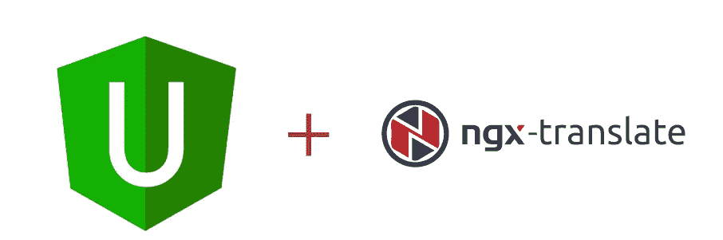

# Angular Universal:如何添加多语言支持？

> 原文：<https://itnext.io/angular-universal-how-to-add-multi-language-support-68d83f6dfc4d?source=collection_archive---------0----------------------->



有时候，还是用暗语说比较好。

# 客户端

安装`TranslateModule`:

```
npm install @ngx-translate/core --save
```

将其添加到主应用模块`app.module.ts`:

这是典型的`@ngx/translate`模块设置。但是它不能在服务器端工作，因为它会尝试从文件系统中获取翻译。为了让它工作，我们需要从我们的后端获取它们。

# 服务器端

在 angular universal app 中，您拥有将为服务器捆绑的服务器应用模块。我们需要使用一个拦截器，它将改变请求路径以从服务器加载翻译。

给`app.server.module.ts`添加一个 HTTP 拦截器，这样它将只捆绑在服务器捆绑包中。

因为这段代码运行在服务器端，所以我们可以使用 Node.js 功能。这样我们就可以获得我们正在运行的服务器的`PORT`。

为了让我们的拦截器得到`REQUEST`对象，我们需要在呈现我们的通用应用程序时提供它。

就是这样。

# 结论

当我试图找到解决这个问题的方法时，我找到了[@ ngx-universal/translate-loader](https://www.npmjs.com/package/@ngx-universal/translate-loader)。但是现在已经不维护了。

这是一个简单的有角度的 HTTP 拦截器。