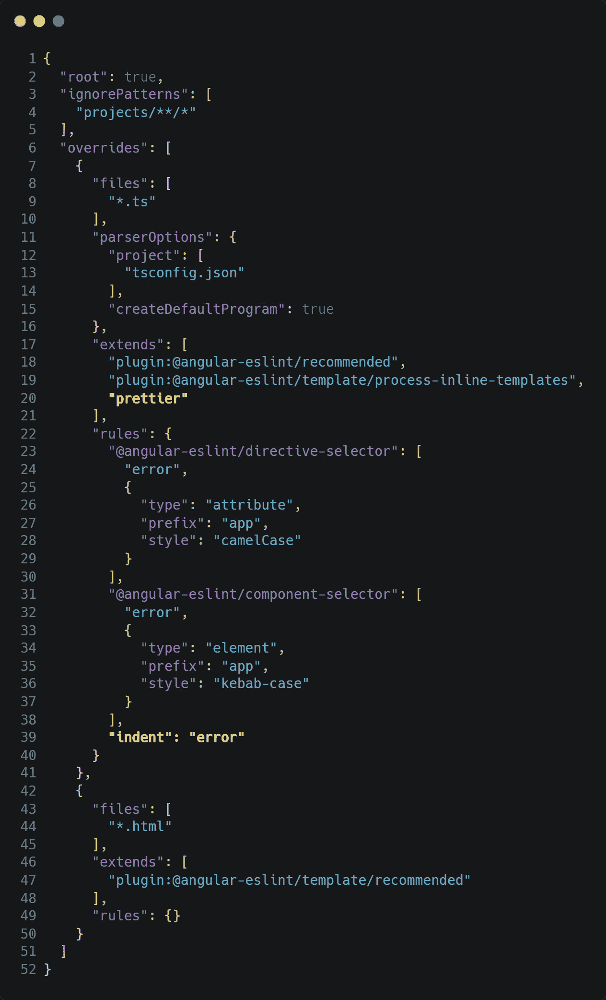
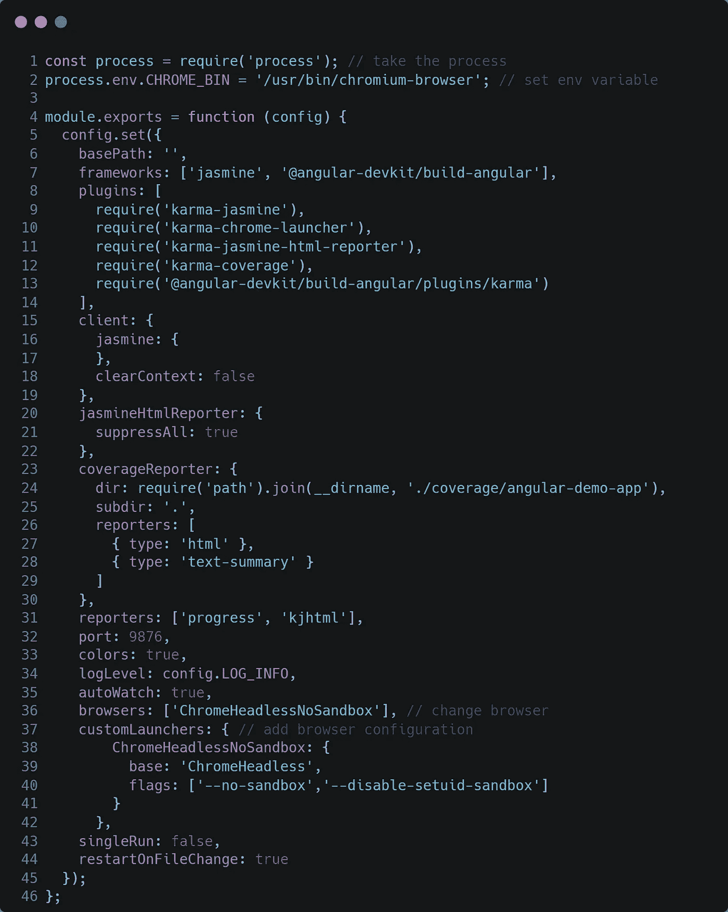

# 棱角分明，更漂亮，沙哑

> 原文：<https://itnext.io/angular-with-eslint-prettier-husky-6581ecd66fbb?source=collection_archive---------2----------------------->

在这篇文章中，我们将创建一个新的 Angular 项目，我们将配置 **eslint，beautiful 和 husky** 。棉绒和 git 挂钩对于个人和公司项目都是必要的。我将使用没有大量扩展的全新 VSCode 安装(实际上只需要更漂亮)。

大多数用户在 Windows 机器上本地安装了 Node.js，所以我将遵循完全相同的方法，但是作为 Docker 爱好者，我将提供等效的命令。如果你像我一样使用一个 [docker 开发环境](https://medium.com/@stavrosdro/docker-development-environment-angular-full-guide-a38ee34fb651)，你会得到同样的结果。

完成以下步骤后，我们将准备好:

*   每次保存文件后自动格式化代码。
*   用代码识别器识别错误。
*   在 git 提交或 git 推送之前执行 linter 和测试。
*   享受一致的代码库，减少差异和合并冲突。

> 本文的目的是让团队可以轻松地克隆一个项目并开始工作，而无需花费时间来配置他们的本地设置。唯一需要的扩展是更漂亮。

## 创建新项目并安装依赖项

`.editorconfig`的配置

`.prettierrc`的配置

`.eslintignore`的配置

## 配置 linter、package.json 和工作空间设置

现在，我们必须配置 eslint 来使用 prettier 作为格式化程序，并更新 VSCode 本地设置。

更新 package.json 中的脚本

```
"test": "ng test --watch=false --browsers ChromeHeadless",
"lint": "npx eslint \"src/**/*.{js,jsx,ts,tsx,html}\" --quiet --fix",
"format": "npx prettier \"src/**/*.{js,jsx,ts,tsx,html,css,scss}\" --write"
```

使用这种 eslint 配置。与默认值的不同之处在于，我们为 typescript 和 html 文件添加了这一行`"plugin:prettier/recommended"`。此外，我们创建了一个关于 html 组件的更具体的规则，我们希望应用 linter 的规则。

`eslintrc.json`的配置



仅复制第 20 和 39 行

键入`CTRL+SHIFT+P`，搜索`workspace settings (JSON)`并使用以下设置

现在我们可以运行`npm run format`来格式化您的整个工作空间。从现在起，每次你保存文件时，它将被自动格式化。
同样，我们可以运行`npm run lint`来检查我们的代码中的林挺错误。

## **安装 Husky &增加预推钩**

[Husky](https://typicode.github.io/husky/#/) 是使用 Git 钩子的一个很棒的工具。我建议遵循自动安装并运行`npx husky-init && npm install`。这也将创建一个预提交挂钩。您可以通过运行`npx husky add .husky/pre-push "npm test"`来创建预推挂钩

我的预提交文件

我的预推送文件

## **奖金**

*   您可以使用工作区设置中的`"editor.codeActionsOnSave": { "source.organizeImports": true }`规则对导入进行排序，并删除未使用的导入。这是一个很好的规则，但是请记住，有些关键文件(例如 test.ts)必须有特定的顺序。如果你知道这些文件，上述规则将会节省时间。
*   您可以创建关于导入的更复杂的规则，比如将外部导入放在顶部，用空行将它们与内部导入分开。这些规则应该在`eslintrc.json`中定义，但是您需要一个扩展来自动应用它们。
*   如果你基于某些扩展创建更复杂的规则，你可以使用`extensions.json`文件通知团队推荐的扩展。请确保检查您需要的扩展是否已经过时，并相应地更新您的代码库。
*   要保存文件而不格式化，输入`CTRL+SHIFT+P`并搜索*保存文件而不格式化*。
*   您可以通过使用`--no-verify`选项绕过 git 挂钩。

> 就是这个！现在我们有一个最小的设置和巨大的潜力！
> 在这里找到[的代号](https://github.com/stavrosdro/angular-demo-app)。
> 享受🚀🚀🚀

## **面向 Docker 爱好者的演练**

对于码头工人奖学金，我从这个`Dockerfile`开始

用`docker build -t ng-image .`构建 docker 图像，用`docker run -it -v $(pwd):/app -p 4200:4200 -p 49153:49153 --name ng-container ng-image sh`创建你的容器

你一般要按照上面的步骤来。我将指出以下不同之处:

创建应用程序:`ng new angular-demo-app --skip-git`

更新 package.json 中的脚本

```
"start": "ng serve --host 0.0.0.0 --poll",
"test": "ng test --watch=false",
"lint": "npx eslint 'src/**/*.{js,jsx,ts,tsx,html}' --quiet --fix",
"format": "npx prettier 'src/**/*.{js,jsx,ts,tsx,html,css,scss}' --write"
```

为了运行测试，您必须对`karma.conf.js`文件进行一些修改。



仅复制第 1、2 行和第 36–42 行

现在你有了完全相同的配置。最后一个变化是修改钩子以使用工具容器来执行钩子。

打开`pre-commit`和`pre-push`文件。

将`npm run lint`替换为`docker exec -i ng-container sh -c "cd angular-demo-app && npm run lint"`

将`npm test`替换为`docker exec -i ng-container sh -c "cd angular-demo-app && npm test"`

现在一切准备就绪！您可以使用`docker exec -i ng-container sh -c "cd angular-demo-app && npm test"`在本地运行测试。此外，通过对 husky hooks 进行上述修改，您可以像以前一样提交和推送代码。

> 在这里找到代码。
> 享受🚀🚀🚀