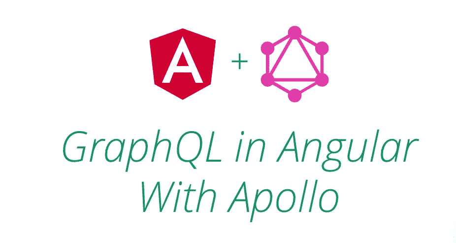
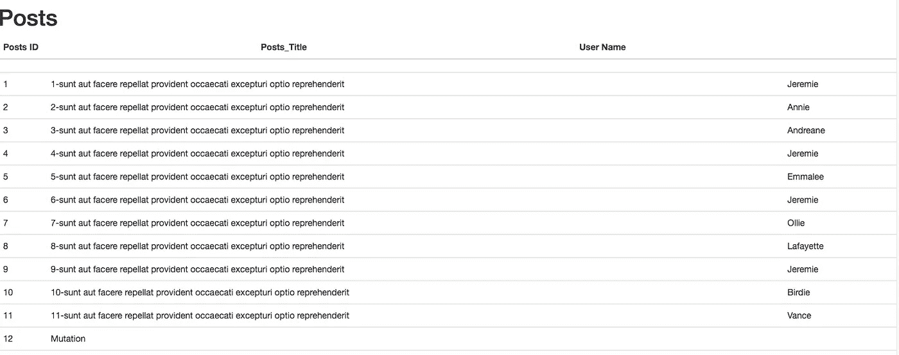

# Angular4 + Apollo + GraphQL

> 原文：<https://itnext.io/angular4-apollo-graphql-49994a2e943c?source=collection_archive---------0----------------------->



# 阿波罗客户端是什么？

Apollo 是一个 GraphQL 客户端，它使得用 React 和 Angular 开发 GraphQL 应用程序变得非常容易。它将帮助您获取数据，并保持您的客户端状态与服务器同步。

# 为什么我们应该使用阿波罗客户端？

Apollo 坚持在我们的应用程序中使用以下几点。

1.  较少的网络请求
2.  请求中的数据较少
3.  基于组件的 API
4.  实时通信
5.  乐观 UI
6.  贮藏
7.  预取

现在让我们来深潜…要开始使用阿波罗和 Angular，让我们从安装开始:


# 装置

让我们从安装 NPM 所需的包(apollo-client、apollo-angular 和 graphql-tag 以及许多其他包)开始:

```
npm install apollo-angular apollo-angular-link-http apollo-client apollo-cache-inmemory graphql-tag graphql --save
```

*   apollo-client 是适用于任何平台的客户端库。
*   阿波罗角度是阿波罗客户端的角度集成。
*   graphql-tag 是解析 graphql 查询/变异的标签。

现在，您可以在应用程序中使用 Apollo 了。要开始使用 Apollo 和 Angular，我们需要导入两个 NgModules，ApolloModule 和 HttpLinkModule。* ApolloModule 是在你的 app 中使用 GraphQL 的中心！它包括允许使用 ApolloClient 功能的所有需要的服务。

* HttpLinkModule 使得以 Angular 方式获取数据变得很容易。

# 创建客户端

首先，注入 Apollo 和 HttpLink 服务(如果您决定使用它),然后创建一个客户机:

```
constructor(apollo: Apollo, httpLink: HttpLink) {
    //localhost
    const uri = 'http://localhost:3000/graphiql';
    const http = httpLink.create({ uri });

    apollo.create({
      link: http,
      cache: new InMemoryCache()
    });
}
```

(注意:你可以在下面找到完整的代码。)

使用 graphql-tag
创建操作`import gql from 'graphql-tag';`

gql 模板标记是用来在 Apollo 应用程序中定义 GraphQL 查询的。它将 GraphQL 查询解析成 GraphQL.js AST 格式，然后由 Apollo 方法使用。

**查询:**您可以学习如何使用 Apollo 将 GraphQL 查询结果附加到

你棱角分明的 UI。

首先创建一个 **apollo.config.ts** 文件。
/app/阿波罗. config.ts

```
import {NgModule} from '@angular/core';
import {HttpClientModule} from '@angular/common/http';
import {Apollo, ApolloModule} from 'apollo-angular';
import {HttpLink, HttpLinkModule} from 'apollo-angular-link-http';
import {InMemoryCache} from 'apollo-cache-inmemory';

@NgModule({
  exports: [
    HttpClientModule,
    ApolloModule,
    HttpLinkModule
  ]
})
export class GraphQLModule {
  constructor(apollo: Apollo, httpLink: HttpLink) {
    //localhost
    const uri = 'http://localhost:3000/graphiql';
    const http = httpLink.create({ uri });

    apollo.create({
      link: http,
      cache: new InMemoryCache()
    });
}
}
```

现在转到 **app.module.ts** 文件，添加下面的代码。

`import {GraphQLModule} from './apollo.config';`

在**进口**部分，

```
imports: [
    BrowserModule,
    HttpModule,
    GraphQLModule
  ],
```

现在让我们创建一个新组件，
，即:

```
ng g c apollo-test
```

您可以在 app/apollo-test 文件夹中找到以下文件。

```
# apollo-test.component.css
<> apollo-test.component.html
TS apollo-test.component.spec.ts
TS apollo-test.component.ts
```

打开**Apollo-test . component . ts**并在文件中添加以下代码。

```
import { Component, OnInit } from '@angular/core';
import { Apollo } from 'apollo-angular';
import gql from 'graphql-tag';
import { ApolloQueryResult } from 'apollo-client';
import { InMemoryCache } from 'apollo-cache-inmemory';
import { Observable } from 'rxjs/Observable';

const PostsGetQuery = gql`
  query PostsGetQuery{
    posts_list {
        id
        title
        body
        user {
          id
          firstName
          lastName
          bio
        }
      }
  }
`;

@Component({
  selector: 'app-apollo-test’,
  templateUrl: './apollo-test.component.html',
  styleUrls: ['./apollo-test.component.css']
})
export class ApolloTestComponent implements OnInit {
  data: Observable<any>;

  constructor(private apollo: Apollo ) { }

  ngOnInit() {
    this.apollo.watchQuery<any>({
      query: PostsGetQuery
    })
      .valueChanges
      .subscribe(({data}) => {
        this.data = data.posts_list;
      });
  }
}
```

现在，您的数据对象中有了一个帖子列表。让我们在表单中显示数据。

转到你的**apollo-test.component.html**文件，

```
<p>
  apollo-test works! DONE
</p>
<h1>Posts</h1>
<div *ngFor="let post of data">
  <table>
    <tr>
        <td>
          User Name: {{post.user.firstName}}
        </td>
      <td>
          Post ID: {{post.id}}
      </td>
      <td>
          Title: {{post.title}}
      </td>
    </tr>
  </table>
</div>
```

就是这样。现在，您可以享受应用程序的快速响应，而不会有任何问题。



详情请点击下面的链接。
[https://www.apollographql.com/docs/angular/](https://www.apollographql.com/docs/angular/)

下面是设置指南:
[https://www . apollographql . com/docs/angular/basics/setup . html](https://www.apollographql.com/docs/angular/basics/setup.html)

感谢您的阅读。我希望这篇文章能对你有所帮助。

享受编码。


**感谢&问候，
阿洛拉瓦特**

*原载于*[*qiita.com*](https://qiita.com/alokrawat050/items/7fc8a240e047ea6c2e06)*。*