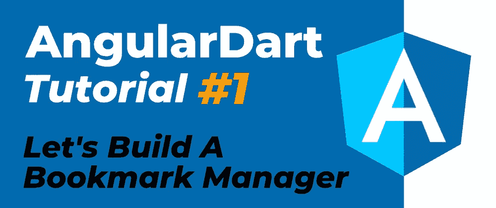

# AngularDart 教程:让我们构建一个书签管理器(第 1 部分)

> 原文：<https://itnext.io/angulardart-tutorial-lets-build-a-bookmark-manager-part-1-67327fbb7e3d?source=collection_archive---------6----------------------->

## 用这个惊人的框架构建你的下一个应用

在这个视频系列中，我们将关注 AngularDart 框架，构建一个书签管理器来存储我们最喜欢的网络剪报。这个单页应用程序将允许我们执行通常的 CRUD 操作。在这个视频的最后，我们将有我们的应用程序的框架，显示一个带有删除功能的书签列表。

→ [**在 YouTube 上观看**](https://creativebracket.com/angulardart-tutorial-lets-build-a-bookmark-manager-1/)
→ [**获取源代码**](https://github.com/graphicbeacon/angulardart-bookmark-manager)

# 进一步阅读

1.  [**AngularDart 教程**:让我们构建一个书签管理器( **Part 2** )](https://youtu.be/l8GYVH4vMXc)
2.  [**角度引导**](https://webdev.dartlang.org/angular/guide)
3.  [免费**飞镖入门** Egghead.io 课程](https://egghead.io/courses/get-started-wtih-dart)

# 分享是关怀🤗

如果你喜欢读这篇文章，请通过各种社交渠道分享。此外，检查并 [**订阅我的 YouTube 频道**](https://youtube.com/c/CreativeBracket) (也点击铃铛图标)上的 Dart 视频。

在 Egghead.io 和 [**上观看我的**](http://eepurl.com/gipQBX)**[免费**Dart**入门课程](https://egghead.io/courses/get-started-wtih-dart)订阅我的电子邮件简讯** 下载我的标题为**Dart**的 35 页免费电子书，并在新内容发布时得到通知。

**喜欢，分享** [**关注我**](https://twitter.com/creativ_bracket) 😍有关 Dart 的更多内容。