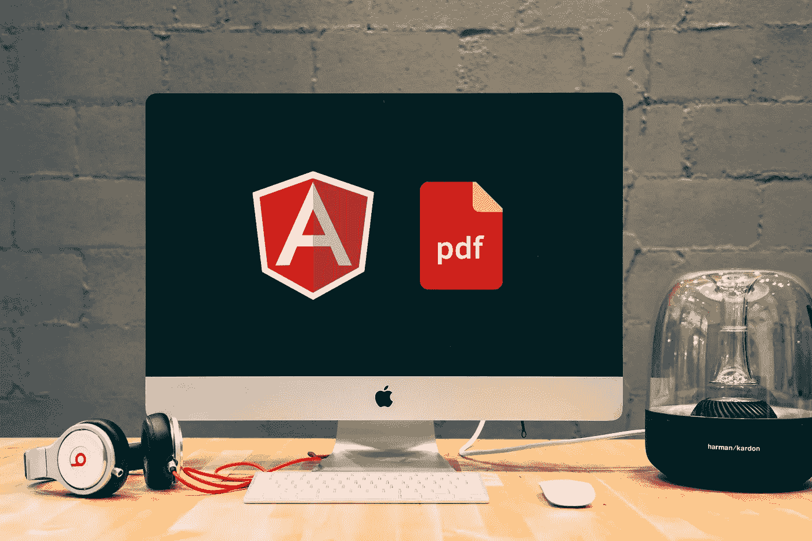

# AngularJS 利用 pdfmake.js 库导出到 PDF。

> 原文：<https://itnext.io/angularjs-exporting-to-pdf-using-pdfmake-js-library-49f3afec97ef?source=collection_archive---------0----------------------->



## 在本教程中，我们将讨论如何在导出的 PDF 文件中设置、设计和实现字体。

[*点击这里在 LinkedIn*](https://www.linkedin.com/cws/share?url=https%3A%2F%2Fitnext.io%2Fangularjs-exporting-to-pdf-using-pdfmake-js-library-49f3afec97ef) 上分享这篇文章

可以使用 bower cd 将 pdfmake.js 库安装到您的 angular 目录中，并运行此代码以获得 pdfmake.js 的最新版本。

```
bower install pdfmake
```

这个也可以从 github [这里](https://github.com/bpampuch/pdfmake)下载。现在把这个库包含到你的 angular js index.html 文件中。

```
**<!doctype html>**
 <html lang='en'>
 <head>
 	<meta charset='utf-8'>
 	<title>AngularJS export to pdf example.</title>
 	<script src='pdfmake/build/pdfmake.min.js'></script>
 	<script src='pdfmake/build/vfs_fonts.js'></script>
 </head>
 <body>
```

接下来在视图中创建一个链接来调用$scope 函数。

```
<a href=”#” ng-click=”downloadPDF()”></a>
```

现在，在由我们的视图执行的控制器中创建一个$scope 方法$scope.downloadPDF。这个方法将包含我们导出逻辑的核心。

```
$scope.downloadPDF = function() {
});
```

让我们为 PDF 创建一个页眉和页脚。在我们的 scope.downloadPDF 方法中

```
var docDefinition = {
          header: function() {
                return [
                    {
                        style: 'table',
                        margin: [62,35,62,35],
                        table: {
                            widths: ['*', '*'],
                            headerRows: 0,
                            body: [
                                [
                                    {text: 'Booking Summary', style: 'topHeader', alignment: 'left'},
                                    {
                                        'base64-image-string-goes-here',
                                        width: 150,
                                        alignment: 'right'
                                    }
                                ]
                            ]
                        },
                        layout: 'noBorders'
                    }
                ]
            },
            footer: function(currentPage, pageCount) { 
                return [
                    {text: currentPage.toString() + ' of ' + pageCount, alignment: 'center', style: 'footer'}
                ]
            },
            content: [],
            pageSize: 'A4',
            pageMargins: [62,80,62,80],
            styles: {
                topHeader: {
                    fontSize: 20,
                    bold: true,
                    margin: [0, 6, 0, 30],
                    alignment: 'left'
                },
                table: {
                    fontSize: 8,
                    alignment: 'left',
                    color: 'black',
                    margin: [0, 5, 0, 15]
                },
                header: {       
                    fontSize: 16,
                    bold: true,
                    margin: [0, 10, 0, 15],
                    alignment: 'left'
                },
                footer: {
                    fontSize: 8,
                    margin: [0, 25, 0, 17],
                    alignment: 'center'
                }
            }
        }; pdfMake.createPdf(docDefinition).download();
};
```

docDefinition 对象是我们描述 PDF 以供 pdfmake.js 呈现的方式。标题由一个包含两列的表格组成。使用星号符号自动调整列宽。通过向该列表追加另一个宽度，我们指示 pdfmake.js 调整新列的大小。

```
widths: ['*', '*']
```

定义为表格的内容可以在主体数组中找到。左侧表格列包含文本“标题”，它链接到样式引用“标题”。右表列将 base64 图像字符串嵌入到对象中。我们通过这个[在线工具](https://codebeautify.org/image-to-base64-converter)生成 base64 字符串，然后将生成的 base64 字符串‘base64-image-string-goes-here’复制并粘贴到我们的对象中。我们希望这个表格没有边框，否则 pdfmake.js 会为我们的单元格和表格绘制黑色边框。footer 函数根据 PDF 底部的总页数绘制当前页面。注意，我们使用 styles 对象中的“footer”选择器来附加页脚的样式。更多关于创造风格的信息可以在[这里](http://pdfmake.org/#/gettingstarted)找到。

```
content: [
                {
                    style: 'topTable',
                    table: {
                        widths: ['*','*', '*', '*'],
                        heights: [18],
                        headerRows: 1,
                        body: [
                            [
                                {text: $scope.title+' '+$scope.firstName+' '+$scope.surname, 
                                style: 'tableHeader', colSpan: 4}, {}, {}, {}
                            ],
                            [
                                {text: 'Type:', style: 'tableLabel'}, {text: 'Flight'}, 
                                {text: 'Verified:', style: 'tableLabel'}, {text: 'Yes'}
                            ],
                            [
                                {text: 'Status ID:', style: 'tableLabel'}, {text: $scope.statusid}, 
                                {text: 'Supplier ID:', style: 'tableLabel'}, {text: $scope.supplierid}
                            ],
                            [
                                {text: 'Session ID:', style: 'tableLabel'}, {text: $scope..sessionid}, 
                                {text: 'Booking ID:', style: 'tableLabel'}, {text: $scope.bookingid}
                            ],
                            [
                                {text: 'Departing:', style: 'tableLabel'}, {text: $scope.date }, 
                                {text: 'Passengers:', style: 'tableLabel'}, {text: $scope.passengers'}
                            ]
                        ]
                    },
                    layout: {
                        paddingLeft: function(i, node) { return 8; },
                        paddingRight: function(i, node) { return 8; },
                        paddingTop: function(i, node) { return 6; },
                        paddingBottom: function(i, node) { return 6; },
                        fillColor: function (i, node) {
                            return (i % 2 === 0) ?  '#F5F5F5' : null;
                        }
                    }
                }
]
```

在上面的内容对象中，我们指示 pdfmake.js 绘制一个包含四列的表格。列宽设置为由星号符号自动定义。我们希望将表头显示为一行，因此设置了 colspan 4。默认情况下，这个表格是有边框的，所以我们只需要为每个表格单元格添加一些填充。我们还想为 fillColor 函数中定义的每一行表格创建斑马效果。

# 将字体超赞融入 PDF。

首先，我们需要使用这个[工具](https://www.giftofspeed.com/base64-encoder)将我们的字体文件转换成 base64 编码的字符串。导航到 bower _ components/pdf make/build/vjs_fonts.js，将编码的 font-awesome.ttf base64 字符串粘贴到 vjs _ fonts . js 文件中。我已经从这段代码中删除了字符串，因为你会发现它们非常大！

```
this.pdfMake = this.pdfMake || {};this.pdfMake.vfs = {
    "Roboto-Italic.ttf": "paste-roboto-base64-string-here",
    "Roboto-Medium.ttf": "paste-roboto-base64-string-here",
    "Roboto-MediumItalic.ttf": "paste-roboto-base64-string-here",
    "Roboto-Regular.ttf": "paste-roboto-base64-string-here",
    "FontAwesome.ttf": "paste-font-awesome-base64-string-here"
};this.pdfMake.fonts = {
 Roboto: {
     italics       : 'Roboto-Italic.ttf',
     normal        : 'Roboto-Regular.ttf',
     bold          : 'Roboto-Medium.ttf',
     mediumitalics : 'Roboto-MediumItalic.ttf'
 },
 FontAwesome: {
     normal     : 'FontAwesome.ttf',
     bold       : 'FontAwesome.ttf',
     italics    : 'FontAwesome.ttf',
     bolditalics: 'FontAwesome.ttf'
 }
};
```