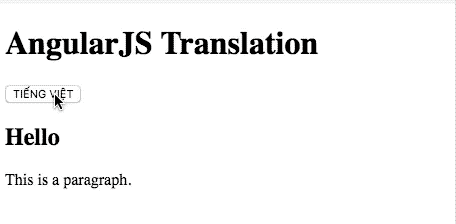

# AngularJS 本地化或多语言或其他

> 原文：<https://itnext.io/angularjs-localization-or-multilingual-or-whatever-53b88585cc48?source=collection_archive---------3----------------------->



我生活在一个(至少)有两种官方语言的国家。你知道这意味着什么——我们必须支持多语言网站或应用程序。

在这篇文章中，我将向您展示如何在 AngularJS 1.x 应用程序中配置多语言支持。我们将利用[角度转换](https://github.com/angular-translate/angular-translate)包来完成转换任务。

在开始这个项目之前，你可以在[广场](https://next.plnkr.co/plunk/EXvRjdObOkcZmnhT)看一下最终产品。

 [## AngularJS —翻译

### 多语言支持角度

next.plnkr.co](https://next.plnkr.co/plunk/EXvRjdObOkcZmnhT) 

**启动 AngularJS 项目**

启动 AngularJS 1.x 项目超级容易。你所需要做的就是把 AngularJS 脚本放在 html 文件的头部。

```
// index.html<html **ng-app="myApp"**>
  <head>
    <meta charset="utf-8">
    <title>AngularJS Translation</title>

    **<script src="//cdnjs.cloudflare.com/ajax/libs/angular.js/1.7.2/angular.min.js"></script>**
    <script src="**app.js**"></script>
  </head>

  <body **ng-controller="Ctrl"**>
    <h1>AngularJS Translation</h1>
  </body>
</html>
```

并添加您的 app.js 内容

```
var app = angular.module('myApp', []);app.controller('Ctrl', function ($scope, $rootScope) {

});
```

这就是启动 AngularJS 项目所需的全部内容

**添加角度平移包**

虽然，您只需要一个 angular-translate 包来处理翻译，但我想添加另一个包来支持从 JSON 文件中获取内容，而不是将所有内容都放在 app.js 中。

```
// index.html<head>
    <meta charset="utf-8">
    <title>AngularJS Translation</title>

    <script src="//cdnjs.cloudflare.com/ajax/libs/angular.js/1.7.2/angular.min.js"></script>
    <script src="//cdnjs.cloudflare.com/ajax/libs/angular-translate/2.18.1/**angular-translate.min.js**"></script>
    <script src="//cdnjs.cloudflare.com/ajax/libs/angular-translate/2.18.1/angular-translate-loader-static-files/**angular-translate-loader-static-files.min.js**"></script>
    <script src="app.js"></script>
  </head>
```

然后添加您的翻译文件。您的内容将从这些 JSON 文件中获取，而不是直接放到您的模板中。

```
**// locales/local-en.json**{
    "TITLE": "Hello",
    "FOO": "This is a paragraph.",
    "BUTTON_LANG": "tiếng việt"
}**// locales/local-vn.json**{
    "TITLE": "Xin chào",
    "FOO": "Đây là một đoạn văn.",
    "BUTTON_LANG": "english"
}
```

配置您的 app.js。我们使用 **useStaticFilesLoaders** 来加载 locales 文件夹中的所有 json 文件。

```
app.config(function (**$translateProvider**) {
    **$translateProvider**
    .useStaticFilesLoader({
        prefix: '/locales/locale-',
        suffix: '.json'
    }) 
    // remove the warning from console log by putting the [sanitize strategy](https://angular-translate.github.io/docs/#/guide/19_security)
    .useSanitizeValueStrategy('sanitizeParameters')    
    .preferredLanguage('en');
});
```

**把所有东西放在一起**

现在，我们将添加一个切换语言按钮，将内容从英语改为越南语，反之亦然。

我们将创建一个名为 **lang** 的变量来控制我们正在使用的当前语言。通过这样做，您可以使用 lang 来控制您的 CSS。例如:***p:lang(en){ color:red；}***

```
// index.html <html **lang="{{ lang }}"** ng-app="myApp">....<body ng-controller="Ctrl">
    <h1>AngularJS Translation</h1>

    <div>
      <button **ng-show="lang === 'vn'"** ng-click="**changeLanguage('en')**">{{'BUTTON_LANG' | translate | uppercase}}</button>
      <button **ng-show="lang === 'en'"** **ng-click="changeLanguage('vn')**">{{'BUTTON_LANG' | translate | uppercase}}</button>
    </div>

    <h2>{{ 'TITLE' | translate}}</h2>          
    <p>{{'FOO' | translate}}</p>
</body>
```

在 side app.js 中，控制器中定义了 **changeLanguage** 函数。当用户点击按钮时，它会切换到另一种语言的内容。

```
// app.jsapp.run(['$rootScope', function($rootScope) {
    $rootScope.**lang** = 'en';
}])app.controller('Ctrl', function ($scope, $rootScope, **$translate**) {
    $scope.changeLanguage = function (key) {
        $rootScope.lang = key;
        **$translate.use(key);**
    };
});
```

从现在起，你有一个最小的工作多语言项目，你可以扩展到任何想要的。

希望这有所帮助:)