# 动物部落:如何创建你的第一个全栈类型脚本 GraphQL 应用程序？—第一部分:项目概述

> 原文：<https://itnext.io/animal-tribes-how-to-create-your-first-full-stack-typescript-graphql-application-76786e5520ed?source=collection_archive---------5----------------------->

如何使用 Typescript、Node、React 和 GraphQL 构建第一个全栈应用的完整教程


大家好，

回来写作真好。在过去的几个月里，我真的很忙，我没有时间写新的帖子。但是别说了，让我们谈重要的事情吧。

# 1.介绍

在本教程中，我将向您展示如何从头开始创建一个应用程序。为此，我将使用 [Typescript](https://www.typescriptlang.org/) 、 [Graphql](https://graphql.org/) 、 [NodeJs](https://nodejs.org/en/) 、 [ReactJS](https://reactjs.org/) 和 [MongoDB](https://www.mongodb.com/) 。除此之外，还有两个框架会让我们的生活变得更简单: [Express](https://expressjs.com/) 和 [ApolloGraphql](https://www.apollographql.com/) 。我们将在三个环境中创建它:开发、测试和生产，我们将在 Heroku 上发布它。

> 嘿，嘿，山姆，这真的很好，但是我们要做什么样的项目呢？*🤔*

问得好，年轻的学徒。在这个项目中，我们将创造一个令人敬畏的游戏。一个游戏叫 [**动物部落**](https://animal-tribes.herokuapp.com/) 。

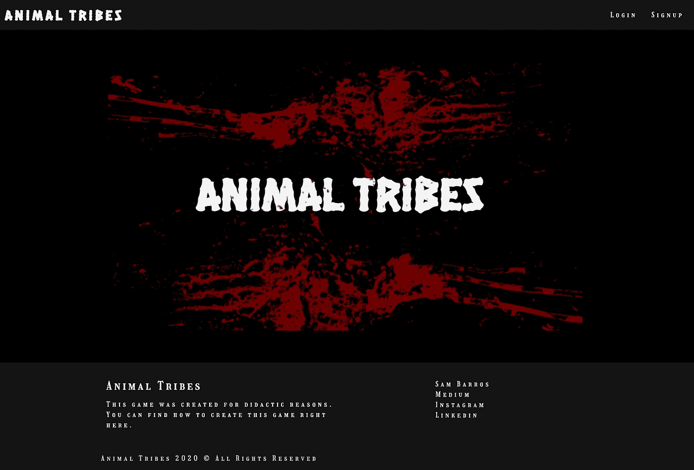

## 1.1.关于游戏

这个游戏真的很简单，我们会有一个**玩家 1** 和一个**玩家 2** ，在这里我们称他们为**战士**和**对手**。每个玩家都有六个属性:力量、灵巧、信仰、智慧、魔法和敏捷。

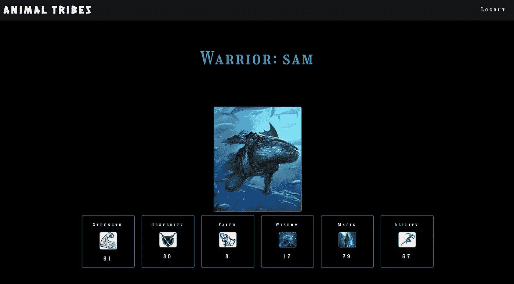

战士的属性

当一个战士挑战对手时，我们比较战士的力量和对手的力量，战士的灵巧和对手的灵巧，战士的信仰和对手的信仰等等。如果比较对战士有利，也就是高一点，就标志着 1 分到了战斗。如果这种比较对战士不利，也就是说，如果它比对手少，它就不会指向战斗。最后，如果出现平局，也就是说当比较结果相等时，这就给勇士一分，因为他有勇气挑战对手。如果点数大于或等于 3，战士赢得战斗，否则输了。

让我们看看下表中的示例:

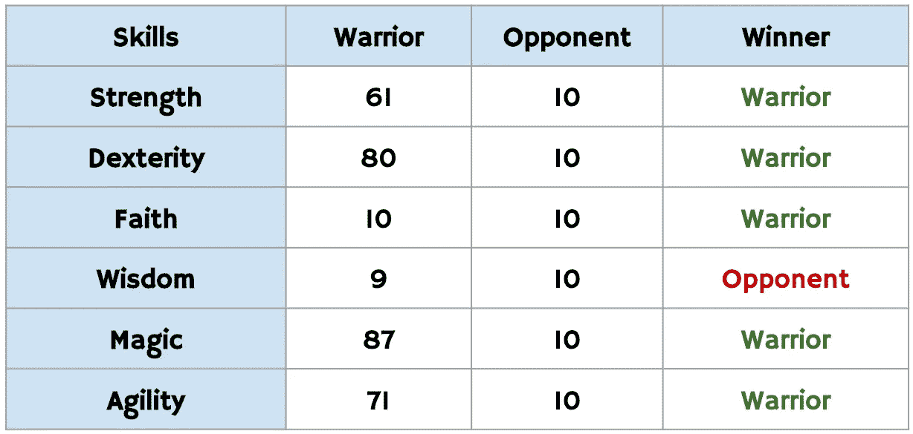

战士赢得了 5 个类别，这意味着战士战胜了对手。

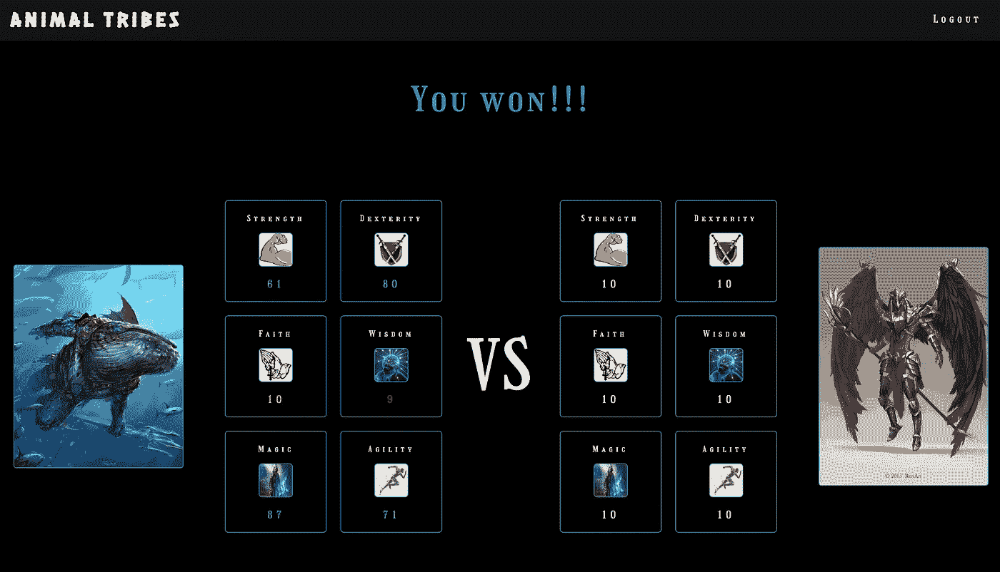

战役

在上图中，我们可以看到一场战斗。战士赢得了战斗。

然后战士获得更多的经验，我们在它的属性上增加更多的点数。对于每个属性，我们随机添加一个介于 0 和 9 之间的数字…好的，我在标点符号策略上没有想太多，但这里的主要目标是教导发展。😅

注册时，用户需要填写全名、战士名和密码。

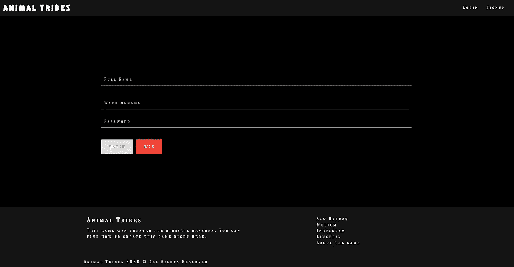

下一步是选择他/她所属的部落。

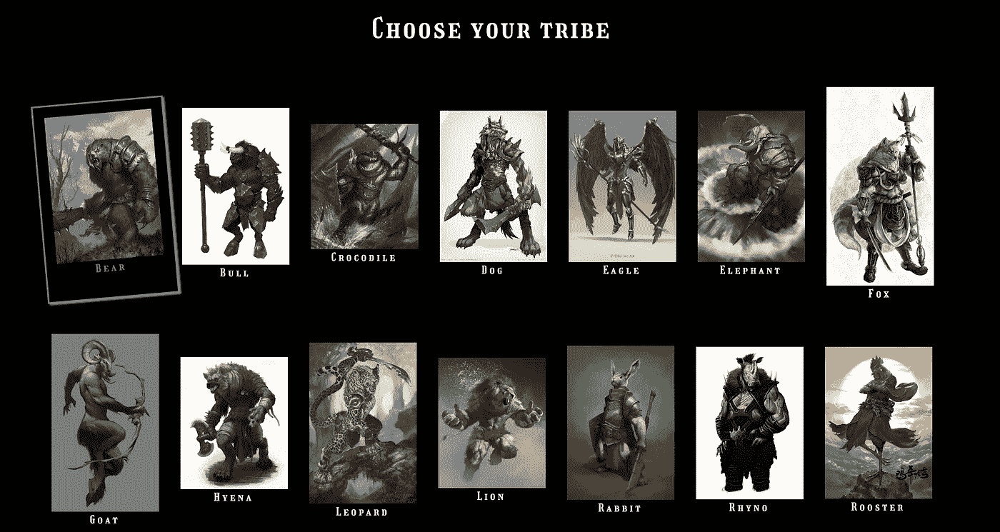

️⚠️ **注意点** ⚠️ **:** 我从 [Pinterest](https://www.pinterest.com/) 获得的所有战士和对手的图片，我对它们没有任何权利，我只是出于教学目的使用它们。

## 1.2.关于教程

正如我所说的，在本教程中，您将学习如何基于我创建的游戏创建一个全栈应用程序。开发将分四步进行:

*   项目概述(这一项)
*   后端
*   前端
*   部署到 Heroku

## 1.3.屏幕

假设设计团队给了我们所有的屏幕，我们需要开发它们。通常，它应该有一个描述，但我只是告诉你我们要做什么。

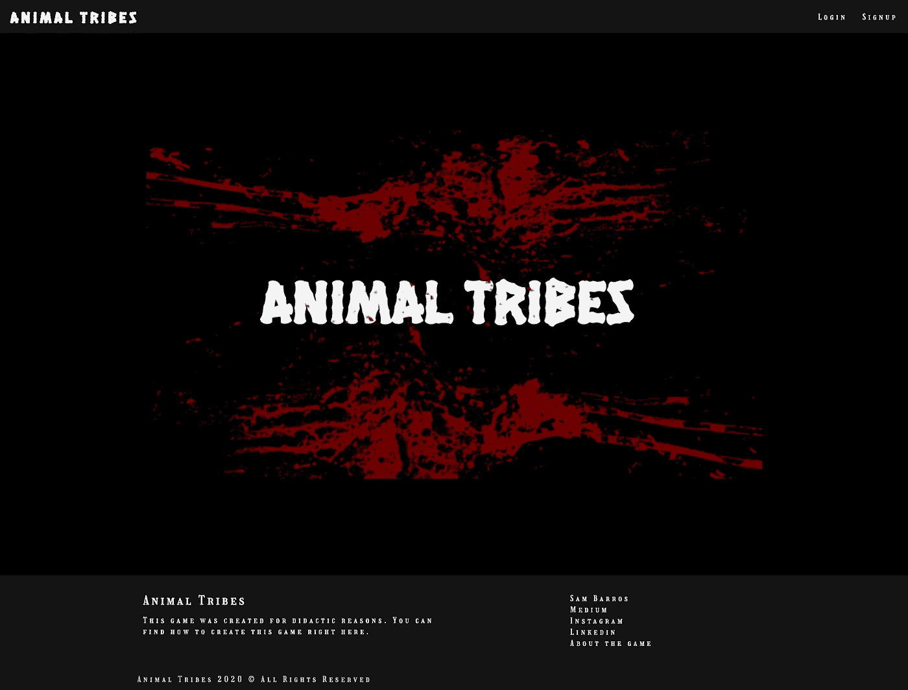

主页

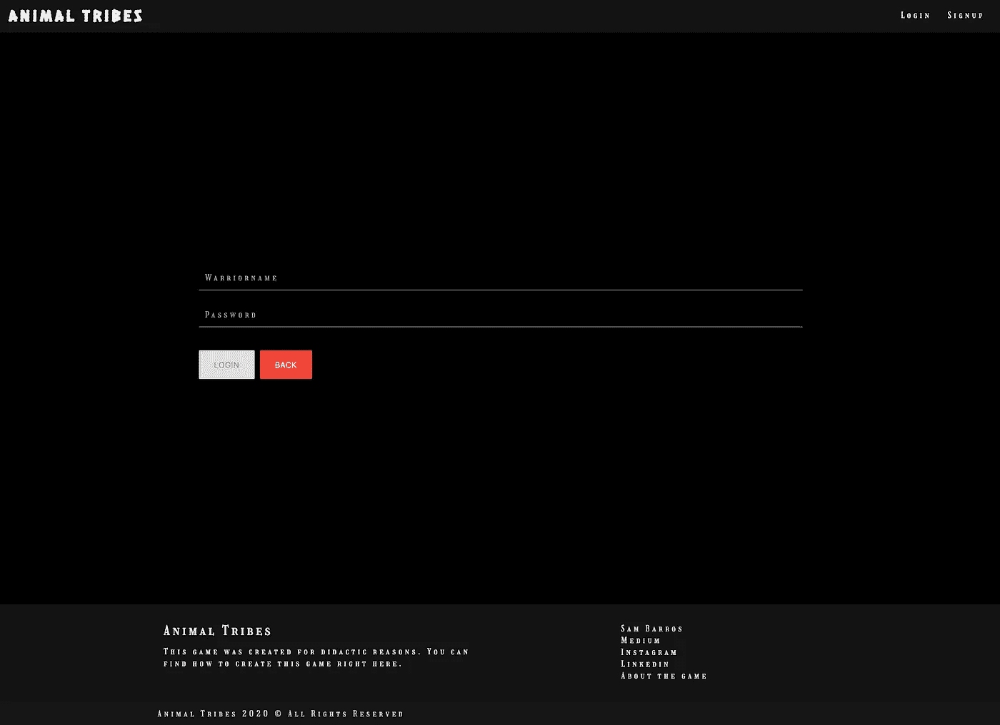

注册

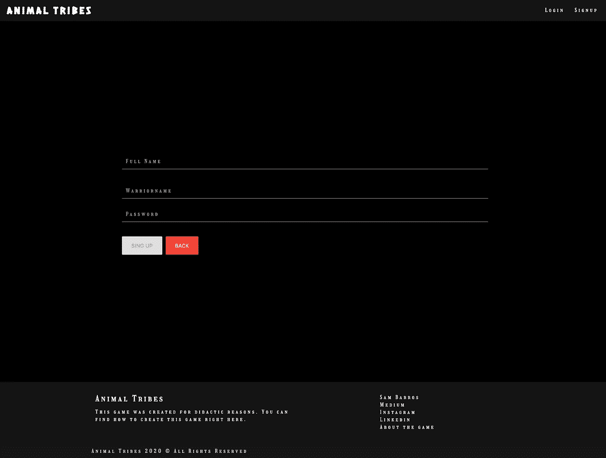

注册

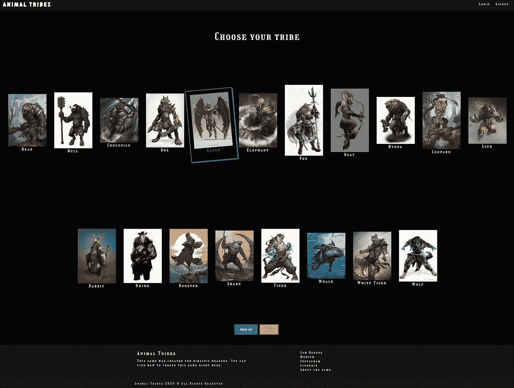

选择你的部落

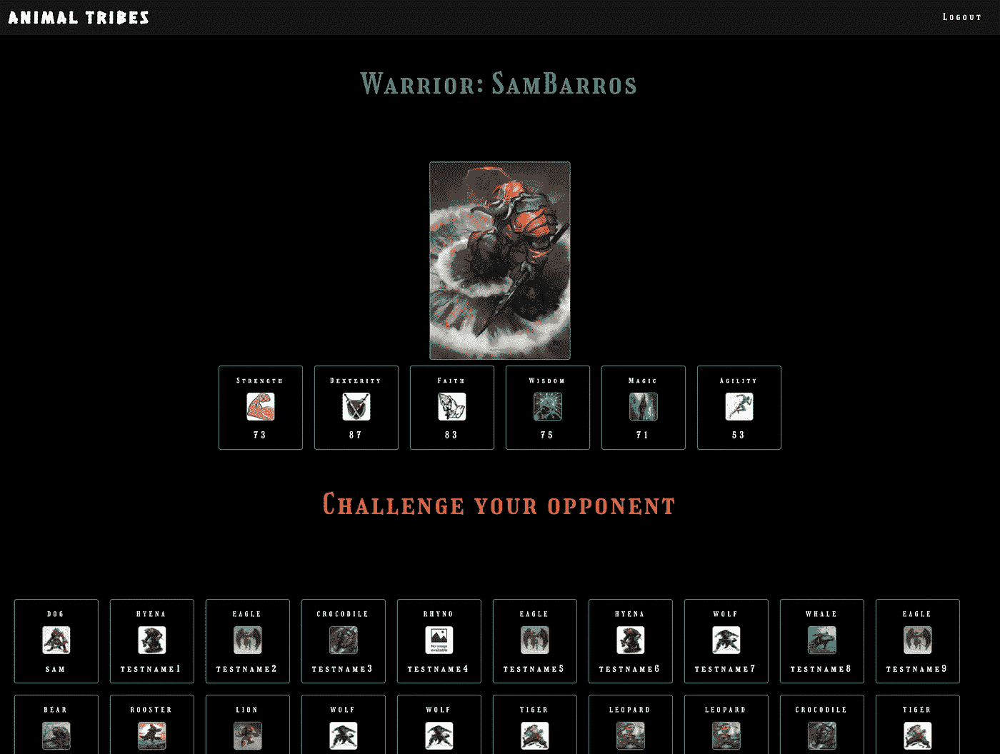

轮廓

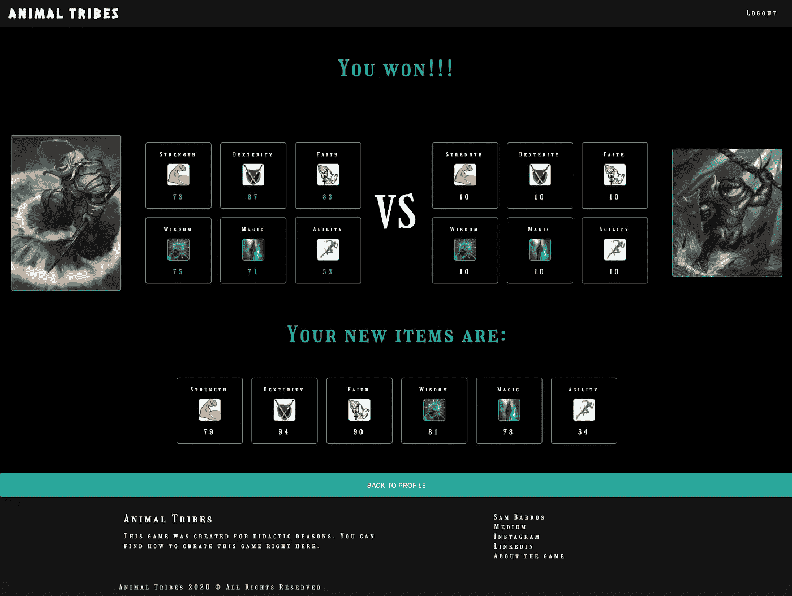

战役


关于

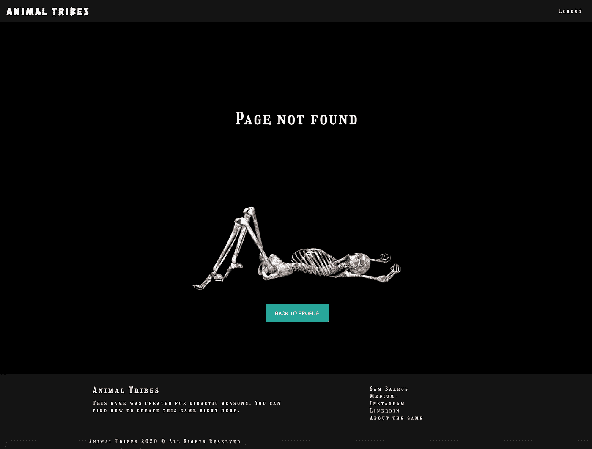

错误

# 2.项目概述

正如我所说，我们将开发一个游戏，应该这样工作。

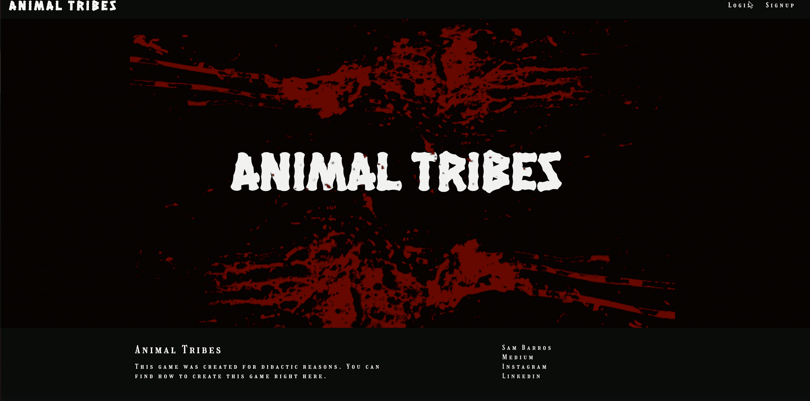

## 2.1.技术

我们将在这个项目中使用的技术是:

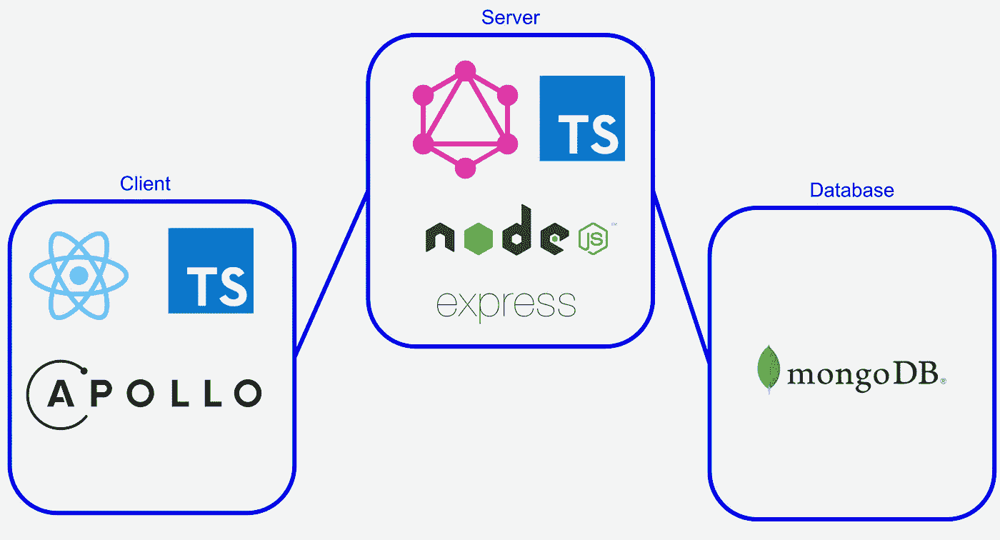

对于**客户端**，我们将使用 React、Typescript 和 Apollo GraphQL。对于**服务器端**，我们将使用 Node、Typescript、GraphQL 和 Express。数据库**将会是 MongoDB。为了测试 GraphQL，我们将使用[操场 GraphQL](https://github.com/prisma-labs/graphql-playground) 。**

## 2.2.结构

我们将有两个实体。其中一个实体是用户信息，另一个实体是游戏信息。

让我们将用户命名为 **warrior** 并得到如下结果:

*   全名
*   战士名字(用户名🙂)
*   密码
*   族

每个战士都属于一个部落，而且战士们不会在自己的部落中战斗。

战士有技能，这些技能是:

*   力量
*   灵巧
*   信任
*   智慧
*   魔法
*   灵活

## 2.3.环境

对于这个项目，正如我之前提到的，我们将创建三个环境:

*   **开发**:一个本地环境，我们将在这里编码并进行简单的测试
*   **测试**:也是一个负责执行单元和集成测试的本地环境。
*   生产:存储在在线服务器上的环境，我们可以在那里存储应用程序。

## 2.4.有些事情我需要提一下。

*   听起来(只是听起来😅)该项目有一个漂亮的布局和 CSS，但我只是做了基本的事情，因为重点是 GraphQL 本身，以及如何创建一个完整的应用程序。有许多地方需要改进，我想听听你的建议。
*   应用程序中有一些需要验证的地方，我会慢慢修复它们，我会在最后一部分给出一些我们可以改进的地方，如果你发现了什么，请告诉我。🙂
*   我正在分享我从 Pinterest 和 T2 谷歌图片获得的图片，但是所有的权利都是留给他们的，而不是我。

# 3.概念

本章介绍了一些关于 GraphQL 和 Typescript 的概念。如果你对此感到不舒服，你可以直接看第三章。

## 3.1.GraphQL 是什么？

Graphql 是一种更灵活的查询语言，与 REST 相比，它具有更高效的方法。

如果你不知道什么是休息，我真心推荐你看看[这篇教程](https://www.codecademy.com/articles/what-is-rest)，我认为它是完整的。我已经链接了 GraphQL 网站，但是如果你想的话，你可以看看这里的。最后，你可以看看 GraphQL 和 REST 之间的[对比。](https://www.howtographql.com/basics/1-graphql-is-the-better-rest/)

使用 GraphQL 的主要优点是,**客户机**可以直接在服务器上查询，而不需要特定的端点。例如，如果我们有一个包含*本书*和*位作者*的数据库，使用 REST，我们可能会有一个端点获取特定的书，另一个端点获取特定的作者。

```
**GET** example/books/:id
*returns* {title, type, authorId}**GET** example.com/authors/:id
*returns* {name, booksId}
```

使用 GraphQL，我们可以查询如下内容

```
query getBookInformation {
  book(id: "123") {
    title
    type
    author {
      name
      books {
        name
        type
      }
    }
  }
}
```

通过这个查询，我们可以得到**id 为 **id 为 123** 的书**，显示这本书的作者以及该作者写的所有其他书。

这太棒了。！！

## 3.2.什么是 Typescript？

你可以在[官网](https://www.typescriptlang.org/)上找到，TypeScript 就是任何比例的打字 JavaScript。您可以对变量进行典型化，并验证函数的参数。

> 但是山姆，为什么这很重要？

假设您想要创建一个函数来添加两个值，在 JavaScript 中您只需键入。

但是，如果您键入:

```
add(1, 2, 3)oradd("1", "2")
```

在第一种情况下，我们会有一个错误，在第二种情况下，我们会有“12”，有，他们不是我们期望的结果，因此我们有 Typescript 来帮助我们。

使用 typescript，我们可以键入变量和函数的返回。如你所见，我们只接受数值，返回的也应该是一个数字。如果您尝试执行上面的两个调用，在第一种情况下，我们会得到错误“期望两个参数，但得到 3 个”，第二个将是“类型为“1”的参数不可分配给类型为“number”的参数”，这就更方便了。

# **4。结论**

这是教程的第一步。进入下一步，让我们构建我们的服务器。

[](https://medium.com/@samarony.barros/animal-tribes-how-to-create-your-first-full-stack-typescript-graphql-application-pt-2-backend-cae1735f13dd) [## 动物部落:如何创建你的第一个全栈类型脚本 GraphQL 应用程序？—第二部分:后端

### 如何使用 Typescript、Node、React 和 GraphQL 构建第一个全栈应用的完整教程

medium.com](https://medium.com/@samarony.barros/animal-tribes-how-to-create-your-first-full-stack-typescript-graphql-application-pt-2-backend-cae1735f13dd) [](https://medium.com/@samarony.barros/animal-tribes-how-to-create-your-first-full-stack-typescript-graphql-application-pt-3-frontend-dc69f71e1d62) [## 动物部落:如何创建你的第一个全栈类型脚本 GraphQL 应用程序？—第三部分:前端

### 如何使用 Typescript、Node、React 和 GraphQL 构建第一个全栈应用的完整教程

medium.com](https://medium.com/@samarony.barros/animal-tribes-how-to-create-your-first-full-stack-typescript-graphql-application-pt-3-frontend-dc69f71e1d62) [](https://medium.com/@samarony.barros/animal-tribes-how-to-create-your-first-full-stack-typescript-graphql-application-e7891ec4963a) [## 动物部落:如何创建你的第一个全栈类型脚本 GraphQL 应用程序？

### 如何使用 Typescript、Node、React 和 GraphQL 构建第一个全栈应用的完整教程

medium.com](https://medium.com/@samarony.barros/animal-tribes-how-to-create-your-first-full-stack-typescript-graphql-application-e7891ec4963a) 

# 5.我的其他文章

[](https://medium.com/swlh/how-to-create-your-first-mern-mongodb-express-js-react-js-and-node-js-stack-7e8b20463e66) [## 如何创建你的第一个 MERN (MongoDB，Express JS，React JS 和 Node JS)栈

### 嗨伙计们，

medium.com](https://medium.com/swlh/how-to-create-your-first-mern-mongodb-express-js-react-js-and-node-js-stack-7e8b20463e66) [](https://medium.com/swlh/how-do-i-deploy-my-code-to-heroku-using-gitlab-ci-cd-6a232b6be2e4) [## 如何使用 GitLab CI/CD 将我的代码部署到 Heroku？

### 关于如何使用舞台和生产环境的教程

medium.com](https://medium.com/swlh/how-do-i-deploy-my-code-to-heroku-using-gitlab-ci-cd-6a232b6be2e4) [](/how-to-make-tests-using-chai-and-mocha-e9db7d8d48bc) [## 如何用柴和摩卡做测试？

### NodeJS 应用程序的 TDD

itnext.io](/how-to-make-tests-using-chai-and-mocha-e9db7d8d48bc) 

# 关于我

Sam Barros 是一名巴西人，作为一名软件工程师在柏林生活和工作。他是一个技术爱好者，他总是用自己的生活来帮助人们。

连接到:

*   [领英](https://www.linkedin.com/in/sam-barros/)
*   [GitHub](https://github.com/samaronybarros)
*   [中等](https://medium.com/@samarony.barros)
*   [个人网站](https://sambarros.com/)