# 动物部落:如何创建你的第一个全栈类型脚本 GraphQL 应用程序？— Pt 4:部署到 Heroku

> 原文：<https://itnext.io/animal-tribes-how-to-create-your-first-full-stack-typescript-graphql-application-e7891ec4963a?source=collection_archive---------7----------------------->

如何使用 Typescript、Node、React 和 GraphQL 构建第一个全栈应用的完整教程

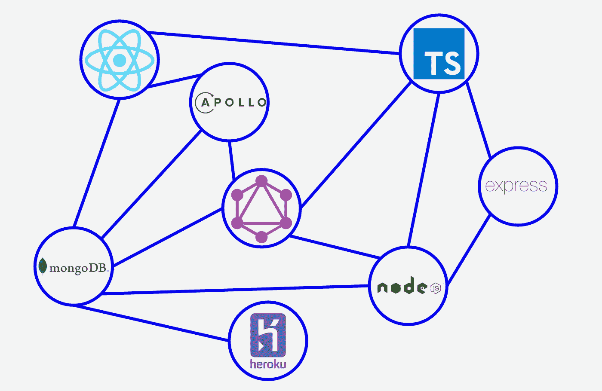

# 1.介绍

这是**动物部落的第四部分也是最后一部分:如何创建你的第一个全栈式 Typescript GraphQL 应用？**教程。如果您没有看到第 1 部分、第 2 部分和第 3 部分，请点击下面的链接。

[](https://medium.com/@samarony.barros/animal-tribes-how-to-create-your-first-full-stack-typescript-graphql-application-76786e5520ed) [## 动物部落:如何创建你的第一个全栈类型脚本 GraphQL 应用程序？

### 如何使用 Typescript、Node、React 和 GraphQL 构建第一个全栈应用的完整教程

medium.com](https://medium.com/@samarony.barros/animal-tribes-how-to-create-your-first-full-stack-typescript-graphql-application-76786e5520ed) [](https://medium.com/@samarony.barros/animal-tribes-how-to-create-your-first-full-stack-typescript-graphql-application-pt-2-backend-cae1735f13dd) [## 动物部落:如何创建你的第一个全栈类型脚本 GraphQL 应用程序？—第二部分:后端

### 如何使用 Typescript、Node、React 和 GraphQL 构建第一个全栈应用的完整教程

medium.com](https://medium.com/@samarony.barros/animal-tribes-how-to-create-your-first-full-stack-typescript-graphql-application-pt-2-backend-cae1735f13dd) [](https://medium.com/@samarony.barros/animal-tribes-how-to-create-your-first-full-stack-typescript-graphql-application-pt-3-frontend-dc69f71e1d62) [## 动物部落:如何创建你的第一个全栈类型脚本 GraphQL 应用程序？—第三部分:前端

### 如何使用 Typescript、Node、React 和 GraphQL 构建第一个全栈应用的完整教程

medium.com](https://medium.com/@samarony.barros/animal-tribes-how-to-create-your-first-full-stack-typescript-graphql-application-pt-3-frontend-dc69f71e1d62) 

在这一部分，我们将把我们的应用程序部署到 [Heroku](https://www.heroku.com/) 。

# 2.创建 GitHub 帐户

为了部署我们的应用程序，我们需要在 [GitHub](https://github.com/) 上托管我们的代码。所以我不会把重点放在如何创建一个 GitHub 帐户，但如果你不知道如何做到这一点。请看一下[这篇教程](https://git-scm.com/book/en/v2/GitHub-Account-Setup-and-Configuration#:~:text=The%20first%20thing%20you%20need,Sign%20up%20for%20GitHub%E2%80%9D%20button.)。

# 3.设置 Heroku —服务器

在开始使用 Heroku 之前，我们需要对我们的存储库进行一些更改。首先，我们需要更改 package.json 上的启动模式

```
"start": "concurrently --kill-others 'npm run tsc:watch' 'npm run dev'",
```

到

```
"start": "node build/src/index.js",
"start:dev": "concurrently --kill-others 'npm run tsc:watch' 'npm run dev'",
```

基本上，生产环境不需要 nodemon，我只是直接从 node 开始。

让我们承诺并推动 GitHub，我们准备好开始与 Heroku 合作。

第一步:首先，我们需要一个关于 [Heroku](https://www.heroku.com/) 的账户。点击**注册**或**登录**如果你已经有一个账户。

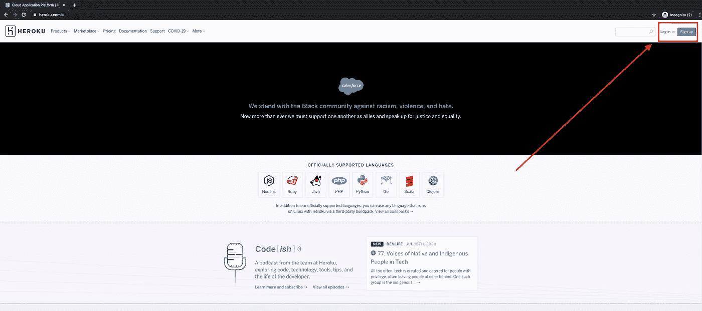

**第二步**:点击**新建**


**第三步**:点击**创建新 app**

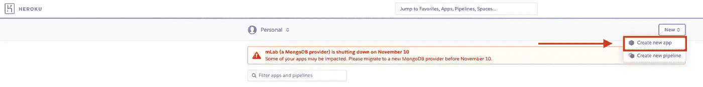

**第四步**:选择一个 **app 名称**和离你最近的**地区**，点击**创建 app** 。

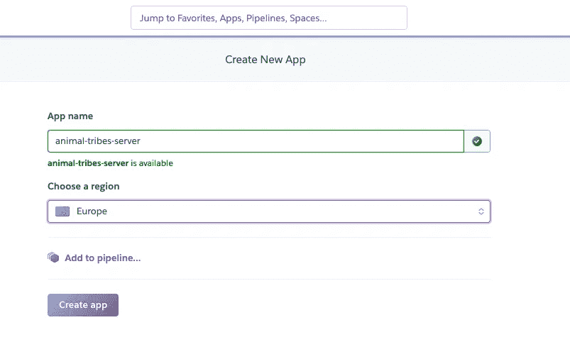

**第五步**:转到**设置**

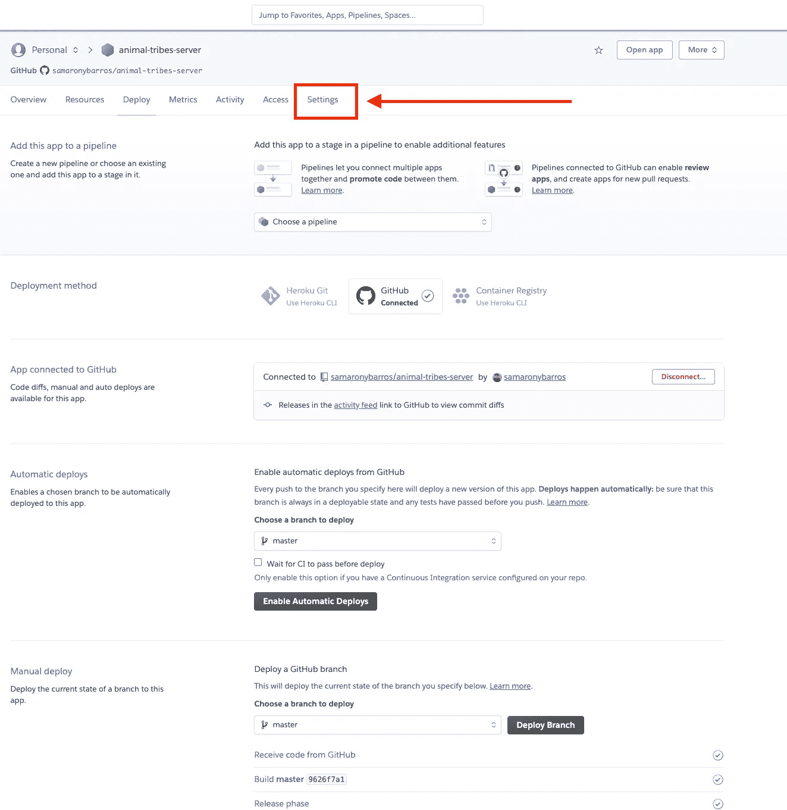

**第六步**:点击**显示配置变量**。

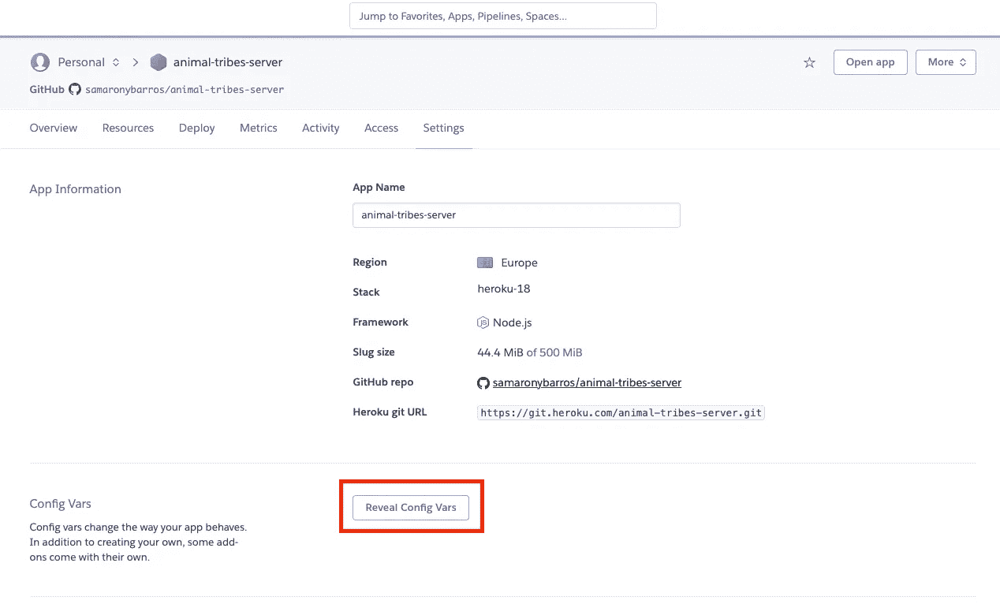

**步骤 7** :添加**环境变量**(同**animal-tribes-server/config/production . ts**)。默认情况下，Heroku 配置了端口变量。

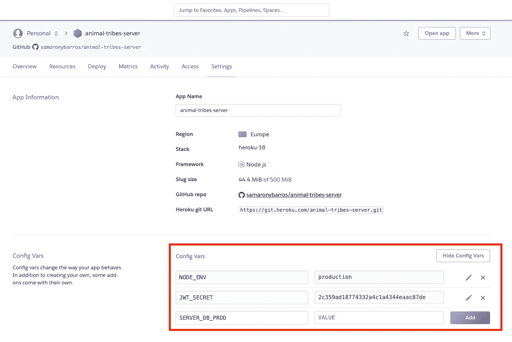

**步骤 8** :再次点击**部署**

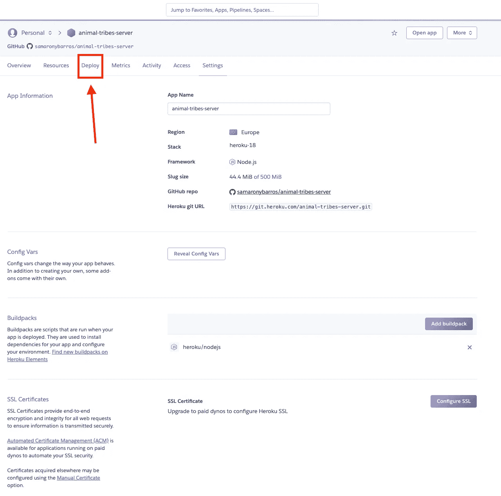

**第 9 步**:点击**连接 GitHub** 。

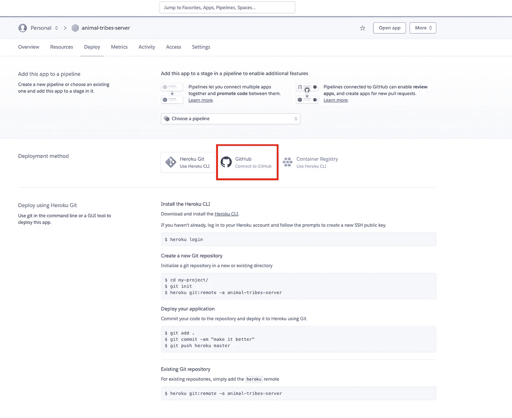

**第十步**:输入你的**回购人姓名**，点击**搜索**，点击**连接**。

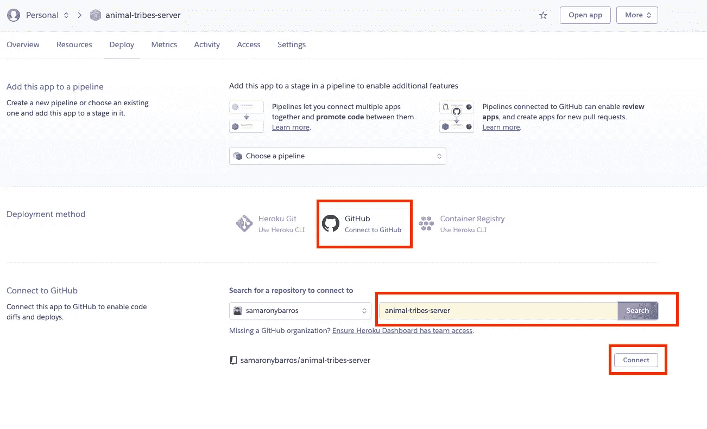

**第十一步**:点击**部署分支**。

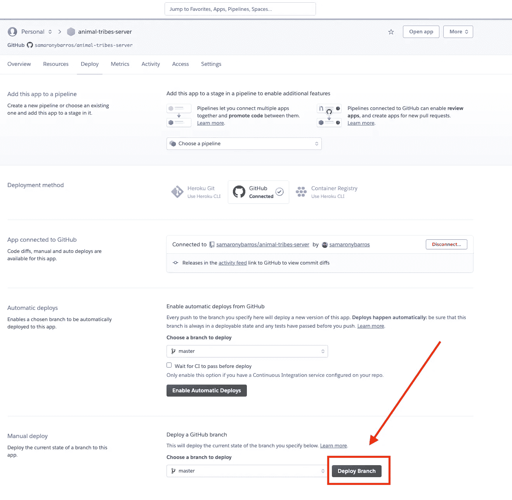

**第 12 步**:点击**查看**

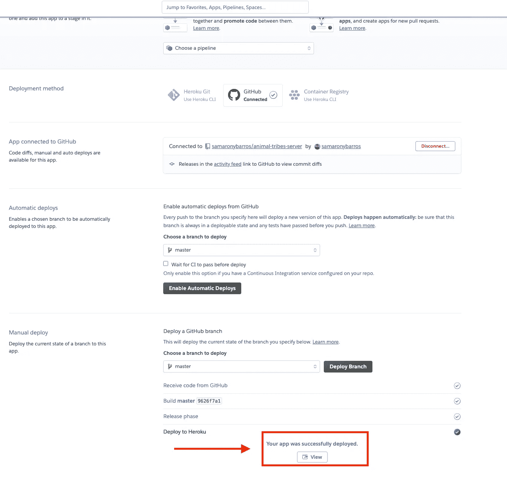

您应该会看到这样的页面。

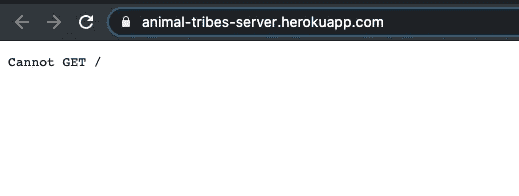

但是，正如我们所知，从第 2 部分中，我们可以将 **/playground** 添加到 URL 中，我们应该会看到 playground 页面。

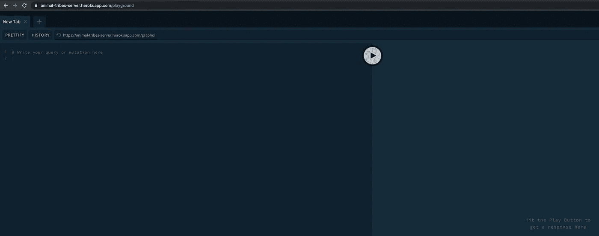

# 4.设置 Heroku —客户端

将客户端部署到 Heroku 实际上是一样的，但是我们需要对代码做一些修改。

因此，首先，打开文件**animal-tribes-client/src/config/index . ts**，让我们替换来自

```
const *prod*: *string* = '<not yet>'
```

到

```
const *prod*: *string* ='https://animal-tribes-server.herokuapp.com/graphql'
```

既然现在我们有了 URL，我们可以将它添加到我们的配置文件中。提交并推送到 GitHub。现在，我们可以部署客户端了。

重复**步骤 1** 至 **4** 。我将把我的应用程序命名为**动物部落**，而不是**动物部落客户端的。在你的情况下，你需要选择一个不同的名字，因为 Heroku 会抱怨冲突。跳过**步骤 5 到 8** (我们不需要客户端的环境变量)。重复**步骤 9** 至**步骤 10** 。**

客户端需要一个 WebPack，但我们不需要自己创建它，我们可以让 Heroku 为我们做这件事。然后，让我们安装 [Heroku CLI](https://devcenter.heroku.com/articles/heroku-cli) 。

```
$ brew tap heroku/brew && brew install heroku
```

如果你是 windows 用户，你可以在 Heroku CLI 上找到如何安装它。

让我们验证当前的构建包。

```
$ heroku buildpacks -a <appname>In my case (you should choose a different name)$ heroku buildpacks -a animal-tribes
```

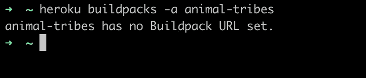

很好，那么让我们将 WebPack 添加到我们的应用程序中。

```
$ heroku buildpacks:set mars/create-react-app -a <appname>in my case$ heroku buildpacks:set mars/create-react-app -a animal-tribes
```

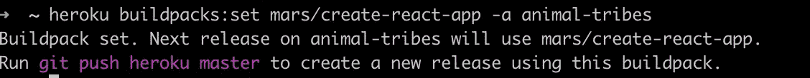

很好，让我们再次验证构建包。

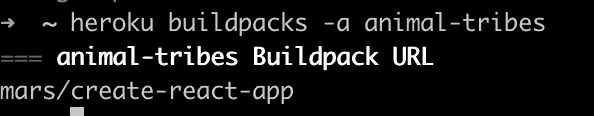

很好，现在我们可以重复**步骤 11** 和 **12** ，我们可以看到我们的应用程序正在运行。

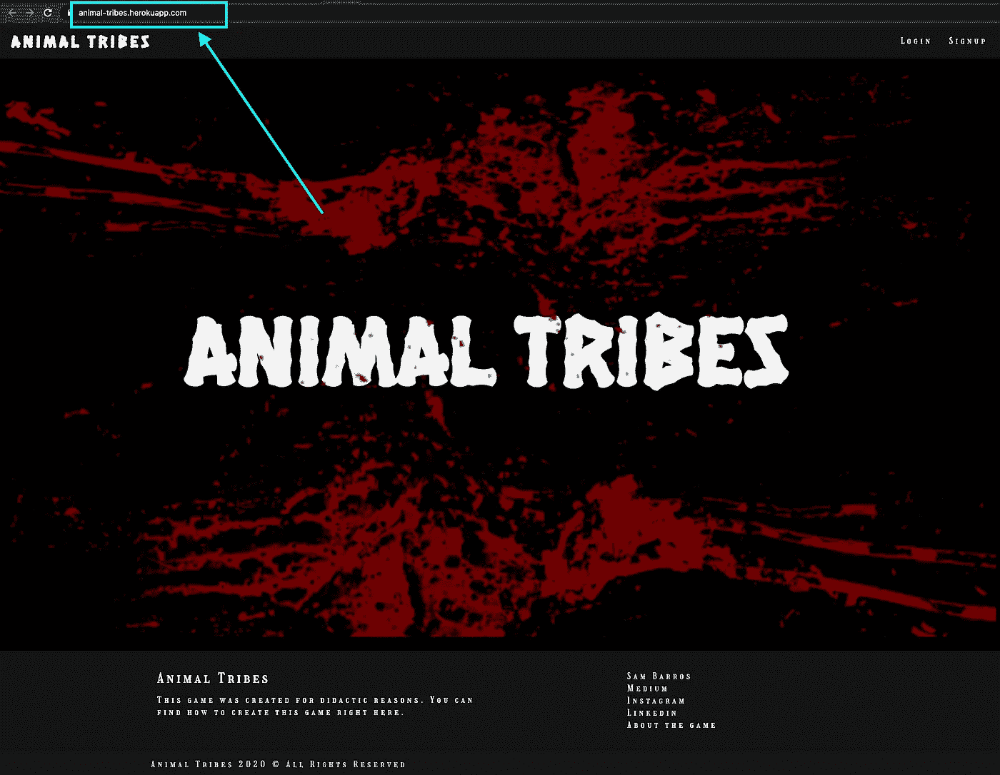

# 4.结论

仅此而已。

这是教程的最后一步。在本章中，你已经学会了如何将整个应用程序部署到 Heroku。

你能在这里找到的所有零件。

[](https://medium.com/@samarony.barros/animal-tribes-how-to-create-your-first-full-stack-typescript-graphql-application-76786e5520ed) [## 动物部落:如何创建你的第一个全栈类型脚本 GraphQL 应用程序？

### 如何使用 Typescript、Node、React 和 GraphQL 构建第一个全栈应用的完整教程

medium.com](https://medium.com/@samarony.barros/animal-tribes-how-to-create-your-first-full-stack-typescript-graphql-application-76786e5520ed) [](https://medium.com/@samarony.barros/animal-tribes-how-to-create-your-first-full-stack-typescript-graphql-application-pt-2-backend-cae1735f13dd) [## 动物部落:如何创建你的第一个全栈类型脚本 GraphQL 应用程序？—第二部分:后端

### 如何使用 Typescript、Node、React 和 GraphQL 构建第一个全栈应用的完整教程

medium.com](https://medium.com/@samarony.barros/animal-tribes-how-to-create-your-first-full-stack-typescript-graphql-application-pt-2-backend-cae1735f13dd) [](https://medium.com/@samarony.barros/animal-tribes-how-to-create-your-first-full-stack-typescript-graphql-application-pt-3-frontend-dc69f71e1d62) [## 动物部落:如何创建你的第一个全栈类型脚本 GraphQL 应用程序？—第三部分:前端

### 如何使用 Typescript、Node、React 和 GraphQL 构建第一个全栈应用的完整教程

medium.com](https://medium.com/@samarony.barros/animal-tribes-how-to-create-your-first-full-stack-typescript-graphql-application-pt-3-frontend-dc69f71e1d62) [](https://medium.com/@samarony.barros/animal-tribes-how-to-create-your-first-full-stack-typescript-graphql-application-e7891ec4963a) [## 动物部落:如何创建你的第一个全栈类型脚本 GraphQL 应用程序？

### 如何使用 Typescript、Node、React 和 GraphQL 构建第一个全栈应用的完整教程

medium.com](https://medium.com/@samarony.barros/animal-tribes-how-to-create-your-first-full-stack-typescript-graphql-application-e7891ec4963a) 

正如您在项目中所看到的，在这个应用程序中，我们有许多可以改进的地方。如果你能有所贡献，这真的很有趣。我会列出一些要做的事情:

*   我们可以改进 CSS。我只是做了一些事情，让应用程序可以使用。有许多事情要做。主要是关于响应度、图像尺寸等
*   我们可以使查询和突变更好，并为应用程序创建必要的突变。
*   在客户端，我们可以改进一些代码，例如，当我们改变部落时，数组需要先将所有值设置为假，然后才能将正确的部落设置为真。由于我们部落不多，这不是问题，但不是正确的方法。
*   我们有一些验证来将用户重定向到正确的路径，但有时我们会得到警告。修好就好。

总是寻找增强功能真的很重要。我们在工作和个人生活中使用这个。

你可以在我的 [GitHub](https://github.com/samaronybarros) 中找到完整的项目，然后搜索[动物部落服务器库](https://github.com/samaronybarros/animal-tribes-server)和[动物部落客户端库](https://github.com/samaronybarros/animal-tribes-client)。

我希望我对你的知识有所贡献。有什么地方需要改进才能写出更好的文章，欢迎随时告诉我。告诉我，如果你有文章或代码的改进。

感谢您耐心阅读本文。下一篇文章再见。

看看我的其他文章。谢谢你能来。

# 5.我的其他文章

[](https://medium.com/swlh/how-to-create-your-first-mern-mongodb-express-js-react-js-and-node-js-stack-7e8b20463e66) [## 如何创建你的第一个 MERN (MongoDB，Express JS，React JS 和 Node JS)栈

### 嗨伙计们，

medium.com](https://medium.com/swlh/how-to-create-your-first-mern-mongodb-express-js-react-js-and-node-js-stack-7e8b20463e66) [](https://medium.com/swlh/how-do-i-deploy-my-code-to-heroku-using-gitlab-ci-cd-6a232b6be2e4) [## 如何使用 GitLab CI/CD 将我的代码部署到 Heroku？

### 关于如何使用舞台和生产环境的教程

medium.com](https://medium.com/swlh/how-do-i-deploy-my-code-to-heroku-using-gitlab-ci-cd-6a232b6be2e4) [](/how-to-make-tests-using-chai-and-mocha-e9db7d8d48bc) [## 如何用柴和摩卡做测试？

### NodeJS 应用程序的 TDD

itnext.io](/how-to-make-tests-using-chai-and-mocha-e9db7d8d48bc) 

# 关于我

Sam Barros 是一名巴西人，作为一名软件工程师在柏林生活和工作。他是一个技术爱好者，他总是用自己的生活来帮助人们。

连接到:

*   [LinkedIn](https://www.linkedin.com/in/sam-barros/)
*   [GitHub](https://github.com/samaronybarros)
*   [中等](https://medium.com/@samarony.barros)
*   [个人网站](https://sambarros.com/)