# 动物部落:如何创建你的第一个全栈类型脚本 GraphQL 应用程序？—第三部分:前端

> 原文：<https://itnext.io/animal-tribes-how-to-create-your-first-full-stack-typescript-graphql-application-pt-3-frontend-dc69f71e1d62?source=collection_archive---------6----------------------->

如何使用 Typescript、Node、React 和 GraphQL 构建第一个全栈应用的完整教程

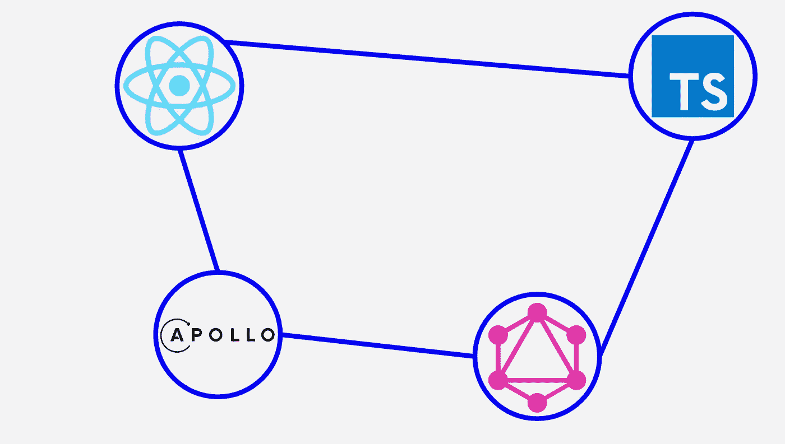

# 1.介绍

这是**动物部落的第三部分:如何创建你的第一个全栈式 Typescript GraphQL 应用？**教程。如果您没有看到第 1 部分和第 2 部分，请点击下面的链接。

[](https://medium.com/@samarony.barros/animal-tribes-how-to-create-your-first-full-stack-typescript-graphql-application-76786e5520ed) [## 动物部落:如何创建你的第一个全栈类型脚本 GraphQL 应用程序？

### 如何使用 Typescript、Node、React 和 GraphQL 构建第一个全栈应用的完整教程

medium.com](https://medium.com/@samarony.barros/animal-tribes-how-to-create-your-first-full-stack-typescript-graphql-application-76786e5520ed) [](https://medium.com/@samarony.barros/animal-tribes-how-to-create-your-first-full-stack-typescript-graphql-application-pt-2-backend-cae1735f13dd) [## 动物部落:如何创建你的第一个全栈类型脚本 GraphQL 应用程序？—第二部分:后端

### 如何使用 Typescript、Node、React 和 GraphQL 构建第一个全栈应用的完整教程

medium.com](https://medium.com/@samarony.barros/animal-tribes-how-to-create-your-first-full-stack-typescript-graphql-application-pt-2-backend-cae1735f13dd) 

在这一部分，我们将使用 React、Typescript 和 Apollo GraphQL 开发我们的客户端。此外，对于造型，我们将使用[风格化组件](https://styled-components.com/)和[反应物化](https://www.npmjs.com/package/react-materialize)。

# 2.设置…我们的大脑

没错，让我们开动脑筋想想我们现在要做什么。让我们稍微思考一下工程学。

我们要创建一个网站，我们需要一些页面，但是我们要使用哪些页面呢？

我们的设计基于我们在第 1 部分中看到的内容

[](https://medium.com/@samarony.barros/animal-tribes-how-to-create-your-first-full-stack-typescript-graphql-application-76786e5520ed) [## 动物部落:如何创建你的第一个全栈类型脚本 GraphQL 应用程序？

### 如何使用 Typescript、Node、React 和 GraphQL 构建第一个全栈应用的完整教程

medium.com](https://medium.com/@samarony.barros/animal-tribes-how-to-create-your-first-full-stack-typescript-graphql-application-76786e5520ed) 

然后我们可以列出页面。

```
Website
  - Home
  - Signup
  - Login
  - Choose your tribe
  - Profile
  - Battle
  - About 
  - Error
```

这将使我们的事情变得容易一些。

# 3.设置客户端

首先，让我们创建一个名为**动物部落客户端的文件夹。**为了简单起见，我们将使用 [create-react-app](https://reactjs.org/docs/create-a-new-react-app.html#:~:text=Create%20React%20App%20is%20a,single%2Dpage%20application%20in%20React.&text=npx%20on%20the%20first%20line,that%20comes%20with%20npm%205.2%2B.) 来创建我们的文件夹，记住添加了 typescript。

```
$ npx create-react-app animal-tribes-client --template typescriptor$ yarn create react-app animal-tribes-client --template typescript
```

这样做，我们应该有一个这样的文件夹结构。

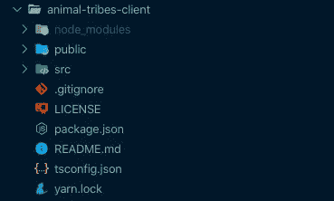

很简单！！！如果您想查看结果，只需在终端中键入:

```
$ yarn start
```

它会自动在您的浏览器中打开一个页面，如下所示:

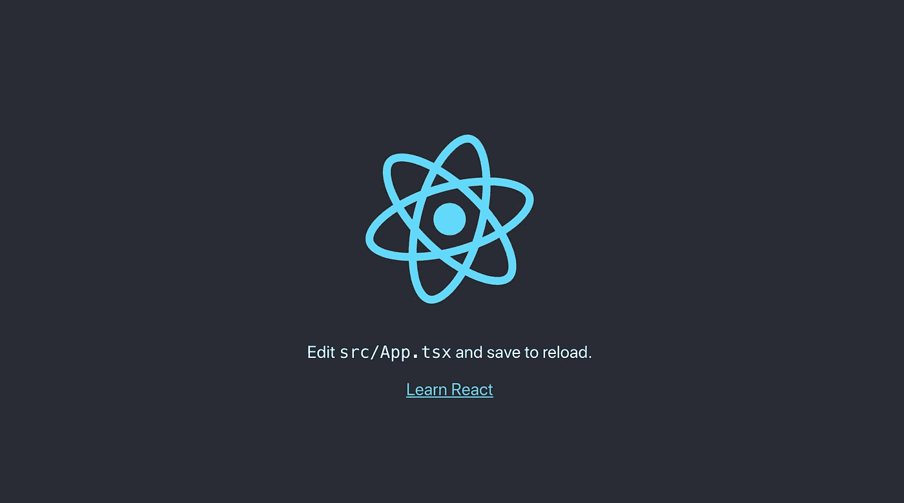

现在，我们可以根据自己的需要进行更改。

让我们创建一个更漂亮的文件。

```
$ cd animal-tribes-client
$ touch prettier.config.js
```

在**动物部落客户端**文件夹中，让我们安装依赖项。

```
$ yarn add \
[@apollo/react-hooks](http://twitter.com/apollo/react-hooks) \
[@types/graphql](http://twitter.com/types/graphql) \
[@types/lodash](http://twitter.com/types/lodash) \
[@types/react-loader-spinner](http://twitter.com/types/react-loader-spinner) \
[@types/react-router-dom](http://twitter.com/types/react-router-dom) \
[@types/styled-components](http://twitter.com/types/styled-components) \
apollo-boost \
graphql \
lodash \
materialize-css \
prettier \
react-loader-spinner \
react-materialize \
react-router-dom \
styled-components \
typescript \
websocket-extensions
```

您的 package.json 文件应该是这样的。

我想使用端口 9000 作为前端，然后您可以将 L35(第 35 行)更改为:

```
"start": "**PORT=9000** react-scripts start",
```

如果您是 Windows 用户，请执行以下操作:

```
"start": "**set PORT=9000** && react-scripts start",
```

让我们删除不必要的文件。

```
$ cd animal-tribes-client
$ rm public/logo192.png public/logo512.png
$ cd src
$ rm App.css App.test.tsx index.css logo.svg serviceWorker.ts 
```

现在我们有一个名为 App.tsx 的文件。为了创建一个模式(文件夹/索引)，我们将创建一个名为 **app** 的文件夹，并将该文件移动到那里，重命名为 **index.tsx** 。

```
$ cd animal-tribes-client
$ cd src
$ mkdir app
$ mv App.tsx app/index.tsx
```

我只想对 **tsconfig.json** 文件做一个修改。在前一章(后端—第 2 部分)，我教了如何使用 **@local** ，而不是**../../** 。在这里，我将展示另一种方式，只显示像'/src/config '这样的文件夹，只需更改 **tsconfig.file** 。

酷，现在，让我们修复和改变我们的文件。

在 **src/index.tsx** 中，让我们修复错误并删除不必要的代码:

我想更改 HTML 标题并添加一些字体。所以，我们打开文件 **public/index.html** 。

将标题 **React App** 改为**动物部落**。

要改变字体，让我们去[谷歌字体](https://fonts.google.com/)，选择对我们更好的。

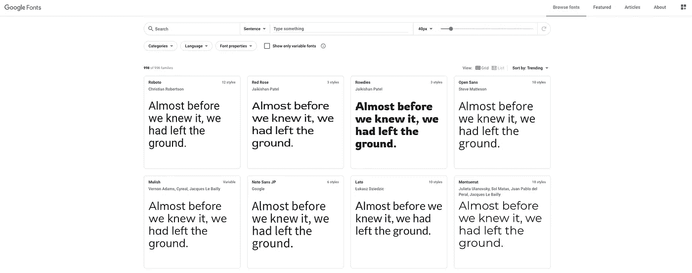

这个项目我喜欢的字体有两种: **Girassol** 和 **Hanalei Fill** 。我们将两者都嵌入到文件中。

```
<link
  href="[https://fonts.googleapis.com/css2?family=Hanalei+Fill&display=swap](https://fonts.googleapis.com/css2?family=Hanalei+Fill&display=swap)"
  rel="stylesheet"
/><link
  href="[https://fonts.googleapis.com/css2?family=Girassol&display=swap](https://fonts.googleapis.com/css2?family=Girassol&display=swap)"
  rel="stylesheet"
/>
```

现在，我们需要添加 react-materialize 中的 CSS 和 JS。

```
<!-- Compiled and minified CSS -->
<link
  rel="stylesheet"
  href="[https://cdnjs.cloudflare.com/ajax/libs/materialize/1.0.0/css/materialize.min.css](https://cdnjs.cloudflare.com/ajax/libs/materialize/1.0.0/css/materialize.min.css)"
/><!-- Compiled and minified JavaScript -->
<script src="[https://cdnjs.cloudflare.com/ajax/libs/materialize/1.0.0/js/materialize.min.js](https://cdnjs.cloudflare.com/ajax/libs/materialize/1.0.0/js/materialize.min.js)"></script>
```

让我们将徽标添加到名为**logo.png**的公共文件夹中。

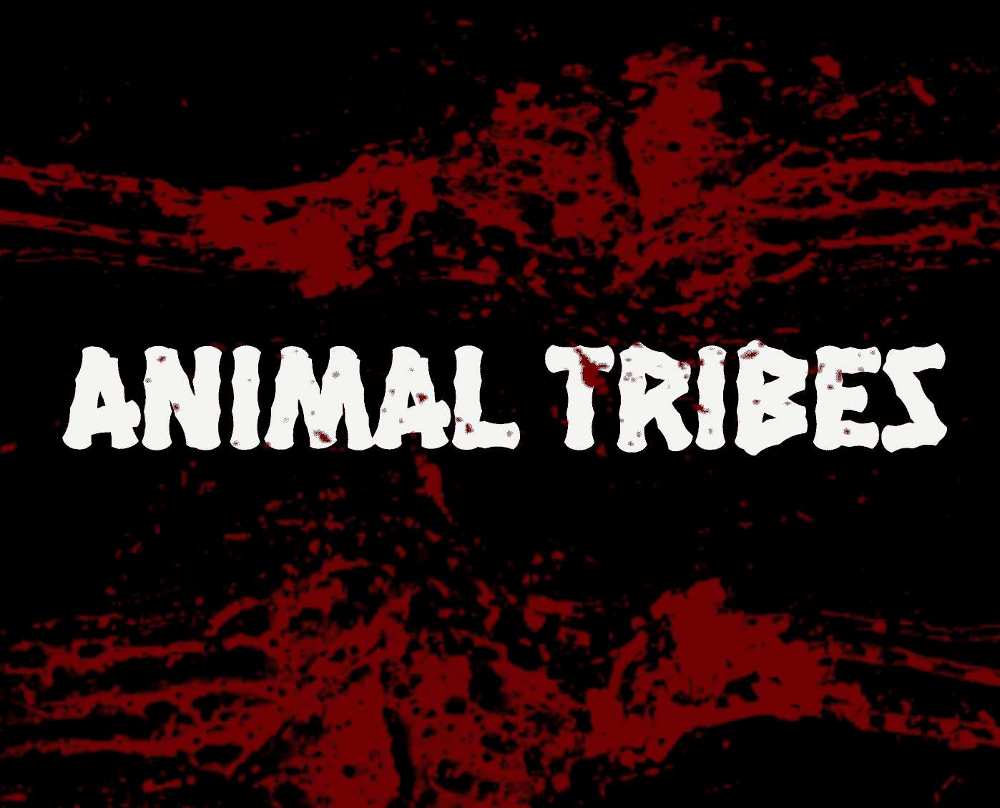

logo.png

最后但同样重要的是，让我们添加一个图标。为此，我将使用下图。


favicon.ico

一个简单的将图片转换成图标的方法是使用在线服务，比如[图标生成器](https://www.favicon-generator.org/)。

选择 **favicon.ico** 并将其添加到公共文件夹。

最后去掉一些注释，加上我们的需求， **public/index.html** 文件应该是这样的。

然后，我们准备开始代码。

## 3.1.设置配置文件夹

在这个文件夹中，我们只需要设置一个生产和开发环境。相反后端，前端不需要隐藏变量。然后，我们只需要创建一个名为 config 的文件夹和索引文件。

```
$ cd src
$ mkdir config
$ touch config/index.ts
```

> 嘿，Sam，我知道我们已经用上一章配置的 URL 设置了开发环境。*🙂*

[](https://medium.com/@samarony.barros/animal-tribes-how-to-create-your-first-full-stack-typescript-graphql-application-pt-2-backend-cae1735f13dd) [## 动物部落:如何创建你的第一个全栈类型脚本 GraphQL 应用程序？—第二部分:后端

### 如何使用 Typescript、Node、React 和 GraphQL 构建第一个全栈应用的完整教程

medium.com](https://medium.com/@samarony.barros/animal-tribes-how-to-create-your-first-full-stack-typescript-graphql-application-pt-2-backend-cae1735f13dd) 

> 但是这个<not yet="">在生产环境中是什么意思呢？*🤔*</not>

耐心年轻的蚱蜢，这是因为我们还没有生产环境的 URL。当我们将它部署到 Heroku 时，我们将改变它，我将在第 4 部分向您展示如何做。

[](https://medium.com/@samarony.barros/animal-tribes-how-to-create-your-first-full-stack-typescript-graphql-application-e7891ec4963a) [## 动物部落:如何创建你的第一个全栈类型脚本 GraphQL 应用程序？

### 如何使用 Typescript、Node、React 和 GraphQL 构建第一个全栈应用的完整教程

medium.com](https://medium.com/@samarony.barros/animal-tribes-how-to-create-your-first-full-stack-typescript-graphql-application-e7891ec4963a) 

## 3.2.设置应用程序

现在，是时候在我们的应用程序中设置 [Apollo GraphQL](https://www.apollographql.com/) 了。然后，让我们编辑文件 **src/app/index.tsx.**

我必须解释一下这个文件中的一些内容。首先，在 L4 中，我们正在导入路线，但是我们仍然没有这个文件。这个文件包含了我们应用程序的所有页面，我很快会教你如何设置。现在，你只需要知道这些。

另一件事是我们使用了**窗口。我们将在上面存储令牌。现在，有许多方法来处理令牌存储，但是为了简单起见，我决定使用本地存储。基本上，我们将使用 [getItem](https://developer.mozilla.org/pt-BR/docs/Web/API/Storage/getItem) 和 [setItem](https://developer.mozilla.org/pt-BR/docs/Web/API/Storage/setItem) 。**

这是我们在这一部分唯一需要做的事情。

## 3.3.设置 GraphQL 文件夹

在第 2 部分中，我们为 GraphQL 创建了查询和变异，现在我们将在前端使用这些东西。

让我们创建文件夹和文件。

```
$ cd src
$ mkdir graphql
$ touch graphql/queries.ts graphql/mutations.ts 
```

正如我在前一章中所说的，我们创建了许多查询和变异，仅仅是出于教学的原因。在这里，我们将只使用必要的。然后，我们只需要查询来获得战士信息，获得技能，获得所有对手，以及获得特定的对手。

然后，让我们创建 **src/graphql/queries.ts** 。

对于突变，我们知道我们需要注册并登录用户，我们还需要更新部落(我们在不同的页面上做这件事)，添加第一技能，并在战斗后更新它们。因此，让我们创建**src/graph QL/mutations . ts .**

## 3.4.正在设置 ts 文件夹

在这里，我们将创建一个共享文件夹，我们称之为 **ts** ，我们将添加我们的共享类型。

然后，让我们创建我们的文件夹和文件。

```
$ cd src
$ mkdir ts
$ touch ts/types.ts
```

这个文件应该有相同的类型，我们在后端:战士，技能，和部落。但是我将为战斗页面添加一个枚举。如果用户赢了一场战斗，我将使用绿色，如果他/她输了就使用红色，如果是平局就使用黄色；

## 3.5.设置公共文件夹

在这一步，我们需要从我的 [GitHub](https://github.com/samaronybarros) 下载图片到[动物部落图片库](https://github.com/samaronybarros/animal-tribes-images)。

下载完图像文件夹后，让我们创建一个公共文件夹。

```
$ cd src
$ mkdir public
```

然后，复制/剪切你从[动物部落图片文件夹](https://github.com/samaronybarros/animal-tribes-images)中下载的文件夹 **img** ，粘贴到**公共文件夹**中。

我们需要在 **public/img/tribes** 中有一个 **index.ts** 文件。有了这个，我们就可以控制自己的结构。

```
$ cd src/public/img/tribes
$ touch index.ts
```

## 3.6.设置路线(第 1 部分)

这个部分称为第 1 部分，因为我需要在不同的时刻做两件事。现在，我们将创建 routes 文件夹并设置页面的路径，稍后我们将创建路由器本身。

> 嘿，山姆，但是你为什么不现在就创建文件呢？

嗯，我想如果你已经有了网页，再看路由器会更清楚。但是现在，让我们创建文件夹和文件。

```
$ cd src
$ mkdir routes
$ touch routes/pages.ts
```

这个文件只包含创建我们的 URL 的常量。如果您将来需要更改它，您可以只在这个文件中进行更改，而不是在整个项目中进行更改。

## 3.7.设置 React 挂钩

React 16 最棒的事情之一是引入了[钩子](https://reactjs.org/docs/hooks-intro.html)，让我们不用写类就能使用状态和其他特性。

基于我们的查询和变异，我们将创建我们的钩子。我们需要做的第一件事是与用户一起工作，因此，我们需要一个钩子来**注册**和**登录**一个用户和另一个用户来获得**认证**。除此之外，我们还需要**战士**和**对手**的信息以及**技能**(获取和更新)。最后，一个钩子指向**更新部落**(选择你的部落屏幕)。

```
$ cd src
$ mkdir hooks
$ touch hooks/use-auth.ts hooks/use-login.ts hooks/use-opponents.ts hooks/use-signup.ts hooks/use-skill.ts hooks/use-tribe.ts hooks/use-warrior.ts
```

3.7.1。创建用户注册

对于这个挂钩，我们需要使用 3 个变体:一个用于添加新用户，一个用于登录用户以获取令牌，最后一个但同样重要的是，用于添加技能。然后，我们需要在本地存储中存储令牌和战士 ID。

**3.7.2。创建用户登录**

这个钩子只需要一个突变来登录用户，但是我们还需要在本地存储中存储令牌和战士 ID。

3.7.3。创建使用授权

这个挂钩非常简单，我们需要验证用户是否已经选择了部落，如果答案是肯定的，这意味着我们存储了入职完成。记住令牌负责获取用户。(后端部分 2)。

然后，如果我们不能得到用户，这意味着用户没有被认证。如果令牌存在，但未设置部落，则用户没有完成入职。如果令牌在那里，并且用户建立了部落，则用户通过了身份验证。

**3.7.4。创建用户部落**

这个钩子负责更新战士部落。我们只是用变异来更新战士。

3.7.5。创建 useWarrior

这个也简单，获取战士信息就行了。

**3.7.6。创建 useSkill 和 useUpdateSkill**

现在，我们需要两个钩子，一个获取技能信息，另一个在有战斗时更新技能。

**3.7.7。创建使用对手和使用对手**

另外两个钩子。我们需要**使用对手**(复数)来构建战士将看到所有对手信息(姓名和部落)的个人资料页面，我们需要**使用对手**(单数)来获得对手的技能。

## 3.8.设置组件

我认为这一部分非常重要。我们将为将在页面中使用的应用程序创建组件。您可以在本教程的第 1 部分找到所有的屏幕。

[](https://medium.com/@samarony.barros/animal-tribes-how-to-create-your-first-full-stack-typescript-graphql-application-76786e5520ed) [## 动物部落:如何创建你的第一个全栈类型脚本 GraphQL 应用程序？

### 如何使用 Typescript、Node、React 和 GraphQL 构建第一个全栈应用的完整教程

medium.com](https://medium.com/@samarony.barros/animal-tribes-how-to-create-your-first-full-stack-typescript-graphql-application-76786e5520ed) 

在这一部分，我将向您展示屏幕，并选择我们要使用的组件。先说主体结构。每个屏幕都有三个部分:页眉、容器(或内容)和页脚。

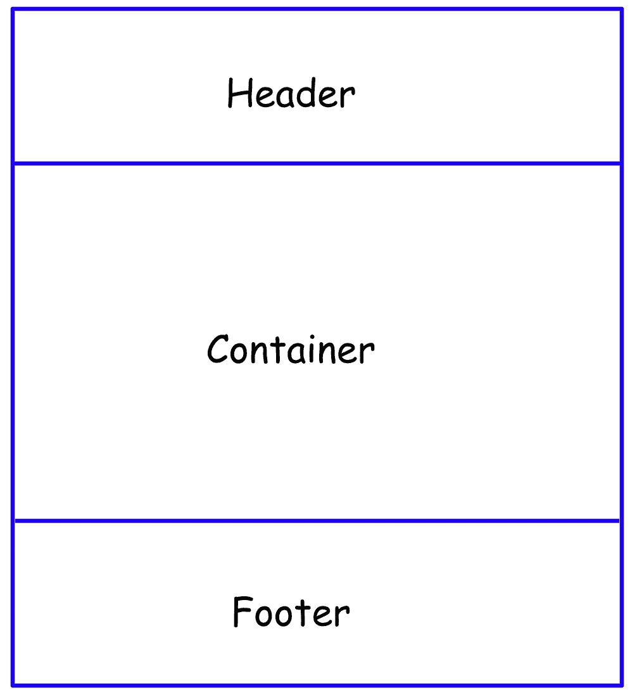

所以，记住，想象设计团队给你 **Home** 屏幕来开发。你如何创建开发结构？我们已经知道我们需要分成 3 个部分:

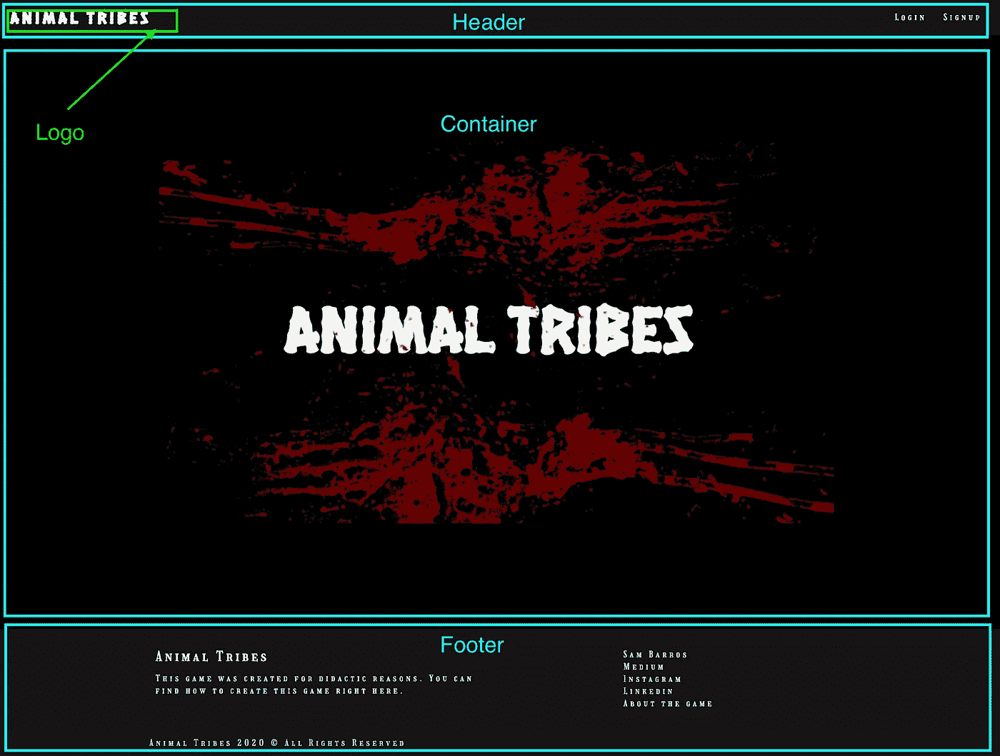

**3.8.1 创建标题**
我们需要知道的一件事是我们有按钮**登录**和**注册**。但是如果用户已经登录，我们不需要显示这些按钮，相反，我们需要显示一个**注销**按钮。

正如我们在 **app/index.tsx** 中看到的，我们将令牌存储在本地存储中。除了令牌之外，我们还将添加用户。然后，要注销，我们只需要清理本地存储。

此外，如果用户登录，用户点击标志，它应该重定向到个人资料，而不是主页。

让我们创建我们的文件夹和文件。

```
$ cd src
$ mkdir components
$ cd components
$ mkdir Header
$ touch Header/index.tsx Header/styles.ts
```

⚠️注意:为了便于识别，所有的组件和页面都将大写。

对于每个组件，我们将有两个文件:**索引**和**样式**。

**3.8.2。创建页脚**

页脚相当简单，我们只需要给一些项目的描述，并给出一些链接。在我的例子中，我只是添加一些个人链接并指向关于页面的**。你也可以这样做。🙂**

```
$ cd src/components
$ mkdir Footer
$ touch Footer/index.tsx Footer/styles.ts
```

**3.8.3。创建容器、输入、按钮、标题和段落**

我决定将所有这些组件添加到同一个子部分中，因为它们只由样式化组件构成。

容器我们之前已经讨论过了，接下来让我们讨论其他的。

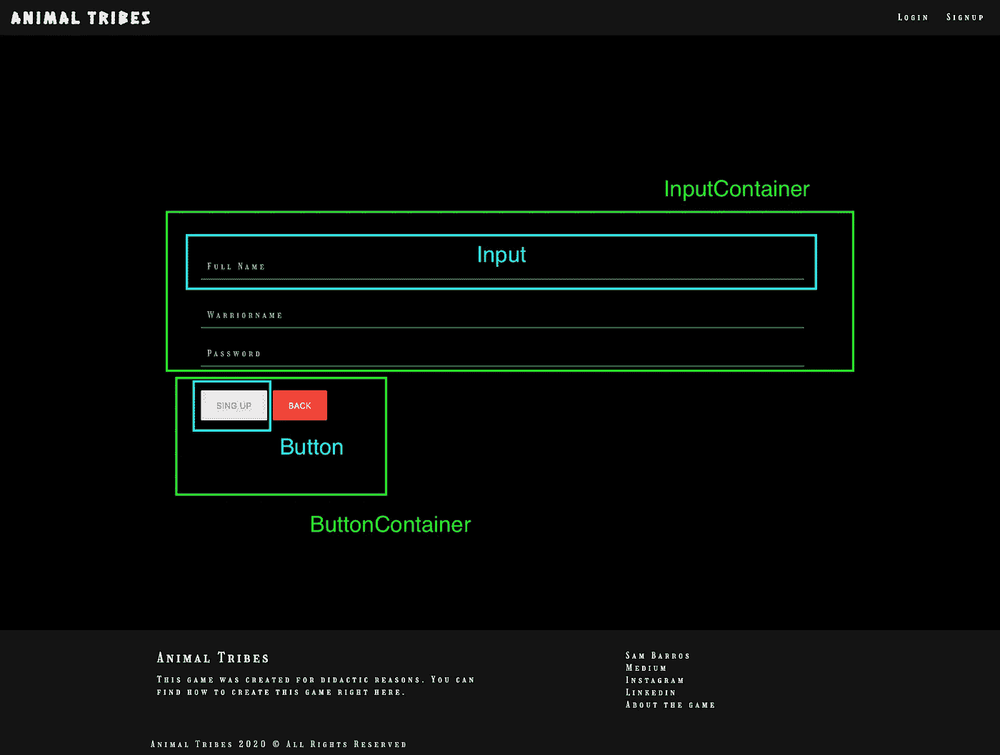

注册屏幕

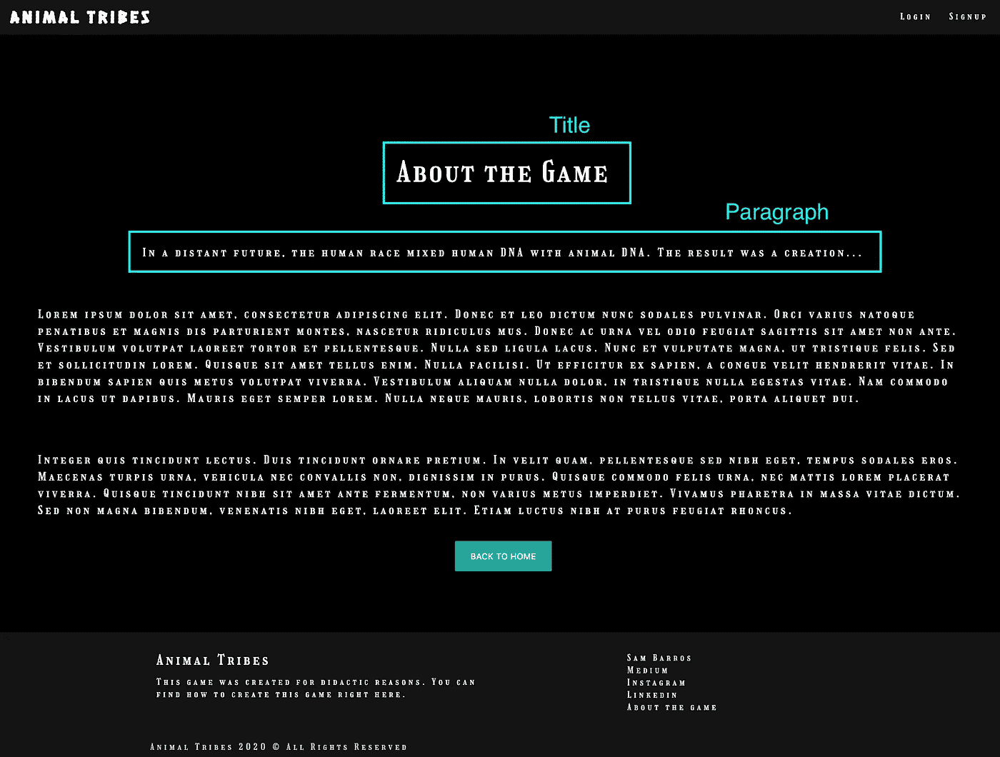

关于屏幕

正如你所看到的，我们有一个用于输入和按钮的容器，这将确保我们保持模式。

它们的一个共同点是:我们可以把它们写在一个文件里。然后，让我们为他们创建一个共享文件夹。

```
$ cd src/components
$ mkdir Shared
$ touch Shared/index.ts
```

3.8.4。创建错误消息

如果用户输入了错误的战士名称和/或密码会发生什么？是的，我们应该显示一条错误消息。


```
$ cd src/components
$ mkdir ErrorMessage
$ touch ErrorMessage/index.tsx ErrorMessage/styles.ts
```

**3.8.5。创建媒体**

当用户注册后，我们进入**选择你的部落**屏幕。我们可以选择所有的部落。我们将调用选择器作为媒体，用户可以选择他/她想要的部落。

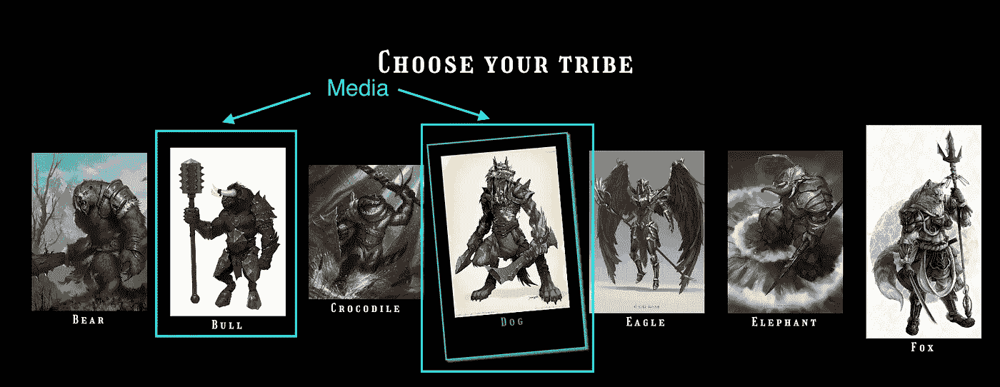

当用户点击部落的名字时，图像向左一点，周围有一个矩形，名字变成绿色。

```
$ cd src/components
$ mkdir Media
$ touch Media/index.tsx Media/styles.ts
```

3.8.6。创造物品、技能、部落形象和战士

在用户的个人资料屏幕中，我们有关于用户及其对手的信息。在这一小节中，我们将重点放在战士上。

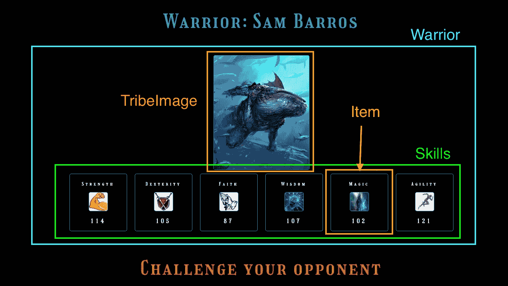

我们可以在这张图片中看到，我们有一个名为**战士**的父组件，两个子组件**部落图像**和**技能**，其中最后一个有一个子组件**物品**。

```
Warrior
  - TribeImage
  - Skills
    + Item
```

然后，我们要从下到上编码，然后从物品到战士。

```
$ cd src/components
$ mkdir Item
$ touch Item/index.tsx Item/styles.ts
```

如您所见，为了构建一个**项目**，我们有一个可以多次重用的组件。现在我们需要根据物品创建一套**技能**。

但是，有一样东西我们可以用在这里。在技能中，我们可以传递两个参数:战士和对手。然后我们可以选择颜色，并在战斗页面上重用组件。

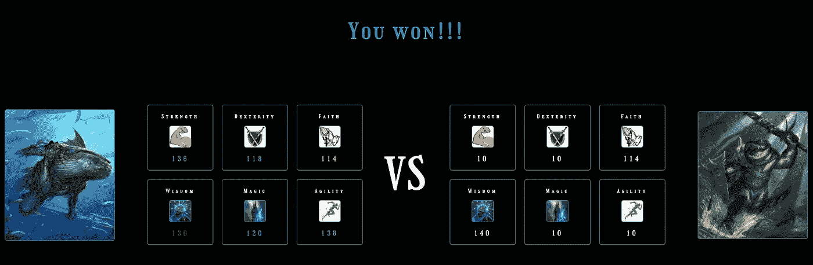

```
$ cd src/components
$ mkdir Skills
$ touch Skills/index.tsx Skills/styles.ts
```

现在，是时候处理 TribeImage 组件了。

```
$ cd src/components
$ mkdir TribeImage
$ touch TribeImage/index.tsx TribeImage/styles.ts
```

最后，我们有战士的成分。另一个有趣的事情是:与上面的图片相比，我们也可以重用这个组件。左边是战士的图像，右边是对手的图像。如果我们处理这个问题，我们还可以重用组件。

```
$ cd src/components
$ mkdir Warrior
$ touch Warrior/index.tsx
```

3.8.7。创造敌人

玩家需要选择他/她想要挑战的敌人/对手。那么我们需要一个组件。

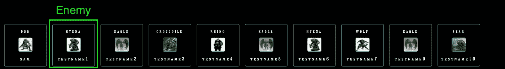

> 嘿，山姆，敌人部分和物品部分很相似。我们能重复使用它吗？

你的想法完全正确，但我这样做并不是为了保持单身的责任。在这种情况下，物品有一个属性**值**是一个**数字，**而敌人应该有一个属性**名称**是一个**字符串**。因此，我将创建另一个组件，以避免概念混淆。

这个组件应该有一个到战斗页面的链接，我们将把对手 ID 作为参数传递。

```
$ cd src/components
$ mkdir Enemy
$ touch Enemy/index.tsx Enemy/styles.ts
```

3.8.8。创建加载器

最后一个组件。当站点加载时，显示一个加载器是很有趣的。因此，我们将使用 [react-loader-spinner](https://www.npmjs.com/package/react-loader-spinner) 库。

```
$ cd src/components
$ mkdir Loader
$ touch Loader/index.tsx
```

## 3.9.设置页面

现在，是时候开始创建我们的页面了。让我们开始创建主页。

```
$ cd src
$ mkdir pages
```

**3.9.1。创建主页**


这是最简单的一页，因为我们已经完成了所有的组件。

```
$ cd src/pages
$ mkdir Home
$ touch Home/index.tsx Home/styles.ts
```

3.9.2。创建注册页面


注册页面应该有输入和按钮。按钮“注册”应被禁用，直到用户填写 3 个输入(全名，战士名和密码)。即使 3 个字段非空，我们也需要验证是否没有错误。我们可以直接从 GraphQL 中捕获错误，由 ErrorMessage 组件来完成这项工作。如果一切正常，我们将重定向到部落页面。

```
$ cd src/pages
$ mkdir Signup
$ touch Signup/index.tsx
```

**3.9.3。创建部落页面**


基本上，在这个屏幕中，用户必须选择部落并转到个人资料。当用户点击“注册”按钮，它应该保存新的部落，并转移到个人资料屏幕。

```
$ cd src/pages
$ mkdir Tribe
$ touch Tribe/index.tsx Tribe/styles.ts
```

**3.9.4。创建登录页面**


这个屏幕与注册屏幕非常相似。我们有更少的领域(只有战士的名字和密码)，我们使用登录钩，而不是注册。

```
$ cd src/pages
$ mkdir Login
$ touch Login/index.tsx
```

3.9.5.创建个人资料页面


个人资料页面有记录的战士和所有对手的信息。记住，对手不能来自同一个部落。

```
$ cd src/pages
$ mkdir Profile
$ touch Profile/index.tsx Profile/styles.ts
```

**3.9.6。创建战斗页面**


在这个屏幕中，我们将获得战士和对手的技能值，并将它们进行比较。我已经在第 1 部分解释了计算。如果用户赢了，我们显示**你赢了**，如果没有，**你输了**。

另一件不同的事情是，我们将直接从 URL 获取对手的 ID。

```
$ cd src/pages
$ mkdir Battle
$ touch Battle/index.tsx Battle/styles.ts
```

**3.9.7。创建关于页面**


“关于”页面只是关于游戏的信息。然而，我们要添加一些东西。如果用户已登录，该按钮将显示消息**返回个人资料**，如果用户未登录，则显示消息**返回主页**。

```
$ cd src/pages
$ mkdir About
$ touch About/index.tsx
```

**3.9.8。创建错误屏幕**


最后，我们有最后一个屏幕，这应该是一个不经常显示的屏幕。如果应用程序没有找到正确的路径，就会出现这个屏幕。

因此，我们需要一个名为 **Error** 的文件夹和带有错误号的子文件夹。在我们的例子中，只是没有找到(404)。

我们将使用与“关于”页面相同的理念。如果用户已登录，按钮将显示消息**返回至配置文件**，如果用户未登录，则显示**返回至主页**。

```
$ cd src/pages
$ mkdir Error
$ mkdir Error/404
$ touch Error/404/index.tsx Error/404/styles.ts
```

## 3.10.设置路线(第 2 部分)

现在我们有了所有的页面，我们可以创建路由来使应用程序工作。

```
$ cd src
$ touch routes/index.tsx
```

**3.11。设置主应用程序**

现在，差不多完成了。我们只需要将路由添加到索引文件中。然后打开文件 **src/index.tsx** ，将内容替换为下面的内容。

# 4.测试应用程序

为了测试应用程序，我们应该启动后端和前端。然后转到终端上的后端文件夹，启动服务器。在另一个终端中，转到前端文件夹并启动客户端。

```
$ cd animal-tribes-server
$ yarn start
```

在另一个终端。

```
$ cd animal-tribes-client
$ yarn start
```

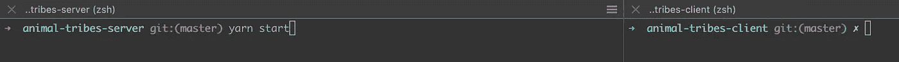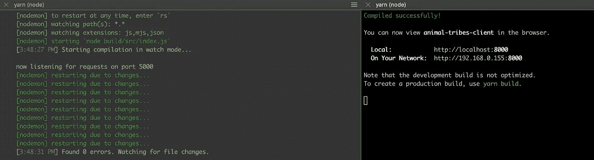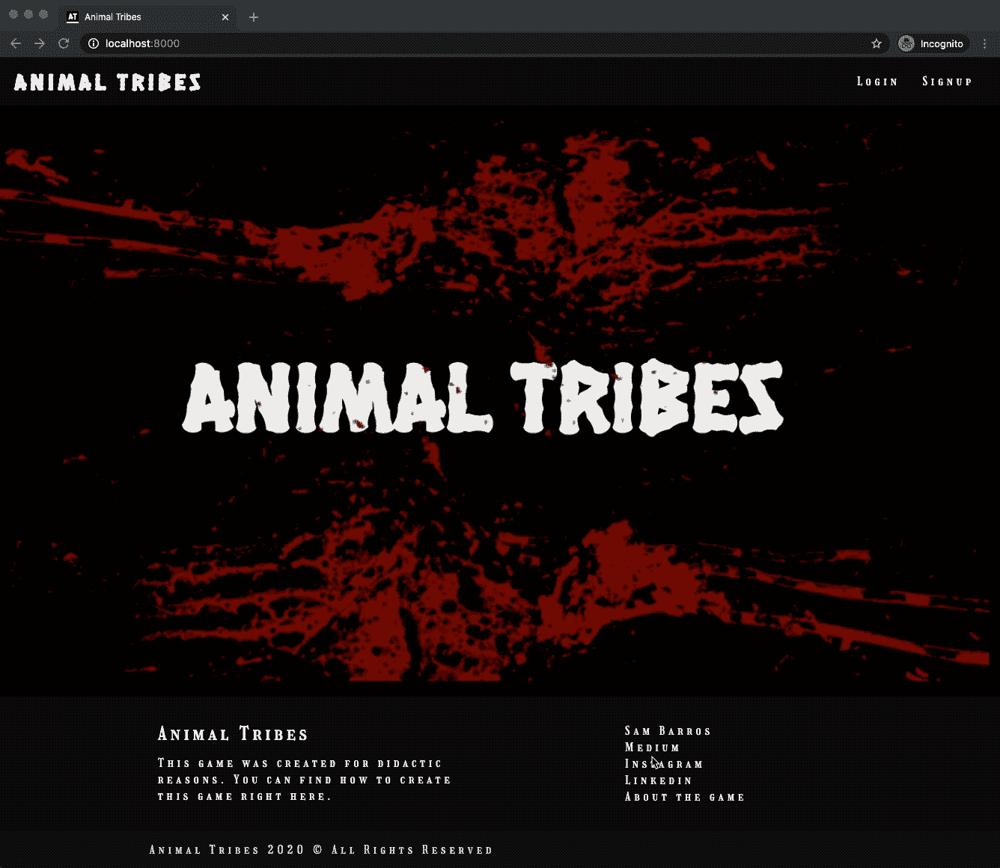

# 5.结论

仅此而已。

这是教程的第三步。在本章中，你已经学习了如何使用 typescript 和 GraphQL 构建一个完整的客户端。你会在这里找到下一部分。

[](https://medium.com/@samarony.barros/animal-tribes-how-to-create-your-first-full-stack-typescript-graphql-application-e7891ec4963a) [## 动物部落:如何创建你的第一个全栈类型脚本 GraphQL 应用程序？

### 如何使用 Typescript、Node、React 和 GraphQL 构建第一个全栈应用的完整教程

medium.com](https://medium.com/@samarony.barros/animal-tribes-how-to-create-your-first-full-stack-typescript-graphql-application-e7891ec4963a) 

其他部分你可以在这里找到。

[](https://medium.com/@samarony.barros/animal-tribes-how-to-create-your-first-full-stack-typescript-graphql-application-76786e5520ed) [## 动物部落:如何创建你的第一个全栈类型脚本 GraphQL 应用程序？

### 如何使用 Typescript、Node、React 和 GraphQL 构建第一个全栈应用的完整教程

medium.com](https://medium.com/@samarony.barros/animal-tribes-how-to-create-your-first-full-stack-typescript-graphql-application-76786e5520ed) [](https://medium.com/@samarony.barros/animal-tribes-how-to-create-your-first-full-stack-typescript-graphql-application-pt-2-backend-cae1735f13dd) [## 动物部落:如何创建你的第一个全栈类型脚本 GraphQL 应用程序？—第二部分:后端

### 如何使用 Typescript、Node、React 和 GraphQL 构建第一个全栈应用的完整教程

medium.com](https://medium.com/@samarony.barros/animal-tribes-how-to-create-your-first-full-stack-typescript-graphql-application-pt-2-backend-cae1735f13dd) [](https://medium.com/@samarony.barros/animal-tribes-how-to-create-your-first-full-stack-typescript-graphql-application-e7891ec4963a) [## 动物部落:如何创建你的第一个全栈类型脚本 GraphQL 应用程序？

### 如何使用 Typescript、Node、React 和 GraphQL 构建第一个全栈应用的完整教程

medium.com](https://medium.com/@samarony.barros/animal-tribes-how-to-create-your-first-full-stack-typescript-graphql-application-e7891ec4963a) 

你可以在我的 [GitHub](https://github.com/samaronybarros) 中找到完整的项目，然后搜索[动物部落客户端库](https://github.com/samaronybarros/animal-tribes-client)。

我希望我对你的知识有所贡献。有什么地方需要改进才能写出更好的文章，欢迎随时告诉我。告诉我，如果你有文章或代码的改进。

感谢您耐心阅读本文。下一篇文章再见。

看看我的其他文章。谢谢你能来。

# 6.我的其他文章

[](https://medium.com/swlh/how-to-create-your-first-mern-mongodb-express-js-react-js-and-node-js-stack-7e8b20463e66) [## 如何创建你的第一个 MERN (MongoDB，Express JS，React JS 和 Node JS)栈

### 嗨伙计们，

medium.com](https://medium.com/swlh/how-to-create-your-first-mern-mongodb-express-js-react-js-and-node-js-stack-7e8b20463e66) [](https://medium.com/swlh/how-do-i-deploy-my-code-to-heroku-using-gitlab-ci-cd-6a232b6be2e4) [## 如何使用 GitLab CI/CD 将我的代码部署到 Heroku？

### 关于如何使用舞台和生产环境的教程

medium.com](https://medium.com/swlh/how-do-i-deploy-my-code-to-heroku-using-gitlab-ci-cd-6a232b6be2e4) [](/how-to-make-tests-using-chai-and-mocha-e9db7d8d48bc) [## 如何用柴和摩卡做测试？

### NodeJS 应用程序的 TDD

itnext.io](/how-to-make-tests-using-chai-and-mocha-e9db7d8d48bc) 

# 关于我

Sam Barros 是一名巴西人，作为一名软件工程师在柏林生活和工作。他是一个技术爱好者，他总是用自己的生活来帮助人们。

连接到:

*   [领英](https://www.linkedin.com/in/sam-barros/)
*   [GitHub](https://github.com/samaronybarros)
*   [中型](https://medium.com/@samarony.barros)
*   [个人网站](https://sambarros.com/)