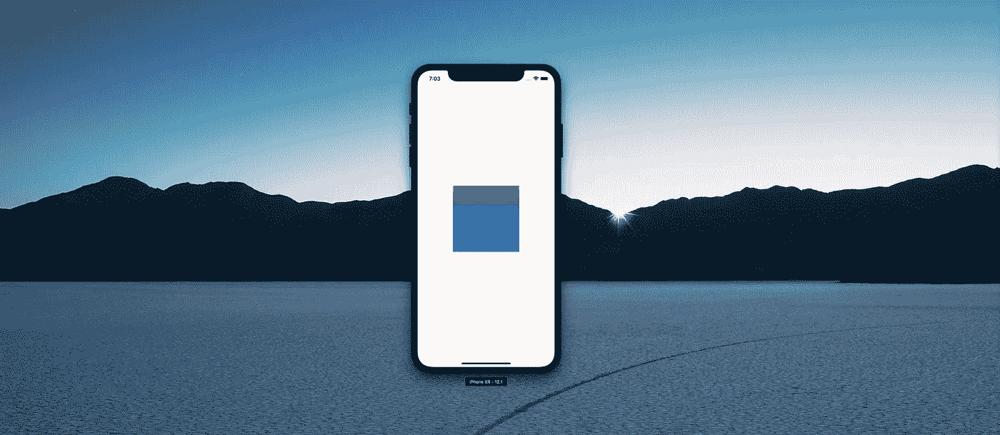
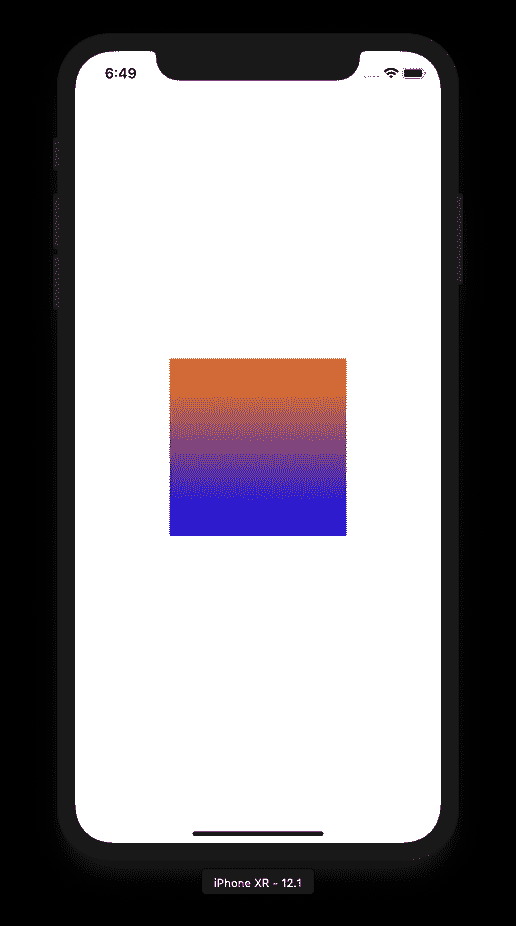
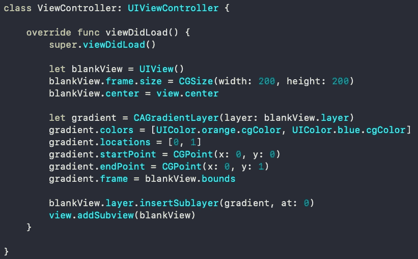
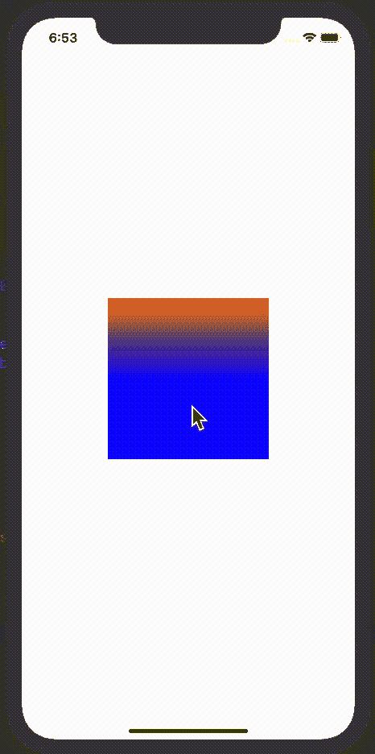

# 使用 CABasicAnimation 制作 CAGradientLayer 动画—在 Swift 和 Xcode 中学习渐变！

> 原文：<https://itnext.io/animate-cagradientlayer-with-cabasicanimation-learn-gradients-in-swift-xcode-93e4b09d3eb1?source=collection_archive---------2----------------------->

快速设置一个渐变和动画！哇！毒品！

如果你喜欢看而不是读，我在我的 youtube 频道上找到了这个故事的视频教程。

## 什么是 CAGradientLayer？

[苹果开发者在 CAGradientLayer](https://developer.apple.com/documentation/quartzcore/cagradientlayer) 上的文档将其描述为 CALayer 的子类，上面绘制了颜色渐变。或者如文件所述:

> 在其背景色上绘制颜色渐变的图层，填充图层的形状(包括圆角)— Apple Developer Docs

好了，为了避免将整个 CAGradientLayer 文档复制粘贴到 medium 上，我们编写一些代码来让您的头脑充满制作 CAGradientLayer 动画的可能性，如何？

## 快速设置！这给了你一个很好的梯度！

## 现在只需添加一个 CABasicAnimation，你就有了一个很酷的动画！

当它不是 GIF 的时候看起来更好

# 干得好！

你刚刚获得了两项新技能！您现在知道如何使用:

*   CAGradientLayer 创建渐变
*   动画制作

# 哟！:)更多免费 SWIFT 内容！

如果你想第一个听说有限的免费课程优惠券(每月 10 英镑)，请随时订阅我的 [**每周开发内容电子邮件列表。**](https://www.maxcodes.io)

[**如果你想在 CAGradientLayer 和 CABasicAnimation 上和其他酷类一起观看整个系列，请在我的 YouTube 频道**](http://Youtube.com/maxcodes) **maxcodes** 上查看