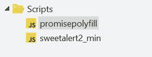
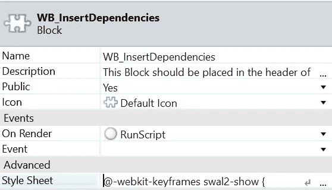
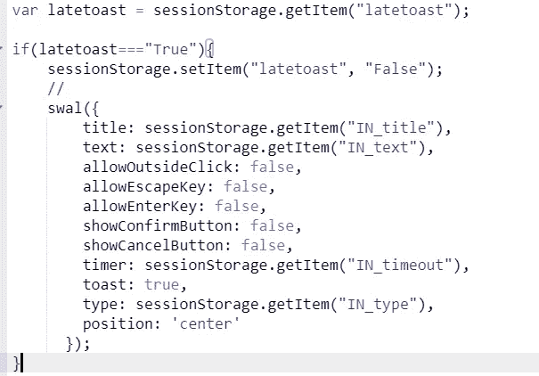
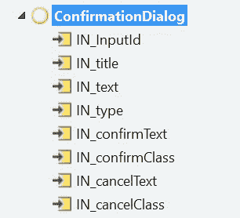
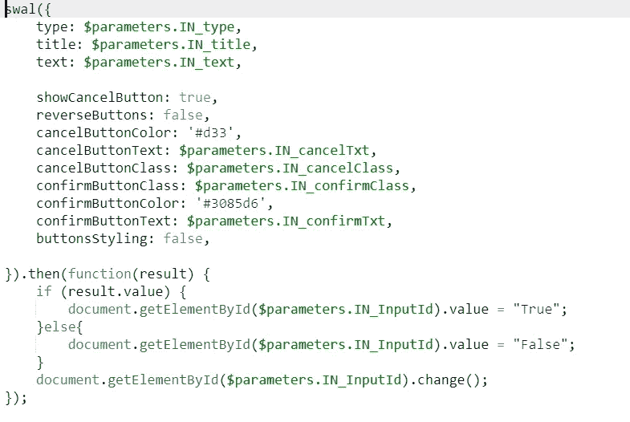
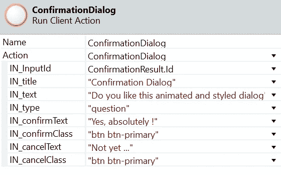
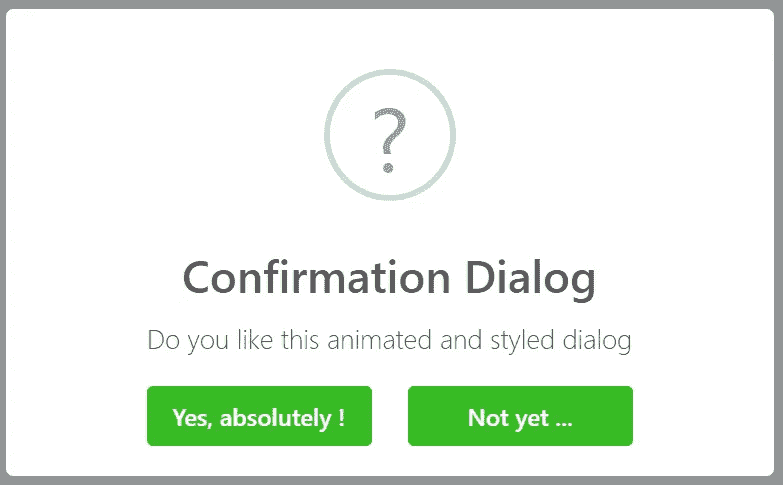

# 动画和样式化的外部系统对话框消息

> 原文：<https://itnext.io/animated-and-styled-outsystems-dialog-messages-6d6adfa974a3?source=collection_archive---------6----------------------->

你觉得标准的外部系统对话信息怎么样？我们社区中最常见的回答是… **我一点也不喜欢他们！**

标准 OutSystems 成功对话消息与动画风格的成功对话消息

产品所有者和设计者多次要求我改变这些丑陋和无聊的对话信息，因此我决定寻找一个解决方案，并在 OutSystems 中实现它。

在本文中，我将解释在 OutSystems Reactive Web 应用程序中实现动画和样式化对话框消息的步骤，这样您就可以自己动手了。

上传到 OutSystems 应用程序中的 JavaScript 库文件

步骤 1:将两个 JavaScript 库( [promisepolyfill](https://www.jsdelivr.com/package/npm/promise-polyfill) 和 [sweetalert2_min](https://www.jsdelivr.com/package/npm/sweetalert2) )上传到您的 OutSystems 应用程序中。

包含样式表和“渲染时”事件的块

第二步:创建一个块。将由库的同一来源提供的样式表粘贴到块的高级属性中。

步骤 3:在事件“On Render”上关联一个客户端动作，该动作将执行以下 JavaScript 代码:

启用延迟 toast(一种对话消息)的 JavaScript 代码

步骤 4:这个块应该放在你的应用程序的布局头中。

> 为了缩短文章，我将只描述最复杂类型的对话框消息，确认对话框消息。所有其他类型都有非常相似或更简单的实现过程。

确认对话框客户端操作

步骤 5:创建一个客户端动作，上面图片中的所有输入都是可见的。此操作将使用以下代码执行 JavaScript:

运行动画和样式确认对话框消息的 JavaScript

步骤 6:在你的屏幕上创建一个按钮，当用户点击它时执行一个屏幕动作(OutSystems 术语)。该屏幕操作将在确认对话框客户端操作(在步骤 5 中创建的操作)内，您需要填写所需的输入(见下图)。

输入使用了一个确认对话框消息的例子

发布您的应用程序，当单击按钮时，结果将是这样的:

动画和样式的确认对话框消息

这个实现也可以作为一个可重用的组件，你可以在这里找到它:[动画&风格的对话框/警告](https://www.outsystems.com/forge/component-overview/8395/animated-styled-dialogs-alerts)

JavaScript 库来源:[https://www.jsdelivr.com](https://www.jsdelivr.com)

由 jsDelivr 使用 UglifyJS v3.4.4 缩小.
原始文件:/NPM/promise-poly fill @ 8 . 1 . 0/lib/index . js

感谢您的阅读！

鲁本·博尼托