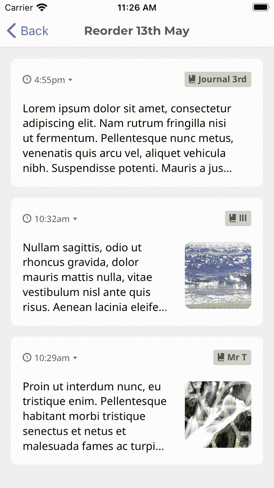

# React Native 中的动画列表重新排序——揭秘

> 原文：<https://itnext.io/animated-list-reordering-in-react-native-secrets-revealed-3192cc33fe4f?source=collection_archive---------3----------------------->

在谷歌搜索了两个小时后，很明显 React Native 中的列表动画重新排序是一个未知领域。很自然，我想到的是，这是一个开源贡献的好机会！虽然，最后多亏了开源，它才得以实现。


每当我遇到问题时，我首先搜索的是通用的解决方案，所以在这种情况下，我们试图在 React Native 中建立一个动画重排，所以让我们从 React 开始。有一个名为 [react-flip-move](https://github.com/joshwcomeau/react-flip-move) 的 react 库，但是经过检查，React 原生支持似乎并不存在。

我决定要构建这个，我需要创建一个自定义的钩子，允许在 React Native 中对列表进行排序，由[动画](https://reactnative.dev/docs/animated) API 提供支持。解决方案分为三个部分:

*   计算列表中每个项目的高度和 y 位置
*   找出交换了位置的项目
*   使用动画 API 对项目重新排序

这导致了一些非常复杂的代码，我计划稍后将其抽象成一个定制的钩子。(**放心吧！你不需要复制这个，它只是作为参考**

```
async function swapItems(index1, index2){
     setIsAnimating(true);

     const item1 = await measure(listRefs[index1].current);
     const item2 = await measure(listRefs[index2].current);
     const animated1 = animatedRefs[index1];
     const animated2 = animatedRefs[index2]; const animations = animatedRefs.slice(index1, animatedRefs.length).map((ref, index) => ( Animated.spring(animatedRefs[index], { toValue: 175 * (index + 1) , duration: 400 }, { useNativeDriver: false })));

   Animated.parallel([
      ...animations,
      Animated.spring(animated2, {
        toValue: (item2.pageY - item1.pageY) - 8,
        duration: 400
      }, { useNativeDriver: false }),
   ]).start(() => {
      animatedEdges.current = edges;
      setIsAnimating(false);
   });
}
```

我在这个定制解决方案上花了几个小时，但毫无效果。排序有几个奇怪的问题，性能很差，我放弃了自定义实现，但我知道一定有更好的方法。

那天晚上…我在梦中想到，要实现这一点，我需要利用 [react-spring](https://react-spring.io/) 动画库，瞧，当我早上登录时，我在 [react-spring](https://react-spring.io/) 网站的代码沙箱中找到了一个 react 动画重排的例子，我的潜意识是对的。

这里是 [CodeSandbox，用于重新排序列表项](https://codesandbox.io/s/eloquent-meninsky-rzmc0?file=/src/App.tsx)。下一个挑战是将其转换为 React 本机代码，需要注意的是，在 react-spring v9 中，`useTransform`钩子[有重大改变](https://aleclarson.github.io/react-spring/v9/breaking-changes/#The-useTransition-hook)，不幸的是，这使得它与 [FlatList](https://reactnative.dev/docs/flatlist) 不兼容，因此下面的解决方案将只适用于小列表。在我们的例子中，这种重新排序功能只适用于专门的重新排序屏幕上的一小部分项目。

## 从 React 转换为 React 本机

您必须安装`@react-spring/native`库，它是 React Native 的 react-spring 端口。安装完成后，您需要导入以下内容:

```
import { useTransition, animated } from "@react-spring/native";
```

然后将一个 React Native [视图](https://reactnative.dev/docs/view)封装成动画，这样我们就可以在以后制作视图组件的动画了:

```
const AnimatedView = animated(View);
```

沙盒中的大部分代码在 React Native 中实现时都非常相似。首先，我们将数据提供给`useTransform`钩子:

```
const ListItemHeight = 190;
const edges = [...];
const transitions = useTransition(
    edges.map((data, i) => ({ ...data, y: -(i * ListItemHeight) })),
    {
       key: (item) => item.id, // <- Update this with uid of item
       from: { height: 0, opacity: 0 },
       leave: { height: 0, opacity: 0 },
       enter: ({ y, height }) => ({ y, height, opacity: 1 }),
       update: ({ y, height }) => ({ y, height }),
    }
);
```

完成后，我们使用`transitions`函数在 [ScrollView](https://reactnative.dev/docs/using-a-scrollview) 中呈现我们的项目。因为我们所有的项目都是使用`absolute`定位的，所以我们必须计算滚动视图的高度。

```
<ScrollView 
  contentContainerStyle={{ 
     minHeight: edges.length * ListItemHeight 
  }}
>
   ...
</ScrollView>
```

然后在 ScrollView 中，我们添加了 transitions 函数来渲染我们的项目，并应用 react-spring 动画和样式。

```
{transitions((style, item, t, index) => (
   <AnimatedView 
     style={{
       zIndex: data.length - index,
       bottom: style.y,
       height: style.height,
       opacity: style.opacity
     }} 
     key={item.id}
   >
     <MyListItem ... />
    </AnimatedView>
))}
```

现在你有了它，你应该能够使用 React Native 实现列表的动画重新排序，无论何时数据发生变化，react-spring 都会动画显示列表的重新排序！



Qeepsake 条目重新排序

综上所述，以下是该代码的要点:

你可以通过下载[qee sake](https://www.qeepsake.com/)来检查这个特性。保存记忆最简单的方法，就像在《鲨鱼池》里看到的。