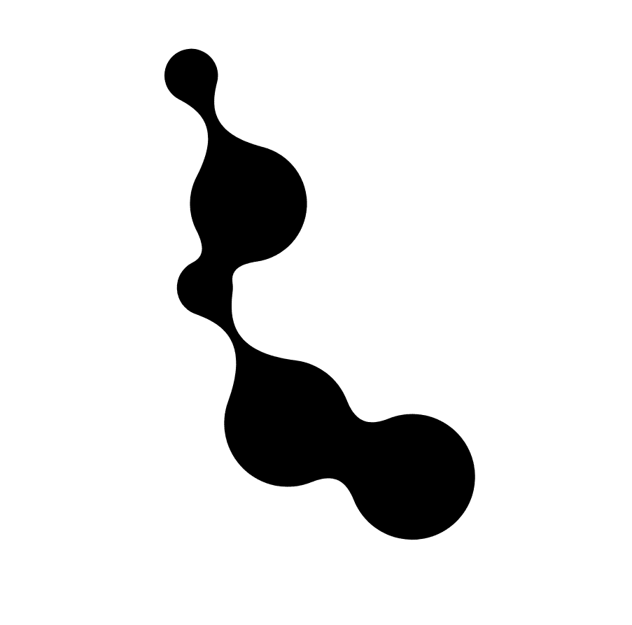

# 动画反应+ d3 变形球

> 原文：<https://itnext.io/animated-react-metaballs-dff3b3a6dee2?source=collection_archive---------6----------------------->



反应变形球:反应和 d3 的动画变形球

前一段时间，我写了关于[高级元球](https://medium.com/@tbarrasso/advanced-meta-metaballs-864bbf0a945c)的文章，描述了它们的效用，并概述了一种算法，用于计算给定一组圆的 SVG 路径。然而，我没有包括示例代码或动画信息。

这就是反应变形球的用武之地。这是一个使用 React 和 d3 构建的简单组件。下面是这个项目的概述，如何使用它，以及我在动画方面的一些尝试。

# 反应变形球

你可以在 npm 上找到 react-metaballs 的[演示，在 GitHub](https://tombarr.github.io/react-metaballs/index.html) 上找到[包和](https://www.npmjs.com/package/react-metaballs)[源代码。](https://github.com/Tombarr/react-metaballs)

## 装置

```
npm install react-metaballs
```

## 使用

安装完成后，`Metaballs`组件可以按如下方式导入

```
import ReactMetaballs from 'react-metaballs'
```

数据被格式化为包含三个值的对象数组:

```
const circles = [
  {
    cx: 200,
    cy: 100,
    r: 64
  }, // ...
];
```

`cx` —在 x 轴上居中

`cy` —在 y 轴上居中

`r` —半径

坐标是相对于整体的，这意味着围绕创建 SVG `[viewBox](https://developer.mozilla.org/en-US/docs/Web/SVG/Attribute/viewBox)`的所有圆构建一个矩形。然后，它使用[贝塞尔曲线](https://medium.com/sketch-app/mastering-the-bezier-curve-in-sketch-4da8fdf0dbbb)围绕所有圆构建一个单独的`path`元素。

```
class App extends Component {
  render () {
    return (
      <Metaballs
        easement={d3.easeBackOut}
        circles={circles} />
    )
  }
}
```

最终的输出呈现了一个`svg`元素，该元素按照`[preserveAspectRatio](https://developer.mozilla.org/en-US/docs/Web/SVG/Attribute/preserveAspectRatio)`属性的定义随其容器一起缩放。这就是 SVG 中的*可伸缩*，我们定义了一个浏览器知道如何放大或缩小的向量。

# 动画

如果您持有对`Metaballs`元素的引用，那么有一个`updateCircles`方法负责两组数据之间的转换。

例如，要在两种状态之间转换:

```
this.metaballRef.current.updateCircles(newCircles)
```

最初的过渡是用 CSS 中的一行代码编写的，但是由于兼容性问题，这种方法被放弃了。

```
path {
    transition: d 300ms ease-in-out;
}
```

要是动画也这么简单就好了。这实际上在谷歌 Chrome 中可以工作，但只有[谷歌 Chrome](https://stackoverflow.com/questions/46454102/css-d-path-attribute-doesnt-work-in-safari-firefox) :(对于其他现代浏览器，有 SVG `animate`元素，但这也有[兼容性问题](https://caniuse.com/#feat=svg-smil)。其他关于 [React SVG 动画](https://www.aaron-powell.com/posts/2017-08-08-react-svg-animations/)的指南建议`requestAnimationFrame`，但这似乎很可能会导致问题，并且很难操纵动画属性，如缓动。

输入`d3`(双关语)！`d3`提供大量选项，并支持轻松制作`[d](https://bost.ocks.org/mike/path/)` [属性的动画](https://bost.ocks.org/mike/path/)。通过创建一个封装了`path`元素的组件，制作`d`属性的动画变得很容易:

```
componentWillReceiveProps(nextProps) {
    if (this.props.path !== nextProps.path) {
        let { duration, easement = d3.easeLinear } = this.props;
        this.path.transition()
                 .ease(easement)
                 .attr('d', nextProps.path)
                 .on('end', () => this.setState({
                     path: nextProps.path
                 }))
                 .duration(duration);
    }
}
```

对于纯粹主义者来说，这违反了所有的规则。从 d3 的角度来看，我们并没有真正绑定到数据，只是使用 d3 作为补间库。从 React 的角度来看，我们正在直接操作 DOM，并使用即将被弃用的`[componentWillReceiveProps](https://reactjs.org/docs/react-component.html#unsafe_componentwillreceiveprops)`方法。但是肯定还有其他人以这种方式使用 [React + d3](https://swizec.com/blog/using-d3js-transitions-in-react/swizec/6797) ，并且取得了很好的效果。

暂时就这样了。我希望在未来探索`[react-move](https://github.com/react-tools/react-move)`，它承诺以一种与两个框架一致的方式来实现我们的 React + d3。瓦隆·瓦赫哈尔的代码和关于[元球](http://varun.ca/metaballs/)数学的文章值得称赞。

你可以在 [GitHub](https://github.com/Tombarr/react-metaballs) 上找到源代码。关于样式和用例的想法，请参见我之前关于[漂亮变形球](https://medium.com/@tbarrasso/pretty-svg-metaballs-f8d2a4c6f594)的文章。