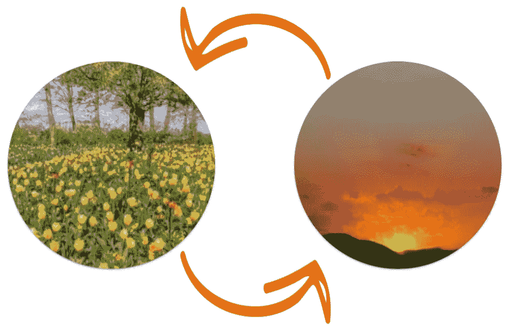

# 用 React 钩子动画列表重新排序

> 原文：<https://itnext.io/animating-list-reordering-with-react-hooks-aca5e7eeafba?source=collection_archive---------1----------------------->

不久前，我得到了一个很酷的 Instagram story 风格的泡泡组件设计，当我们从 API 获得新的订单时，每个泡泡都会平稳地滑入新的位置。

虽然用 CSS 做一整套动画和过渡很简单，但我花了一段时间才找到一个动画列表项重新排序的例子，尤其是用 React。因为我也开始习惯 React 钩子的概念，所以我想用它们来实现这个动画。

我发现使用 React hooks 很难做到这一点，因为当我的组件获得新数据时，它会以新的顺序自动重新呈现。我试图在重新渲染之前抓住时机，平稳地从一种状态过渡到另一种状态。如果没有来自类组件的***componentWillReceiveProps***函数调用，这是很难做到的。

我曾经(错误地)认为在野外会有很多 React hooks 的例子。老实说，我只是想要一个不需要太多改动的复制意大利面解决方案👀。我也不想引入一些巨大的、通常过于灵活的包来重新订购一个小东西。我确实看到了 Joshua Comeau 的一篇很棒的文章(链接如下)。它解释了如何做我所需要的，但是使用类组件。对于 React hooks，我需要重新思考一些概念来让它工作，但是我已经将大部分工作建立在这篇文章的基础上。

我们希望发生的事情:

1.  留意我们的元素列表什么时候会改变
2.  当它改变时，我们希望在 DOM 更新之前计算列表中每个元素的先前位置和新位置
3.  此外，在 DOM 使用列表的新顺序更新之前，我们希望“暂停”更新，并显示列表中每个项目从旧位置到新位置的平滑过渡

让我们从一个父组件开始，它只是呈现传递给它的子组件， ***AnimateBubbles*** :

然后，我们可以通过在组件中呈现我们的项目来使用该组件。在我的例子中，我创建了一个 ***Bubble*** 组件，它添加了一些样式，使每个图像都变成了一个圆形，[完整的代码在这里](https://codesandbox.io/s/reorder-elements-with-slide-transition-and-react-hooks-flip-211f2?file=/src/Bubble.js)。 ***气泡*** 组件也将 ref 转发到 DOM 元素上。这很重要，因为我们可以使用 ref 来查找元素在 DOM 中呈现的位置，然后我们可以计算它的位置。另一个重要的道具是 ***键*** ，这不仅是映射元素时 React 所需要的，而且我们还可以在以后使用它来唯一地标识每个项目并匹配它在 DOM 中的新旧位置。

现在我们有了组件的基础，我们可以开始构建我们的 ***动画气泡*** 组件的逻辑了。

# 留意反应堆里的人

有了 React 钩子，我们不再能够访问像***componentWillReceiveProps***或***componentDidUpdate***这样的生命周期方法，取而代之的是所有关于效果的东西。如果我们想在道具改变时做些什么，我们可以在[***use effect***](https://reactjs.org/docs/hooks-effect.html)中完成。 ***useEffect*** 钩子告诉 React 我们的组件在渲染之后需要做一些事情。在我们的例子中，如果我们的列表发生变化，新的订单被提交，我们只需要做一些工作。将孩子添加为依赖项允许我们这样做。

# 测量 DOM 中的每个位置

每当子道具改变时，为了计算每个子道具在 DOM 中的位置，我们可以使用[***getBoundingClientRect***](https://developer.mozilla.org/en-US/docs/Web/API/Element/getBoundingClientRect)。为此，我创建了一个单独的助手函数:

在这个函数中，我们传入 ***子*** 作为参数，并在 React 上使用 ***forEach*** 函数。子对象来迭代它们，获取对象中每一项的度量值，稍后我们可以将这些度量值存储在 state 中。这就是为每个孩子设置一个关键点很重要的地方，因为我们存储每个盒子，并将其关键点作为对象关键点，这样我们就可以在以后用新位置匹配旧位置。这也是为什么为每个子元素创建一个 ref 很重要，因为我们用它在 DOM 中找到元素并测量它的边界框。现在，当我们在 ***useEffect*** 中调用这个函数时，我们将在每次渲染时为每个孩子更新边界框🎉。

现在的问题是，我们只得到新的位置，但我们也需要旧的位置，这样我们就可以从旧的位置到新的位置做幻灯片动画。

# 使用 usePrevious 挂钩获取上一个状态/属性

我们可以得到孩子的旧位置的一种方法是通过跟踪孩子的先前状态。React 文档已经建议了一个名为 ***的钩子，使用先前的*** 。他们说将来可能会提供开箱即用，因为它被认为是一个常见的用例。使用 [***使用前一个***](https://reactjs.org/docs/hooks-faq.html#how-to-get-the-previous-props-or-state) 意味着我们可以像测量新位置一样测量旧位置的边界框。

我把这个放到了一个单独的 ***useEffect*** 中，因为它们不需要一起完成，而且它们都有不同的依赖关系。这些以前的位置现在将在每次孩子改变时重新计算。

现在我们有了这两条重要的信息，我们可以继续进行实际的转换了😅

# 采取行动

在制作真正的动画时，我更多地关注了约书亚·科莫帖子中提到的翻转。FLIP 代表 First，Last，Invert，Play，由 Paul Lewis 创造，作为渲染更高性能动画的原则。

所以在我们的例子中，我们找到每个孩子的第一个位置。我们将此状态存储在 ***预边界框*** 中。然后我们找到每个孩子最后的位置。我们在 ***的输入框*** 中也有这个储存状态。下一步是反转，这是为了找出每个孩子是如何改变的，并对每个孩子应用这些变换，使其看起来像在第一个位置。

我们可以设置一个新的 useEffect 来实现对 ***子*** 、 ***边界框*** 和 ***预边界框*** 的依赖，因为我们将在效果中使用所有这些值。记住当 React 重新渲染时，它会立即用新的状态更新视图，但是我们可以使用[***requestAnimationFrame***](https://developer.mozilla.org/en-US/docs/Web/API/window/requestAnimationFrame)来告诉浏览器我们想要执行一个动画。浏览器会在下次重画之前调用你给它的函数。

这一点我们可以用 ***倒数=倒值*** 上 ***左*** 框的值来实现。因为我们也有一个对 DOM 节点的引用，所以我们可以将转换直接应用到节点上，转换时间为 0 秒，这样它就会立即反转。

最后一步是播放动画。为此，我们等待子元素被反转，然后我们移除变换并应用平滑过渡。然后这些元素滑入它们的新位置💃🏾💃🏾💃🏾。

# 消除故障

当我开始用 ***useEffect*** 工作时，我发现它看起来超级故障，然后在 React 文档中挖掘后，我发现了这个提示:

> "与 componentDidMount 或 componentDidUpdate 不同，使用 useEffect 安排的效果不会阻止浏览器更新屏幕。这让你的应用程序感觉反应更快。大多数影响不需要同时发生。在不常见的情况下(例如测量布局)，有一个单独的 useLayoutEffect 挂钩，其 API 与 useEffect 相同。— [反应文件](https://reactjs.org/docs/hooks-effect.html#detailed-explanation)

既然我们的目的是度量 DOM 中元素的布局，那么我们实际需要的是[***useLayoutEffect***](https://reactjs.org/docs/hooks-reference.html#uselayouteffect)。如前所述，***useLayoutEffect***拥有与 ***useEffect*** 相同的 API，所以我可以很容易地切换两者，这使得整个动画看起来非常流畅😎

你走到了最后🎉在推特上找到我，了解更多技术思考😁

# 临时演员

*   Joshua Comeau 的[动画制作不可想象的](https://medium.com/developers-writing/animating-the-unanimatable-1346a5aab3cd)帖子是这项工作的基础，所以我推荐阅读，Joshua 谈了很多关于 DOM 渲染和翻转概念的内容。
*   我最初尝试使用基于 Ryan Florence 的 React.js conf talk 的“Magic Move”概念。这个版本的代码沙箱在这里，但是这个版本相当复杂和不完整。