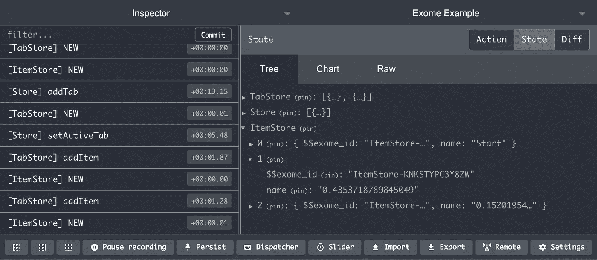
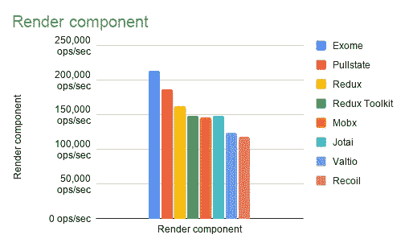
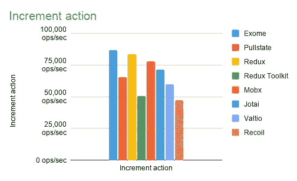
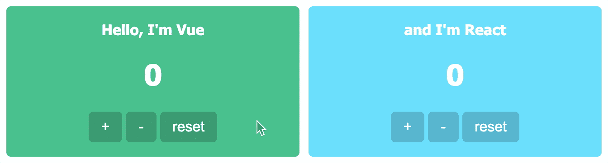

# 宣布新的和简单的状态管理器“Exome”

> 原文：<https://itnext.io/announcing-new-and-simple-state-manager-exome-78b5874325c1?source=collection_archive---------3----------------------->

## TLDR:我创建了名为 [Exome](https://github.com/Marcisbee/exome) 的新州立图书馆(与 React 一起工作，还有一个 Vue 的 PR(对不起，听起来像口袋妖怪))。结束了。

# 介绍

让我先自我介绍一下。从我记事起，我就是一名前端开发人员。甚至在 jQuery 占主导地位之前。所以我见过很多，从简单的 JS 库到非常复杂的 JS 库，再到简单的 JS 库等等。当我一天之内开始学习 Redux、NgRx 和 Vuex 时，这是一座很高的山，一开始总是希望更容易一些。更容易，就像一个简单的对象更容易陈述。

因此，几年前，我就开始尝试各种不同的想法，希望我理想中的国家管理人员看起来和感觉起来如何。我记得在随机的时间有随机的想法，然后把它们写在笔记里。我从来没有用它们做过任何事情，因为它们中没有一个真的感觉足够好。

直到现在，当我开始一个新项目时，使用深度嵌套的树结构是必须的。因为这是 Redux(我可以说是整个 flux 架构)的核心问题之一，所以我使用了 Pmndrs 的库`[valtio](https://github.com/pmndrs/valtio)`。一开始很棒，但后来我开始看到代码中一片混乱，我编造的动作和选择器越来越没有意义。从状态中选择的内容和更新的内容之间的界限变得模糊起来。所以我知道我只有一个选择，最终找出我梦想中的州经理。

# 从创意到图书馆

我为我想要的州经理设定了几个目标:

1.  必须有动作(从某种意义上说，这是修改状态的唯一方法)；
2.  必须与 Redux Devtools 集成，并立即看到深度嵌套的对象，而不是通过点击树来找到确切的一个我正在寻找；
3.  必须通过 TypeScript 键入，我的意思是当处理数据时，必须有一些保护措施，当然还有那可爱的自动完成功能；
4.  必须能够作为一个字符串保存和加载(因为在我的情况下，我需要一种方法来保存文件中的状态和恢复它)；
5.  必须非常简单，这样任何初级开发人员都可以立即获得生产力；
6.  不得成为视图渲染器的瓶颈(必须是高性能的)。

所以这些是我最初的目标，在一个晚上我就想出了`[Exome](https://github.com/Marcisbee/exome)`并开发了一个原型。我非常喜欢它，所以我决定把它开源。它真的达到了我设定的所有目标，甚至更多。唯一的问题是[不支持 IE11](https://caniuse.com/proxy) ，因为它使用代理。但对我来说，这无关紧要。

**更新**:现在[支持 IE11](https://github.com/Marcisbee/exome#ie-support) ！🎉

# 例子

首先，这里有一个基本的计数器示例(单击 number 使其递增)。

就是这样，没有提供者，没有上下文，没有样板文件。Store 只是一个类。属性是状态值，方法是动作。每当调用动作时，状态被更新，并且有线视图组件(通过`useStore`)被呈现。它只更新那些在`useStore`钩子中使用特定 Exome 实例的组件。就这么简单。

Ok 大家可以做一个反例。我的目标中嵌套很深的树的部分呢？啊，好问题。为此，我举了一个简单的路由器例子。

这是一个更复杂的问题。我想在这里演示一下，我们的商店可以有多个选项卡，这些选项卡也可以有多个项目。所以这是一棵嵌套的树。只要通过`useStore`传递子 Exome 实例，子组件就会被连接起来。

## 开发工具

使用 Redux Devtools 检查 Exome 状态也很容易。没有必要深入挖掘状态树来找到你正在寻找的外显子组。但是，如果你想看到整个树，这也是可行的(所有 Exome 的孩子都可以在完整的树视图中查看)。

Redux Devtools 中探索的 Exome 状态

*注意:由于 devtools 有* [*怪异的 bug*](https://github.com/zalmoxisus/redux-devtools-extension/issues/737)*当使用* `*serializedType*` *时，每个 Exome 都会有* `*$$exome_id*` *直到那些 bug 被解决。*

保存和加载状态在 API 文档(【https://github.com/Marcisbee/exome#savestate】T21)中有详细描述。

## 表演

太棒了！并且随着库的成熟会越来越优化。

为了感受这个库的性能，我创建了一个[基准](https://github.com/Marcisbee/exome/tree/main/benchmark#benchmarks)(非常非常原始的基准)。结果相当不错，事实上 Exome 似乎是我测试过的最快的库(至少在我的机器上——Macbook Pro 2020 M1)。结果如下:

渲染组件基准

这是 React 中的一个简单反例，在第一次基准测试中被渲染。在第二秒，一个计数增加，并通过视图更新呈现。

增量行动基准

请注意，这些基准测试并不是要让任何库看起来很糟糕(事实上它们都非常棒)。主要目的是了解 Exome 在性能方面的情况，以及在哪些方面以及如何改进它。我知道这些是非常原始的基准，但我真的不想花很多时间为每个商店创建真实世界的应用程序。也许将来吧。

## 结论

Exome 还有更多我们没有探究的额外好处，但大多数都在 [readme](https://github.com/Marcisbee/exome#readme) 中有解释。

最令人兴奋的是，微 froontends 之间可以共享单个状态。我创建了一个[的小例子](https://codesandbox.io/s/vue-exome-lchcp?file=/src/App.vue)，其中我创建了一个 Exome store 并将其传递给 React 和 Vue。每当状态发生变化，它就会在所有使用 Exome 中间件的框架间同步。它只是工作。

Vue 计数器和 React 计数器共享计数器状态

我真的对未来感到兴奋。现在我要去喂狗和测试这个库。回头见。

 [## Marcisbee/exome

### 用于深度嵌套状态的基于代理的状态管理器😍简单:使用类作为状态🧬嵌套:轻松管理深度…

github.com](https://github.com/Marcisbee/exome)