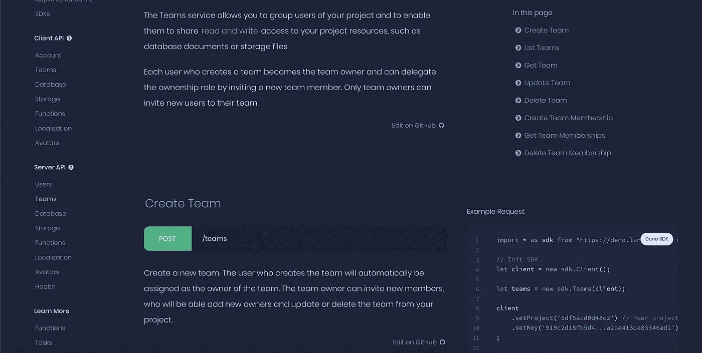

# 宣布 Appwrite Deno SDK 正式发布

> 原文：<https://itnext.io/announcing-the-official-release-of-appwrite-deno-sdk-75bebba03bfe?source=collection_archive---------3----------------------->


我们非常兴奋地宣布 [Appwrite Deno SDK](https://deno.land/x/appwrite) beta 版正式发布。新的 SDK 加入了我们的 Node、PHP、Ruby 和 Pythons 服务器端 SDK，允许您从后端扩展 Appwrite 功能。

# 什么是德诺？

如果你是 Deno 新手，你应该知道 Deno 是一个基于 V8 JavaScript 引擎和 Rust 编程语言的 JavaScript 和 TypeScript 的新运行时。它是由 Ryan Dahl(Node 的最初创建者)创建的，其主要关注点是生产力。与大多数编码语言不同，Deno 在一个可执行文件中明确地扮演了运行时和包管理器的角色。使用 Deno 时，您不必安装软件包或依赖项。您必须在您的脚本中声明它们，Deno 将在您的脚本运行时解析它们。

# 什么是 Appwrite？

Appwrite 是一个 100%开源的“后端即服务”，打包成一组可扩展且易于部署的 Docker 容器。Appwrite 为您提供了一套易于使用的必备 API 和工具，让您可以更快地构建新项目。我们有许多预先构建的安全特性，如文件加密、自动生成的 SSL、速率限制等等。

# 入门指南

新的 Appwrite Deno SDK 是用 Typescript 编写的，允许您从 Deno 后端直接集成 Appwrite 服务和 API。

新 SDK 的入门极其容易；您所需要做的就是从您的代码中导入最新的 SDK 版本，设置您的 Appwrite 凭证，并开始进行 API 调用。下面是一个简单的例子:

```
import * as sdk from "https://deno.land/x/appwrite/mod.ts";

let client = new sdk.Client();
let users = new sdk.Users(client);

client
    .setEndpoint('https://[HOSTNAME_OR_IP]/v1') // Your API Endpoint
    .setProject('5df5acd0d48c2') // Your project ID
    .setKey('919c2d18fb5d4...a2ae413da83346ad2') // Your secret API key
;

let promise = users.create('email@example.com', 'password');

promise.then(function (response) {
    console.log(response);
}, function (error) {
    console.log(error);
});
```

# 文档和示例



Appwrite 官方文档网站

要了解如何使用新的 Deno SDK，可以访问官方的 [Appwrite 文档](https://appwrite.io/docs)。我们还发布了一个新的专门的 [Deno Playground repository](https://github.com/appwrite/playground-for-deno) ，其中包含有用的代码示例，可以帮助您很好地了解如何使用新的 app write SDK。

# 信用

这是感谢 Appwrite 社区成员 [Ali Almoullim](https://github.com/Almoullim) 和 [Punit Diwan](https://github.com/punitdiwan) 帮助构建和测试新的 Deno SDK for Appwrite 的绝佳机会。没有他们的大力支持，这次发布是不可能的。