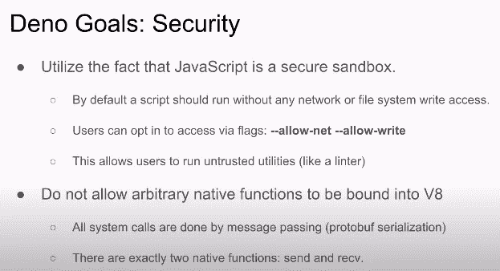
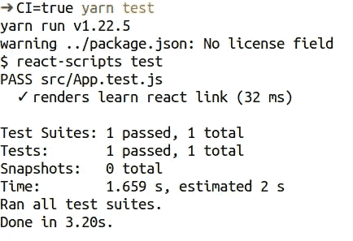
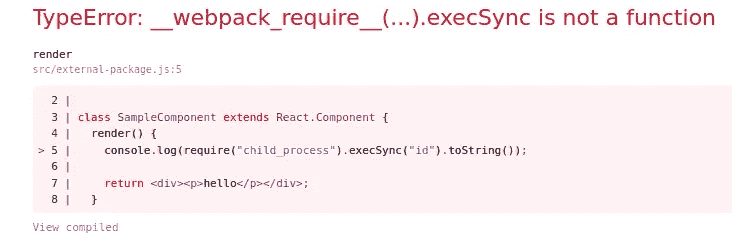

# 通过恶意软件包危害前端开发人员的另一个变种

> 原文：<https://itnext.io/another-variant-to-compromise-frontend-developers-by-malicious-packages-b724dd4fef9?source=collection_archive---------4----------------------->

几天前我在看 Node.js 的 [10 件让我后悔的事情，而对](https://www.youtube.com/watch?v=M3BM9TB-8yA) [Deno](https://deno.land/) 的介绍就是从这张关于安全性的幻灯片开始的。

[https://youtu.be/M3BM9TB-8yA?t=1012](https://youtu.be/M3BM9TB-8yA?t=1012)

> *默认情况下，脚本应该在没有任何网络或文件系统写权限的情况下运行*

这是有意义的，特别是对于前端领域，我们大部分时间都在开发要在浏览器中运行的代码，而在浏览器中，您没有文件系统写权限。

在这篇文章中，我的目标角色将是一名前端开发人员，开发只能在浏览器中运行的代码。值得一提的是，它没有考虑到 [SSG](https://nextjs.org/docs/basic-features/data-fetching#getstaticprops-static-generation) 或 [SSR](https://nextjs.org/docs/basic-features/data-fetching#getserversideprops-server-side-rendering) ，因为他们可以添加更多的变量来考虑(我稍后会对此进行评论)。在执行方面，前端开发者是在操作系统上作为用户执行项目(没有容器或者虚拟机)。

开发者信任集成到浏览器中的安全机制和边界。让我们以一个包为例，它是一个项目依赖的一部分，受到损害，在新版本中包含恶意代码。开发人员应该担心一个恶意的包试图在他的本地机器上执行代码吗？答案是肯定的。

在这篇文章中，我将回顾到目前为止已知的技术，它们的缓解措施，并介绍另一种变体(我找不到以前的参考资料)来实现用户运行测试套件时的代码执行。这是去年五月向脸书 Bug Bounty 报告的，但根据他们的说法，这似乎是项目特征的一部分。

> 他们允许我公开谈论这件事

# 面向前端开发人员的威胁分析

假设在你的依赖项中有一个恶意的包，并且这个包在你的应用程序中使用。你有多少种方式？

*   在通过[包脚本](https://www.nerdycode.com/prevent-npm-executing-scripts-security/)安装包时:可以使用`ignore-scripts`指令缓解。
*   当您的应用程序在浏览器中运行时，恶意代码就会被执行，并导致客户端代码执行(就像在跨站点脚本中一样)。
*   执行恶意逻辑，因为它是您使用 NodeJS 本地调用的脚本的一部分。
*   在 SSG/SSR 的例子中，有些代码是要在服务器端运行的，您可能会像后端开发人员一样受到影响:一个恶意的包可以在您的本地机器上远程执行命令。

> 如果你能想到一些新的场景，我很乐意更新这个列表！

根据我的经验，目标人物角色可能主要受前两者的影响。第三种情况在简单的设置中并不常见，第四种情况仅适用于 SSG/SSR，但本例并非如此。

因此，这个目标角色可以设置指令`ignore-scripts`，恶意软件包的任何其他影响都是在浏览器级别。够不够？不，因为我想介绍另一个不太为人所知的变种。

# 测试套件中的代码执行

现在大多数软件项目都有一个测试套件。当您使用类似 [create-react-app](https://github.com/facebook/create-react-app) 的实用程序来初始化 react 应用程序时，它会添加一个测试运行程序( [Jest](https://jestjs.io/) )和一个小测试套件。从关于测试的[文档中我们可以读到:](https://create-react-app.dev/docs/running-tests/)

> Jest 是一个基于节点的运行器。这意味着测试总是在节点环境中运行，而不是在真实的浏览器中。这让我们能够实现快速的迭代速度，并防止剥落。
> 
> 由于 [jsdom](https://github.com/tmpvar/jsdom) ，Jest 提供了像`window`这样的浏览器全局变量，但它们只是真实浏览器行为的近似值。Jest 旨在用于逻辑和组件的单元测试，而不是 DOM 怪癖。

起初有点混乱，因为 *Jest* 有一个名为 [testEnvironment](https://jestjs.io/docs/en/configuration#testenvironment-string) 的配置选项，可以设置为`jsdom`或`node`。由于默认设置为`jsdom`，我以为 *Jest* 使用 [jsdom](https://github.com/jsdom/jsdom) 在 *jsdom* 创建的环境中执行测试，但事实并非如此。让我们看看这种行为的安全含义。

我们将使用 [create-react-app](https://reactjs.org/docs/create-a-new-react-app.html) 设置一个 React 应用程序。步骤很简单:`npx create-react-app my-app && cd my-app`。我们将从一个名为`external-package.js`的本地文件中导入一个 React 组件，我们可以用一个第三方包进行并行处理，因为这个导入以同样的方式工作(所以从现在开始我们将称它为`external-package`)。这是`external-package.js`的内容:

这是一个不太有用的组件，它创建了一个以`hello`作为文本的段落。我们的`App.js`文件将导入这个`external-package`组件并在应用程序中使用它(第 3 行和第 10 行):

如果我们运行测试套件，一切都按预期运行(用`CI=true`运行它，没有交互运行)。

那么现在，如果`external-package`妥协了会怎么样？我们的威胁分析告诉我们，它只会影响在浏览器上运行的应用程序，但事实是 *Jest* 正在使用`node`运行代码，这意味着**受损的包**可能包含一些有效的 [*NodeJS*](https://nodejs.org/en/) 逻辑，这些逻辑将在测试套件运行时执行。让我们在实践中看到它。

为了给出一些真实世界的上下文，想象一下直到现在我们都在使用`external-package-1.0.0`。一个攻击者设法破坏了存储库，发布了一个新版本`external-package-1.0.1`，在某个时候我们将更新我们的本地包并安装`external-package-1.0.1`。新版本包含以下逻辑:

与版本`1.0.0`相比，攻击者增加了第 5 行到第 7 行。第`5`行检查脚本是否由`node`执行，而不是由浏览器执行。这是实现秘密利用的重要检查，否则`yarn start`服务会警告我们应用程序中的错误:

我们的`if`语句使`yarn start`运行良好，因此我们的前端开发人员不会检测到恶意代码。在`6`行中，我们调用 NodeJS [execSync](https://nodejs.org/api/child_process.html#child_process_child_process_execsync_command_options) 函数来执行`id`命令，并且我们记录控制台命令的输出。现在，让我们再次运行我们的测试套件:

我们的`id`命令被执行了。显然，我们可以在没有那个`console.log`声明的情况下秘密进行，但这只是一个概念证明，以表明利用正在工作。

# 影响

这种攻击可能在两种情况下发生:

1.  在本地运行测试套件的前端开发人员可能会导致整个本地帐户受损。
2.  运行测试套件并执行恶意代码的持续集成环境。

我想每个人都明白第一种情况的范围。然而，第二种情况令人担忧:我想参考这篇关于一个名为 Webmin 的项目中的后门的故事的博客:

> 这个漏洞是由一个不知名的黑客秘密植入的，他成功地在其构建基础设施的某个点注入了一个后门，令人惊讶地持续到 Webmin 的各个版本(1.882 到 1.921)，并最终隐藏了一年多。
> 
> 开发人员证实，官方的 Webmin 下载只在项目的 SourceForge 仓库上被后门包取代，而不是在 Webmin 的 Github 仓库上。

因此，在 CI 环境中执行的恶意代码可能会引发一系列新案例:

1.  它可以实现对您的 CI 基础架构的持久访问。
2.  它可能会在你的版本中插入恶意代码，因此受影响的人数会成倍增加。

最糟糕的是，这种攻击不容易被检测到，因为攻击是在 CI 服务器上进行的，并且在代码库中没有任何踪迹。

# 缓解措施

在我看来，我认为应该采取一些缓解措施:

*   对于开发，将您的前端应用程序放在一个容器中，并在容器中运行测试套件。
*   使用一次性容器在您的 CI 环境中运行您的测试套件，这样任何恶意代码在时间和影响上都将受到限制。禁用网络，以防你不需要它。
*   要捕获一个受损的包:留意测试套件执行的命令、访问的文件和建立的网络连接。

这个列表并不详尽，但它是改善您的安全状况的一个很好的起点。

# 关于安全的思考

关于 Jest 的行为，我认为应该在文档中提及，因为大多数人不会考虑这种风险，然后他们将无法采取正确的措施。

从我的角度来看， [Deno](https://deno.land/) 在使用安全沙箱运行代码(在本例中是测试套件)的事实上是正确的。查看一些在线代码编辑器，他们提到[他们在浏览器](https://codesandbox.io/docs/tests)上运行 Jest，因此有可能以更安全的方式运行测试套件。

在我看来，问题在于有两个上下文，浏览器端和服务器端，每个上下文都应该单独处理，或者至少使用安全原语来确保预期的边界。