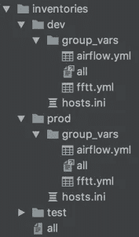

# Ansible 和 Jenkins —自动化您的脚本

> 原文：<https://itnext.io/ansible-and-jenkins-automate-your-scritps-8dff99ef653?source=collection_archive---------1----------------------->


我想在这篇文章中揭示的主题似乎是显而易见的，但我很惊讶有多少公司没有遵循这一最佳实践。

因为不耐烦:

*   将你做过不止一次的每一个动作自动化。
*   不要使用 Jenkins 静态 groovy 库。
*   使用 Jenkins + Ansible + Python 实现自动化。

## 问题是

任何开发人员在工作中总会面临这样的情况:某个动作需要重复。有时这些行动很紧急，需要很快完成。例如，您的生产停止，您需要在数据库上重建索引，或者在仪表板上重新填充图像，或者在您的分布式后端重新选举新的领导者。

记住这三条黄金法则是有好处的，它们能让你的生活更轻松:

*   如果你重复一个动作超过两次，它应该是自动的。
*   如果有几个步骤要完成，它们应该放在一个脚本中。
*   当在运行这些操作之前有一些复杂的设置时，一切都应该记录下来。

遵循这些规则会减少你通常花在救火上的时间。从商业前景来看，在这种自动化上花费时间似乎是不必要的，但在现实生活中，您可以腾出时间来开发新功能，并减少修复问题所需的时间。

另一个问题是总线因素。当您手动操作时，总会有人知道关键和独特的信息。如果这个人(去世)离开你的公司，你将无法快速解决问题，因为知识将会丢失。带有动作的文档脚本是你的朋友。

## 自定义脚本

在某种程度上，所有的开发人员都会遵循上面提到的规则。他们开始通过创建脚本来自动化他们的操作。这很好，但这里隐藏着危险——这样的脚本通常用不同的编程语言编写，并存储在许多存储库中。

维持这样一个动物园是很难的。有时甚至很难找到解决特定问题的脚本。也许有些脚本甚至会重新实现几次。做好准备。

另一个问题是环境。这样的脚本对其创建者的环境是友好的。现在假设你发现了一个旧的脚本，它是用你系统中没有安装的语言编写的。您应该如何快速运行它并解决问题？

## 詹金斯共享图书馆

这里的一个解决方案是让詹金斯解决你的问题。您有带脚本的 groovy 共享库，它可以修复您需要的问题。还有詹金斯·乔布斯，每一个都是你需要解决的问题。一个存储库中的所有内容。

方法是好的，但不是实现。

开发这样的脚本真的很难。我在这方面遇到了很多问题，因为无法保证你在本地测试过的代码能在 Jenkins 上运行。主要原因在于不同的 Groovy 版本。

## Python 脚本

要解决版本问题，可以使用 Python+[Conda](https://conda.io)/[venv](https://docs.python.org/3/library/venv.html)。Python 本身非常适合编写脚本，并且非常普及。与 Groovy 相比，你的团队中更有可能有人了解 Python。

在 Conda 的帮助下，你可以在任何地方使用相同的 Python 版本。

我也强烈推荐 Python 的 [docopt](http://docopt.org/) 。你还记得自动化的第三条规则吗？当你的文档和代码放在一起时会更好，因为这降低了维护的难度。

脚本中的注释并不总是能够向您解释为什么以及如何运行该脚本，以及参数值是什么。docopt 将为您处理参数和缺省值，并在提供的每个错误参数上打印帮助消息，或者只是根据需要打印。

```
#!/usr/bin/env python 
""" 
Very important script. It should be run when our prod freezes for some seconds. It will get all missed transactions, ask for confirmation and process results. Usage: 
    transaction.py --issuer=<i> --bank=<b> [--slack=<s>] 
    transaction.py -h | --help 
Options: 
-h --help     show this help message and exit 
--issuer=<i>  Which issuer to use for transaction confirmation.[default: primary] 
--bank=<b>    Which bank's backend to use. --slack=<s> slack callback to notify 
"""
```

## Ansible + Python

经过前一阶段，你有自我记录的独立于版本的脚本。一个开发者的梦想。有哪些可以改进的地方？

首先，它们仍然与 python 的依赖性有点耦合。如果你打算将这些 python 脚本作为公司的标准，你必须强迫每个人安装 conda，以便能够运行这些脚本。

第二，您仍然需要一个中央存储空间来存储这些脚本。真理的唯一来源，在那里可以找到任何问题的理想解决方案。

为了解决这两个问题，你需要使用 [Ansible](https://www.ansible.com/) 并为它的脚本建立一个单一的存储库(在大公司，你应该更喜欢每个部门的存储库)。

每一个可以用脚本解决的问题都变成了角色。每个角色都有自己的自述文件，其中描述了问题和解决方案。Root 的自述文件指向每个角色的自述文件，并附有它所解决的一个问题的小注释。

```
## Problem 
Sometimes we have a pikes of a high load. During this load our slaves can loose master and some transactions won't be processed. 
## Solution 
Such missed transactions are saved by slaves in a special queue. This role gets these transactions, asks bank's confirmation for each and processes the results. 
## Run 
ansible-playbook resolve_transactions.yaml -i inventory/prod/hosts.ini -extra-vars "-i='primary' -b='my_bank'"
```

它不会取代 Python 脚本，因为普通的 ansible 脚本更难调试和开发。取而代之的是，所有 python 脚本都进入角色内部的文件或模板中，并作为该剧的一部分被调用。

最小的场景通常包含 conda 创建和 deps 安装，以及运行脚本本身(为简单起见，该角色假设 conda 已安装)。

```
--- 
- block: 
    - name: "Copy requirements.txt" 
      copy: 
        src: "requirements.txt" 
        dest: "/tmp/{{ role_name }}/" 
    - name: "Copy python executable" 
      template: 
        src: "transaction.py.j2" 
        dest: "/tmp/{{ role_name }}/transaction.py" 
    - name: "Create Conda Env for {{ python_version }}" 
      shell: "conda create -p /tmp/{{ role_name }}/{{ conda_env }} --copy -y python={{ python_version }}" 
    - name: "Run my script" 
      shell: "source activate /tmp/{{ role_name }}/{{ conda_env }} && {{ item }}" 
      with_items: 
        - pip install -r /tmp/{{ role_name }}/requirements.txt 
        - "python /tmp/{{ role_name }}/transaction.py --issuer={{ issuer }} --bank={{ bank }} --slack={{ slack }}" 
      args: 
        executable: /bin/bash 
  always: 
     - name: "Clean up" 
       file: 
         state: absent 
         path: "/tmp/{{ role_name }}/"
```

在这里，您可以从可变系统中获益:

每个环境都存储组变量和全局变量，它们是所有变量的符号链接。



每个角色也可以有自己特定的`default`变量，这些变量被脚本的 ansible 输入覆盖。

现在，您可以将一线支持转移到另一个部门，只需将他们指向一个包含完整文档和脚本的存储库。他们只需要知道如何运行 ansible。

## Jenkins + Ansible + Python

一线支持的问题是，他们通常比一般的开发人员更便宜，资格更差。他们也可能运行 Windows，不知道 Ansible 是什么。对他们来说，理想的解决方案是提供一个带有类似“如果你怀疑这个问题—按下那个按钮”的规则的文档。你可以在詹金斯的帮助下完成。首先确保你已经安装了一个可翻译的[插件](https://wiki.jenkins.io/display/JENKINS/Ansible+Plugin)。

第二步—为 ssh 的使用创建凭证。

第三，为您希望为其创建按钮的每个角色编写一个管道。您可以将它放在 Readme 前面的角色根目录中，并使存储库根目录的 Jenkins 管道扫描角色/中的所有管道，并在必要时创建子 Jenkins 管道。

典型的管道会有输入参数:

```
parameters { 
    choice(choices: ['dev','prod', 'stage'], description: 'On which Environment should I run this script?', name: 'environment') 
}
```

第一步应该是用 ansible 克隆您的 repo:

```
stage(Clone Git repository') {
  steps {
    git branch: 'master', 
    credentialsId: <some-uuid>', 
    url: "${env.PROJECT_REPO}" 
  } 
}
```

称之为“可行剧本”:

```
stage('Run ansible script') {
  steps { 
    script { 
       if (params.environment == 'prod') {
         env.INVENTORY = "inventories/prod/hosts.ini" 
         env.ISSUER = "primary" 
       } else if(params.environment == 'dev') {
         env.INVENTORY = "inventories/dev/hosts.ini"
         env.ISSUER = "secondary" 
       } else if(params.environment == 'stage') {
         env.INVENTORY = "inventories/stage/hosts.ini" 
         env.ISSUER = "secondary" 
       } else { 
         throw new Exception("Unknown environment: ${params.environment}") 
       }
    } 
    ansiblePlaybook( 
            playbook: "${env.PLAYBOOK_ROOT}/deploy_service.yaml", 
            inventory: "${env.PLAYBOOK_ROOT}/${env.INVENTORY}",   
            credentialsId: '<your-credentials-id>', 
            extras: '-e "i=' + "${ env.ISSUER }" + ' b='my_bank"+ '" -v') 
  }
}
```

创建 Jenkins 职务后，您只需将它们链接到每个角色的自述文件，以及任何相关项目的自述文件。

## 总结

*   自动化脚本允许您更快地修复问题，但它们也需要一些努力来使它们易于使用和独立于平台。
*   自我记录的脚本允许您减少新员工的总线因素和入职时间。
*   带有标准化工具的集中存储库允许您在将来将责任快速移交给另一个团队。
*   Ansible + Jenkins 允许您在 Jenkins 停机时，通过按下一个 Jenkins 按钮(即使您正在度假，并且只带着手机)或运行 Ansible 脚本来解决问题。
*   Jenkins Buttons 允许您降低资格要求和一线支持的价格。

祝救火愉快！🙂