# 裸机和 Akri 上的 Anthos 从云中管理边缘 Kubernetes 集群上的叶设备

> 原文：<https://itnext.io/anthos-on-bare-metal-and-akri-managing-leaf-devices-on-edge-kubernetes-clusters-from-cloud-222ff17dd7b8?source=collection_archive---------0----------------------->

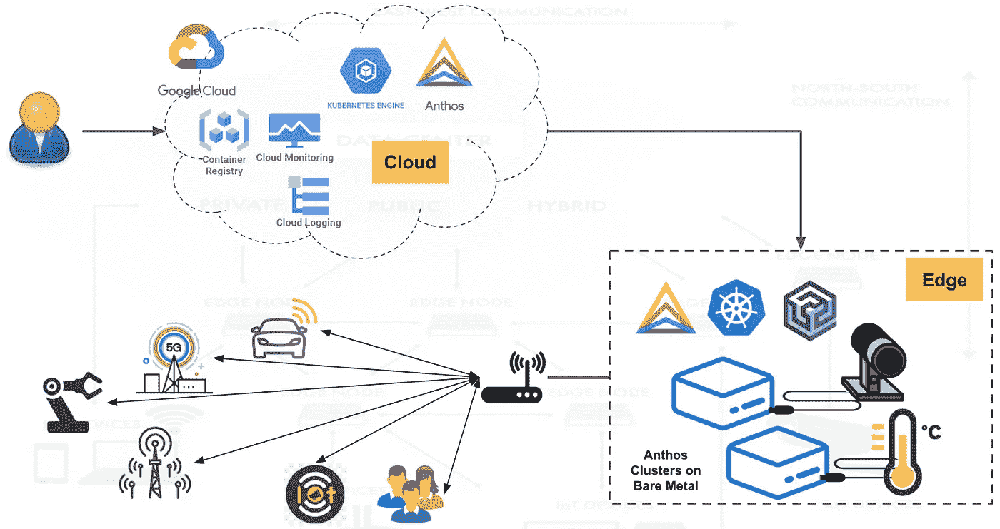

Anthos 集群在裸机上，Akri 作为 Kubernetes 的资源接口用于 Edge

目前构成物联网(IoT)的数百万个设备不是驻留在云中，而是驻留在现场:从零售店到工厂车间。这些设备中有许多是微型边缘设备，如照相机(IP 照相机、USB 照相机等。)、传感器(设备上的智能热传感器等。).对于开发人员来说，编写定制的解决方案来检测和使用每个设备以及核心开发运维/部署团队来管理应用程序和托管这些位于远边缘站点(靠近最终用户)的应用程序的集群变得越来越困难和不切实际。

然而，这些设备中的大多数都太小了，不能自己运行 Kubernetes。Kubernetes 工作负载如何利用它们，以及如何从云中管理私有集群？

[VMware 上的 Anthos 集群](https://cloud.google.com/anthos/clusters/docs/on-prem/1.6/overview)也称为 GKE 本地，是一种支持用户在客户数据中心运行 GKE 的产品，但这种模式需要 vCenter Server 和 VSphere，但[裸机上的 Anthos](https://cloud.google.com/anthos/clusters/docs/bare-metal/1.6/concepts/about-bare-metal)使用“自带操作系统”模式。它运行在物理或虚拟实例之上，支持 Red Hat Enterprise Linux 8.1/8.2、CentOS 8.1/8.2 或 Ubuntu 18.04/20.04 LTS。

[来自 Deislabs(微软)的 Akri](https://github.com/deislabs/akri) ，这是一个开源项目，它定义了一种基于 Kubernetes 的方法，将边缘上的叶设备表示为本地 Kubernetes 资源。它提供了一个类似容器网络接口的抽象层，但是它没有抽象底层网络细节，而是删除了查找、利用和监控叶设备可用性的工作。

# 示例用例场景

一家全国性零售店需要实施基于摄像头的应用程序(一般商店监控、情感分析、性别分析、面具检测、自助结账等)。)并支持商店经理和本地业务开发团队等用户在本地访问应用，支持核心团队通过公共云平台从总部操作和管理应用。在这种情况下，商店可以被视为边缘站点。

在这种情况下，可行的选择是使用小尺寸设备，如英特尔 NUC 公司或任何其他具有足够容量来运行 Kubernetes 的单板机，并使用与其连接的 USB 摄像头。

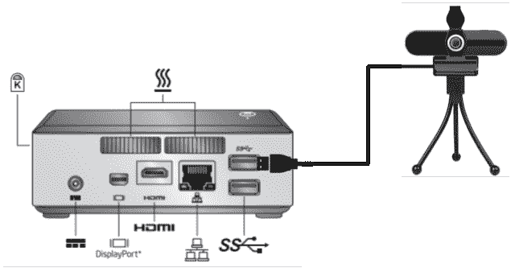

连接到 NUC 的 USB 摄像头

Anthos clusters on Bare Metal 在这里部署了 Kubernetes，并将 edge 站点中的私有裸机集群连接到 Google Cloud。在上面的使用案例示例中，总部可以使用 Anthos 裸机或使用某种自动化(systemd、rc.local 等)对 NUC 进行映像和预部署/配置。)来引导集群。启动后，群集将使用预配置的 SA 密钥自动注册到 GCP 上的用户项目，然后总部团队可以接管在边缘站点上部署、管理和更新应用程序。在这种情况下，本地团队不需要技术能力，他们可以直接使用终端应用程序。

在本文中， [Anthos 配置管理](https://cloud.google.com/anthos/config-management)用于从 GCP 的 Anthos 门户将 Akri 组件部署到远程/私有集群。部署完成后，本地用户可以使用本地 LB IP 访问摄像机的镜头。

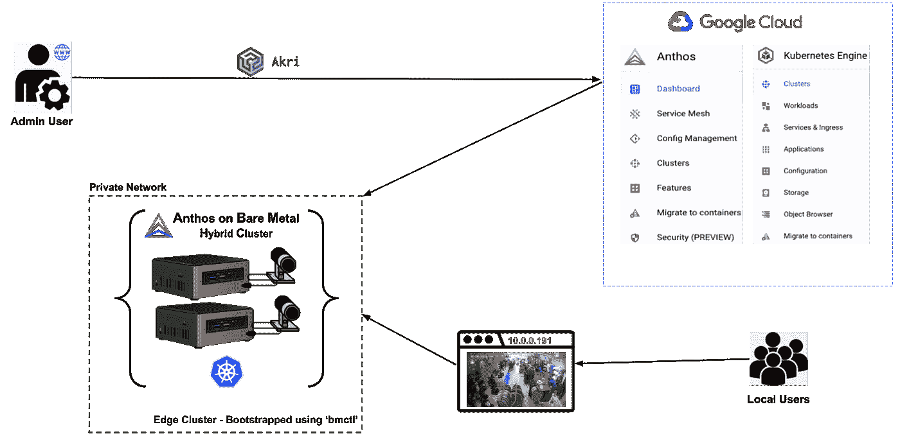

使用 Anthos 将 Akri 部署到远程集群

这只是一个示例场景，用于访问裸机上的 Anthos 集群的功能和用法，以及管理 edge 上的 Kubernetes 和 Leaf 设备的 Akri。

# 裸金属上的 Anthos 簇

[裸机上的 Anthos](https://cloud.google.com/anthos/clusters/docs/bare-metal/1.6)是在物理服务器上运行 Anthos 的部署选项，部署在用户提供的操作系统上，没有虚拟机管理程序层。裸机上的 Anthos 具有内置网络、生命周期管理、诊断、健康检查、日志记录和监控功能。用户可以使用受支持的 CentOS、Red Hat Enterprise Linux (RHEL)和 Ubuntu，所有这些都经过 Google 验证，可用于集群部署。

借助裸机上的 Anthos，用户可以利用现有投资，使用公司的标准硬件和操作系统映像，这些映像会根据 Anthos 基础架构要求自动检查和验证。裸机上的 Anthos 遵循与所有[托管的 Anthos 集群](https://cloud.google.com/anthos/docs/setup/overview#requirements)相同的计费模式，基于 Anthos 集群 vCPUs 的数量，按小时收费。

用户可以使用以下部署模式之一在裸机上部署 Anthos:

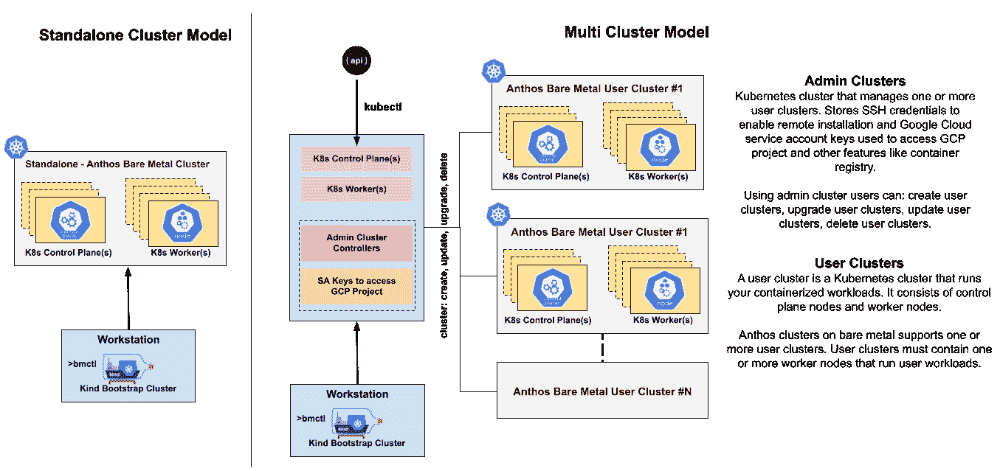

裸机上的 Anthos 集群—部署模型

独立模式允许用户独立管理每个集群。当在边缘位置运行时，或者如果用户希望他们的集群彼此独立管理时，这是一个很好的选择。一种多集群模型，允许用户从一个名为管理集群的集中式集群中管理集群(用户集群)。适合从一个集中位置管理多个集群。

为了满足不同的需求，裸机上的 Anthos 集群支持以下部署模型(所有三个模型都包括如上所述的管理集群和用户集群结构)。

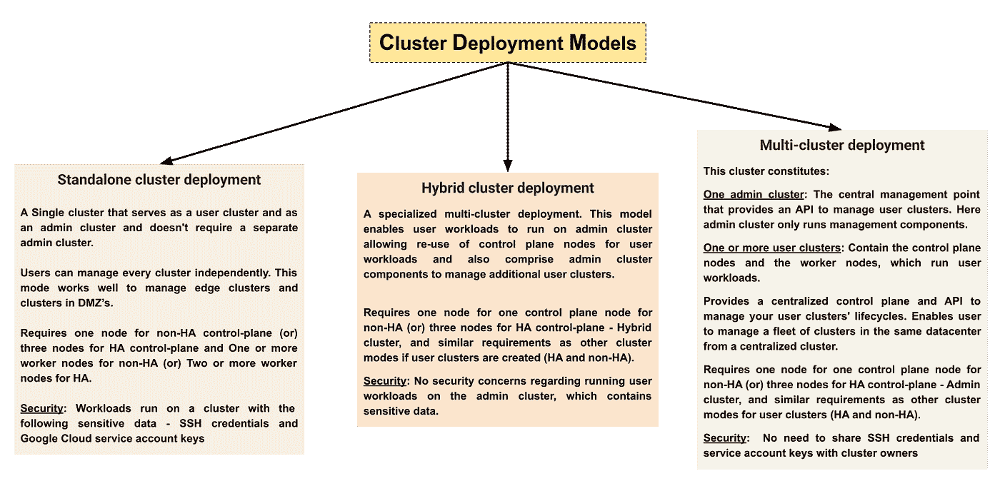

裸机上的 Anthos 集群—部署模型

帖子中的拓扑结构包括三个英特尔 NUC、两个 16 GB RAM、4 个 vCPU 和 250 GB SSD，用作主节点和节点(Anthos 提供了具体的硬件要求)。这里的部署模型是混合的，其中群集是一个管理群集，也允许运行用户工作负载，如果需要，该群集可以作为管理群集重复使用，以创建用户群集。第三个 NUC (2 个 vCPU，8GB RAM)用作执行所有必需部署操作的工作站，它托管临时类型(Docker 中的 Kubernetes)引导集群。

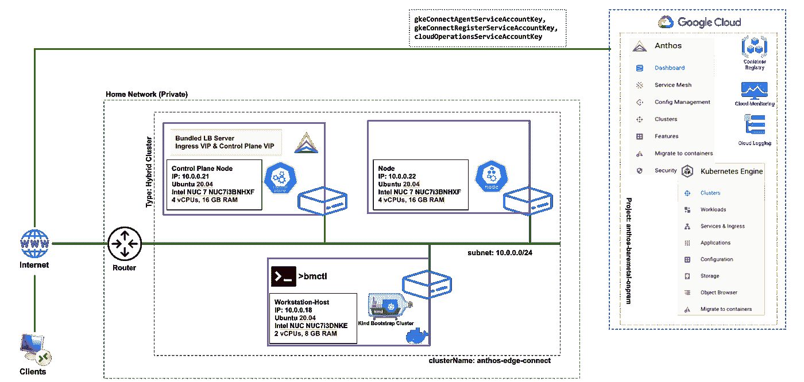

裸机上的 Anthos 集群—测试集群拓扑

集群中的所有机器都连接到一个家庭网络(专用),该家庭网络具有到互联网的出站连接。所有 NUC 从本地网络获取 ip(节点 ip 和主节点 IP)。裸机上的 Anthos 集群使用在 L2 模式下运行的 [MetalLB](https://metallb.universe.tf/) 来实现数据平面负载平衡。用户可以在专用网络上划出一块连续的 IP 地址，分配给“负载平衡器”类型的 K8s 服务。用户可以在上面的块中选择一个“开始”IP 地址分配给 IngressVIP 和另一个不在 controlPlaneVIP 范围内的 IP。

裸机上的 Anthos 集群部署 L4 负载平衡器，这些负载平衡器运行在专用的工作节点池或与控制平面相同的节点上。上述拓扑以“捆绑”模式部署 LB，在集群创建期间，负载平衡器将安装在负载平衡器节点上。

Anthos 提供现成的覆盖网络和 L4/L7 负载平衡。客户还可以集成自己的负载平衡器，如 F5 和 Citrix。对于存储，用户可以使用 [CSI 与现有基础设施的集成](https://kubernetes-csi.github.io/docs/drivers.html)来部署持久工作负载。

# 使用 bmctl 引导集群

在裸机上安装 Anthos 集群的命令是 [bmctl](https://cloud.google.com/anthos/clusters/docs/bare-metal/1.6/installing/creating-clusters/create-clusters-overview) ，该实用程序使用户能够以最小的努力创建一个集群。

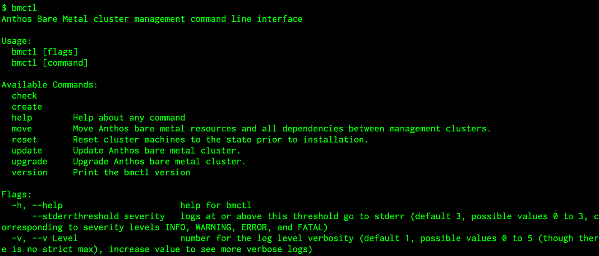

裸机上的 Anthos 集群— bmctl 实用程序

*bmctl* 实用程序从[配置文件](https://cloud.google.com/anthos/clusters/docs/bare-metal/1.6/quickstart#edit-config)中读取所有配置，可以使用‘bmctl create config’创建模板。用户可以通过'*—enable-API—create-service-accounts*'来自动启用 Google Cloud 中项目认证自动需要的服务账户和 API。这个配置文件包括密钥路径和 ssh_keys，用于输入部署组件的主节点和节点。配置文件包括节点池、地址池和与存储相关的配置。

在安装过程中，Anthos on Bare Metal 创建一个临时引导集群(KIND，一个 Kubernetes 集群，其中部署了所需的组件来创建第一个管理员/用户集群)，在上述场景中，集群部署在工作站主机上。成功安装后，将删除引导群集，给用户留下一个管理群集和一个用户群集。一般来说，您应该没有理由与该集群进行交互，如果需要的话，可以不删除该集群(*—clean up-external-cluster = false*)。

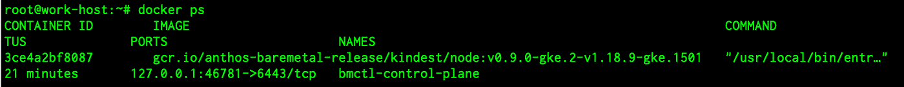

KIND 引导集群

集群创建遵循 cluster-api 模式，该模式使用定制的 GKE 裸机提供程序，在工作站上运行的引导类集群使用生成的 CRD 来引导混合集群(或任何其他部署模型)。CRD 也是在管理集群上创建的，这样用户就可以创建用户集群。

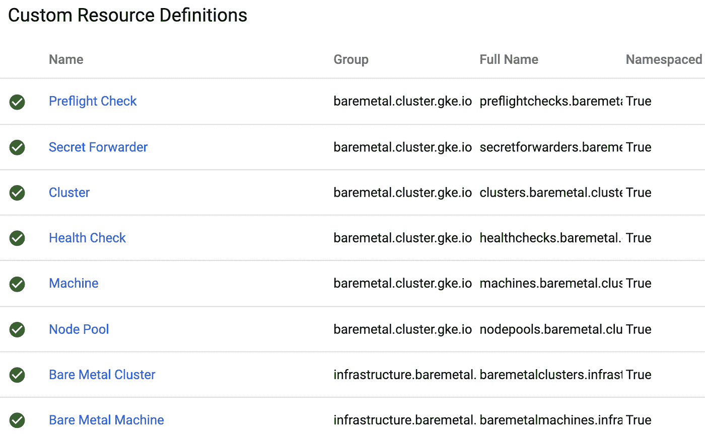

裸机上的 Anthos 集群—用于集群创建的定制 CRD

集群部署步骤:

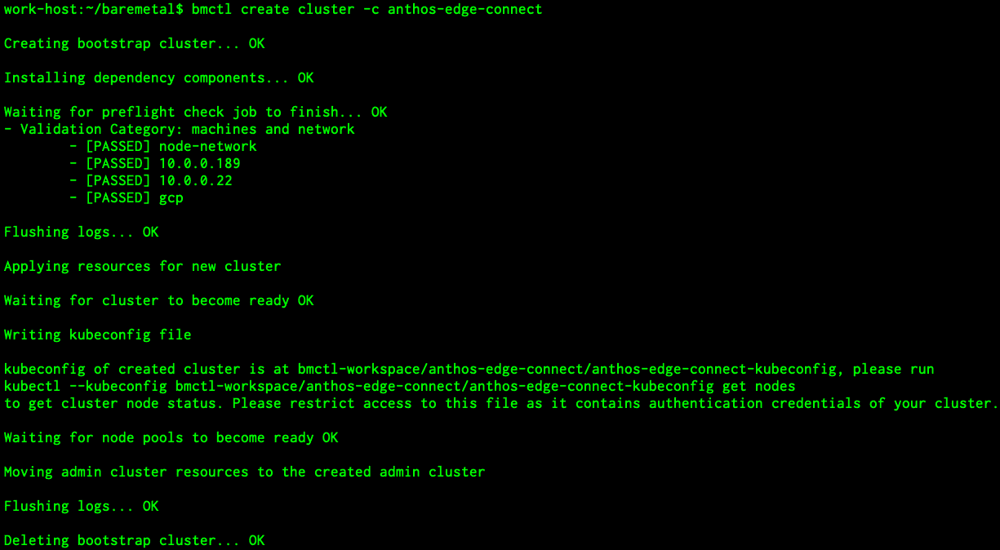

裸机上的 Anthos 集群—集群部署阶段

访问主集群所需的所有配置文件以及飞行前检查、集群创建日志和 kubeconfig 都在工作站的特定目录中创建。

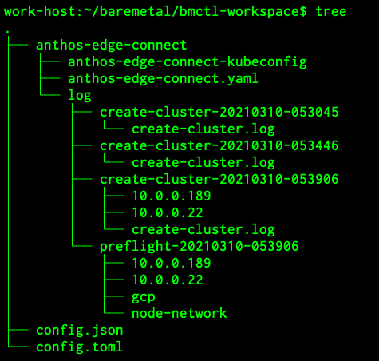

裸机上的 Anthos 集群—集群部署

一旦群集准备就绪，引导群集将被删除，用户可以开始使用创建的混合群集，用户可以根据需要使用混合群集来创建多个用户群集。如果部署模型是独立的，那么创建一个用户集群时不需要任何机器(管理集群)来创建多个用户集群。

裸机上的 Anthos 集群—集群部署

由于上面的集群是使用混合模式部署的，因此该集群由管理集群机器组成。

集群 API 组件:

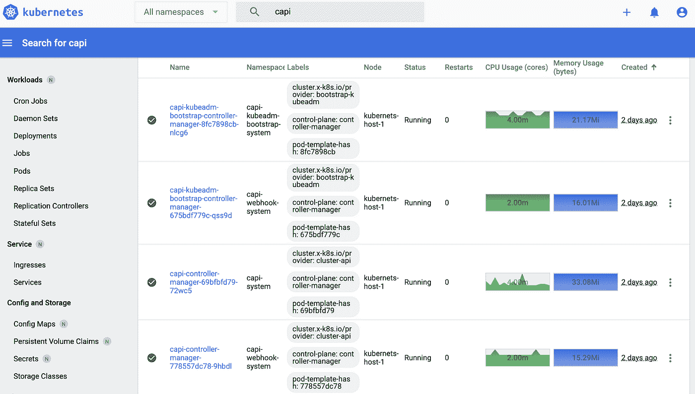

管理集群-CAPI 组件

CRD 裸机集群:

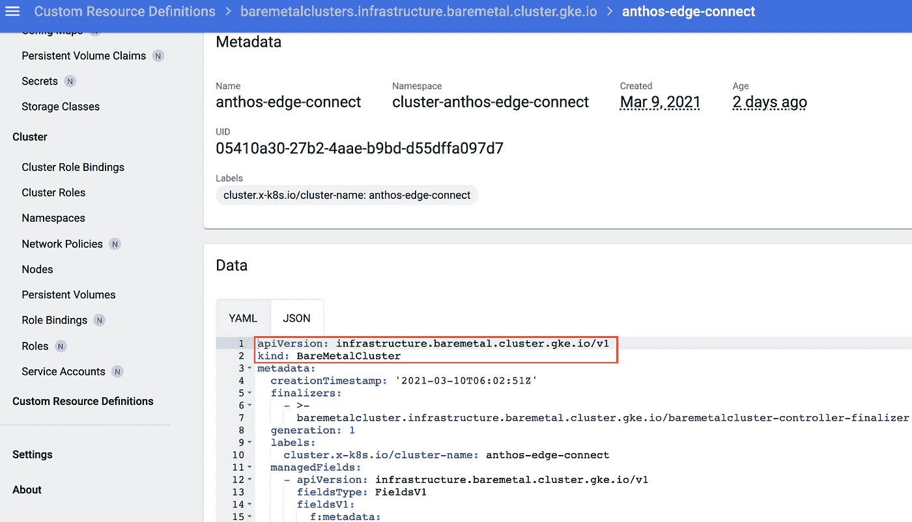

管理集群—裸机集群 CRD

BareMetalMachine CRD(由于这是一个混合群集，NUC 作为对象添加):

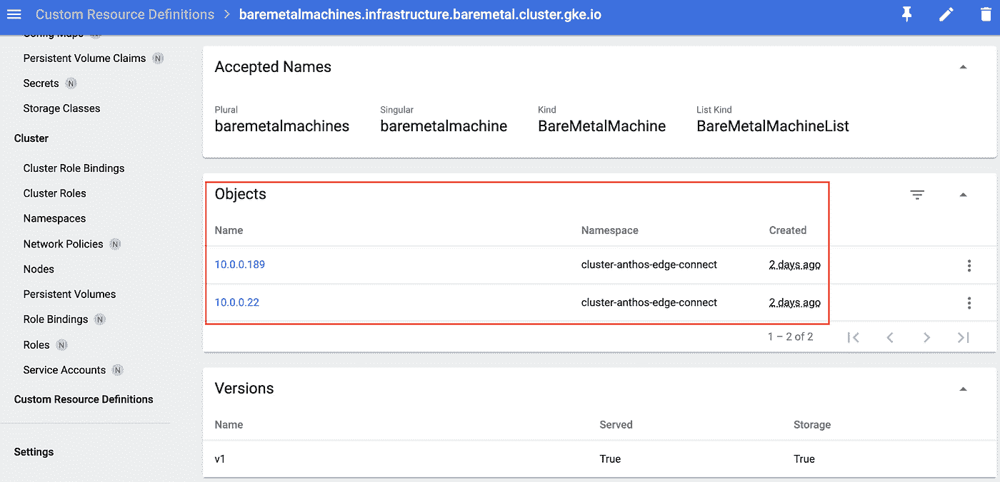

管理集群—裸机集群 CRD

# 将裸机上的 Anthos 集群连接到 Google Cloud

裸机上的 Anthos 集群将集群连接到谷歌云。这种连接允许用户通过使用 [Connect](https://cloud.google.com/anthos/multicluster-management/connect/overview) 从云控制台管理和观察孤立的集群。作为集群部署的一部分，在集群中部署连接代理，并且' *bmctl* '实用程序自动创建建立连接所需的服务帐户(如果需要更多控制，用户可以手动创建连接代理、连接注册和日志记录监控服务帐户)，并将集群注册到谷歌云 GKE 中心。

Connect 是 Anthos 的一项功能，并不局限于 Anthos bare metal，它允许用户将任何 Kubernetes 集群连接到 Google Cloud，而不管它部署在哪里。这使得能够访问集群和工作负载管理功能，包括统一的用户界面[云控制台](https://cloud.google.com/cloud-console)，以便与集群进行交互。Connect 允许 Anthos 配置管理安装或更新 Connect in-cluster 代理并观察同步状态。Connect 还允许计量代理观察已连接集群中的 vCPUs 数量。

这对于从中央位置(HQ/区域 IT 运营中心等)管理隔离网络空间中远端站点上的应用程序的拓扑来说至关重要。)

连接代理可以配置为遍历 NAT、出口代理和防火墙，以在隔离裸机集群的 Kubernetes API 服务器和 Google Cloud 项目之间建立长期的加密连接。

裸机集群上部署的连接代理:

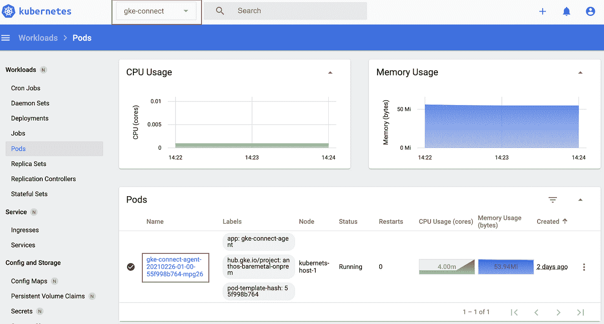

裸机上 Anthos 集群上的 GKE 连接代理

anthos-creds 名称空间包含连接 GCP 服务所需的机密。

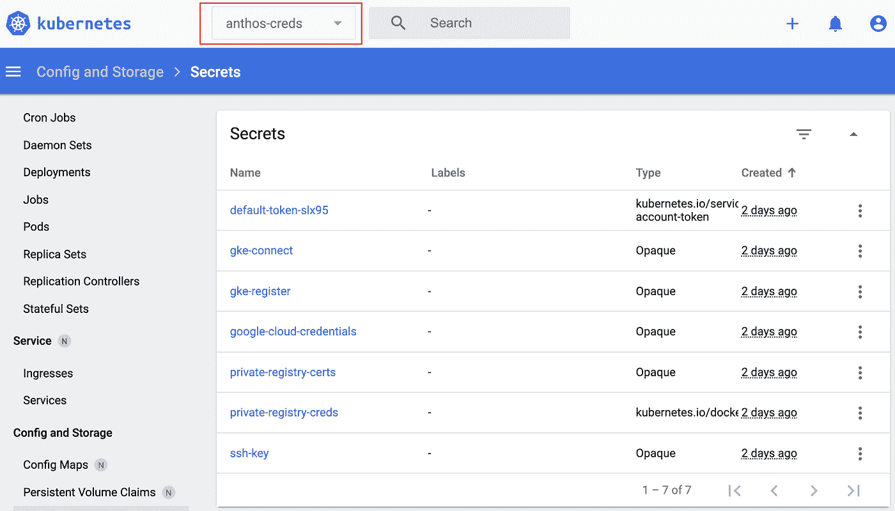

GCP 服务连接的秘密

Anthos 门户显示已注册的集群(登录前)，在用户登录之前，右侧面板上的集群信息不会显示:

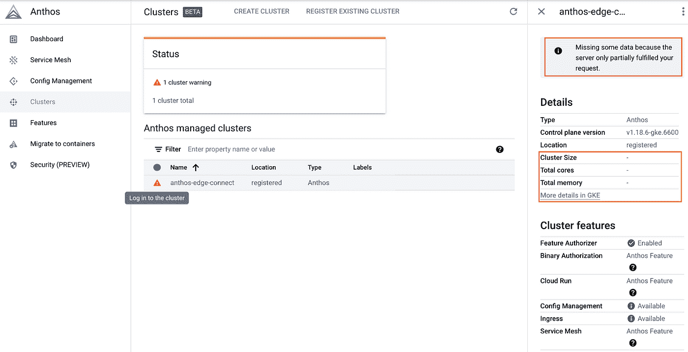

显示注册集群的 Anthos 门户

Kubernetes 引擎门户显示已注册的集群(登录前) :

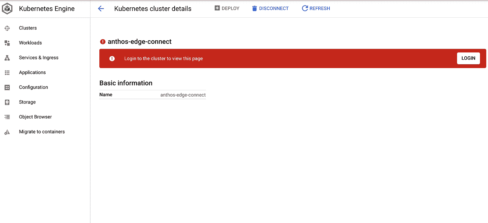

显示注册集群的 Kubernetes 引擎

用户可以使用谷歌云控制台登录注册的集群。这可以通过三种方式实现:使用基本身份验证或不记名令牌，或者使用 OIDC 提供商。在下面的场景中，创建了一个与集群管理角色关联的管理用户，令牌用于登录(用户可以根据所需的操作级别创建一个集群只读角色)。

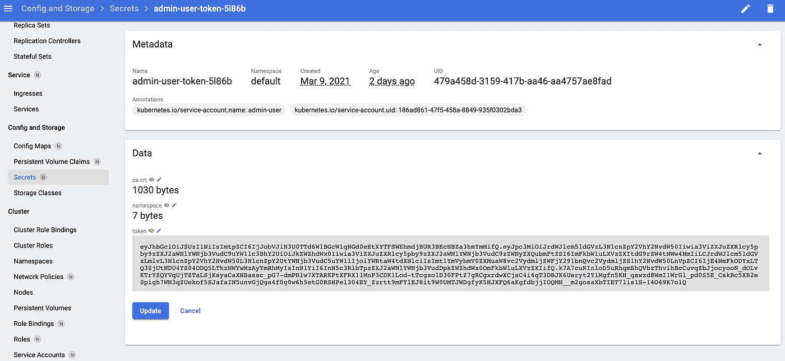

使用服务帐户登录到已注册的集群

使用令牌登录到集群:

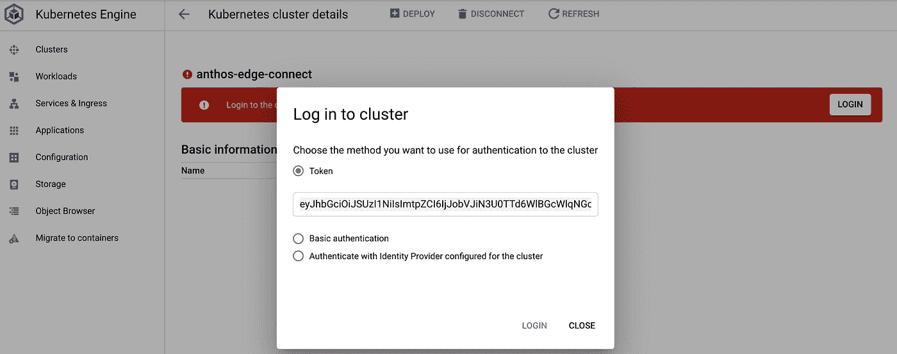

使用服务帐户令牌登录到已注册的群集

如下所示，登录成功后，将启用所有管理选项，并显示集群信息。该信息还显示了 GKE 中心成员 ID，用户可以使用'*g cloud container Hub Membership list*'列出所有连接的集群。

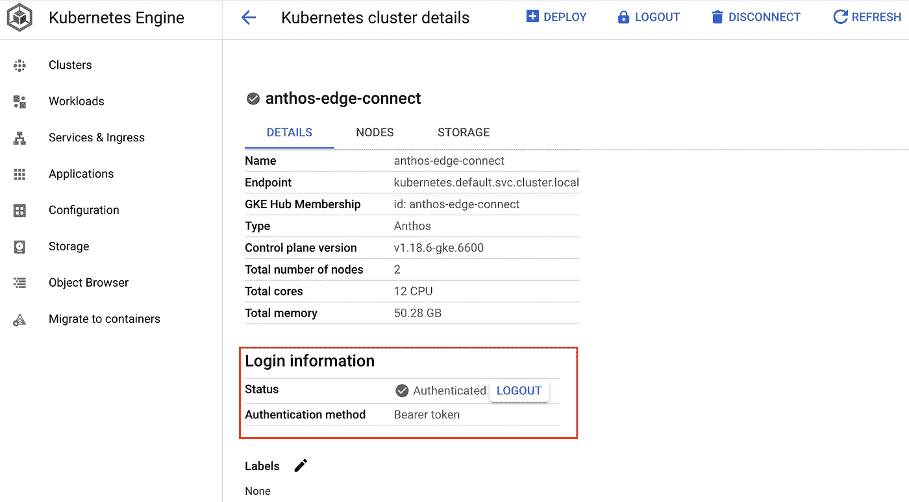

显示注册集群的 Kubernetes 引擎

显示集群信息和集群功能列表的 Anthos 门户:

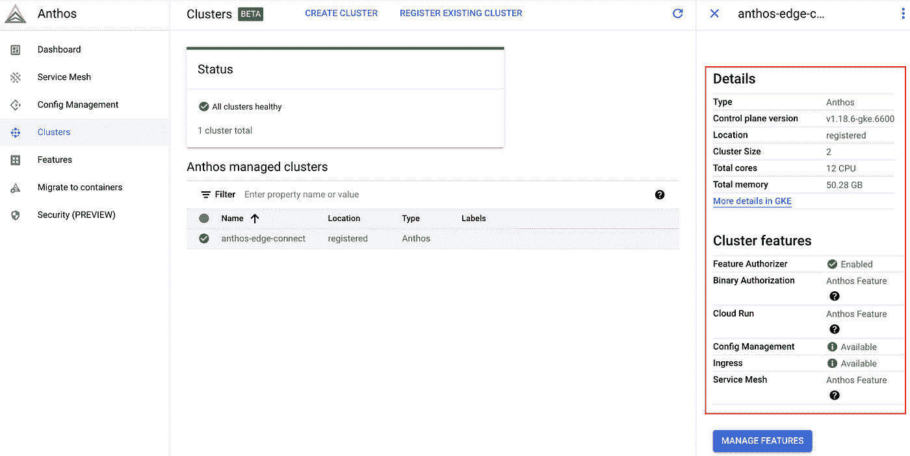

显示注册集群的 Anthos 门户

# 在裸机上管理 Anthos 集群上的工作负载

一旦连接代理连接到集群，用户就可以使用 Kubernetes 引擎门户作为仪表板来访问所有 Kubernetes 组件，并管理裸机集群上的私有 Anthos 上的工作负载，就像在 GKE 上一样。

Anthos dashboard 使用户能够部署与 Anthos 相关的组件(特性),如 ACM、服务网格等。(提供了功能和说明的目录)功能有限，仅用于验证集群的连接性和高级详细信息，如集群大小和门户中的节点。Kubernetes 引擎门户是主要的集群管理实体，使用户能够操作 Kubernetes 的核心功能，如创建、编辑、更新和删除对象，访问配置对象(机密/配置映射)，从市场部署应用程序，浏览对象以及管理/列出 PV/PVC 等存储元素。

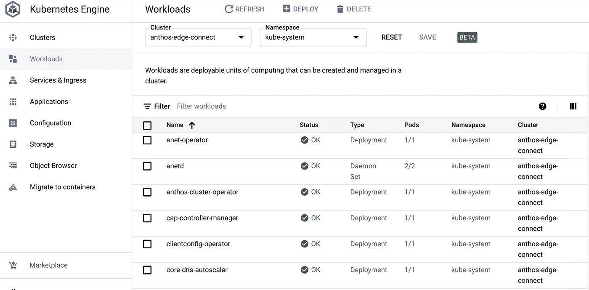

工作负载— Kubernetes 引擎

用户可以编辑任何 Kubernetes 对象，这同样会反映在裸机集群上。

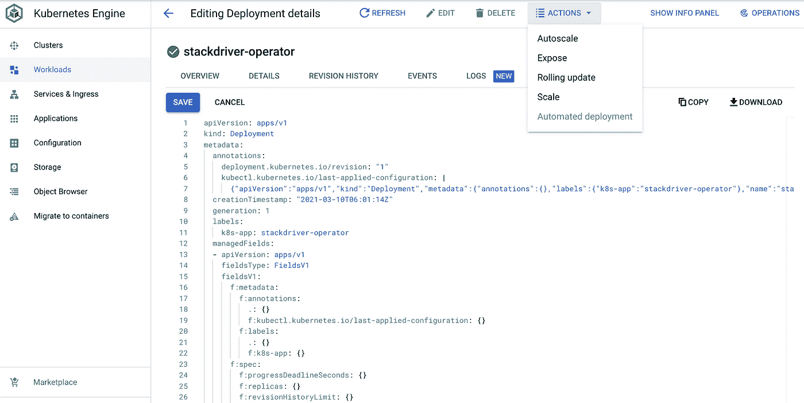

编辑/更新工作负载— Kubernetes 引擎

访问集群服务和入口:

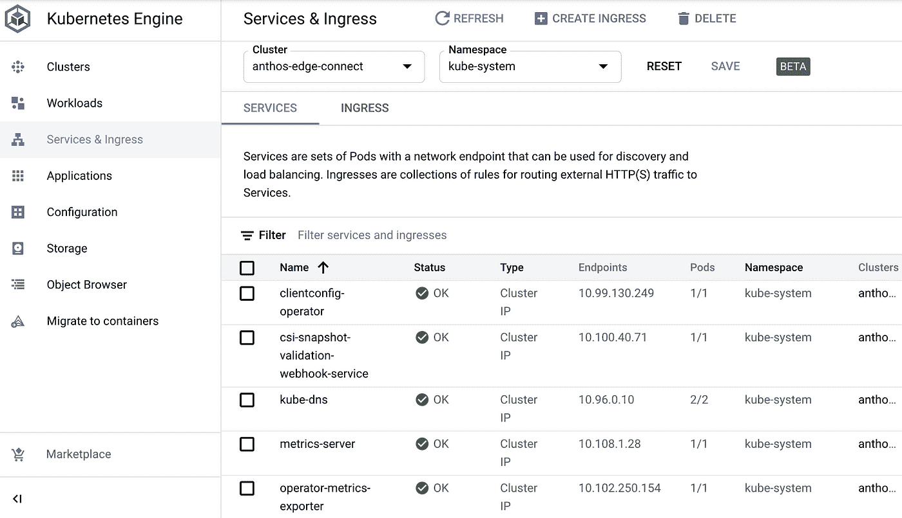

服务和入口— Kubernetes 引擎

裸机上的 Anthos 集群使用本地卷供应器(LVP)来管理本地持久卷。在裸机上的 Anthos 集群中为本地 PV 创建三种类型的存储类:LVP 共享(在本地共享文件系统中创建集群期间创建的子目录支持下创建本地 PV)、LVP 节点挂载(在配置的目录中为每个挂载的磁盘创建本地 PV)、Anthos 系统(在集群创建期间创建预配置的本地 PV，供 Anthos 系统 pod 使用)。

访问 PVC 和可用存储类别:

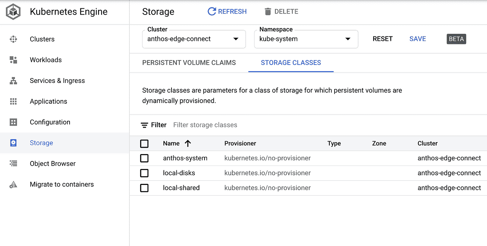

存储— Kubernetes 引擎

Anthos portal 方便用户在连接的集群上启用受支持的功能:

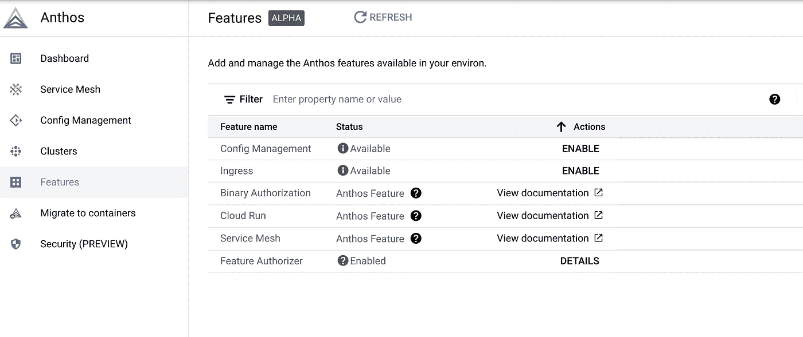

在已注册的集群上启用功能— Anthos

# 监控和记录

当用户创建新的管理或用户集群时，会在每个集群中安装并激活日志记录和度量代理。Stackdriver operator 管理部署在群集上的所有其他与 Stackdriver 相关的组件(日志聚合器、日志转发器、元数据代理和 prometheus)的生命周期。用户可以使用监控门户在云项目中设置云监控工作区，以访问控制台上远程裸机集群中所有系统和 Kubernetes 组件的日志。

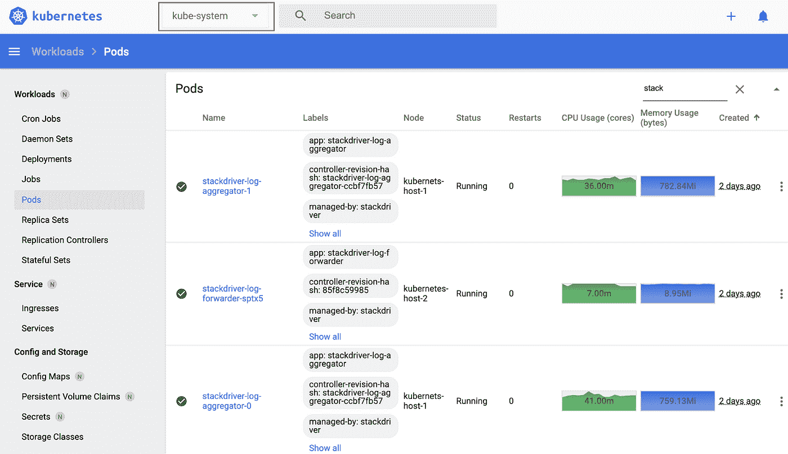

监控和日志记录— Stackdriver

普罗米修斯的 Stackdriver 收集器为著名的普罗米修斯标签中的 Kubernetes 对象构建了一个云监控资源。一个单独的实体'*stack driver-Prometheus-app*'与栈一起部署，可以配置为监控集群中的应用。

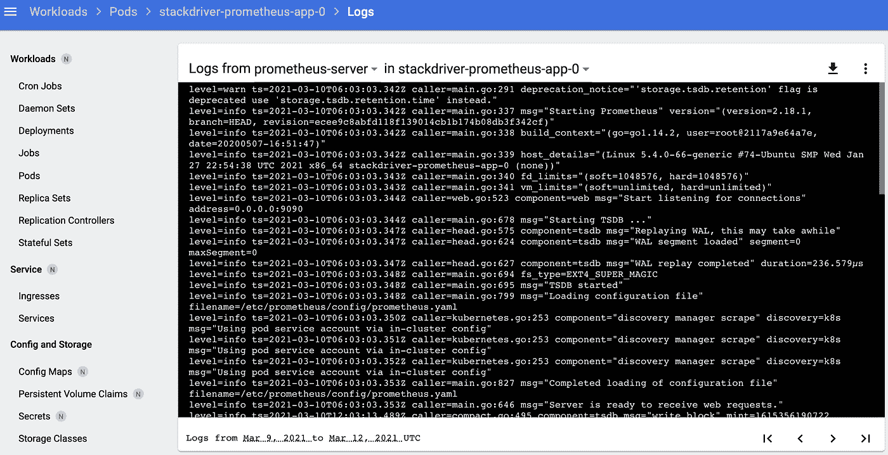

监控和记录—堆栈驱动普罗米修斯

谷歌云的运营套件是谷歌云的内置可观测性解决方案。它提供了全面管理的日志记录解决方案、指标收集、监控、仪表板和警报。云监控使用工作区来组织和管理其信息。

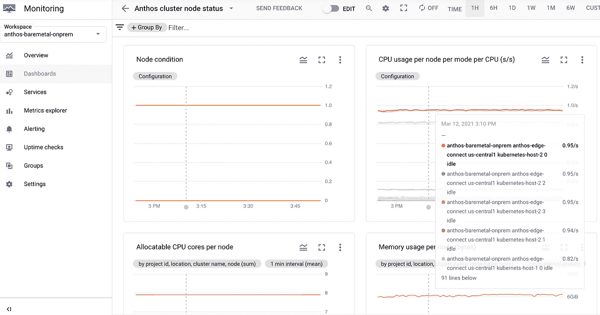

监控和日志记录—工作区

集成日志记录:

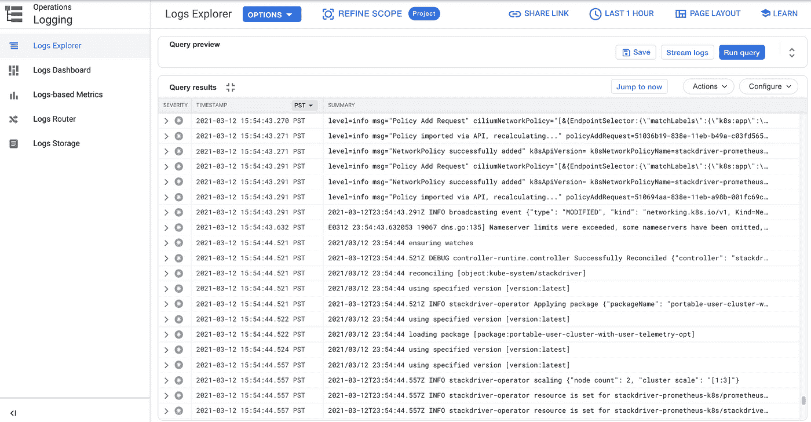

监控和日志记录—工作区

# akri——面向边缘的 Kubernetes 资源接口

Akri 支持发现和公开异构叶设备作为资源，并为 Kubernetes 集群中的每个设备创建服务。这使得运行在 Kubernetes 上的应用程序能够使用来自设备的输入。Akri 处理设备的自动包含和移除，以及资源的分配和取消分配，以更好地优化集群。

Akri 是一个标准的 Kubernetes 扩展，使用两个定制资源定义(配置和实例)、一个代理和一个控制器来实现。安装后，用户可以为设备编写 Akri 定义，设备插件充当代理，使用支持的发现协议查找与定义匹配的硬件，然后使用 Akri 控制器通过 Kubernetes pod 中运行的代理管理它，该代理向您的应用程序代码公开设备及其 API。

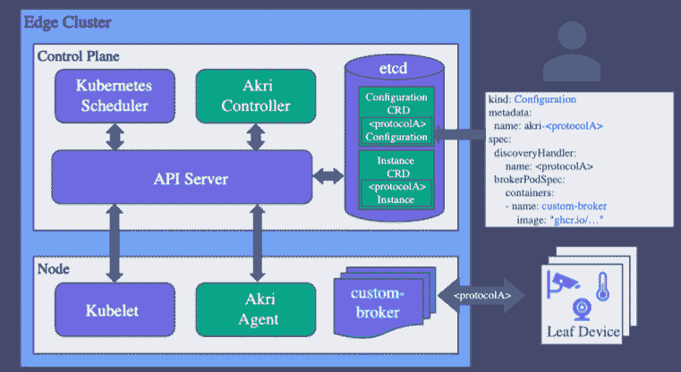

阿克里建筑公司

Akri 基于 [Kubernetes 设备插件框架](https://github.com/kubernetes/community/blob/master/contributors/design-proposals/resource-management/device-plugin.md)，该框架为供应商提供了一种称为设备插件的机制，可用于广告设备、监控设备(如健康检查)、将设备挂接到运行时以执行设备特定的指令(例如:清理 GPU 内存、捕捉视频等)。)并使该设备在容器中可用。这使得供应商无需编写额外的代码就可以公布他们的资源并对其进行监控。

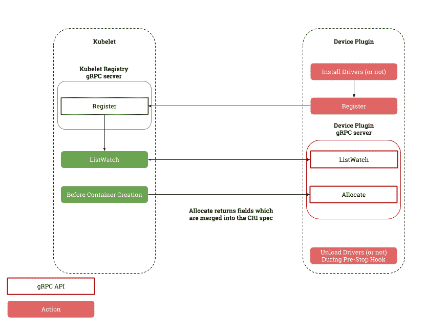

设备插件框架

Akri 目前支持的协议有:udev(发现 Linux 设备文件系统中的任何东西)、ONVIF(发现 IP 摄像头)和 OPC UA(发现 OPC UA 服务器)。像蓝牙、简单扫描 IP/MAC 地址、LoRaWAN、Zeroconf 等协议。都在路线图中。

在本文中，udev (userspace /dev)协议用于发现连接到裸机 Kubernetes 集群上的 Anthos 的两个节点的 USB 摄像头。

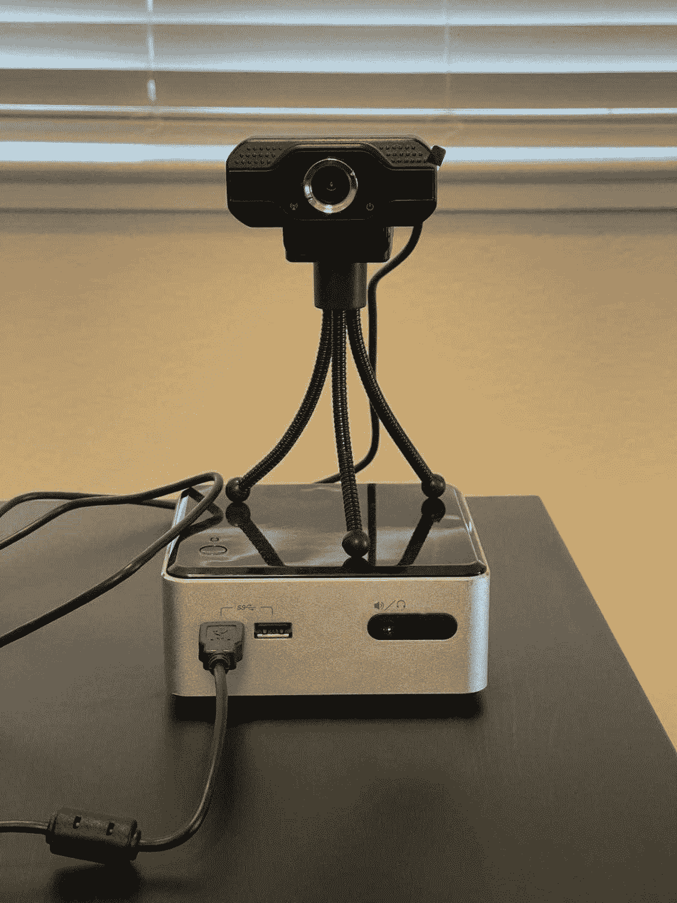

连接到 NUC 的 USB 摄像头

Udev 管理 */dev* 目录下的设备节点，比如麦克风、安全芯片、usb 摄像头等等。Udev 可用于查找连接到或嵌入到节点中的设备。Akri 的 udev 发现处理程序解析配置中列出的 udev 规则，使用 udev 搜索它们，并返回发现的设备节点列表(即:/dev/video0)。用户可以通过将 [udev 规则](https://wiki.archlinux.org/index.php/Udev)传入配置规范来配置 Akri 要查找的设备。

用户还可以允许多个节点使用一个叶设备，从而在一个节点离线时提供高可用性。此外，Akri 将为每种类型的叶设备(或 Akri 配置)自动创建一个 Kubernetes 服务，无需应用程序来跟踪 pod 或节点的状态。

例如，以下是在其中一个节点上使用“udevadm”连接的 USB 摄像头的信息:

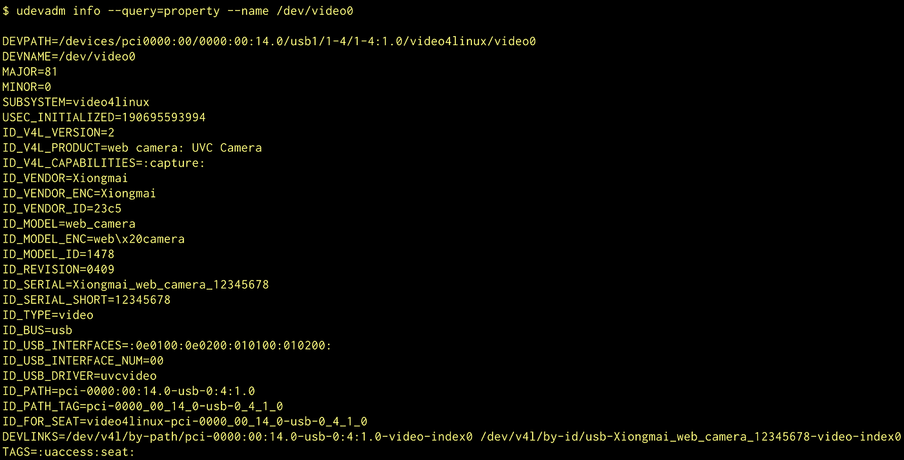

Udevadm 列出附加的摄像机信息

用户可以使用 Akri 的预定义语法[在这里](https://github.com/deislabs/akri/blob/main/discovery-handlers/udev/src/udev_rule_grammar.pest)来定义 Akri 的配置规范的协议部分中的特定 udev 规则，以定义 udev 规则应该在特定节点上发现什么设备。

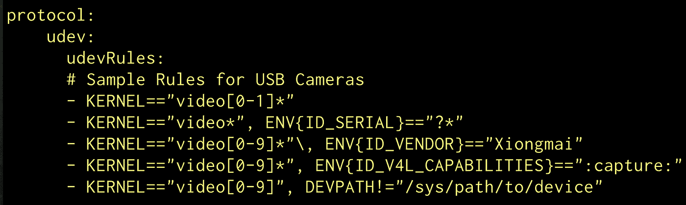

udev-Akri 规则

作为 daemonset 部署的 Akri 代理处理资源可用性更改并启用资源共享，这些任务使 Akri 能够找到已配置的资源(叶设备)，将它们暴露给 Kubernetes 集群以进行工作负载调度，并允许多个节点共享资源。代理通过[发现处理程序(DHs)](https://github.com/deislabs/akri/blob/main/docs/agent-in-depth.md#resource-discovery) 发现资源。

Akri 控制器部署在集群中的主节点上，支持集群访问叶设备和处理节点丢失。代理 pods 是根据选择的协议和定义的容量([资源共享](https://github.com/deislabs/akri/blob/main/docs/resource-sharing-in-depth.md))自动创建的。

# 使用 ACM (Anthos 配置管理)将 Akri 部署到裸机集群上的 Anthos

下面的拓扑展示了如何配置 GitOps 以及如何从云到边缘执行应用部署的经典示例。Akri 部署在隔离网络空间中的 Anthos 裸机集群上，使用来自云的 Anthos 配置管理。Akri 然后负责所有其他所需的方面，以发现连接的 USB 摄像头，并使流媒体应用程序能够使用它们。最终用户可以使用 LB_IP(本地网络)来观看访问运行在远端站点上的流媒体应用程序的视频(在这种情况下，远端站点是运行 Anthos Bare Metal Kubernetes 集群的 NUC)

在下面的拓扑中，管理员用户向 Anthos 配置管理提供“配置管理”规范，该规范包含 cluster_selector(在本例中选择了 Anthos 裸机集群)和 git 信息，后者包含 Akri 的所有部署清单。

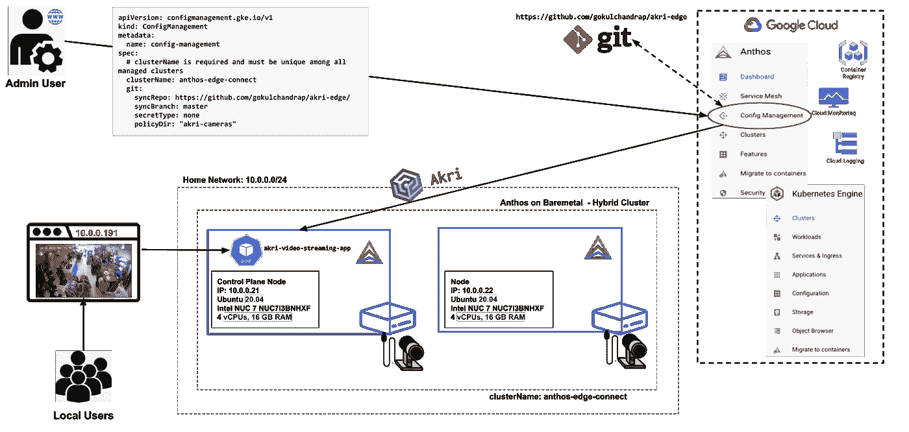

使用 ACM (Anthos 配置管理)部署 Akri

ACM 负责将清单部署到指定 git_repo 中定义的私有裸机集群，并与 git 分支保持同步。Akri machinery 检测连接到节点的 USB 摄像机(这里两个主机都充当节点—主污点已删除),本地用户可以使用本地网络上的 LB_IP 访问镜头。

ACM 可以从 GCP 控制台上的 Anthos dashboard 配置，通常项目的所有集群部分都会被考虑更新，用户可以配置特定的集群或将配置应用于所有集群。

1.  Git 存储库身份验证:

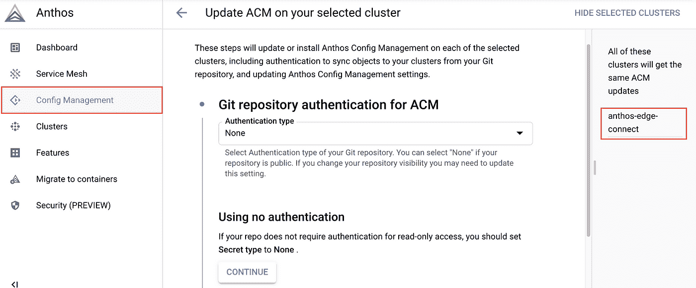

ACM 配置

2.Conifg Sync —保存诸如 git_url 和带有配置清单的目录之类的信息。这里用了一个[回购](https://github.com/gokulchandrap/akri-edge)的例子。

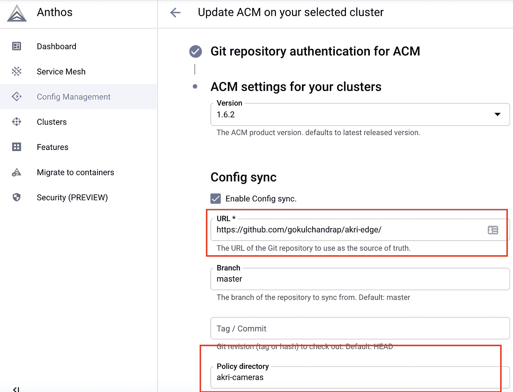

ACM 配置

上面配置的 [repo](https://github.com/gokulchandrap/akri-edge) 包含了在 Kubernetes 上部署 Akri 所需的所有清单。格式遵循 [ACM 指定的布局](https://cloud.google.com/kubernetes-engine/docs/add-on/config-sync/concepts/repo)，其中集群目录包括所有集群级对象(如 CRD、集群角色、集群角色绑定等。)，名称空间目录包括一个具有名称空间名称的子目录，该子目录保存名称空间对象和所有其他命名空间对象(如部署、守护程序集、服务等)。)，系统目录包含操作员的配置。

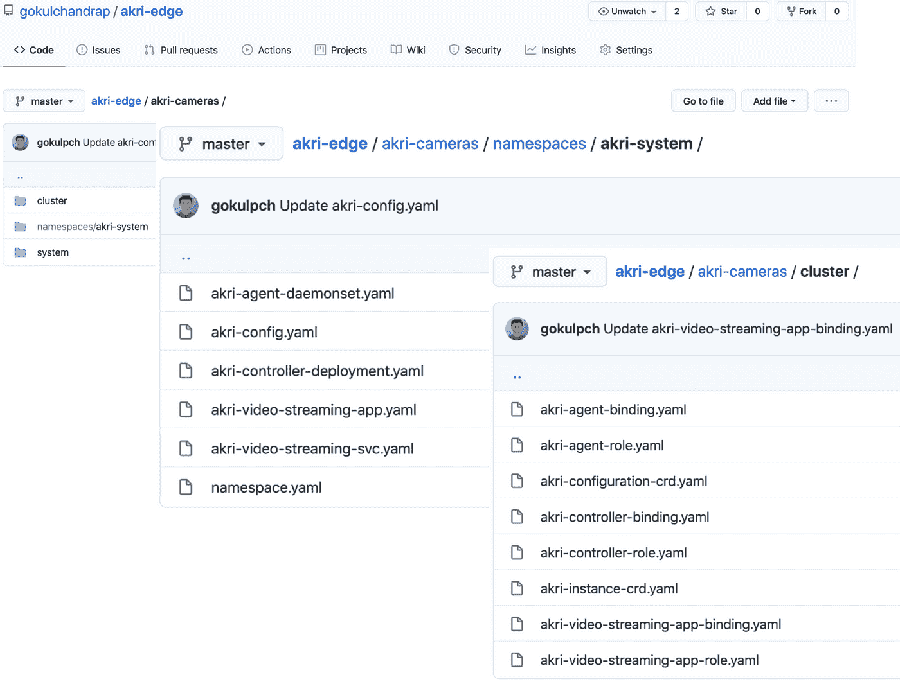

ACM 配置— Git 源

使用 cluster_selector 提交 ACM 规范后(在本例中选择了 Anthos 裸机集群),裸机集群上的控制器会在配置管理命名空间中创建所需的 git-importer 和 monitor pods，这些 pods 会在集群上执行所有与 GitOps 相关的任务。

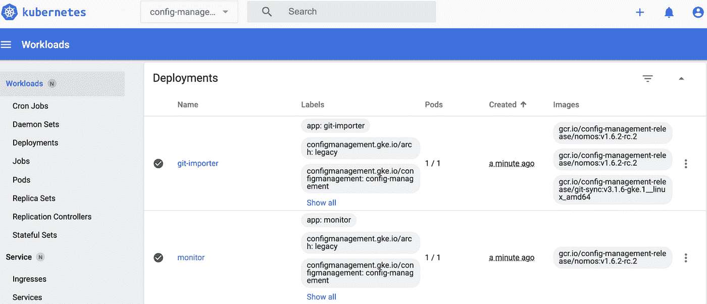

ACM 组件—导入器和监视器

安装完成后，用户可以从 Anthos 仪表板的 Anthos 配置管理部分或使用“nomos 状态”来检查同步状态。如下所示，一旦同步完成，所有与 Akri 相关的组件都部署在裸机集群上的私有 Anthos 上，并且可以从 Kubernetes 引擎的工作负载部分进行验证。

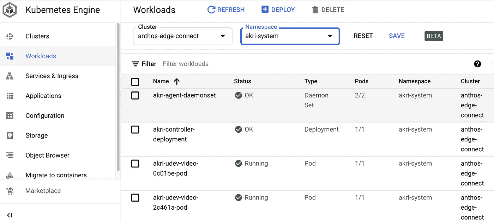

Akri 组件

Akri 实施在集群中安装两个 CRD:

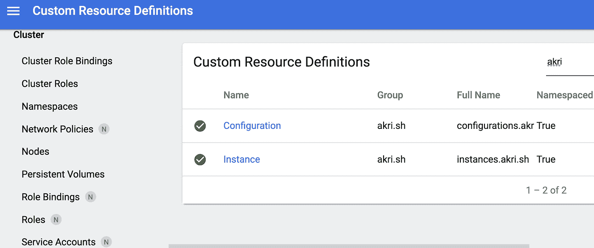

阿克里 Akri 的

Akri 配置指定 Akri 控制器要发现的叶设备的类型。在下面的示例(akri-udev-video)中，udev 协议用于发现 USB 摄像头。

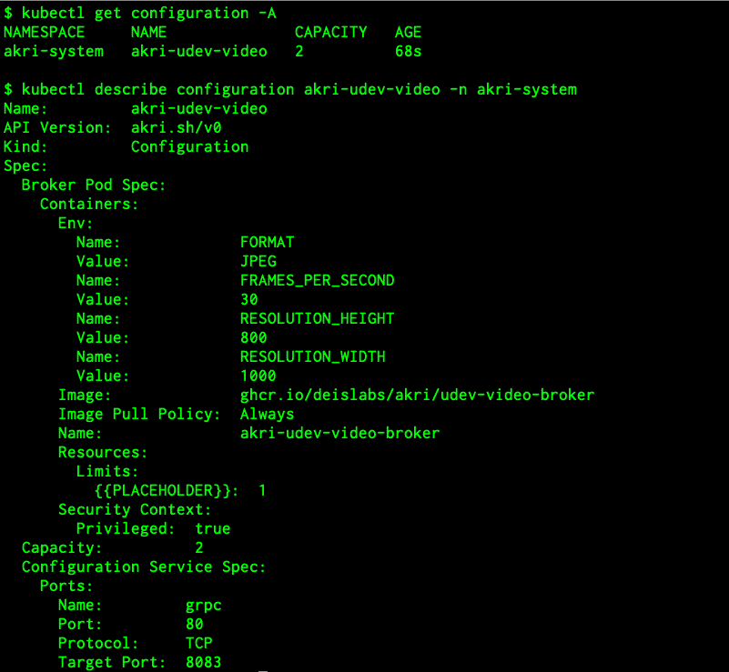

阿克里 Akri 的

Akri Agent 是一个 Kubernetes 设备插件框架实现，它搜索叶设备，根据指定的规则检查可用性。一旦设备被发现，Akri 控制器将每个 Akri 实例视为叶设备的代表，部署“代理”pod 以促进与叶设备的连接并利用它。

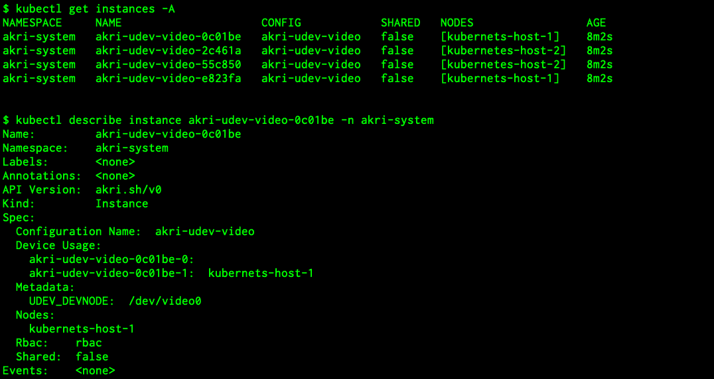

阿克里 Akri 的

除了核心 Akri 组件之外，还部署了一个' *akri-vedio-straming-app* '来传输从 broker pods 收集的视频帧。

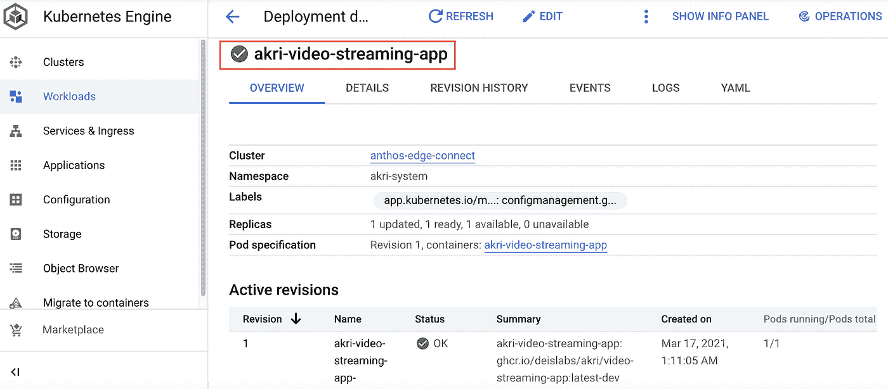

Akri —视频流应用

流媒体应用程序可以使用“ *akri-configuration* ”对象进行配置:

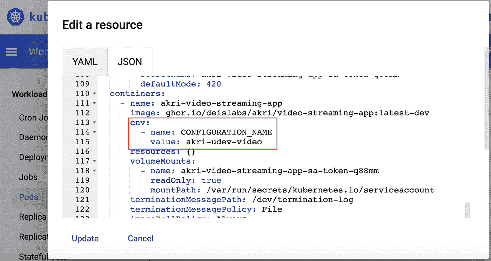

Akri —视频流应用—配置

可以使用 broker pod 规范配置格式、分辨率和帧等配置:

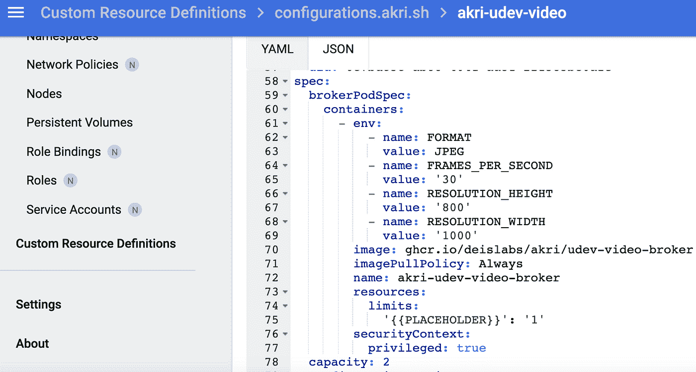

Akri —配置

管理员可以从 Kubernetes 引擎的工作负载部分管理所有 Akri 组件。

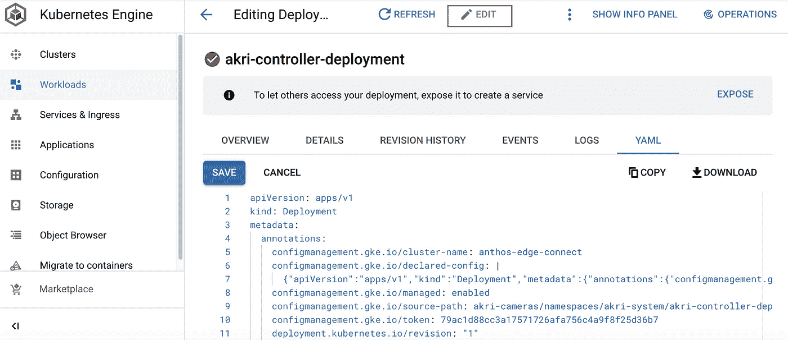

从云中管理 Akri 组件

Pod 日志可以从 Kubernetes 引擎门户访问。

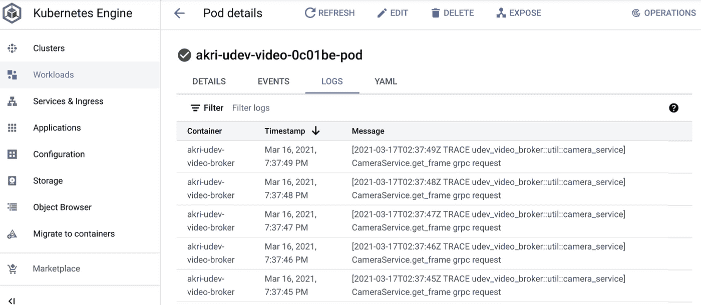

从云中监控 Akri 组件

安装在集群上的 stackdriver 将所有日志传输到操作和日志记录单元，使用户能够过滤特定的日志。

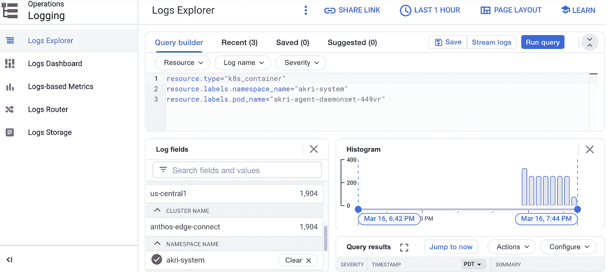

从云中监控 Akri 组件

裸机上的 Anthos 集群使用在 L2 模式下运行的 [MetalLB](https://metallb.universe.tf/) 来实现数据平面负载平衡。MetalLB 使用在引导群集时配置的 IP 池，将它们连接到负载平衡器类型的服务。

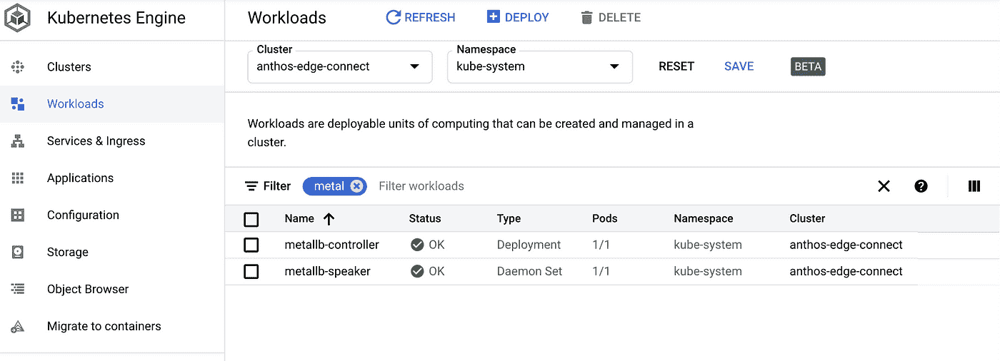

裸机上的 Anthos 集群— Metallb 组件

如果需要，用户可以从 Kubernetes 引擎-服务和入口门户编辑服务:

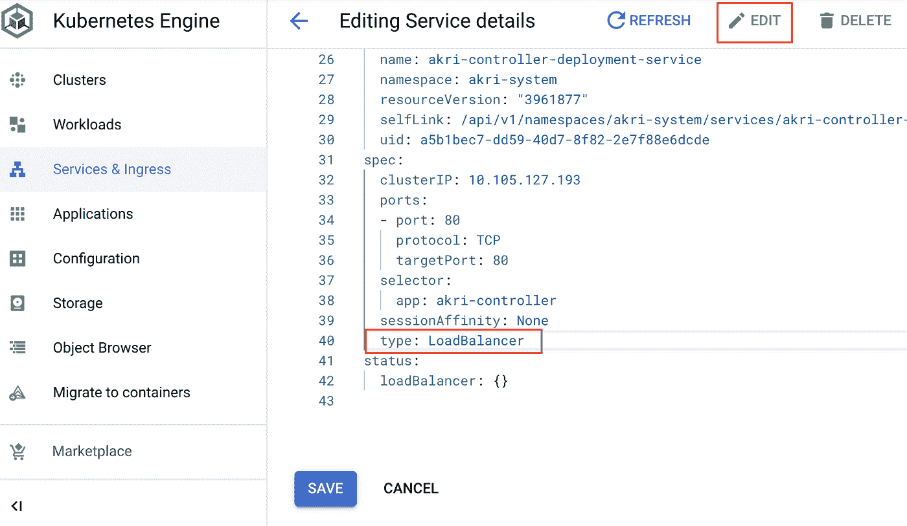

将视频流应用程序服务公开为负载平衡器

如下图所示，akri-video-streaming-app 被公开为一种负载平衡器类型，可用于使用负载平衡器 IP 访问素材。

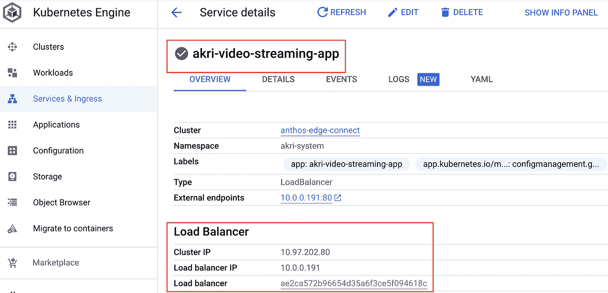

将视频流应用程序服务公开为负载平衡器

在上面的拓扑中，两个摄像机连接到两个节点，Akri 控制器为每个实例(摄像机)部署两个代理单元。如下图所示，摄像机指向两个不同的对象:

连接到同一个集群的两个摄像机指向两个不同的对象

akri-video-streaming-app 从两个 broker pods 收集帧，并在一个统一的视图中显示它们。分辨率和帧数根据 akri 配置规范进行配置。

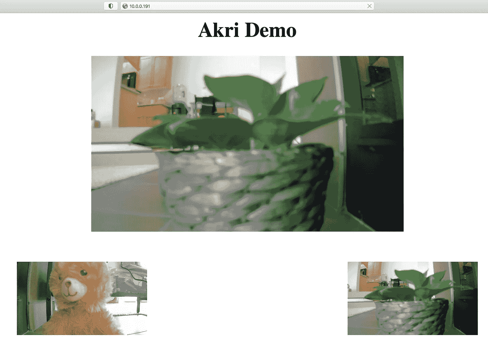

视频流应用——从连接的摄像机转发帧

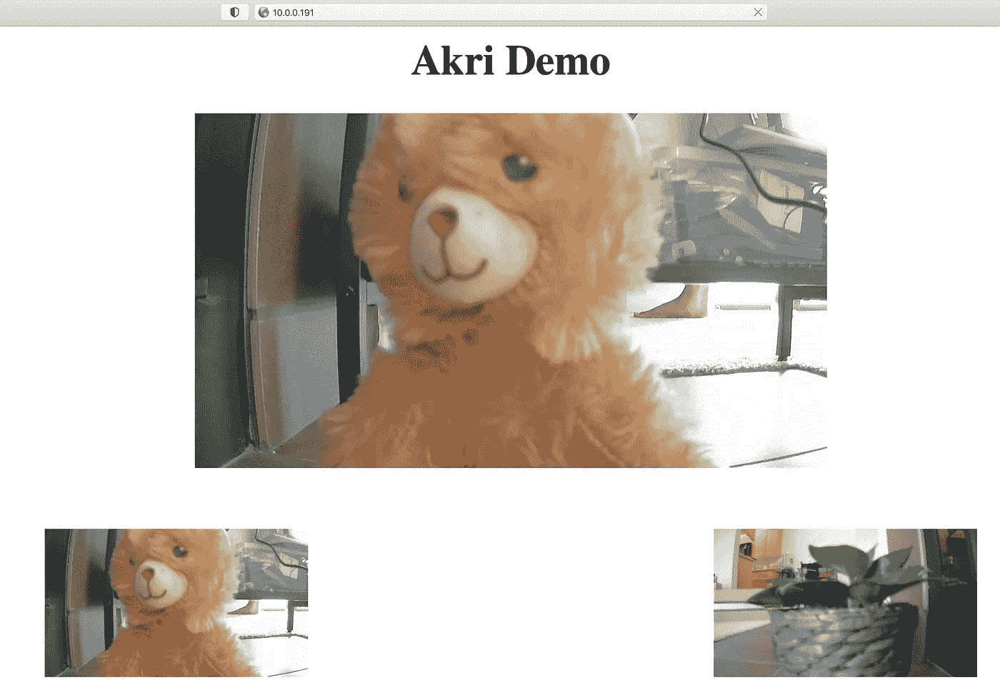

视频流应用——从连接的摄像机转发帧

这种结合为用户提供了创建集群所需的自动化，将它们连接到云，并使叶设备能够被表示为 Kubernetes 对象，从而使 Kubernetes 成为一种多功能的边缘计算解决方案。