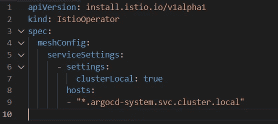

# Anthos 服务网格—配置全局设置

> 原文：<https://itnext.io/anthos-service-mesh-configuring-global-settings-e03adc6e0b22?source=collection_archive---------4----------------------->

最近，当我在使用 Google 托管控制平面的多集群设置中解决服务发现问题时，我需要配置网格范围的设置。我不会进入实际的故事，那是另一个博客的主题，因为我想把重点放在配置步骤上

当查看与 Anthos Service Mesh 相关的文档时，我经常依赖于官方的 Istio 文档，因为它更完整，对于 Google 来说复制它的全部没有意义。然而，我希望谷歌能让 ASM 的特定页面更加流行……稍后会有更多的介绍。

在配置全局设置的背景下，我针对我遇到的问题设计了这两页

*   https://istio . io/latest/docs/ops/configuration/traffic-management/multi cluster/—这一页概述了我需要做出的更改……但对如何做出更改却知之甚少，除非你已经知道如何/在哪里做出更改。基本上，我想将一些名称空间配置为 clusterLocal，并“禁用”名称空间一致性的影响。
*   [https://istio . io/latest/docs/reference/config/istio . mesh . v1 alpha 1/# MeshConfig-service Settings-Settings](https://istio.io/latest/docs/reference/config/istio.mesh.v1alpha1/#MeshConfig-ServiceSettings-Settings)—所有 mesh config 设置的参考页面

现在我知道了变化是什么，我必须弄清楚如何变化。许多页面都引用了 IstioOperator CRD，您可以在那里创建一个自定义资源，并让 Istio 为您翻译它。不幸的是，在受管理的控制平面中，该操作符是隐藏的/不可用的。然而，这是一个有助于找到方法的线索。这是我真正想要的配置



将 ArgoCD 命名空间配置为集群本地

然后我找到了这个[页面](https://cloud.google.com/service-mesh/docs/managed/enable-managed-anthos-service-mesh-optional-features)，它介绍了如何在托管 Anthos 服务网格上配置可选功能。它只有很少的配置示例，并且与 Istio 参考资料不太一致，尽管在配置模式中需要一些翻译。

然后一个同行发现了一个关于从 IstioOperator 迁移到 ASM 的[页面](https://cloud.google.com/service-mesh/docs/managed/migrate-istio-operator)。现在我有了一个 FROM，一个翻译机制，我离如何排序更近了！

```
asmcli experimental mcp-migrate-check -f clusterlocal.yaml
```

运行上面的命令将 IstioOperator 配置转换为 Istio ConfigMap(参见下面的代码片段)。我用我们的 GitOps 工具部署了它。不料，这第一次尝试就成功了！

```
apiVersion: v1
kind: ConfigMap
metadata:
  name: istio-asm-managed
  namespace: istio-system
data:
  mesh: |-
    serviceSettings:
    - hosts:
      - '*.argocd-system.svc.cluster.local'
```