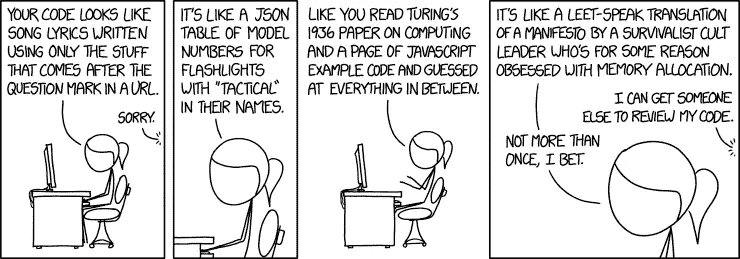

# 反模式和代码味道

> 原文：<https://itnext.io/anti-patterns-and-code-smells-46ba1bbdef6d?source=collection_archive---------0----------------------->


图片来自 [Pixabay](https://pixabay.com/?utm_source=link-attribution&utm_medium=referral&utm_campaign=image&utm_content=3113828)

每个人都写完美的代码，对吧。我们都不慌不忙，不用担心最后期限和外部压力，来创建结构如此良好的优雅代码，它应该被视为艺术。

对…

好吧，现实世界是很难原谅的。每个人都走捷径，不得不在好的和好的之间做出选择，然后把事情做完。我们做出牺牲，不良做法渗透进来。其中一些捷径以迂回的方式重复出现。我们称这些为反模式或代码气味。

这些代码让我们畏缩，并感到恶心。我们诅咒屏幕，发誓要对犯下这种错误的白痴进行报复。

谁做了这些垃圾:

```
git blame pom.xml...
efenglu
```

…哦，等等。让我们暂时忽略它。我肯定开发商今天过得很艰难。

我们都经历过。就像任何坏习惯一样，我们需要首先识别习惯并纠正行为。

这是我见过(做过)的一系列糟糕的编程实践，我希望永远不要重复。希望通过识别行为，我们可以在早期解决它，避免以后代价高昂的重构。


图片来自[公共领域图片](https://www.pexels.com/@public-domain-pictures?utm_content=attributionCopyText&utm_medium=referral&utm_source=pexels)来自[像素](https://www.pexels.com/photo/food-plate-italian-dinner-41320/?utm_content=attributionCopyText&utm_medium=referral&utm_source=pexels)

# 意大利面条代码

与一大盘意大利面不同，意大利面代码既不美味也不吸引人。

示例:

> *A* 引用 *B* 哪个引用 *C* 和 *D* 哪个有时引用 *A* 或 *E* 但主要是*A’*哪个提供……你都明白了吗？现在添加一个使用 *G* 而不是 *I* 的新特性。

意大利面条式代码是指通过所有间接的、抽象的和最好的意图，我们最终得到的代码在内部来回缠绕。不同代码段之间的界限模糊到了毫无意义的程度。看似分离的代码片段最终被发现是结合在一起的。

当你试图提取一种能力时，意大利面条式的代码真的露出了它丑陋的一面。就像吮吸意大利面条一样，看起来你已经成功完成了任务，直到它扇了你一巴掌，把酱汁溅得你满衬衫都是。

为了避免意大利面条式的代码，你应该确定界限，尽可能遵循单一目的的原则。保持较小的代码大小和有限的依赖性。

并使用围嘴。

# 克隆并拥有

有时候一个软件的行为就像我们想要的那样…除了我们需要稍微修改它。不幸的是，源代码不能轻易接受我们的用例，我们不能或者不想重构它。因此，我们简单地复制实现并修改它以适应我们的需要。

克隆和拥有是干(不要重复自己)编码原则的对立面。

有时克隆和拥有自己的模式实际上是"*最佳"*方法。但是我们应该谨慎使用它。当发现 bug 时，克隆和拥有大块代码会导致一场维护噩梦。

当使用 clone and own only 时，我们应该只克隆非常小的可重用代码片段。这些通常应该是对库重构没有意义的模式或策略。提及克隆的来源也是很好的做法。

至少这样，当你发现一个错误时，你就可以责怪别人了。

# 手放在裤子里

你会把手伸进别人的裤子里吗？不。那就不要接触他们的代码。

手放在裤子里是通过所有私有的，甚至有时是公共的 API 的事情，我们最终接触到了我们真的不应该接触的代码。这打破了关注点的界限，暴露了您实际上不应该知道的代码内部工作的知识。

通常情况下，开发人员并不知道您正在使用某个特定的功能，他们会认为它是完全安全的，并对其进行重构。其他时候，通过深入代码，您可能会打破关于对象内部的假设。

一般来说，我们应该遵守 API 边界，不要将接口类型化到实现类中。实现类是内部的，不应该被引用。更好的是，将实现隐藏在单独的 maven 依赖项中，并使用依赖注入，或者更好的是，使用类似 java 模块的东西来确保没有人能够引用它们。

应该不惜一切代价避免反射。它很慢，将来几乎肯定会坏掉。你能做某事并不意味着你应该做。

尝试重构您的代码以使用公开可用的 API。设置知识边界。吃自己的狗粮，在使用自己的 API 时强迫自己不知道实现细节。如果感觉怪异或尴尬，重构。你不想有人把手伸进你的裤子，所以不要把手伸进他们的！


图片来自[皮克斯拜](https://pixabay.com/?utm_source=link-attribution&utm_medium=referral&utm_campaign=image&utm_content=763246)的[威利·海德尔巴赫](https://pixabay.com/users/wilhei-883152/?utm_source=link-attribution&utm_medium=referral&utm_campaign=image&utm_content=763246)

# 纸牌屋

很优雅，几乎是美丽的。但不是因为它写得好，而是因为你不能相信它真的有用！纸牌屋通常是其他反模式的症状。当被告知重构别人的代码时，你通常会发现一个纸牌屋。

为了避免纸牌屋:

*   编写简洁的代码
*   编写 API 和接口的测试
*   尝试破解你的代码

如果给你一个纸牌搭的房子，在继续之前有必要建立一个坚实的基础。焦点是首先编写现有应用程序的大量单元测试。这将使你熟悉现有的行为，并确保你不会破坏任何东西。开始小块重构。首先编码并保持现有行为。慢慢地，你可以开始加强 API 并引入更好的模式。

# 唯一的班轮

出于某种原因，一些开发人员认为世界上只有一定数量的换行符，他们必须作为一种宝贵的资源进行配给。他们常常喜欢将一个大语句压缩成一行代码的能力。这些行通常很复杂，很长，很难读懂。

听说过 [DeCSS 7 行 Perl 脚本](https://arstechnica.com/civis/viewtopic.php?f=15&t=1008590)吗？

当编码时，记得考虑那些跟随你的人。你的代码应该易于阅读，并且流畅。每一行应该完成一个工作单元。

水平滚动条不是你的朋友！

三元运算符是一行程序的罪魁祸首。

你喜欢这个吗:

```
5 > b ? 3<b ? print "4" : print "2" : print "6" 
```

或者这个:

```
if ( 5 > b) {
  if ( 3 < b) {
    print "4"
  } else {
    print "2"
  }
} else {
  print "6"
}
```

一般情况下，不要使用三元运算符。对于简单的打印语句，这可能是有用的，但不要嵌套它们。

拆分对多行的长链方法调用。例如，使用流时，请执行以下操作:

```
list.stream()
   .filter(...)
   .map(...)
   .filter(...)
   .collect(...)
```

使用构建器也是如此:

```
MyBuilder.newBuilder()
   .setValue1(...)
   .setValue2(...)
   .build()
```


照片由来自 [Pexels](https://www.pexels.com/photo/abc-books-chalk-chalkboard-265076/?utm_content=attributionCopyText&utm_medium=referral&utm_source=pexels) 的 [Pixabay](https://www.pexels.com/@pixabay?utm_content=attributionCopyText&utm_medium=referral&utm_source=pexels) 拍摄

# 学术

学术程序员以使用别人从未听说过的代码特性而自豪。当他们的代码使用一些模糊的闻所未闻的功能时，他们会很高兴。

一个常见的例子是位操作。在大多数常规代码中很少需要。所以不要做。

听说过 [XOR 交换算法](https://en.wikipedia.org/wiki/XOR_swap_algorithm)吗？这可能是一个奇怪的面试问题，但是看在上帝的份上，千万不要这样做。内存和寄存器并不是那么珍贵的资源。只需使用第三个变量。

相反，编写代码时，就好像一个语言新手需要阅读它一样。当然，它可能会更长更冗长，但也更容易阅读。在大多数情况下，你并不像你认为的那样“聪明”。


# 每一颗螺丝钉都是一颗钉子

工具只有用在正确的工作上才是好的。仅仅因为你了解了这种漂亮的新语言或新框架，并不意味着你可以使用它。

当编码时，慢下来问问你自己。

> 我是在强迫自己使用这种方法，还是有一种不那么复杂的更简单的方法

这里，特殊 AST 转换是一个常见的原因。

坚持使用你的团队已经同意的内置语言结构或特性。

# 过早优化

这种常见的反模式非常容易陷入。你看到一段代码，觉得有必要写一个稍微复杂一点的版本，这样会更快。虽然您的意图是正确的，但是您也占用了宝贵的时间，使得代码更加复杂，并且很可能引入更多的 bug。

现在我们不应该故意写缓慢的代码。

我们应该首先关注易读的、可维护的代码。如果性能成为一个问题，那么，只有到那时，进行性能分析，并在必要的地方进行重构。通常情况下，它不在你预期的地方。

小心过度使用缓存，或将大量数据复制到内存中。这看起来像是一个快速的胜利，但实际上可能没有必要。

此外，编译器通常可以很好地为您优化代码。

# 全局

这包括所有种类的静态变量、方法和导入静态。

在容器和服务的世界中，这个概念扩展到了容器中包含的环境变量、URL、系统属性和可执行文件。

全球化充满了陷阱。它们使代码变得脆弱，因为改变一件事会产生深远的后果。很难确定它们用在哪里。全局变量使得测试更加困难，因为几乎不可能为全局变量插入模拟。它们也是安全问题的潜在来源。

一般来说，避免他们！

避免静态方法和公共静态字段。尽可能使用依赖注入。

避免环境变量和硬编码的 url。使用像[尤里卡](https://github.com/Netflix/eureka)这样的服务发现机制和像 [Spring Boot 配置](https://cloud.spring.io/spring-cloud-config/spring-cloud-config.html)这样的外部配置。

对于实用程序类，考虑使它们成为接口的可注入 bean。尤其是，如果他们的行为很复杂。如果你创建一个实用程序类，保持它的小规模。


照片由来自[佩克斯](https://www.pexels.com/photo/photo-of-pathway-surrounded-by-fir-trees-1578750/?utm_content=attributionCopyText&utm_medium=referral&utm_source=pexels)的[詹姆斯·惠勒](https://www.pexels.com/@souvenirpixels?utm_content=attributionCopyText&utm_medium=referral&utm_source=pexels)拍摄

# 快乐路径驱动的发展(HPDD)

这一个我是有罪的。我想每个人都在某个时候做过。你写一段代码，直到它为你的一个案例工作。你甚至可以为它写一个测试。

然后你就完事了。

你还没完！

事实上，这可能是有趣的时间。邪恶的时候到了:)

试着给它发送坏的东西，无效的参数，空的，未初始化的状态。攻击你的假设，冷酷无情。

当所有的尘埃落定，你的代码缰绳胜利，现在你完成了。

# 这永远不会…

就像快乐之路一样，这是懒惰开发者的症状。

> “这永远不会为空”
> 
> “这永远不会引发异常”

六个月后…

> "嘿，我们的代码坏了，是谁开始抛出这个异常的？"

防御性编码。

永远不要捕捉所有的异常并盲目地抛弃它们。

不要对行为做出假设。行为可能会改变，通常是在没有察觉的情况下。

如果它可以为空，就假设它会为空。

如果你发现自己在说“它永远不会…”知道它几乎肯定会。帮你自己一个忙，现在就编码吧。即使它只是抛出 IllegalStateException。

# 就用 Maven 最新版本

在 maven 中指定依赖项时，总是为每个依赖项设置一个特定的版本会很麻烦。使用最新版本可能很有诱惑力。

```
<**dependency**>
    <**groupId**>org.apache.pulsar</**groupId**>
    <**artifactId**>pulsar-client</**artifactId**>
    <**version**>LATEST</**version**>
</**dependency**>
```

不要！

使用最新版本使得可重复的构建几乎不可能，因为你永远不知道你以前构建了什么，现在又将构建什么。

始终使用特定的版本。最起码的版本范围，但即使这样也会给开发人员带来问题。

```
<**dependency**>
    <**groupId**>org.apache.pulsar</**groupId**>
    <**artifactId**>pulsar-client</**artifactId**>
    <**version**>[2.3.0,3.0.0)</**version**>
</**dependency**>
```

当使用版本范围时，maven 只会在本地没有满足依赖关系的版本范围时解析依赖关系。因此，如果你引入新的东西，你的一些开发人员会开始抱怨他们的构建在本地失败。这是因为他们使用的是以前的版本。如果您使用范围，如果您期待新的功能，请始终更新最低版本。但是如果你要这么麻烦的话，你最好更新版本，忘记版本范围。

```
<**dependency**>
    <**groupId**>org.apache.pulsar</**groupId**>
    <**artifactId**>pulsar-client</**artifactId**>
    <**version**>2.3.0</**version**>
</**dependency**>
```

此外，永远不要使用项目外部模块的快照依赖关系。这些是移动的目标。事实上，我建议您使用 Maven Enforcer 来确保您的库只使用具体版本。

```
<**plugin**>
    <**groupId**>org.apache.maven.plugins</**groupId**>
    <**artifactId**>maven-enforcer-plugin</**artifactId**>
    <**version**>3.0.0-M2</**version**>
    <**executions**>
        <**execution**>
            <**id**>default-cli</**id**>
            <**goals**>
                <**goal**>enforce</**goal**>
            </**goals**>

            <**configuration**>
                <**rules**>

                    <**requireReleaseDeps**>
                        <**message**>No Snapshots Allowed in releases!</**message**>
                        <**onlyWhenRelease**>${enforcer.requireReleaseDeps.onlyWhenRelease}</**onlyWhenRelease**>
                    </**requireReleaseDeps**>
                </**rules**>
            </**configuration**>
        </**execution**>
    </**executions**>
</**plugin**>
```



[XKCD](https://xkcd.com/1833/)

# 谁需要代码风格？

所有人！

我们可以就什么是最好的代码风格进行无休止的辩论，但简单的答案是，最好的代码风格是你的团队能够同意的。弄清楚这一点，并执行它。

使用 Checkstyle 和 Sonar 之类的工具。不要接受新代码，直到代码符合要求。

像代码这样简单的东西，不管是谁写的，看起来都一样，会对代码的可读性和可维护性产生深远的影响。

# 角色很贵

您是否遇到过开发人员使用大量缩写或简短的难以描述的变量名的代码？代码需要被人阅读。不要担心使用稍微长一点的变量名。如果这能让代码更易读，那就去做吧。

不要:

```
int i
int compObjVerT
long delVarId
```

避免简洁的单字符变量。

做:

```
for (int i;...)
int compareObjVersion
long deleteVariableId
```

在 for 循环或 lambda 表达式中使用“I”或“It”是可以接受的。但是要小心嵌套循环。如果变量的定义和使用之间的距离超过了几行，那么变量应该有一个描述性的名字。

# Git:更大更少的提交

我对此完全有罪，我被它烧伤的次数已经记不清了。

git 最好的特性之一是它是一个分散的存储库。这意味着，您的提交实际上不会进入主线，直到您希望它们进入。

因此，尽早提交并经常提交。

使用 git 作为一种方法来跟踪你的想法的进展。没做完也没关系。继续提交。

这使您可以轻松地恢复到以前的状态。

在你尝试新事物之前，先承诺。

在重构之前，提交。

见鬼，在你离开一天之前，承诺吧。

不要担心你的犯罪记录。一旦你真的完成了，你就可以很容易地把这些垃圾合并成一条很好的专业提交消息。

# Git:无意义的提交消息

说到提交消息，你见过这个吗:

> 修理东西

或者这个

> 更新规格

还是这个？！？

> 与你无关

嗯，最后一个有点极端，但你明白我的意思。您提交消息是您告诉其他开发人员您正在做什么的方式。当然，我们可以阅读你的代码，但是消息给了我们上下文。提交消息应该回答“为什么？”有时候“怎么做？”你做了一些事。

*   为什么你在修东西？
*   为什么/怎么破的？
*   你为什么要更新规格？
*   这对我们的客户有什么影响？

你不需要写论文。这是你的问题跟踪者的工作。提交应该是:

*   短但不要太短
*   描述性而不重复
*   如果你有相关的问题，提出来。

还要遵循良好的提交模板实践:。

```
short one-line messagefollowed by blank line and
long multi-line
descriptive message
```

遵循这种模式可以很容易地扫描 git 日志，甚至创建简短的发行说明:

```
git log --pretty=oneline
```

# Git:长寿分支

你曾经有过一个持续几周或几个月的功能分支吗？一直等到它完美，做了所有的事情，最后才意识到，因为你等了太久，你和师父的距离太远，你的分支现在合并起来太危险了。

+1 我有

遵循敏捷宣言。将特征分成小块。并将其合并。然后下一块，合并一下。

如果它不能做所有的事情，那又怎么样。只要它能工作，不破坏现有的东西，那就好。实际上比好还要好。

您正在交付新的功能。这太棒了。通常，这是当你发现你需要重新考虑一个设计决策，也许扔掉代码的时候。

没关系。你学到了一些东西，并在开发周期的早期而不是晚期解决了它。

如果你在一个分支上工作了几个星期以上，你可能工作的时间太长了。


[XKCD](https://xkcd.com/378/)

# 仅使用 IDE

我们都有自己喜欢的想法。

*   IntelliJ
*   黯然失色
*   Netbeans…

但是不要让 IDE 成为拐杖。熟悉每个人都有的最好的 IDE 终端。

这个神奇的黑匣子没那么恐怖。它非常强大，总是完全按照指示去做，并且很容易重复动作。哦，我有没有提到它的愚蠢快。自由了。

我想说的是，不要把自己局限在自己喜欢的图形化 IDE 里。

您应该知道如何在命令行上使用 git。

```
git clone [https://github.com/torvalds/linux.git](https://github.com/torvalds/linux.git)
git checkout myNewKernelMod
...
git add .
git commit -m "I am amazing!"
```

你应该知道用 vi 编辑一个文件。

```
vi someTime
// i Type some code
// :wq
```

你应该知道如何使用 grep 和 find。

```
grep -R "strange Stuff" *find . -name magicFile -exec rm '{}' ';'
```

这些简单的工具将使你在任何计算机上成为一股强大的力量。尤其是那些没有 UI 的服务器。

你不需要成为 bash 大师。适应就好了，还有 RTFM。

如果你需要帮助，请找一个“人”。(好吧，糟糕的笑话，但说真的，手册页真的很有用。)

```
man find
```

或者只问命令本身:

```
grep --help
```

关于终端的最好的事情之一是我可以很容易地与另一个开发者共享一个命令，并且知道它会工作:

```
git reset HEAD~1
git clean -f
git commit -m "Commit the changes"
```

尝试使用图形 IDE 界面来解释这一点。

# 修改输入参数

你有没有把一个对象传递给一个方法，方法修改了对象？

```
public void trustMe(java.util.Date importantDate); 
```

这个方法会修改日期吗？显然不应该这样。事实上，你可能会相信它不会。但是有可能。

我见过这样的代码！可怕的狗屎。

相反，您应该:

```
public java.util.Date safeTrustMe(java.util.Date importantDate);
```

现在很明显，一个新的日期正在被创造。虽然，他们仍然可以修改我传入的日期，但至少我感到安全，他们不会。

为了真正防止这种情况，您应该只传递不可变的对象。

```
public LocalDate safeTrustMe(LocalDate importantDate);
```

# 返回空值

Null (IMHO)在几乎所有语言中都是破的。尽管 Java 是一种强类型语言，但它有一个关键的缺陷。每个引用“可能”都有一个值。不能保证它会。这意味着通常我们不得不基本上不相信任何人。但是这意味着我们的代码中充满了空检查。所以我们走捷径，假设大多数东西不为空。

这导致大多数开发人员认为方法不接受空参数，并且方法从不返回空参数，因此代码有返回空的味道。

但是当我们没有价值的时候呢？

在 Java 的早期版本中，没有真正的选项。你必须返回 null。显然，您可以记录这一点，但是大多数开发人员从来没有真正阅读过文档。

用过这个吗:

```
new File("somePath").list()
```

你知道它可以返回 null 吗？

谢天谢地，Java 8 引入了可选的。对于新代码，没有理由不使用可选的。很明显，返回的值可能不存在。使用 Optional，我们可以返回一个描述空值(或缺失值)的非空引用。

是的，你可以使用@Nullable 或者@Nonnull，但是这些就像文档一样。它们不是由编译器或语言强制执行的。

看在上帝的份上，永远不要返回空集合！

```
List<String> happyString() {
   return null;
}
```

为什么！？！？！？是列表，只返回一个空的！

```
List<String> happyString() {
    return Collections.empyList();
}
```

# 可投掷的

```
try {
...
} catch (Throwable e) {
  throw new IllegalStateException("Bad stuff happened", e);
}
```

你真的认为你知道如果出了什么问题该怎么办吗？

Throwable 的含义很广。它包括像堆错误，JVM 错误，很多你没有机会正确处理的东西。

如果堆空间用完了，你会怎么做？

我告诉你…没什么。你完了，完了，死了，完了！所以不要表现得好像你可以通过捕捉 Throwable 或 Error 之类的东西来恢复一样。

不要这样做！

# 无故投掷

您已经捕获了一个异常，并且您将抛出一个新的异常，并带有一条更具描述性的错误消息。太棒了，太棒了！

```
try {
...
} catch (IOException e) {
  throw new IllegalStateException("failed to write");
}
```

但是…等等…发生了什么。为什么会失败？你那里就有信息。传下去:

```
try {
...
} catch (IOException e) {
  throw new IllegalStateException("failed to write", e);
}
```

有那么难吗？

如果从 catch 块中抛出异常，请在新的异常中包含异常原因。

# 无故记录

这类似于不重新抛出异常。

```
try {
...
} catch (IOException e) {
  log.warn("failed to write");
}
```

再问一次，为什么？为什么写不出来？将异常记录在日志中。

```
try {
...
} catch (IOException e) {
  log.warn("failed to write", e);
}
```

没那么难，加到日志里。您可以在日志配置文件中过滤掉它。但是如果你甚至不尝试去记录，你将永远不会拥有它。

通常，如果您在 catch 块中登录，请确保您记录了源异常。如果您静默地捕捉到一个异常，您至少应该添加一个跟踪日志。

```
try {
...
} catch (IOException e) {
  log.trace("Nothing to see here", e);
}
```

这样，当出于某种原因需要调试这些“永远不会发生”或“不重要”的代码块时，这些跟踪日志将变得非常有用。

# 系统输出日志记录

说到日志，System.out 不是日志。事实上，除非您正在编写某种控制台应用程序，否则永远不要使用 System.out。

在我的团队中，我们甚至使用 checkstyle 来强制执行 System.out、System.err 等在我们的代码库中任何地方都没有使用。

始终使用日志框架。有很多可供选择。

# 系统.退出

你在写一个控制台应用吗？没有吗？不要用。使用 checkstyle 来强制禁止任何人使用它。

System.exit 将做到这一点。退出。立刻。

这永远不是你想要的。

而是抛出异常。甚至像 IllegalStateException 这样的运行时异常。

如果你正在编写一个控制台应用程序，我仍然会质疑 System.exit 的必要性。如果你从 main 抛出一个异常，它将传播到 JVM 中，并导致退出代码为-1。

如果您必须严格控制程序返回的退出代码，请仅使用 System.exit。


图片来自 [Pixabay](https://pixabay.com/?utm_source=link-attribution&utm_medium=referral&utm_campaign=image&utm_content=159359)

# 重新发明轮子

你会编写自己的 java.util.List 版本吗？

还是自己的 SQL 实现？

大概不会。

在你做任何事情之前，先快速搜索一下。看看别人以前有没有做过。你不需要使用他们的实现，但你至少可以从中学习。


来自 [Pixabay](https://pixabay.com/?utm_source=link-attribution&utm_medium=referral&utm_campaign=image&utm_content=870757) 的[Bruno glt sch](https://pixabay.com/users/Bru-nO-1161770/?utm_source=link-attribution&utm_medium=referral&utm_campaign=image&utm_content=870757)的图片

# 货币的浮点数

货币需要分数。

浮点数提供分数。

他们不一样。

浮点数是一个模糊数。这意味着它不是一个精确的值。因此它不能做精确的数学运算。

如果你的银行说，“我们在你的银行账户上少了几美元”，你会接受吗？不要！

那就不要在你的 app 里做。

使用像 Joda Money 这样的库。或者如果你一定要 BigDecimal。

这不仅是一个好主意，这是法律。


图片由 [Willgard Krause](https://pixabay.com/users/WILLGARD-4665627/?utm_source=link-attribution&utm_medium=referral&utm_campaign=image&utm_content=3672347) 提供，来自 [Pixabay](https://pixabay.com/?utm_source=link-attribution&utm_medium=referral&utm_campaign=image&utm_content=3672347)

# 时间…你做错了

对我们人类来说，时间似乎是一件非常明显的事情。但正如爱因斯坦所展示的那样，它绝不是。

在没有进入量子理论和时间膨胀的情况下，计算机编程中的时间是非常非常困难的。

让我们考虑一下 2015 年 12 月 12 日下午 2 点这样简单的事情。似乎很精确。

不对！

由于时区等因素，这个时间可以实时表示任意数量的实际实例。

为了深入了解时间，我强烈推荐这篇文章，[时间和时区:正确对待](https://medium.com/@kstenerud/time-and-timezones-getting-it-right-b91fb31ccca6)

总的来说，让自己了解时间的复杂性。完全理解你是如何在你的上下文中使用时间和日期的。不要假设。没有一个正确的答案。

# 遗产

你见过 5 个或更多类深的继承树吗？

遗产是伟大的，同时也是可怕的。它允许“是”关系。以及继承行为的能力。这可以减少代码重复。

但是我们经常会做过头。

继承引入了各种奇怪的问题，比如覆盖行为、默认行为、类型化。

总的来说，合成应该优先于遗传。不要用继承来避免代码重复。它应该只存在于真实的关系中。即便如此，界面可能更适合。

# 优步函数

它可以切片，可以切丁，可以破碎，而且无法测试。

我们都写过变大的函数。它们有大量的嵌套循环和分支。处理各种不同的配置和条件。

但是我们会对它们都进行测试吗？你是否编写了单元测试来实际测试每个分支的每个排列。

有一个常用来判断函数复杂度的度量，[圈复杂度](https://en.wikipedia.org/wiki/Cyclomatic_complexity)。此指标允许您为您的功能复杂性分配一个数值。值太高表示有些东西太难测试，应该重构。

现在，这不是一个完美的测量，但它是一个开始。


https://xkcd.com/844/

那么我们如何写出“好”的代码呢？

就像生活中的大多数事情一样，什么是好的完全是主观的。坏与好之间没有完美的分界线。甚至这里提到的一些“反模式”也可能是谨慎的。

但是随着我们口味的进化，我们学会了更好地判断食物、行为和领导力。有了经验和知识共享，我们可以更好地判断编码中的良好实践。我们学会识别不好的模式和它们背后的原因。这让我们在未来做出更好的选择，避免陷阱。

我还建议使用工具来实施“好的”编程。

有很多选择:

*   [PMD](https://pmd.github.io)
*   [斑点虫子](https://github.com/spotbugs/spotbugs)
*   [声纳](https://www.sonarqube.org)
*   [检查样式](http://checkstyle.sourceforge.net)

了解这些工具，并将它们集成到您的构建过程中。我今天在这里列出的许多问题以及更多的问题都可以通过使用它们来阻止它们进入您的代码库。

你“最喜欢”的反模式或代码味道是什么？