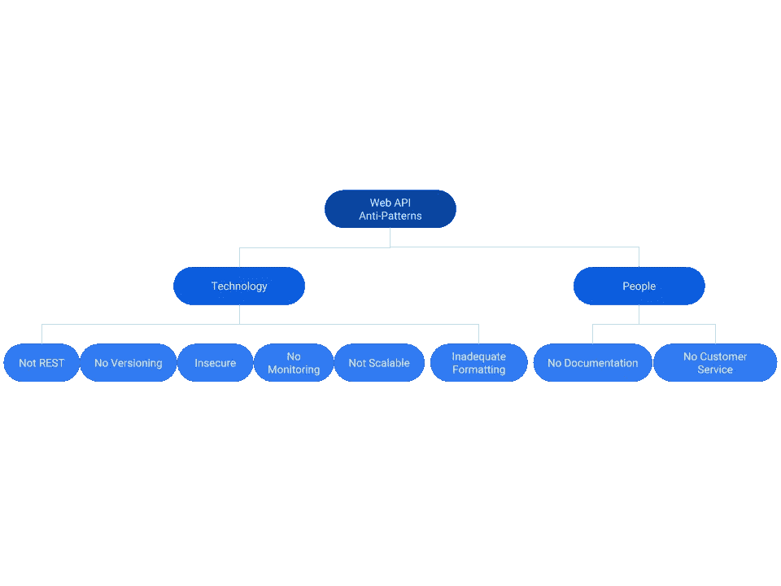

# Web API 的反模式

> 原文：<https://itnext.io/anti-patterns-of-web-apis-33d2a28534f2?source=collection_archive---------0----------------------->

Web API 是运行在 HTTP 服务器上的请求-响应消息服务(例如 IIS、Apache、Nginx)。Web API 在 20 世纪 90 年代开始作为非正式的客户端/服务器 RPC 样式的接口，然后发展到更加结构化的 SOAP 样式的、以 XML 为中心的服务(2000 年代),最近发展到使用 JSON 的 RESTful 服务，这已经成为通过互联网和公司内部网交付企业信息服务的事实上的标准。在过去的十年中，我一直在为多个行业的不同企业设计、开发和交付 Web API，我想分享一些我从其他从业者那里观察和了解到的最重要的反模式、错误和坏习惯，以便您可以避免它们，从而帮助您的组织在市场上交付优秀的软件和竞争优势。好好享受，让我知道你的想法！

1.  我不是一个严格的 RESTafarian，但我承认务实的休息在一些事情上是正确的。

*   **第一件事，第一个**——如果你在顶部公开操作，那么由于操作 X 对象的组合，你会有 API 膨胀，这导致更高的维护成本；相反，遵循以资源为中心的原则，将对象作为一等公民，并提供一些与其父对象相关的子操作。
*   **明白，明白。** — REST 还标准化了调用对象操作的 HTTP 动词和习惯用法；这些约定将简化您所做的设计决策的数量，并且也使客户更容易学习您的 API。使用 GET 获取数据。使用上传/发布来更改数据。使用 DELETE 删除数据。
*   **情况如何？** — 200 好，500 不好。够了吧？不对。不好的输入格式怎么办？未授权用户？找不到对象？超出服务配额限制？如果没有一致的 HTTP 状态代码，您的客户在没有解析响应体的情况下将不会知道成功或失败之间的区别。好好用几个状态码，他们会很感激的。
*   **Mini MIME** —如果既不支持 I/O 的多种 MIME 类型，也不使用标准的头参数，那么它会减少您的 API 受众和成功的机会。支持 JSON 作为 I/O 的必须和最低要求；将 CSV 视为与外部遗留系统进行数据集成的首选，并将 XML 视为可选的 I/O 格式。

**2。没有版本控制**——事情会变，你的 API 也会变。如果您不这样做，那么您的客户至少会讨厌您，并希望当 API 在没有向后兼容性的情况下更新时，可怕的事情会降临到您身上，最糟糕的情况是，考虑改用其他方法。有不同的版本控制方法，从 URI 到请求查询/报头参数；了解权衡并选择一个。就挑一个，坚持下去。顺便说一下，我更喜欢 URI(例如“api/v1/MyResource”)，因为它让客户清楚地知道使用的是什么版本。

**3。没有文档** —无论文档是一个简单的带有操作方法和示例的 wiki(尝试 mkdocs)，一个基于 Swagger 或 RAML 属性的交互式 API 浏览器，还是两者的组合(更好)，您的直接客户都是开发人员，您应该帮助他们学习和使用您的服务。

*   **0-60**:开发者要能尽快获得 0-60 及以上的《Hello World》；包括快速入门教程和快速 1–2–3 注册，以简化这一过程。
*   问&答:确保文档准确、清晰、完整、定期更新并且可搜索。如果你不勾选这个简单的选项，那么你将会一遍又一遍地回答用户同样令人痛苦的问题。

**4。没有安全保障——安全保障是头条新闻。它是存在性的、战略性的，应该是你设计 API 的首要考虑因素之一。你不想成为 IT 架构师、首席技术官或首席执行官，向董事会或记者解释为什么你会被黑客攻击、泄露机密数据或允许对重要数据进行未经授权的更改。**

*   **无认证/授权** —您必须知道谁是 API 客户端，以及允许用户(例如，有时是人，有时是机器)做什么。无论是基于 Windows/AD 的专用内部网的 NTLM，还是公共外部网的 OAuth，都要选择一些短期的东西，并为长期的未来做好计划。
*   **无输入验证** — [OWASP 的顶级漏洞](https://www.owasp.org/index.php/OWASP_Top_Ten_Cheat_Sheet)突出了 SQL/OS 注入、跨站脚本等多个安全漏洞。验证请求时使用安全解析器。
*   **无错误处理** —确保安全地处理错误和异常，不要在堆栈跟踪和状态消息中向外部用户透露系统内部信息。

**5。没有可伸缩性**——如果您没有为可伸缩性进行设计，没有为额外的容量缓冲区进行规划，那么您可能会成为 API 成功的牺牲品。关于这个主题的更多细节可以在关于这个主题的[文章](https://medium.com/@bishr_tabbaa/book-review-scalability-rules-6f7ef5a2052a)中找到。

*   **你好，多莉**:设计你的服务，让它能比实验室里的转基因羊更快地被横向克隆。努力实现无状态，并注意与服务器的密切关系。查看 AKF 尺度立方体，从多维角度了解性能。
*   冗余:避免单点故障，就像一个套在脖子上的绞索。
*   **缓存**:是的，您可能需要将一些长期存在、很少改变、经常使用的对象从持久存储缓存到内存中，但是如果您缓存太多(例如，与用户的粘性会话)而改变太频繁，那么您可能无法在多个节点之间进行水平扩展和负载平衡。尽可能无国籍，但不要再无国籍。
*   **喝酸自担风险**:你真的需要一致性和可串行化吗？还有哪些数据约束可以放宽？

**6。无日志** —监控和记录多个节点上的 API 活动。如果没有良好的日志，很难进行故障排除、规划容量变化以及跟进客户的使用情况。从人和机器可读的基于文本的日志文件开始。使用 UNIX syslog 或文件观察器整合文件以进行服务范围的报告。考虑将日志实时流入专用服务(例如 Azure Application Insights、Amazon Cloud Watch、Splunk、Elasticsearch)。

**7。如果你没有抑制客户的能力，那么你很容易受到拒绝服务攻击，并且不能公平地为大多数其他客户服务。为了同伴。NET 工程师，我推荐 Stefan Prodan 的[**webapi throttle**](https://github.com/stefanprodan/WebApiThrottle)**项目；它提供了按 IP 地址、客户端身份和端点进行节流的能力，可通过策略文档进行配置，可以按网络地址或客户端列出白名单，可以进行定制，并且易于集成到 ASP.NET 解决方案中。AWS 和 Azure 也提供具有类似功能集的世界级 API 网关管理服务。首先进行测量，首先设置保守的限制，在 API wiki 上向客户发布限制，监控使用情况，并根据您的基础设施容量(供应)和客户需求(需求)灵活地管理流量速率限制。****

****8。没有客户服务**——最终都是为了让客户满意。通知用户即将发布的版本。履行 SLA。快速修复错误和实现功能；更快地交付生产。发布过去变更和未来路线图的发行说明。促进在线聊天论坛，在那里你可以帮助他们，他们也可以互相帮助。定期安排与最重要的利益相关者的会议。向您的客户发送调查问卷，询问他们喜欢/不喜欢什么，以及他们希望看到什么发展。答案可能会让你大吃一惊。**

****

**Web API 反模式**

***喜欢文章吗？关注我的* [*中*](https://medium.com/@bishr_tabbaa) *和* [*推特*](https://twitter.com/bishr_tabbaa) *了解更多更新。***

****参考文献****

*   **[微服务的反模式](/anti-patterns-of-microservices-6e802553bd46)**
*   **[InfoQ API 设计错误](https://www.infoq.com/presentations/API-design-mistakes)**
*   **[十大 API 隐患](https://techcrunch.com/2009/11/08/the-top-10-most-common-api-pitfalls/)**
*   **[Web API 的原理和实践](https://medium.com/@bishr_tabbaa/principles-and-practices-of-web-api-bf653e22cd69)**