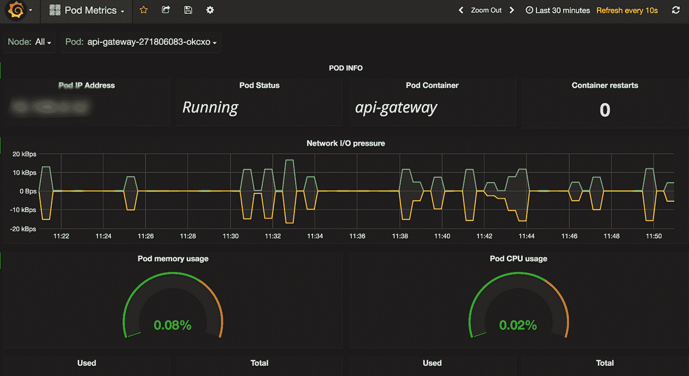
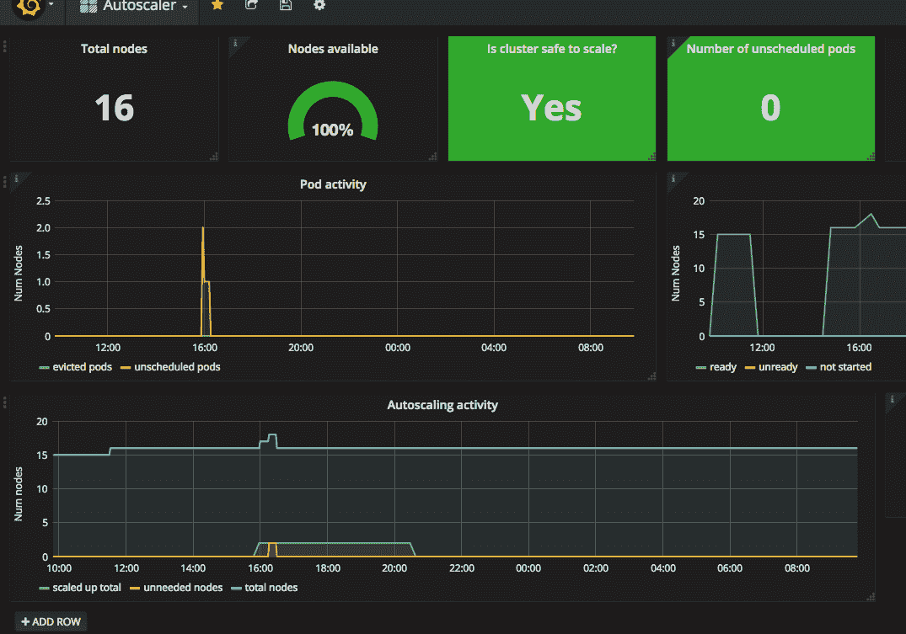
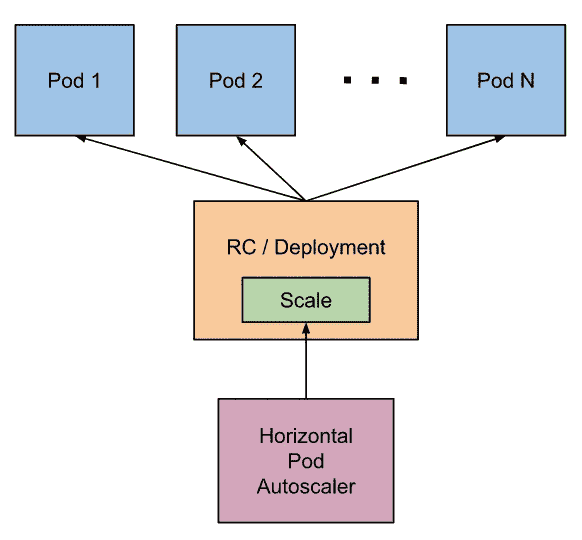

# 库伯内特斯的抗脆性

> 原文：<https://itnext.io/antifragility-in-kubernetes-bcac9ec5baaf?source=collection_archive---------7----------------------->

如何从波动、随机和无序中获益。


[https://unsplash.com/@arthuryeti](https://unsplash.com/@arthuryeti)

许多工程师采取非常乐观的方法，认为他们的服务将完美无缺地工作，他们倾向于从一开始就以最终形状为目标，而不考虑可能导致灾难的潜在变化或不可预测的事件，而不是利用它并使他们的服务更加强大…

问题来了——如何从波动性、随机性和无序中获益？

有很多[的博客文章](http://lmgtfy.com/?q=antifrafile+systems)是关于防脆弱系统的，但是没有多少提到现有的技术。所以让我们把一切都包起来:)

# 抗脆弱剂

抗脆弱这个词是由[纳西姆·尼古拉斯·塔勒布](http://Nassim Nicholas Taleb)在他的书[抗脆弱:从无序中获得的东西](https://www.amazon.com/Antifragile-Things-That-Disorder-Incerto/dp/0812979680)中引入的。

> 有些东西受益于冲击，它们在暴露于波动、[](https://en.wikipedia.org/wiki/Randomness)*、无序、应激源和爱情冒险、[风险](https://en.wikipedia.org/wiki/Risk)和[不确定性](https://en.wikipedia.org/wiki/Uncertainty)时茁壮成长。然而，尽管这种现象无处不在，却没有与脆弱完全相反的词。让我们称之为抗脆弱。抗碎性超出了弹性或坚固性。有弹性的抵抗冲击并保持不变；抗碎性变得更好。*

# *库伯内特斯的抗脆性*

*我们如何衡量我们服务的脆弱性？万一失败会怎么样？Kubernetes 如何提供帮助？*

*这可以归结为抗脆弱性的几个关键概念。*

## *简单*

*复杂的系统很难监控和维护。系统越大，就越难改变。此外，任何意外事件都可能导致副作用或级联故障，这可能很难跟踪和调试。*

*Kubernetes 提供了名为 [Pod](https://kubernetes.io/docs/concepts/workloads/pods/pod/) 的部署单元，它是一组运行在相同节点上的容器，具有共同的生命周期。我们可以有把握地假设一个容器应该负责一件特定的事情(保持简单)。*

```
***apiVersion: v1
kind: Pod
metadata:
  name: web-app
spec:
  containers:
    - name: web
      image: nginx
      ports:
      - name: web
        containerPort: 80
        protocol: TCP
    - name: database
      image: postgres
      ports:
      - name: psql
        containerPort: 5432
        protocol: TCP***
```

*显然，Kubernetes 资源的类型更多，如 [Deployment](https://kubernetes.io/docs/concepts/workloads/controllers/deployment/) 、 [DaemonSet](https://kubernetes.io/docs/concepts/workloads/controllers/daemonset/) 、[statefullset](https://kubernetes.io/docs/concepts/workloads/controllers/statefulset/)等。*

## *可观察性*

*监控和日志记录是理解事物如何工作和执行的关键机制，尤其是在像 Kubernetes 这样的动态和分布式环境中。*

*Kubernetes 上运行的每个容器都应该在 stdout 或 stderr 上记录应用程序输出。它有助于有单独的存储空间，并在我们的集装箱损坏时提供可视性。*

```
*I0221 00:40:02.060314 version: 1.14.8
I0221 00:40:02.133217 Using configuration read from directory: /kube-dns-config with period 10s
I0221 00:40:02.133299 FLAG: --alsologtostderr="false"
I0221 00:40:02.133312 FLAG: --config-dir="/kube-dns-config"
I0221 00:40:02.133320 FLAG: --config-map=""
I0221 00:40:02.133325 FLAG: --config-map-namespace="kube-system"
I0221 00:40:02.133331 FLAG: --config-period="10s"
I0221 00:40:02.133338 FLAG: --dns-bind-address="0.0.0.0"
I0221 00:40:02.133344 FLAG: --dns-port="10053"
I0221 00:40:02.133353 FLAG: --domain="cluster.local."
I0221 00:40:02.133361 FLAG: --federations=""
I0221 00:40:02.133368 FLAG: --healthz-port="8081"
I0221 00:40:02.133373 FLAG: --initial-sync-timeout="1m0s"
I0221 00:40:02.133378 FLAG: --kube-master-url=""
I0221 00:40:02.133385 FLAG: --kubecfg-file=""
I0221 00:40:02.133390 FLAG: --log-backtrace-at=":0"
I0221 00:40:02.133400 FLAG: --log-dir=""
I0221 00:40:02.133406 FLAG: --log-flush-frequency="5s"
I0221 00:40:02.133411 FLAG: --logtostderr="true"
I0221 00:40:02.133416 FLAG: --nameservers=""
I0221 00:40:02.133421 FLAG: --stderrthreshold="2"
I0221 00:40:02.133426 FLAG: --v="2"
I0221 00:40:02.133431 FLAG: --version="false"
I0221 00:40:02.133440 FLAG: --vmodule=""
I0221 00:40:02.133520 Starting SkyDNS server (0.0.0.0:10053)
I0221 00:40:02.133827 Skydns metrics enabled (/metrics:10055)
I0221 00:40:02.133836 Starting endpointsController
I0221 00:40:02.133841 Starting serviceController*
```

*Prometheus 是一个开源系统监控和警报工具包，最初在 [SoundCloud](http://soundcloud.com/) 构建。与 [Grafana](https://grafana.com/) 结合使用，它提供了 Kubernetes 集群运行状况的完整可见性。*

**

*Kubernetes Pod Metricsby [矿石 Olarewaju](https://grafana.com/orgs/orezi)*

## *公差和误差*

> *想想大自然母亲不仅仅是“安全的”它在破坏和取代、选择和重组方面咄咄逼人。考虑到完美的稳健性无法实现，我们需要一种机制，通过这种机制，系统可以利用随机事件、不可预测的冲击、应激源和波动性，而不是遭受这些因素的影响，不断自我再生。*

*同样的原则也适用于 Kubernetes 环境，当某个节点由于某种原因死亡时，所有的容器都被重新分配给其他健康的节点，顺便说一下，平衡资源利用率。*

*就容器而言，有[活性和准备就绪探测器](https://kubernetes.io/docs/tasks/configure-pod-container/configure-liveness-readiness-probes/)。如果应用程序无法取得进展，活跃度负责重新启动。准备就绪是确定集装箱何时准备好开始接受流量。*

```
***apiVersion: v1
kind: Pod
metadata:
  labels:
    test: liveness
  name: liveness-exec
spec:
  containers:
  - name: liveness
    image: k8s.gcr.io/busybox
    args:
    - /bin/sh
    - -c
    - touch /tmp/healthy; sleep 30; rm -rf /tmp/healthy; sleep 600
    livenessProbe:
      exec:
        command:
        - cat
        - /tmp/healthy
      initialDelaySeconds: 5
      periodSeconds: 5
    readinessProbe:
      exec:
        command:
        - cat
        - /tmp/healthy
      initialDelaySeconds: 5
      periodSeconds: 5***
```

*另一个重要的技术是故障注入，有时是混沌工程方法的一部分，让系统进化并在混沌中生存。*

> *混沌工程是一门在分布式系统上进行实验的学科
> ,目的是建立对系统能力的信心
> ,以抵御生产中的动荡条件。*
> 
> *[混沌工程原理](http://principlesofchaos.org/)*

*kube-monkey 是针对 Kubernetes 集群的[网飞混沌猴](https://github.com/Netflix/chaosmonkey)的实现。它随机删除集群中的 Kubernetes pods，鼓励和验证故障恢复服务的开发。*

## *分散和孤立*

*分布式系统类似于活的有机体，如果过度补偿到位，显然可以更好地响应意外事件。结合适当的隔离，[爆炸半径](https://en.wikipedia.org/wiki/Blast_radius)是有限的。*

*Kubernetes 提供了[名称空间](https://kubernetes.io/docs/concepts/overview/working-with-objects/namespaces/)的概念，我们可以将它们视为具有基于基于属性的访问控制( [ABAC](https://kubernetes.io/docs/admin/authorization/abac/) )或更细粒度的基于角色的访问控制( [RBAC](https://kubernetes.io/docs/admin/authorization/rbac/) )的访问控制策略的作用域虚拟集群。*

```
***kind: Role
apiVersion: rbac.authorization.k8s.io/v1
metadata:
  namespace: default
  name: pod-reader
rules:
- apiGroups: [""] *# "" indicates the core API group*
  resources: ["pods"]
  verbs: ["get", "watch", "list"]***
```

*还可以使用[网络策略](https://kubernetes.io/docs/concepts/services-networking/network-policies/)在网络层上限制特定的名称空间，网络策略说明允许哪些组的 pod 相互通信以及与其他网络端点通信。*

```
***apiVersion: networking.k8s.io/v1
kind: NetworkPolicy
metadata:
  name: test-network-policy
  namespace: default
spec:
  podSelector:
    matchLabels:
      role: db
  policyTypes:
  - Ingress
  - Egress
  ingress:
  - from:
    - ipBlock:
        cidr: 172.17.0.0/16
        except:
        - 172.17.1.0/24
    - namespaceSelector:
        matchLabels:
          project: myproject
    - podSelector:
        matchLabels:
          role: frontend
    ports:
    - protocol: TCP
      port: 6379
  egress:
  - to:
    - ipBlock:
        cidr: 10.0.0.0/24
    ports:
    - protocol: TCP
      port: 5978***
```

## *非预测*

*有时在不确定的情况下很难做出决策，例如，我们应该分配多少资源来处理意外的高流量？我们需要多少运行在云中的实例？不幸的是，我们无法预测罕见事件的发生。*

*Kubernetes 的优势之一是能够根据特殊情况(例如使用 [cluster-autoscaler](https://github.com/kubernetes/autoscaler/tree/master/cluster-autoscaler) 调整节点数量，包括删除未充分利用的节点)来调整资源使用情况。*

**

*Kubernetes 集群自动缩放器(通过 Prometheus)由 [bookchair](https://grafana.com/orgs/bookchair)*

*就应用层的自动扩展而言，我们可以使用[水平 Pod 自动缩放器](https://kubernetes.io/docs/tasks/run-application/horizontal-pod-autoscale/)，它可以根据资源利用率或自定义指标自动缩放 Pod 的数量。*

**

*[https://kubernetes . io/docs/tasks/run-application/horizontal-pod-auto scale/](https://kubernetes.io/docs/tasks/run-application/horizontal-pod-autoscale/)*

# *摘要*

*让我们诚实地说:)这是不可能的，但经常和快速的失败可以使我们的系统更能抵抗错误。*

*为了减少脆弱性，您应该不断地强调您的部署过程和运行在 Kubernetes 之上的服务。*

*[](https://twitter.com/antoniaklja) [## Bartek Antoniak (@antoniaklja) |推特

### Bartek Antoniak 的最新推文(@antoniaklja)。软件工程师、开发人员和安全爱好者

twitter.com](https://twitter.com/antoniaklja)*