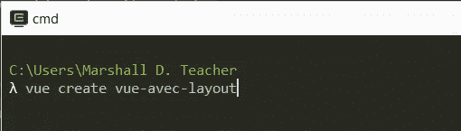
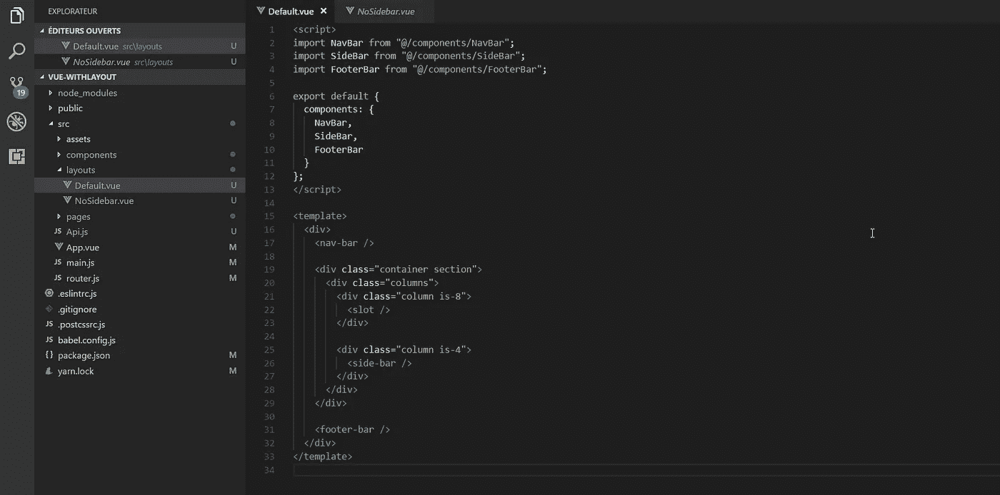
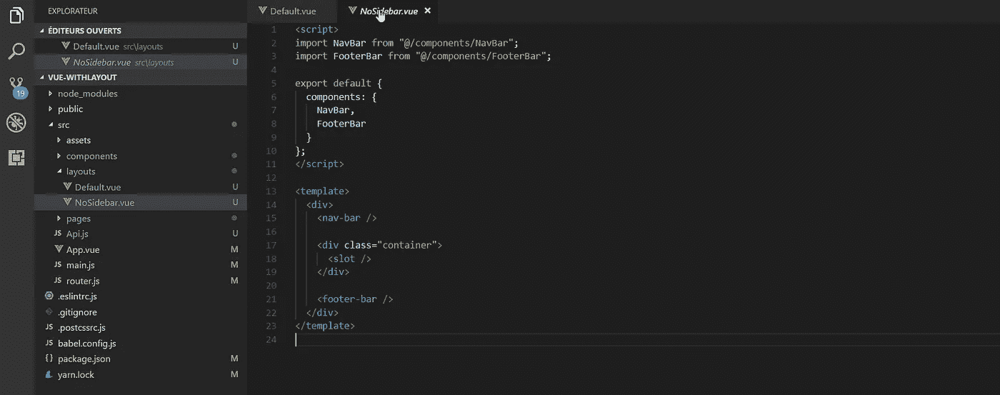
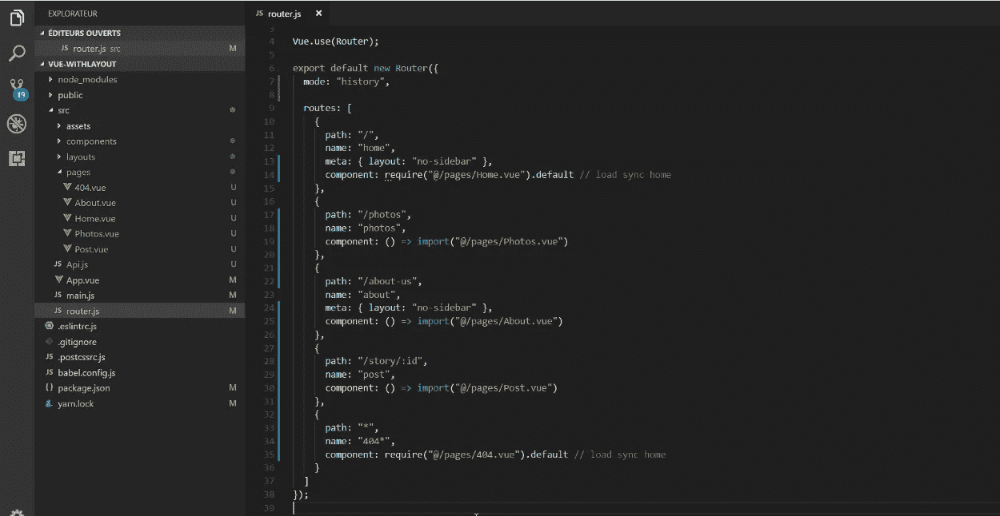
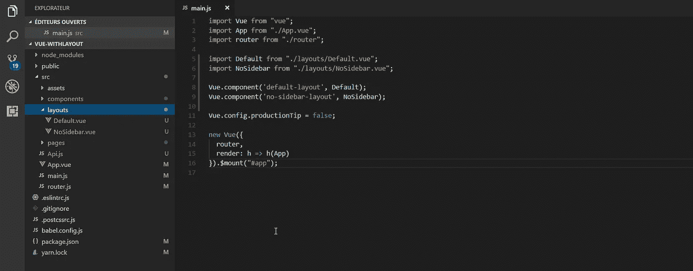
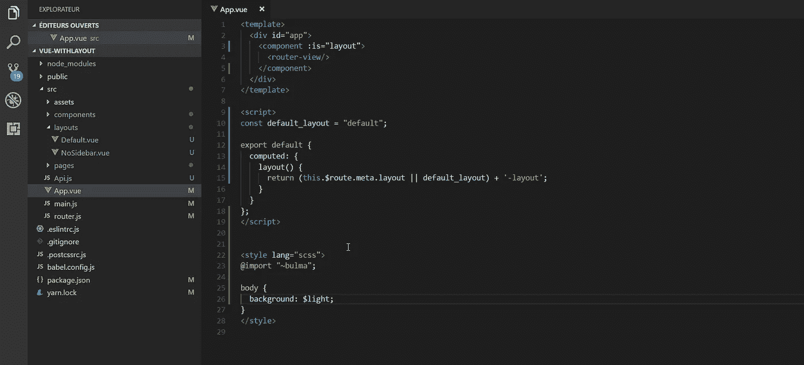

# 无论如何，这里是如何创建一个多布局系统与 Vue 和 Vue 路由器

> 原文：<https://itnext.io/anyway-heres-how-to-create-a-multiple-layout-system-with-vue-and-vue-router-b379baa91a05?source=collection_archive---------0----------------------->

你是否曾经因为内容不同而有过不同的布局？

让我解释一下，假设你创建了一个博客。你希望关于页面的**主页&没有**侧边栏**，但是所有其他页面都有。你明白这个想法吗？**

你会告诉我，这本身并不复杂，只需**创建一个侧边栏组件**并**将其导入到你需要的每个页面组件**中。

好吧，但是总是导入这个侧边栏并写下来还是**很烂，对吧？如果有更简单的方法呢？比如在路由器里注明？**

# 下面是如何使用 route-view 创建一个多重布局系统

首先，为什么用 Vue-router 做？

路由器是**，我们在这里定义我们站点的页面**，那么为什么不指定我们希望每个页面使用哪种布局呢？

让我们从用 vue-cli 3 创建我们的项目**开始。**

让我们首先创建我们的布局。它将是没有逻辑的组件，只有接受一个**槽**的 HTML / CSS，要注入的内容。
(我用的是**布尔玛 CSS** )。

带有侧边栏的默认布局

在一些页面上使用的没有侧边栏的布局

**好吧，酷，我们有我们的布局。让我们将页面添加到路由器中。**

****

**我们将特定文件夹中的页面添加到路由器中**

**如你所见，我为关于页面的**主页&添加了一个**元键**。
在 Vue-router 中，不是**在根节点**创建密钥，而是使用元密钥来设置与每条路由相关的数据。
[**https://router.vuejs.org/guide/advanced/meta.html**](https://router.vuejs.org/guide/advanced/meta.html)****

## **我们现在怎么做？让我们导入全局布局**

**现在我们已经有了**我们的路线、页面和布局**，让我们将它们混合在 **App.vue** 和**中，将布局全局导入 main.js** 。**

****

**使用 **Vue.component( …)** 全局导入布局**

**你注意到了，不是吗？我添加了一个“ **-layout** ”后缀，让名字有两个或更多的单词，也是因为这样更精确。**

**但是！但是！在我们的 **meta** 中我们没有放“ **-layout** ”，我们是怎么做的？**

**这就是魔法出现的地方，首先我们将根据当前的路线动态加载/使用我们的布局。**

**Vue-router 功能强大，让我们可以在每个组件中访问代表当前路线的 **$route** 。我们将检查它上面的**元**来知道加载哪个布局，并且**定义一个默认布局**。**

****

**我们使用“**组件是**”和 **$route** 动态加载/使用我们的布局**

## **台阶**

1.  **我们定义了一个**常量**，它包含了**要加载的默认布局****
2.  **我们基于 **$route** 创建一个**计算属性**，这样当我们改变 URL / route 时，布局**会动态改变****
3.  **当**元布局**包含**未定义**时，我们回退到**默认布局****
4.  **条件的结果是**用什么串接**？"**-布局**"**
5.  **我们使用特殊的组件 **<组件 is="…" >** 允许动态使用组件**，属性 is** 以组件名称为值显示**

## **结论**

**当你到达一个没有带有布局关键字的**元的**路线**时，代码将生成“**默认-布局**”，否则，如果**有一个布局关键字**，它给出关键字的**值—布局**，因此在我们的例子中是“**无侧边栏-布局**”。****

**一旦这个值是在 computed 中计算出来的**，带有**组件**和**道具的模板就是**，剩下的就交给它了。****

****/！\重要**:不要忘记**给出页面显示**感谢:
**<路由器-查看/ >** 路由器用来显示路由。**

**有没有更复杂的情况可以使用这个系统？是的
简单的例子:**

*   **在内容周围有一个全屏广告横幅**
*   **根据用户角色有不同的标题/导航/页脚**
*   **具有 3 个网格设计:流体、2 列和 3 列**

**这就是动态加载一个 **LayoutComp** 有用的地方，你可以为每一个布局创建**一个组件，这个组件拥有视觉复杂度，并且只接受内容(< slot >)作为参数。****

**为了**了解更多关于 vue-router**:
[https://router.vuejs.org/](https://router.vuejs.org/)**

**要**了解<component 是= " "><component>**:
[https://vue js . org/v2/guide/Components . html # Dynamic-Components](https://vuejs.org/v2/guide/components.html#Dynamic-Components)**

**查看**代码运行**:
[https://darkylmnx . github . io/Layout-system-with-vue-and-vue-router/](https://darkylmnx.github.io/Layout-system-with-vue-and-vue-router/)**

**查看 github
[上的**完整源代码 https://github . com/darkylmnx/Layout-system-with-vue-and-vue-router**](https://github.com/darkylmnx/Layout-system-with-vue-and-vue-router)**

**如果你欣赏这个故事，不要犹豫**拍&分享这篇文章**。**

**PS:
如果你**喜欢旅行**或者喜欢**惊艳**山水:[**https://goo.gl/paFUwK**](https://goo.gl/paFUwK)如果你想**发现一些我们之外的说唱**:[**https://goo.gl/4C4suQ**](https://goo.gl/4C4suQ)
如果你更**动漫&**:[**https://goo.gl/GZ2FtJ**](https://goo.gl/GZ2FtJ)**

****PS 2:如果你想学习如何创建高级组件，请查看我的课程**:[https://courses . maisonfutari . com/mastering-vue-components-creating-a-ui-library-from scratch？优惠券=M](https://courses.maisonfutari.com/mastering-vue-components-creating-a-ui-library-from-scratch?coupon=PRESALE) EDIUM**

**有 50%的折扣，因为你来自这个故事。**