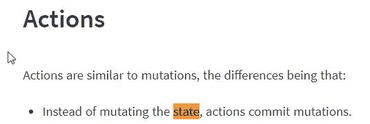
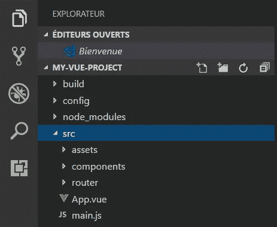
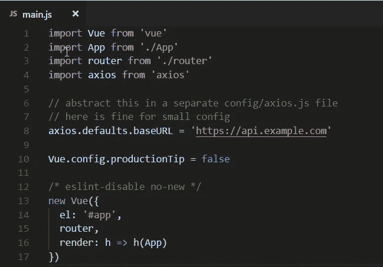
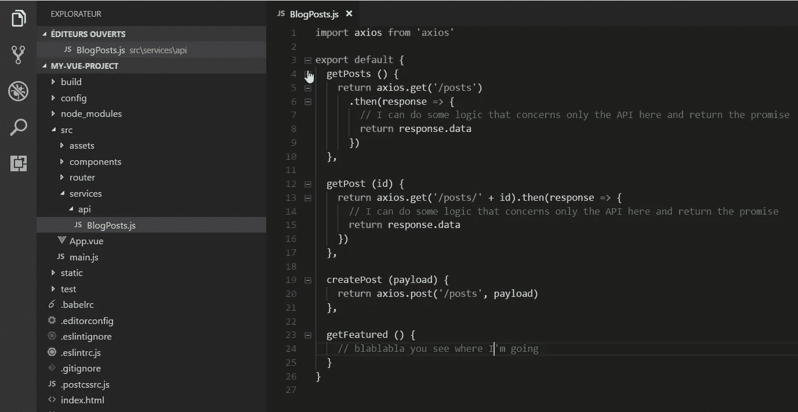
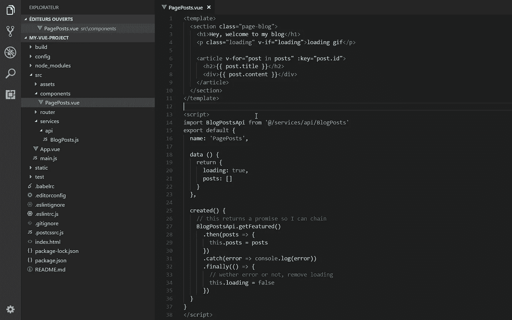
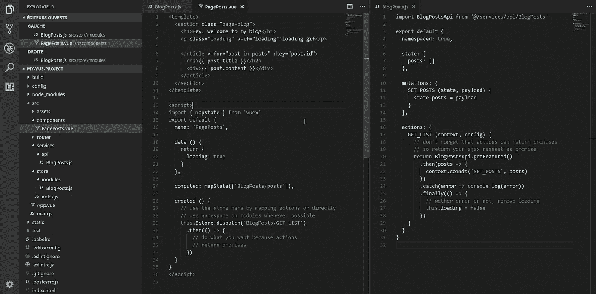

# 不管怎样，下面是如何用 Vue JS 进行 AJAX & API 调用

> 原文：<https://itnext.io/anyway-heres-how-to-do-ajax-api-calls-with-vue-js-e71e57d5cf12?source=collection_archive---------0----------------------->

我想用法语发布这个故事，但是…对不起，我的法国朋友，它会先用英语。

最近，我看到有人问如何用 Vue 处理 AJAX 请求和 T2 API 调用。

起初，我真的不明白为什么人们对此感到困惑，因为这不是一个 Vue 问题，而是一个 JavaScript 问题。

然后……照明！我发现了为什么人们对此如此困惑:
这是因为 Vue 非常灵活，没有任何规则，让你来做决定。

虽然这对于小型项目可能是好的，但是对于中型到大型的项目，您需要知道何时以及如何分离关注点。

## 哪里可以做 API 调用？Mixins？Vuex 动作？组件？

如果你只是想要最后的答案，那就去下一个标题。
如果你想要一个详细的解释来成为一个更好的开发者，让我们看看所有的选项及其优缺点:

*   **Mixins** :你可以把它放在一个共享的 mixin 中，当你需要它的时候导入它
    - **优点**:你只在你需要它的时候加载
    - **CONS** :你必须把它作为一个方法添加，因此，混合了模板使用的方法和与模板无关的 JS 逻辑使用的方法
*   **Vuex 动作**:你可以为每个 AJAX 请求创建一个 Vuex 动作
    - **优点**:它集中在你的组件中可用，可以改变全局状态
    - **CONS** :嗯……你需要加载 Vuex lol。如果您的项目不需要它，那么只为 AJAX 调用加载它就有点大材小用了。尤其是如果你没有在你的行为中做出改变，在我看来这就变成了一个
    反模式

来自 Vuex 的文档

*   **组件**:你可以直接在你的组件
    - **优点**的方法中进行 AJAX 调用:你只需使用你需要的，不会过载
    - **CONS** :你的调用分散在各处，维护起来会变得非常困难。如果两个组件需要相同的 API 调用，您可以创建代码复制

如你所见，**它们都有优点和缺点**那么哪一个是最好的呢？
嗯，一个都没有，或者应该说:**全部**？

这不是 Vue 的问题，是 JavaScript 架构的问题。

你应该问自己的问题是:我的 API 调用与 Vue 相关吗？
答案是:**不，它们和你的 app** 有关。

凡是可以抽象的东西:**抽象出来！**

## 解决方案:创建一个单独的 JS 文件来导入

解决方案实际上很简单。你的 API 调用需要集中化和可重用，所以为什么不使用普通 JS 拥有的东西:一个**类**或**对象文字**。

对于每个 API 资源，创建一个带有对象文字或静态类的 API 文件，或者只导出进行 API 调用的函数。

## 为什么这样更好？

*   如果您在另一个不是 Vue 项目的项目中需要它，那么:它是可重用的！它只是一个 JS 文件，对吗？
*   如果 API 中的路径/ url 发生变化，它是集中的，所以不需要记住它是在哪个动作或哪个组件中被调用的，只需转到您的 API 文件并在那里进行更改:)
*   抽象总是比紧密耦合的逻辑更好

这里有一些屏幕来理解我所说的。

这是全新安装

这是 main.js 文件，我在其中配置 axios，AJAX 库(它可以是任何其他库或 fetch API)

在这里，我创建了一个文件夹“services”和一个子文件夹“api ”,其中有我的 API 文件“Posts ”,它基本上只是一个带有方法的对象文字，我将这些方法导出为我的文件的默认值(es 模块)

现在，这里是如何在你的组件中进行 API 调用，在 Vuex 动作中也是一样的。

我希望这很清楚。API 或 GraphQL 调用不能直接耦合到 Vue。它们是独立的，不依赖于你的视图层，所以你可以抽象它们。

以下是我在大中型 Vue 项目中总结的一些东西:

*   自定义验证程序
*   Api 或其他 AJAX 请求
*   模型(这里的模型不像后端模型，它更像一个数据格式化器，主要用于 API 文件中，在我将数据传递给组件之前格式化数据)
*   效用函数(但是大多数时候我直接将它们创建为 mixins)
*   分析包装器/谷歌 Api 包装器/脸书包装器…
    任何不相关的 Vue 服务，我可以有

记住，那些只是 JS 文件，你可以在组件或者 Vuex 存储或者 Mixins 等等中导入它们。

## 【Vuex 商店示例(编辑)

这是我的存储，其中有一个命名空间模块。不需要在我的组件中导入我的 API 处理程序，因为导入它的是我的存储。不要忘记在行动中回报承诺，这样你以后用的时候就可以链起来

框架和库很好，但是， [JavaScript 设计模式](https://scotch.io/bar-talk/4-javascript-design-patterns-you-should-know)更好。

另一个好处是，你也可以把它导入到 Vue-router navigation guards 或者任何其他你可以挂接到并执行一些 API 调用的库中:)

PS:如果你想学习如何创建高级组件，可以查看我的课程:[https://courses . maison futari . com/mastering-vue-components-creating-a-ui-library-from-scratch？优惠券=M](https://courses.maisonfutari.com/mastering-vue-components-creating-a-ui-library-from-scratch?coupon=PRESALE) EDIUM

**有 50%的折扣，因为你来自这个故事。**