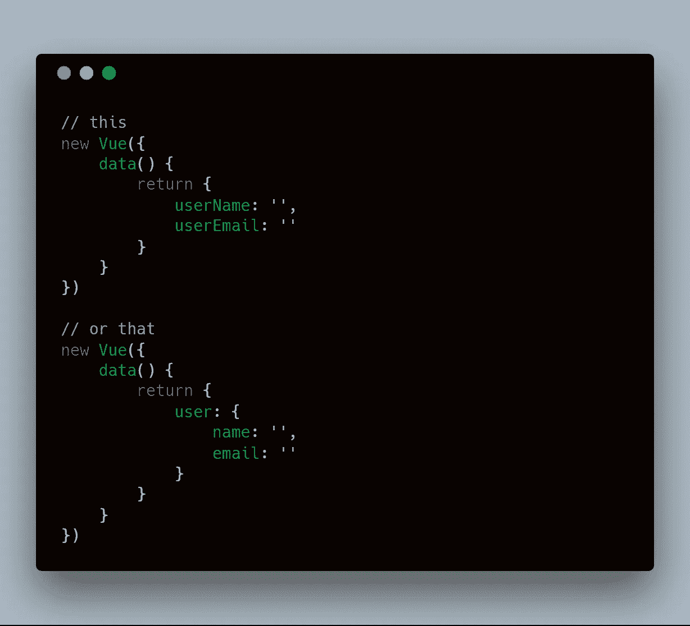
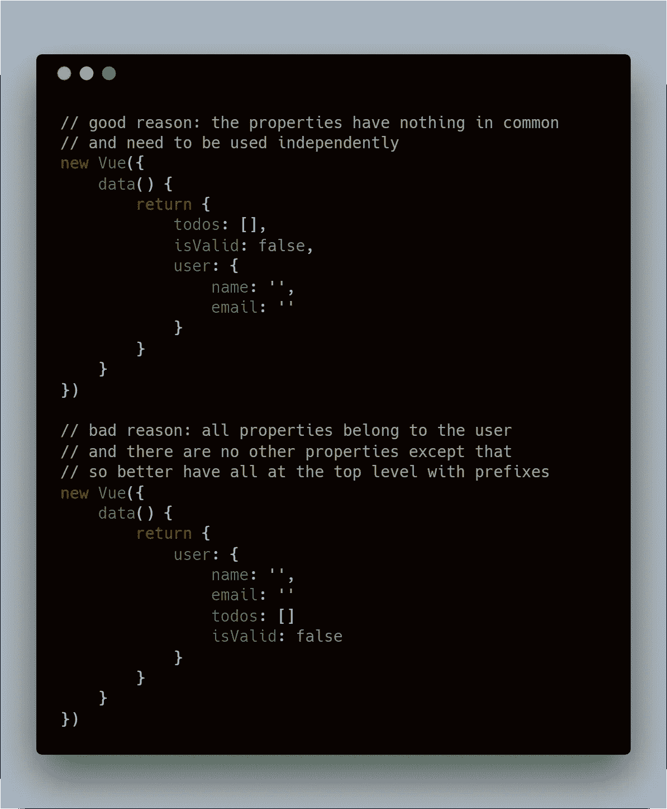

# 不管怎样，我应该嵌套数据还是不应该在 Vue JS 中？

> 原文：<https://itnext.io/anyway-should-i-nest-data-or-should-i-not-in-vue-js-8536c86a612f?source=collection_archive---------0----------------------->

我在 **Vue.js 开发者脸书小组**中看到一个非常有趣的问题，我想把这个问题分解给你，如果你想知道在 Vue 实例数据选项中，嵌套数据和扁平化数据哪个更好的话。

简而言之，问题是:

## 在 Vue 数据中使用模型的最佳实践是什么？嵌套与否？

下面是一个截图，可以更好的理解这个问题。

在成为 Vue 问题之前，这首先是一个 JavaScript 问题。

让我们来分析一下这里发生了什么:

*   当 JavaScript 看到一个**对象文字**时，它创建
    一个对象函数/类的**实例**
*   当您将一个**对象嵌套在另一个对象**中时，就像**创建两个实例**，即使嵌套的对象是父对象的一部分

你知道我要去哪里吗？更多的对象实例附加到一个**变量**或**属性**意味着:更多的对象在内存中被引用。

点击此处了解更多信息:

 [## 内存管理

### 低级语言，如 C，有低级内存管理原语，如 malloc()和 free()。另一方面…

developer.mozilla.org](https://developer.mozilla.org/en-US/docs/Web/JavaScript/Memory_Management#Reference-counting_garbage_collection) 

这个也适用于 Vue，因为 **Vue 是用:JavaScript** 做的。

您必须使用嵌套对象，知道它意味着什么内存使用。

## 让我们看看它是如何直接影响 Vue 的:反应性和观察者

Vue 基于**反应性**。为此，Vue 在 data 中返回的**对象的每个属性和嵌套属性上添加了一个带有 JS setters** 的 **observer。**

嵌套的对象越多，Vue 创建的观察者就越多，性能就越低。更多的观察者 Vue 的更多工作。
**业绩回购的纪尧姆周某 Vue 团队核心成员。**

**这是否意味着我们不应该筑巢？不，不一定。**

## **现在，让我们进入有趣的部分:最佳实践是什么？**

**你看到了嵌套如何影响你的代码，这并不意味着你不应该嵌套对象，这意味着:**嵌套解决正确的问题**。**

**在以下情况下使用嵌套对象:**

*   ****您计划稍后单独使用嵌套对象****
*   ****嵌套对象代表不同于其兄弟对象的东西****

**在下列情况下，尽可能避免嵌套:**

*   **你只是想要更多的可读性**
*   ****你在某处看到的，所以你只是复制了一下****

**记住:更多的嵌套=更多的 Vue 观察者=更低的性能
根据你的应用程序的大小来考虑这个问题。**

**为了可读性，我相信，**山茶案**和**蛇案**绰绰有余。**

## **结论**

**两者都是很好的实践，但是要在正确的原因和用例中使用。**

## ****编辑:2018 年 7 月 24 日****

**人们在评论中似乎把注意力集中在记忆上，但正如我所说:**

> **您必须使用嵌套对象，知道它意味着什么内存使用。**

**我从没说过“不要用嵌套对象，你的内存会炸”——所以如果你只想说这个，就不要费心评论了。**

**如果你喜欢这个，**拍一拍**。
如果你喜欢说唱或者想要一种**发现音乐的新方式**:[https://foreignrap.com](https://foreignrap.com/)
如果你想要一种**发现旅行地点的新方式**:[http://mustsee . earth](http://mustsee.earth/)**

****