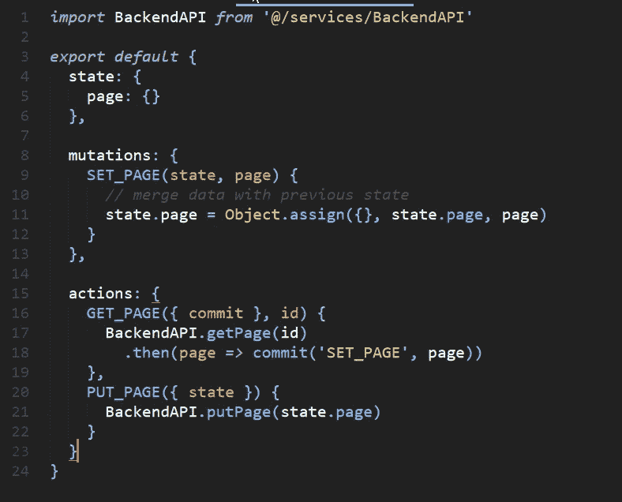
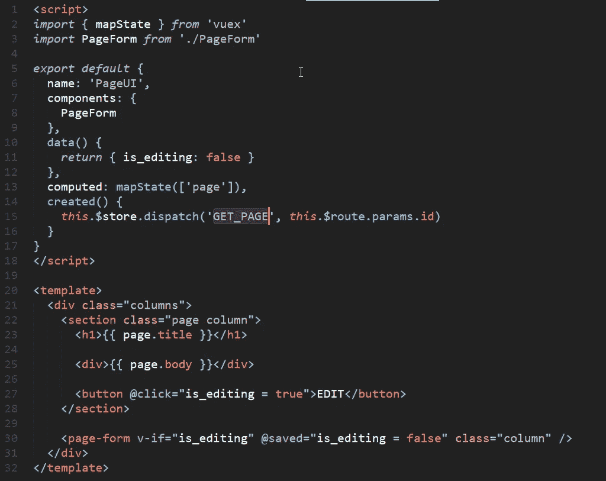
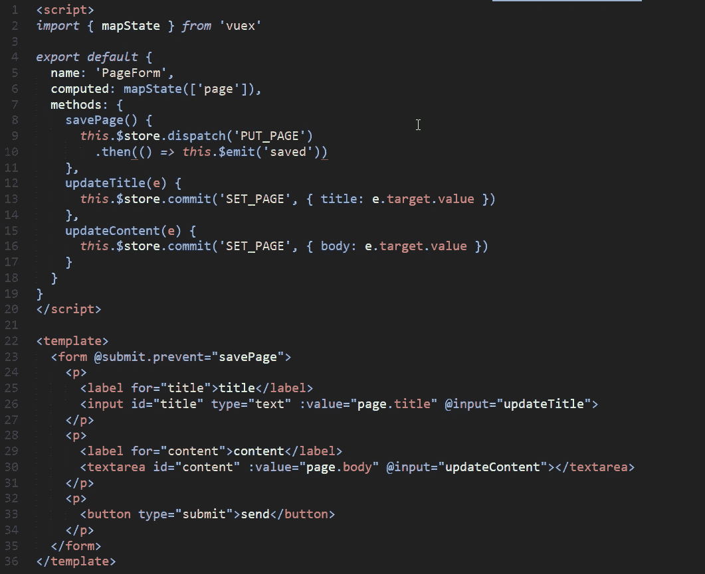
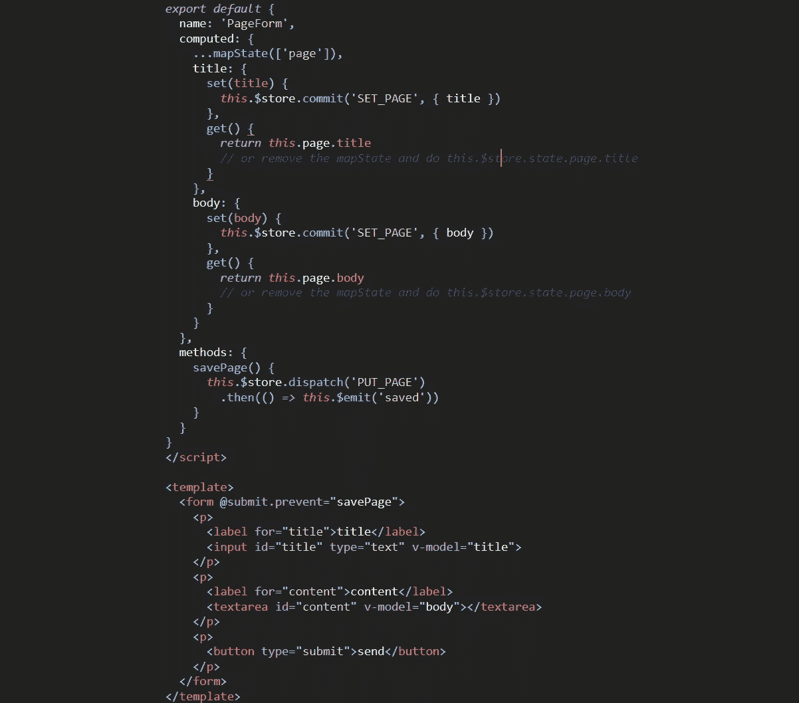

# 反正这就是用 Vuex 使用 v-model 的方法。运行中的计算 setter。

> 原文：<https://itnext.io/anyway-this-is-how-to-use-v-model-with-vuex-computed-setter-in-action-320eb682c976?source=collection_archive---------0----------------------->

这是一个简短的故事，与使用 Vuex 的 Vue 开发人员分享一个技巧，同时展示了一个如何使用计算属性设置器的实际例子。

在学习 Vuex 的时候，你可能没有注意到这一点，但是在你的 Vuex 商店中，将 **v-model** 与**状态绑定是可能的。**

让我们从当前的解决方案**开始，将用户输入绑定到 Vuex 状态**。

这是我们的应用程序示例:
-用户在**一个页面**上，他可以看到**一个标题**和**一些内容**
-用户可以**编辑页面**和**直接在 UI**
上看到结果-**用户完成**他的编辑后，他可以**保存**
-当**服务器**

Vuex 商店

PageUI 组件。加载页面并在商店上设置页面

用于实时编辑 UI 的 PageForm 组件。

*   在商店里我们有一个**页面状态**
*   在 PageUI 组件中，我们**加载它的数据**，这些数据将在存储中设置
*   **在页面表单组件中，我们通过**输入事件**及其**处理程序**将**每个表单元素**链接到状态**

**在行动中检查这段代码:【https://jsfiddle.net/darkylmnx/k2o8ejp1**

****如你所见，我们**一直没有使用 v-model** ，我们的逻辑有点**散**。****

****一个商店状态必须是**不可变的**，所以不能只放 **v-model="page.title"** 。****

## ****那我们怎么做呢？电脑设定者来救援了！****

****我们可以使用计算设置器。计算的设置器将采用输入给定的的**值，然后**将一个变异**提交给存储。计算出的 getter 将**从存储器**返回该值。******

**让我们看看代码是如何变化的。**

****

**使用 v-model 计算 getters 和 setters 的 PageForm 组件**

**我们有一个 **v-model** ，不再有**输入事件+值属性绑定**。**

**事件处理程序被移除并被**计算设置器和获取器**所取代。我们的逻辑现在更**集权**。**

**这里的行动代码:[**https://jsfiddle.net/darkylmnx/k2o8ejp1/1**](https://jsfiddle.net/darkylmnx/k2o8ejp1/1/)**

****就是这样！你现在是一个计算机设置专家。我希望这是有用的。****

****PS:说真的，更新后如果你刷新，更新就会消失，因为我用的是不保存数据的**开放 API**[jsonplaceholder.typicode.com](https://jsonplaceholder.typicode.com/posts/1)。****

****PS 2:这里 可以阅读更多关于 computed [*和 Vuex*](https://vuejs.org/v2/guide/computed.html#Computed-Setter) *[*中的 v-model 这里*](https://vuex.vuejs.org/en/forms.html#two-way-computed-property) 。*****

******PS 3:如果你想学习如何创建高级组件，请查看我的课程**:[https://courses . maisonfutari . com/mastering-vue-components-creating-a-ui-library-from scratch？优惠券=M](https://courses.maisonfutari.com/mastering-vue-components-creating-a-ui-library-from-scratch?coupon=PRESALE) EDIUM****

****有 50%的折扣，因为你来自这个故事。****