# Apache 德鲁伊:概述，在 Kubernetes 中运行并使用 Prometheus 进行监控

> 原文：<https://itnext.io/apache-druid-overview-running-in-kubernetes-and-monitoring-with-prometheus-4c8d29f6c8b9?source=collection_archive---------5----------------------->


Apache Druid 是一个[列数据库](https://highload.today/kolonochnye-bazy-dannykh/)，专注于处理大量数据，结合了时间序列数据库、数据仓库和搜索引擎的特性和优点。

一般的任务是在 Kubernetes 中设置对 Druid 集群的监控，所以首先，我们将了解它一般是什么以及它是如何工作的，然后我们启动 Druid 来配置它的监控。

为了在 Kubernetes 中运行德鲁伊本身，我们使用[德鲁伊-操作员](https://github.com/druid-io/druid-operator)，收集指标— [德鲁伊-导出器](https://github.com/opstree/druid-exporter)，监控— Kubernetes 普罗米修斯堆栈，我们将在 Minikube 中运行所有这些。

*   [阿帕奇德鲁伊概述](https://rtfm.co.ua/en/apache-druid-overview-running-in-kubernetes-and-monitoring-with-prometheus/#Apache_Druid_overview)
*   [德鲁伊架构和组件](https://rtfm.co.ua/en/apache-druid-overview-running-in-kubernetes-and-monitoring-with-prometheus/#Druid_Architecture_and_Components)
*   [三服务器配置—主服务器、查询服务器、数据服务器](https://rtfm.co.ua/en/apache-druid-overview-running-in-kubernetes-and-monitoring-with-prometheus/#Three-server_configuration_-_Master_Query_Data)
*   [德鲁伊数据流](https://rtfm.co.ua/en/apache-druid-overview-running-in-kubernetes-and-monitoring-with-prometheus/#Druid_data_flow)
*   [数据摄取](https://rtfm.co.ua/en/apache-druid-overview-running-in-kubernetes-and-monitoring-with-prometheus/#Data_ingest)
*   [数据查询](https://rtfm.co.ua/en/apache-druid-overview-running-in-kubernetes-and-monitoring-with-prometheus/#Data_query)
*   [在 Kubernetes 中运行德鲁伊](https://rtfm.co.ua/en/apache-druid-overview-running-in-kubernetes-and-monitoring-with-prometheus/#Running_Druid_in_Kubernetes)
*   [德鲁伊操作员安装](https://rtfm.co.ua/en/apache-druid-overview-running-in-kubernetes-and-monitoring-with-prometheus/#Druid_Operator_install)
*   [旋转德鲁伊集群](https://rtfm.co.ua/en/apache-druid-overview-running-in-kubernetes-and-monitoring-with-prometheus/#Spin_Up_Druid_Cluster)
*   [安装 Kube Prometheus Stack](https://rtfm.co.ua/en/apache-druid-overview-running-in-kubernetes-and-monitoring-with-prometheus/#Installing_Kube_Prometheus_Stack)
*   [格拉夫纳仪表盘](https://rtfm.co.ua/en/apache-druid-overview-running-in-kubernetes-and-monitoring-with-prometheus/#Grafana_dashboard)
*   [经营德鲁伊出口](https://rtfm.co.ua/en/apache-druid-overview-running-in-kubernetes-and-monitoring-with-prometheus/#Running_Druid_Exporter)
*   [普罗米修斯服务监视器](https://rtfm.co.ua/en/apache-druid-overview-running-in-kubernetes-and-monitoring-with-prometheus/#Prometheus_ServiceMonitor)
*   [阿帕奇德鲁伊监控](https://rtfm.co.ua/en/apache-druid-overview-running-in-kubernetes-and-monitoring-with-prometheus/#Apache_Druid_Monitoring)
*   [德鲁伊指标发射器](https://rtfm.co.ua/en/apache-druid-overview-running-in-kubernetes-and-monitoring-with-prometheus/#Druid_Metrics_Emitters)
*   [德鲁伊监视器](https://rtfm.co.ua/en/apache-druid-overview-running-in-kubernetes-and-monitoring-with-prometheus/#Druid_Monitors)
*   [相关链接](https://rtfm.co.ua/en/apache-druid-overview-running-in-kubernetes-and-monitoring-with-prometheus/#Related_links)

# 阿帕奇德鲁伊概述

对我个人来说，Druid 的主要特点是，该系统最初是为在 AWS 和 Kubernetes 等云中使用而开发的，因此它具有出色的伸缩性、数据存储和在某个服务崩溃时的恢复能力。

还有，阿帕奇德鲁伊是:

*   **柱状数据存储格式**:只加载必要的表进行处理，显著提高了查询处理的速度。此外，为了快速扫描和数据聚合，Druid 根据其数据类型优化列存储。
*   **可扩展的分布式系统** : Druid 集群可以位于数十甚至数百个单独的服务器上
*   数据并行处理:德鲁伊可以在独立的实例上并行处理每个请求
*   **自我修复和自我平衡**:您可以随时向集群添加或删除新节点，而集群本身会执行平衡请求并在它们之间进行切换，而不会出现任何停机。此外，Druid 允许您在不停机的情况下执行版本升级。
*   实际上，**云原生和容错架构** : Druid 最初被设计用于分布式系统。在收到新数据后，他会立即将它们复制到他的深层存储中，这可以是亚马逊 S3、HDFS 等数据存储服务，也可以是网络文件系统，即使所有德鲁伊服务器都崩溃了，也可以让你恢复数据。在只有一部分德鲁伊服务器崩溃的情况下——内置的数据复制将允许您继续执行查询(我已经很想杀死他的节点并观察德鲁伊的反应了——但不是这次)
*   **用于快速搜索的索引**:德鲁伊使用压缩位图索引，允许你快速搜索多列
*   **基于时间的划分**:默认情况下，德鲁伊按时间划分数据，允许跨其他字段创建额外的段。因此，当执行有时间间隔的查询时，将只使用必要的数据段

## Druid 架构和组件

总体架构:


或者像这样:

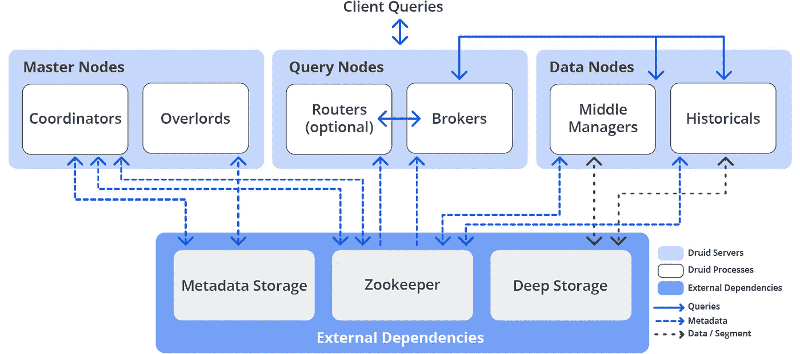

参见[流程和服务器](https://druid.apache.org/docs/latest/design/processes.html)。

## 三服务器配置—主服务器、查询服务器、数据服务器

Druid 有几个用于处理数据的内部服务，这些服务可以分为三种类型的服务器— *主服务器、查询服务器和数据服务器*，参见[主机托管的利弊](https://druid.apache.org/docs/0.23.0/design/processes.html#pros-and-cons-of-colocation)。

[**主服务器**](https://druid.apache.org/docs/0.23.0/design/processes.html#master-server) —管理新数据的添加和可用性(摄取/索引)—负责启动新任务以添加新数据并协调数据可用性:

*   **协调器**:负责将数据段放置在有历史进程的特定节点上
*   **霸王**:负责向中层管理人员下达添加传入数据的任务，并负责协调已创建的细分市场向深层存储的转移

[**查询服务器**](https://druid.apache.org/docs/0.23.0/design/processes.html#query-server) —客户请求管理

*   **代理**:接收来自客户端的请求，确定哪个历史或中间管理器进程/节点包含必要的段，并根据初始客户端请求，形成子查询(sub-query)并将其发送给这些进程中的每一个，之后，它接收来自它们的响应，形成来自它们的带有客户端数据的一般响应，并将其发送给他。
    与此同时，Historicals 响应引用已经存储在深层存储中的数据段的子查询，而中层管理器响应引用最近接收的仍在内存中且未发送到深层存储的数据的查询
*   **路由器**:一个可选的服务，它提供了一个通用的 API 来与代理、领主和协调者一起工作，尽管你可以直接使用它们。此外，Router 提供了 Druid 控制台——WebUI 来处理集群，我们稍后会看到

[**数据服务器**](https://druid.apache.org/docs/0.23.0/design/processes.html#data-server) —管理向集群添加新数据，并为客户端存储数据:

*   **Historical**:Druid 的“主要工作人员”，他们负责存储和查询“历史”数据，即那些已经在深层存储中的数据，从那里将数据段下载到运行历史进程的主机的本地磁盘，并基于这些数据为客户端生成响应
*   **中层管理人员**:负责向集群添加新数据——他们从外部源读取数据，并从中创建新的数据段，然后将这些数据段加载到深层存储中
*   [](https://druid.apache.org/docs/0.23.0/design/peons.html)**:多个任务可以负责向一个集群添加数据。为了记录和隔离资源，中层管理人员创建 Peons，Peons 是独立的 JVM 进程，负责执行中层管理人员的特定任务。始终在产生 Peon 进程的中间管理器进程运行的主机上运行。**
*   ****索引器**:中间管理器和 Peon 的替代方案——索引器不是为来自中间管理器的每个任务创建单独的 JVM，而是在其 JVM 的单独线程中执行它们。
    作为中层管理人员和员工的简单替代方案开发，目前是[试验功能](https://druid.apache.org/docs/0.23.0/development/experimental.html)，但将来会取代中层管理人员和员工**

**除了内部流程，德鲁伊还使用外部服务来工作——深度存储**、**元数据存储**和**动物园管理员**:****

*   **[深度存储](https://druid.apache.org/docs/latest/dependencies/deep-storage.html):用于存储所有添加到系统中的数据，是一个分布式存储，可供每个 Druid 服务器使用。可以是[亚马逊 S3](https://aws.amazon.com/s3/) 、 [HDFS](https://hadoop.apache.org/docs/r1.2.1/hdfs_design.html) ，也可以是 [NFS](https://en.wikipedia.org/wiki/Network_File_System)**
*   **[元数据存储](https://druid.apache.org/docs/latest/dependencies/metadata-storage.html):用于存储段使用信息、当前任务等内部元数据。这种存储的角色可以是经典的 SUDB，如 PostgreSQL 或 MySQL**
*   **[ZooKeeper](https://druid.apache.org/docs/latest/dependencies/zookeeper.html) :用于服务发现和服务协调(在 Kubernetes 中，您可以使用`[druid-kubernetes-extensions](https://druid.apache.org/docs/latest/development/extensions-core/kubernetes.html)`来代替，我们也将尝试它，但另一个时间)**

## **德鲁伊数据流**

**让我们看看如何添加数据(数据摄取)和回答客户端(数据查询，查询回答)。**

## **数据接收**

**添加数据可以分为两个阶段:首先，中间管理器实例运行索引任务，这些任务创建数据段并将它们发送到深层存储。**

**在第二种情况下，历史实例从深层存储中下载数据段，以便在对客户查询进行回复时使用。**

**第一阶段是从外部来源获取数据，索引和创建数据段，并将它们上传到深层存储:**

****

**同时，在创建数据段的过程中，已经可以对它们执行查询。**

**在第二阶段，协调器轮询元数据存储以搜索新的数据段。一旦协调器进程找到它们，它就选择历史实例，该实例必须从深层存储中下载该段，以便它可用于处理请求:**

****

**协调器轮询元数据存储中的新数据段。一旦找到它们，协调器就选择历史实例，该实例应该从深层存储中下载片段。当段被加载时——历史记录准备使用它来处理请求**

## **数据查询**

**客户端直接或通过路由器向代理发送请求。**

****

**当收到这样的请求时，代理确定哪些进程正在为所需的数据段提供服务。**

**如果数据既需要来自深层存储(一些旧的)的数据段，也需要来自中间管理器(我们现在从流中获得)的数据段，那么代理形成并向历史管理器和中间管理器发送单独的子请求，其中每个管理器将执行自己的部分，并将数据返回给代理。代理将它们聚合起来，并向客户端返回最终结果。**

**接下来，让我们尝试部署这整个东西并用小树枝戳它，然后从上面添加监控。**

# **在 Kubernetes 经营德鲁伊**

**运行 [Minikube](https://rtfm.co.ua/kubernetes-zapusk-minikube-na-arch-linux/) ，添加内存和 CPU 安静地运行所有 pod，这里我们分配 24 个 RAM 和 8 个内核——Java 在那里，让它吃:**

```
$ minikube start — memory 12000 — cpus 8
😄 minikube v1.26.1 on Arch “rolling”
✨ Automatically selected the virtualbox driver
👍 Starting control plane node minikube in cluster minikube
🔥 Creating virtualbox VM (CPUs=8, Memory=12000MB, Disk=20000MB) …
🐳 Preparing Kubernetes v1.24.3 on Docker 20.10.17 …
▪ Generating certificates and keys …
▪ Booting up control plane …
▪ Configuring RBAC rules …
🔎 Verifying Kubernetes components…
▪ Using image gcr.io/k8s-minikube/storage-provisioner:v5
🌟 Enabled addons: storage-provisioner, default-storageclass
🏄 Done! kubectl is now configured to use “minikube” cluster and “default” namespace by default
```

**检查:**

```
$ minikube status
minikube
type: Control Plane
host: Running
kubelet: Running
apiserver: Running
kubeconfig: Configured
```

**和节点:**

```
$ kubectl get node
NAME STATUS ROLES AGE VERSION
minikube Ready control-plane 41s v1.24.3
```

**让我们继续安装 Apache Druid 操作符。**

## **德鲁伊操作员安装**

**为操作符创建一个名称空间:**

```
$ kubectl create namespace druid-operator
namespace/druid-operator created
```

**将运算符设置为此命名空间:**

```
$ git clone [https://github.com/druid-io/druid-operator.git](https://github.com/druid-io/druid-operator.git)
$ cd druid-operator/
$ helm -n druid-operator install cluster-druid-operator ./chart
```

**检查盒:**

```
$ kubectl -n druid-operator get pod
NAME READY STATUS RESTARTS AGE
cluster-druid-operator-9c8c44f78–8svhc 1/1 Running 0 49s
```

**继续创建集群。**

## **旋转德鲁伊集群**

**创建名称空间:**

```
$ kubectl create ns druid
namespace/druid created
```

**安装 Zookeeper:**

```
$ kubectl -n druid apply -f examples/tiny-cluster-zk.yaml
service/tiny-cluster-zk created
statefulset.apps/tiny-cluster-zk created
```

**要创建一个测试集群，使用示例中的配置— `[examples/tiny-cluster.yaml](https://github.com/druid-io/druid-operator/blob/master/examples/tiny-cluster.yaml)`。**

**创建集群:**

```
$ kubectl -n druid apply -f examples/tiny-cluster.yaml
druid.druid.apache.org/tiny-cluster created
```

**检查资源:**

```
$ kubectl -n druid get allNAME READY STATUS RESTARTS AGE
pod/druid-tiny-cluster-brokers-0 0/1 ContainerCreating 0 21s
pod/druid-tiny-cluster-coordinators-0 0/1 ContainerCreating 0 21s
pod/druid-tiny-cluster-historicals-0 0/1 ContainerCreating 0 21s
pod/druid-tiny-cluster-routers-0 0/1 ContainerCreating 0 21s
pod/tiny-cluster-zk-0 1/1 Running 0 40sNAME TYPE CLUSTER-IP EXTERNAL-IP PORT(S) AGE
service/druid-tiny-cluster-brokers ClusterIP None <none> 8088/TCP 21s
service/druid-tiny-cluster-coordinators ClusterIP None <none> 8088/TCP 21s
service/druid-tiny-cluster-historicals ClusterIP None <none> 8088/TCP 21s
service/druid-tiny-cluster-routers ClusterIP None <none> 8088/TCP 21s
service/tiny-cluster-zk ClusterIP None <none> 2181/TCP,2888/TCP,3888/TCP 40sNAME READY AGE
statefulset.apps/druid-tiny-cluster-brokers 0/1 21s
statefulset.apps/druid-tiny-cluster-coordinators 0/1 21s
statefulset.apps/druid-tiny-cluster-historicals 0/1 21s
statefulset.apps/druid-tiny-cluster-routers 0/1 21s
statefulset.apps/tiny-cluster-zk 1/1 40s
```

**等待 pod 切换到运行状态(大约需要 5 分钟)，并将端口转发到 Druid 路由器:**

```
$ kubectl port-forward svc/druid-tiny-cluster-routers 8888:8088 -n druid
Forwarding from 127.0.0.1:8888 -> 8088
Forwarding from [::1]:8888 -> 8088
```

**打开德鲁伊控制台—[*http://localhost:8888*:](http://localhost:8888:)**

**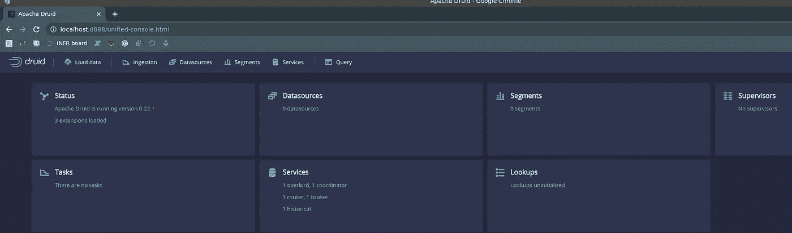**

**你可以看看德鲁伊的服务——我们会看到与我们在 Kubernetes pods 中看到的相同的服务:**

**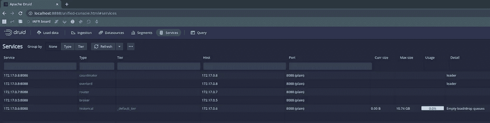**

**[**这里**](https://www.youtube.com/watch?v=bPtT08_R1bU) 是一个很好的短视频，有加载测试数据的例子——为了兴趣，可以走一走。**

**让我们继续安装普罗米修斯。**

# **安装 Kube Prometheus 堆栈**

**创建名称空间:**

```
$ kubectl create ns monitoring
namespace/monitoring created
```

**安装 KPS:**

```
$ helm -n monitoring install kube-prometheus-stack prometheus-community/kube-prometheus-stack
NAME: kube-prometheus-stack
LAST DEPLOYED: Tue Sep 13 15:24:22 2022
NAMESPACE: monitoring
STATUS: deployed
…
```

**检查舱:**

```
$ kubectl -n monitoring get po
NAME READY STATUS RESTARTS AGE
alertmanager-kube-prometheus-stack-alertmanager-0 0/2 ContainerCreating 0 22s
kube-prometheus-stack-grafana-595f8cff67-zrvxv 3/3 Running 0 42s
kube-prometheus-stack-kube-state-metrics-66dd655687-nkxpb 1/1 Running 0 42s
kube-prometheus-stack-operator-7bc9959dd6-d52gh 1/1 Running 0 42s
kube-prometheus-stack-prometheus-node-exporter-rvgxw 1/1 Running 0 42s
prometheus-kube-prometheus-stack-prometheus-0 0/2 Init:0/1 0 22s
```

**等待几分钟，直到每个人都开始运行，并打开普罗米修斯:**

```
$ kubectl -n monitoring port-forward svc/kube-prometheus-stack-prometheus 9090:9090
Forwarding from 127.0.0.1:9090 -> 9090
Forwarding from [::1]:9090 -> 9090
```

**开放 Grafana 的访问:**

```
$ kubectl -n monitoring port-forward svc/kube-prometheus-stack-grafana 8080:80
Forwarding from 127.0.0.1:8080 -> 3000
Forwarding from [::1]:8080 -> 3000
```

## **Grafana 仪表板**

**要从 Grafana 获取密码，请找到它的秘密:**

```
$ kubectl -n monitoring get secret | grep graf
kube-prometheus-stack-grafana Opaque 3 102s
```

**获取其值:**

```
$ kubectl -n monitoring get secret kube-prometheus-stack-grafana -o jsonpath=”{.data.admin-password}” | base64 — decode ; echo
prom-operator
```

**对于 Grafana，有一个现成的[社区дашборда](https://grafana.com/grafana/dashboards/12155-druid-druid-overview/) ，我们现在可以添加它，但以后我们会创建自己的社区。**

**在浏览器中打开 localhost:8080，登录并进入*仪表盘>导入*:**

**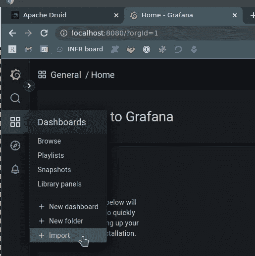**

**设置 ID *12155* ，装载:**

**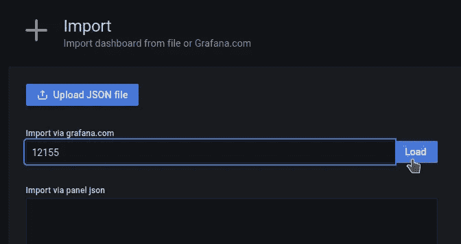**

**选择*普罗米修斯*作为数据源:**

**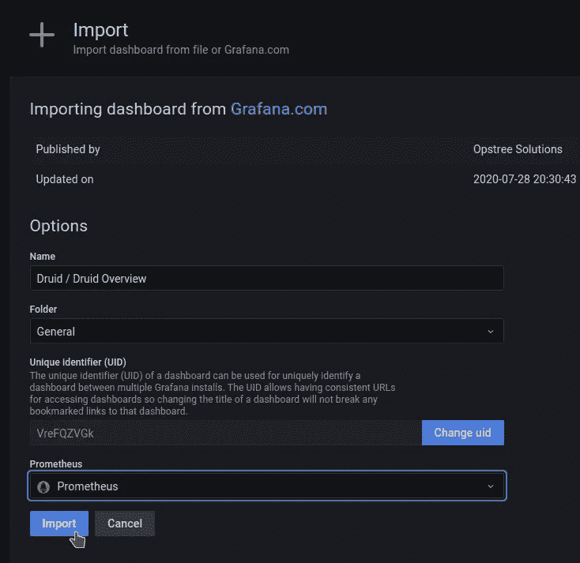**

**我们得到了这样一个板，但是至今没有任何数据:**

**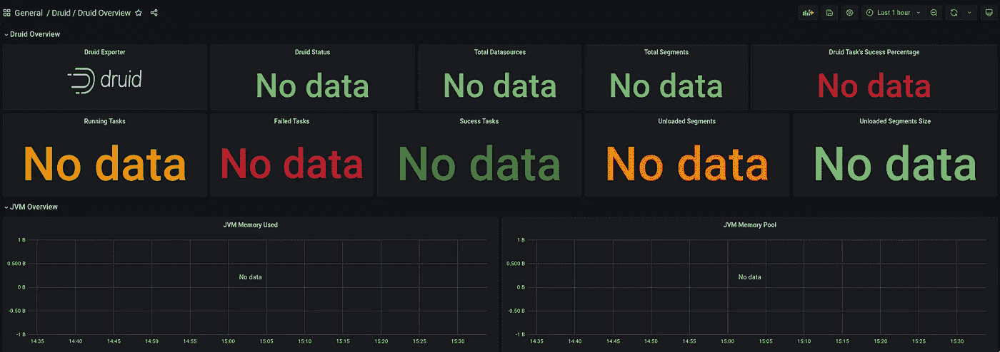**

## **运行德鲁伊导出器**

**克隆存储库:**

```
$ cd ../
$ git clone [https://github.com/opstree/druid-exporter.git](https://github.com/opstree/druid-exporter.git)
$ cd druid-exporter/
```

**检查 Druid 路由器的 Kubernetes 服务—我们需要它的全名来配置导出器:**

```
$ kubectl -n druid get svc
NAME TYPE CLUSTER-IP EXTERNAL-IP PORT(S) AGE
…
druid-tiny-cluster-routers ClusterIP None <none> 8088/TCP 4m3s
…
```

**在名称空间 *monitoring* 中安装导出器，在`druidURL`参数中，我们指定我们刚才看到的 Druid 集群的路由器服务的 URL、它的端口，然后我们启用 Kubernetes ServiceMonitor 的创建以及 Prometheus ( *monitoring* )为我们工作的名称空间:**

```
$ helm -n monitoring install druid-exporter ./helm/ --set druidURL="http://druid-tiny-cluster-routers.druid.svc.cluster.local:8088" --set druidExporterPort="8080" --set logLevel="debug" --set logFormat=”text” --set serviceMonitor.enabled=true -set serviceMonitor.namespace="monitoring"
NAME: druid-exporter
LAST DEPLOYED: Tue Sep 13 15:28:25 2022
NAMESPACE: monitoring
STATUS: deployed
…
```

**开放对出口商服务的访问:**

```
$ kubectl -n monitoring port-forward svc/druid-exporter-prometheus-druid-exporter 8989:8080
Forwarding from 127.0.0.1:8989 -> 8080
Forwarding from [::1]:8989 -> 8080
```

**检查指标:**

```
$ curl -s localhost:8989/metrics | grep -v ‘#’ | grep druid_
druid_completed_tasks 0
druid_health_status{druid=”health”} 1
druid_pending_tasks 0
druid_running_tasks 0
druid_waiting_tasks 0
```

**好的——已经有了，尽管还不够。让我们将数据收集添加到 Prometheus 中，然后我们将添加更多的指标。**

## **普罗米修斯服务监视器**

**检查 Prometheus 服务发现—我们所有的服务监视器都应该在这里:**

**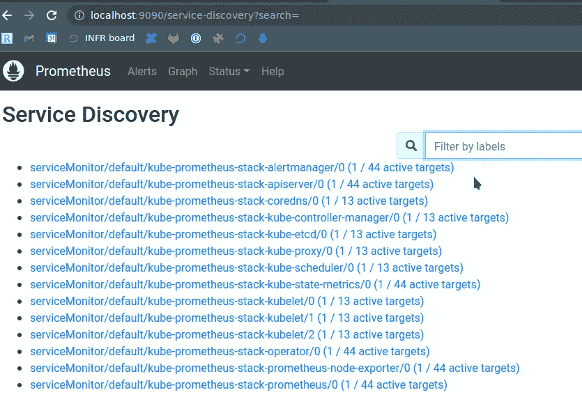**

**检查是否在 Kubernetes 中创建了 Druid ServiceMonitor:**

```
$ kubectl -n monitoring get servicemonitors
NAME AGE
druid-exporter-prometheus-druid-exporter 87s
…
```

**检查普罗米修斯资源—它的`serviceMonitorSelector`:**

```
$ kubectl -n monitoring get prometheus -o yaml | yq .items[].spec.serviceMonitorSelector.matchLabels
{
“release”: “kube-prometheus-stack”
}
```

**编辑 Druid 服务监视器:**

```
$ kubectl -n monitoring edit servicemonitor druid-exporter-prometheus-druid-exporter
```

**添加标签`release: kube-prometheus-stack`，以便 Prometheus 开始从此 ServiceMonitor 收集指标:**

**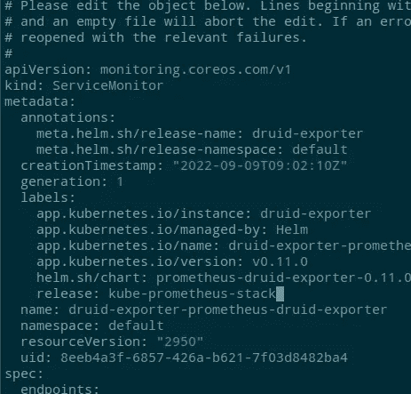**

**稍等一两分钟，再次检查监视器:**

**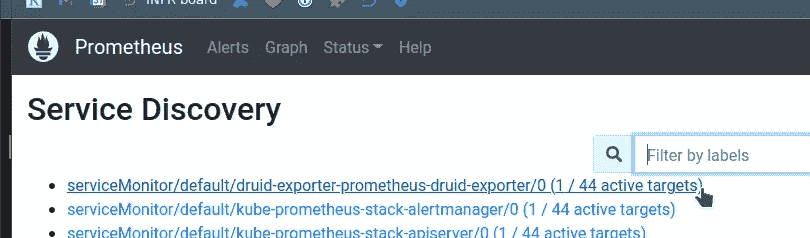**

**检查指标:**

**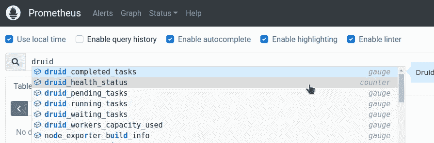**

**好的，现在我们有了德鲁伊集群，我们有了收集指标的普罗米修斯，它仍然需要配置这些相同的指标。**

# **阿帕奇德鲁伊监控**

**德鲁伊的监视设置包括*发射器*和*监视器*:发射器从德鲁伊“推出”指标，监视器决定哪些指标可用。同时，对于某些指标，需要包括额外的扩展。**

**См:**

*   **[指标](https://druid.apache.org/docs/latest/operations/metrics.html)**
*   **[指标发射器](https://druid.apache.org/docs/latest/configuration/index.html#metrics-emitters)**
*   **[指标监视器](https://druid.apache.org/docs/latest/configuration/index.html#metrics-monitors)**
*   **[扩展](https://druid.apache.org/docs/latest/development/extensions.html#core-extensions)**

**所有服务都有共同的指标，例如`query/time`，而您自己的，例如，有一个名为`sqlQuery/time`的代理指标，这些额外的指标可以通过其`runtime.properties`为特定服务启用。**

## **德鲁伊度量发射器**

**要启用指标发射—编辑`examples/tiny-cluster.yaml`，并向`common.runtime.properties`添加以下内容:**

```
druid.emitter=http
druid.emitter.logging.logLevel=debug
druid.emitter.http.recipientBaseUrl=http://druid-exporter-prometheus-druid-exporter.monitoring.svc.cluster.local:8080/druid
```

**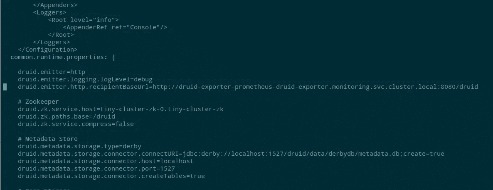**

**保存，更新集群:**

```
$ kubectl -n druid apply -f examples/tiny-cluster.yaml
druid.druid.apache.org/tiny-cluster configured
```

**等待一两分钟，让 pod 重新启动并开始收集指标，在导出器中检查指标:**

```
$ curl -s localhost:8989/metrics | grep -v ‘#’ | grep druid_ | head
druid_completed_tasks 0
druid_emitted_metrics{datasource=””,host=”druid-tiny-cluster-brokers-0:8088",metric_name=”avatica-remote-JsonHandler-Handler/Serialization”,service=”druid-broker”} 0
druid_emitted_metrics{datasource=””,host=”druid-tiny-cluster-brokers-0:8088",metric_name=”avatica-remote-ProtobufHandler-Handler/Serialization”,service=”druid-broker”} 0
druid_emitted_metrics{datasource=””,host=”druid-tiny-cluster-brokers-0:8088",metric_name=”avatica-server-AvaticaJsonHandler-Handler/RequestTimings”,service=”druid-broker”} 0
druid_emitted_metrics{datasource=””,host=”druid-tiny-cluster-brokers-0:8088",metric_name=”avatica-server-AvaticaProtobufHandler-Handler/RequestTimings”,service=”druid-broker”} 0
druid_emitted_metrics{datasource=””,host=”druid-tiny-cluster-brokers-0:8088",metric_name=”jetty-numOpenConnections”,service=”druid-broker”} 1
druid_emitted_metrics{datasource=””,host=”druid-tiny-cluster-coordinators-0:8088",metric_name=”compact-task-count”,service=”druid-coordinator”} 0
druid_emitted_metrics{datasource=””,host=”druid-tiny-cluster-coordinators-0:8088",metric_name=”compactTask-availableSlot-count”,service=”druid-coordinator”} 0
druid_emitted_metrics{datasource=””,host=”druid-tiny-cluster-coordinators-0:8088",metric_name=”compactTask-maxSlot-count”,service=”druid-coordinator”} 0
druid_emitted_metrics{datasource=””,host=”druid-tiny-cluster-coordinators-0:8088",metric_name=”coordinator-global-time”,service=”druid-coordinator”} 2
```

**得到了新的`druid_emitted_metrics`——不错。**

**在标签`exported_service`中，我们可以看到一个德鲁伊的服务，在`metric_name`中，我们可以看到确切的指标。**

**与普罗米修斯一起切克:**

**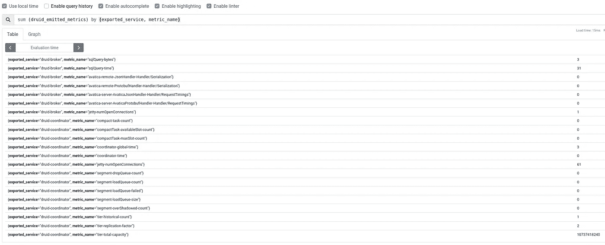**

**完美！**

**但是我想要更多的度量——“*需要更多的度量，大人！*”**

## **德鲁伊监视器**

**例如，我想知道每个进程/服务的 CPU 消耗。**

**为了能够看到所有系统指标(没有 Prometheus 节点导出器)，包括`[org.apache.druid.java.util.metrics.SysMonitor](https://druid.apache.org/docs/latest/operations/metrics.html#sys)`，对于来自 JVM 的数据，添加`[org.apache.druid.java.util.metrics.JvmMonitor](https://druid.apache.org/docs/latest/operations/metrics.html#jvm)`。**

**在同一`examples/tiny-cluster.yaml`模块`common.runtime.properties`中添加以下内容:**

```
...
druid.monitoring.monitors=["org.apache.druid.java.util.metrics.SysMonitor", "org.apache.druid.java.util.metrics.JvmMonitor"]
...
```

**保存、更新集群，等待 pod 重新启动，几分钟后检查指标:**

**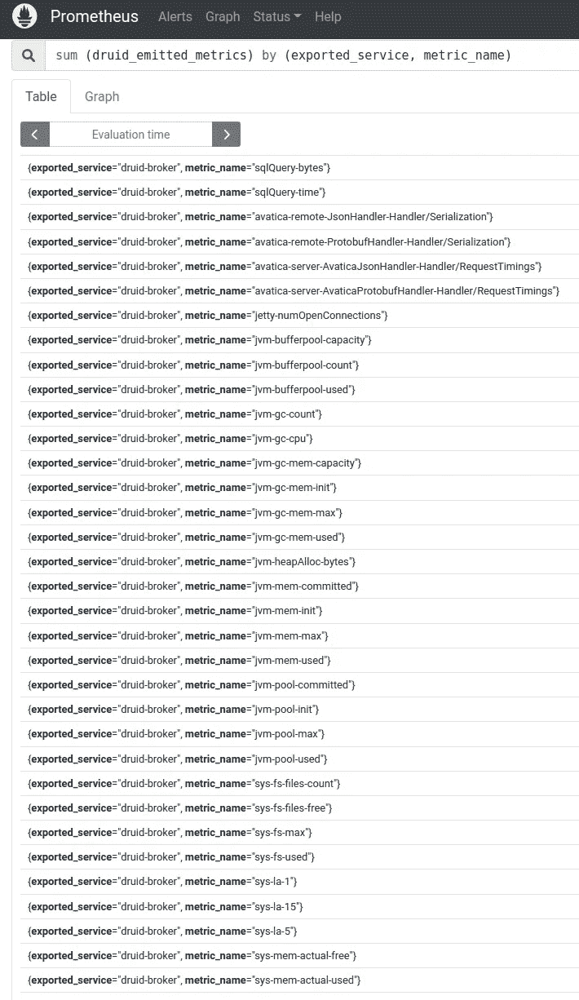**

**格拉法纳的仪表板:**

**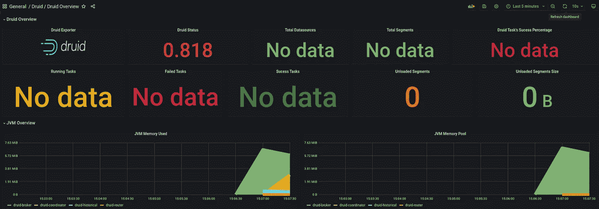**

**好吧，我们做到了。**

**在运行/失败的任务中，我们仍然没有数据，因为我们没有运行任何东西。如果您从已经提到的[视频](https://www.youtube.com/watch?v=bPtT08_R1bU)中加载测试数据，那么这些指标将会出现。**

**实际上还剩下很多:**

*   **将 PostgreSQL 添加为元数据存储**
*   **配置从中收集的指标**
*   **没有管理员的测试工作(`[druid-kubernetes-extensions](https://druid.apache.org/docs/latest/development/extensions-core/kubernetes.html)`)**
*   **测试[普罗米修斯发射器](https://druid.apache.org/docs/latest/development/extensions-contrib/prometheus.html)**
*   **尝试索引器而不是中间管理器**
*   **配置日志集合(在哪里？还没想出来，但最有可能是 Promtail && Loki)**
*   **嗯，实际上——为格拉夫纳组装一个普通的仪表板**

**已经有了监控，就有可能进行一些负载测试和集群性能调优，但这都在接下来的部分中。**

# **相关链接**

*   **[网飞如何利用德鲁伊的实时洞察力来确保高质量的体验](https://netflixtechblog.com/how-netflix-uses-druid-for-real-time-insights-to-ensure-a-high-quality-experience-19e1e8568d06)**
*   **[Apache Druid(第 1 部分):一个可伸缩的时间序列 OLAP 数据库系统](https://anskarl.github.io/post/2019/druid-part-1/)**
*   **[德鲁伊的数据摄取—概述](https://blog.knoldus.com/data-ingestion-in-druid-overview/#indexing-and-handoff)**
*   **[了解德鲁伊建筑](https://dev.to/rusrushal13/learning-about-the-druid-architecture-184c)**
*   **[德鲁伊建筑&概念](https://imply.io/druid-architecture-concepts/)**
*   **[使用 Apache Druid 的事件驱动数据](https://www.baeldung.com/apache-druid-event-driven-data)**
*   **[Apache Druid:在 Kubernetes 上设置、监控和自动缩放](https://medium.com/@aeli/apache-druid-setup-monitoring-and-auto-scaling-on-kubernetes-91739e350fac)**
*   **[阿帕奇德鲁伊:大规模互动分析](https://www.lohika.com/apache-druid-interactive-analytics-at-scale)**
*   **[阿帕奇德鲁伊(孵化)配置参考](https://apache.googlesource.com/druid/+/refs/heads/0.14.0-incubating/docs/content/configuration/index.md#common-configurations)**
*   **[在 Kubernetes 中运行 Apache 德鲁伊](https://chenriang.me/running-apache-druid-in-kubernetes.html)**
*   **[在 30 分钟之内在 Kubernetes 上建立阿帕奇德鲁伊](https://www.rilldata.com/blog/setting-up-apache-druid-on-kubernetes-part-one)**
*   **[在 Kubernetes 中运行 Apache 德鲁伊](https://chenriang.me/running-apache-druid-in-kubernetes.html)**

***最初发布于* [*RTFM: Linux，DevOps，和系统管理*](https://rtfm.co.ua/en/apache-druid-overview-running-in-kubernetes-and-monitoring-with-prometheus/) *。***