# 蔚蓝中的阿帕奇卡夫卡

> 原文：<https://itnext.io/apache-kafka-in-azure-6985ccdce89f?source=collection_archive---------1----------------------->

Apache Kafka 已经在不同的垂直行业和行业中获得了广泛的采用，并且确实已经成为数据流、构建实时大数据管道甚至与流行的微服务异步通信的事实上的选择。

在本文中，我们比较并快速浏览了在 Azure 中运行 Kafka 集群的各种选项——请记住，这是我基于个人经验的个人观点，并不反映我的雇主微软的观点。

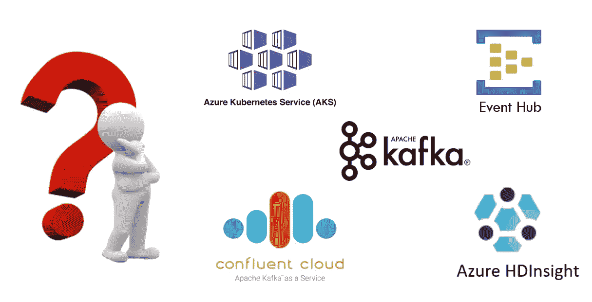

卡夫卡——在云中？

TL；DR——对于没有耐心的人，请查看下表，获取简明摘要

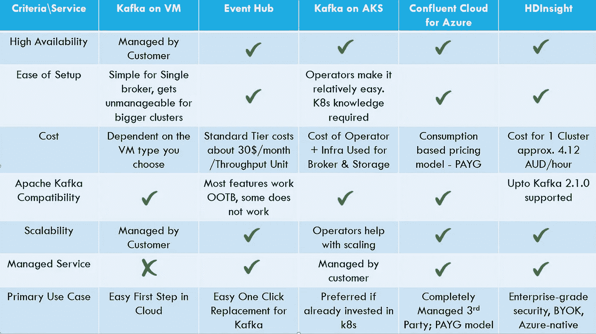

快速脏对比！

然而，本文的重点是讨论和比较在 Azure 中运行 Kafka 的最相关和最新的方法:

1.  活动中心
2.  使用运算符的 Kubernetes (AKS)上的卡夫卡
3.  蔚蓝色的融合云
4.  卡夫卡论 HDInsight

它们中的每一个都以自己的方式提供了一个全面的解决方案&在某些条件下是合适的。本文的目的是提供指导，帮助您为工作负载选择正确的方式。

# 活动中心

这可能是迁移到托管 Kafka 集群的最简单和最容易的方法，因为您可以使用一些限制:

1.  压缩:虽然 Kafka 的事件中心目前不支持压缩 OOTB，但你可以解决这个问题
2.  **缺乏对 Kafka 流、HTTP Kafka API 支持和主题 ACL 的支持**，尽管它与 Azure AD 很好地集成了身份验证&授权，并提供了访问 EH 的不同方式；通过[共享访问签名(SAS)](https://docs.microsoft.com/en-us/azure/event-hubs/authenticate-shared-access-signature) 或通过[管理身份](https://docs.microsoft.com/en-us/azure/event-hubs/authenticate-managed-identity)。
3.  **主题**的分区数量一旦部署就无法更改。所以一定要精心策划。(**更新**:在专用层中，允许向上扩展— [您可以动态地向事件中心主题添加分区](https://docs.microsoft.com/en-us/azure/event-hubs/dynamically-add-partitions))

还有一些我非常喜欢活动中心的地方:

*   作为一项托管服务，您可以选择根据需求**自动扩展**集群。EH 与吞吐量单位一起工作。单个吞吐量单元允许 1 MB/s 的入流量和两倍的出流量。它允许您从小规模开始，并根据您的需求进行扩展。
*   能够创建具有 99.99% SLA 的活动中心的**专用单租户部署**，以满足最苛刻的流媒体需求。
*   **事件中心捕获**:允许您将 EH 中的数据自动捕获到 blob 存储帐户或 ADLS Gen2，使您能够专注于数据处理而不是数据捕获。

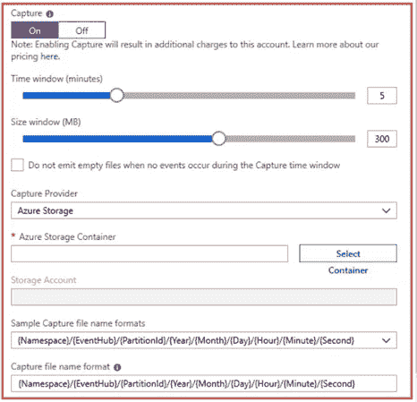

事件中心捕捉设置

*   **BYOK** : EH 支持客户管理的密钥来加密静态数据。你可以使用 Azure Key Vault 来存储&管理你的密钥&审计你的使用情况。
*   Swift **与事件网格**的集成:事件网格是一个智能路由系统，使您能够构建高度健壮的事件驱动系统。详情见本 [GitHub repo](https://github.com/Azure/azure-event-hubs/tree/master/samples/e2e/EventHubsCaptureEventGridDemo) 。

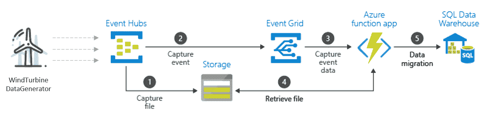

活动中心和活动网格集成

## 有活动中心的 Spring Boot

为了证明从 Kafka 迁移到 EventHub 是多么容易，我在这里创建了一个非常基本的 [Spring Boot 应用程序](https://github.com/agrajm/spring-boot-kafka),只需更改配置文件`application.yaml`,它就可以与 Kafka 本地或 Event Hub 对话

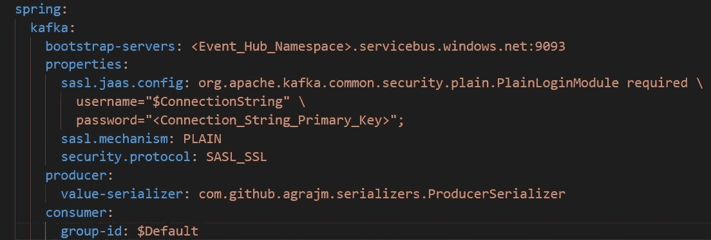

一些需要考虑的事项:

1.  用您的 EventHub 名称空间替换`<Event_Hub_Namespace>`
2.  在事件中心用共享访问策略替换`<Connection_String_Primary_key`——只选择需要的访问。默认情况下，定义了一个根 SAS 策略，它拥有比您希望给予您的应用程序更多的访问权限。相反，定义一个适当范围的 SAS 策略，并复制其连接字符串主键，以代替 JAAS 配置的密码。
3.  连接到 EventHubs 时，您必须使用`$ConnectionString`作为用户名。
4.  默认情况下，它会创建一个名为`$Default`的消费组，我们在这里已经使用过了，但是您可以随意创建更多的消费组。
5.  确保选择标准或高级层，因为基本层中的事件中心不支持 Kafka 协议

# 卡夫卡论库伯内特使用算子

如果您已经投资了 Kubernetes 来管理您的基础设施或编排您的微服务，并且如果这些工作负载需要与 Kafka 对话，那么这可能是您的最佳选择。我之前在博客上写过如何使用 Strimzi 运算符在 AKS 上运行 [Kafka。正如他们所说，细节决定成败，但是如果你真的选择 Kubernetes 来运行你的 Kafka 工作负载，确保你使用一个运营商来帮助你。因为有很多，从免费的&开源](https://medium.com/swlh/running-kafka-on-azure-kubernetes-service-d8d6882ade8) [Strimzi Operator](https://strimzi.io/quickstarts/) 到像 [Confluent Operator](https://docs.confluent.io/current/installation/operator/index.html) 这样的许可运营商，它们允许你在 Kubernetes 上部署和管理作为云原生的有状态容器应用的 Confluent Platform。

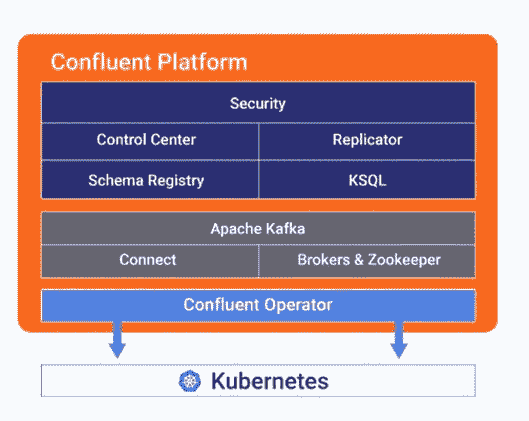

## 为什么要使用运算符？

因为这些运营商提供各种级别的配置来实现默认安全的 Kafka 安装，所以使用生产级功能(如机架感知)来跨可用性区域传播代理，并使用 Kubernetes 污点和容差在专用节点上运行 Kafka。根据您的需要，您可以使用 NodePort、负载平衡器和 Ingress 在 Kubernetes 外部公开 Kafka，使用 TLS 可以轻松保护这些组件。

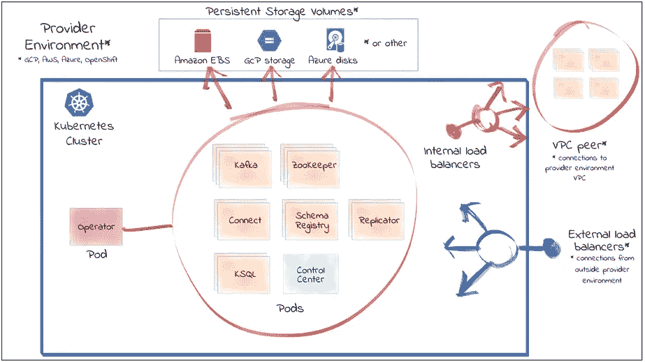

礼貌:汇合操作员

汇合操作符可能是最全面的，支持整个汇合平台(Kafka Connect，KSQL，Schema Registry，Replicator 等)。)上 Kubernetes。Strimzi 是另一个需要小心的。它有一个非常令人印象深刻的全面的文档和一个非常活跃的 Github repo。Strimzi 由 Red Hat 支持，也有一个以 Red Hat AMQ Streams 形式出现的付费版本。但是，如果您愿意为 Kafka 集群付费，为什么不考虑像融合云这样的完全托管解决方案呢？这是我们在下一节要探讨的内容。

# 蔚蓝色的融合云

融合云现在集成在 Azure Marketplace 中，让您可以自由地构建新的集群，而无需使用信用卡单独注册融合，也就是说，您可以使用 Azure 信用来消费融合云提供的任何服务。此外，在融合云中发生的任何消费都会反映在您的 Azure 消费中。

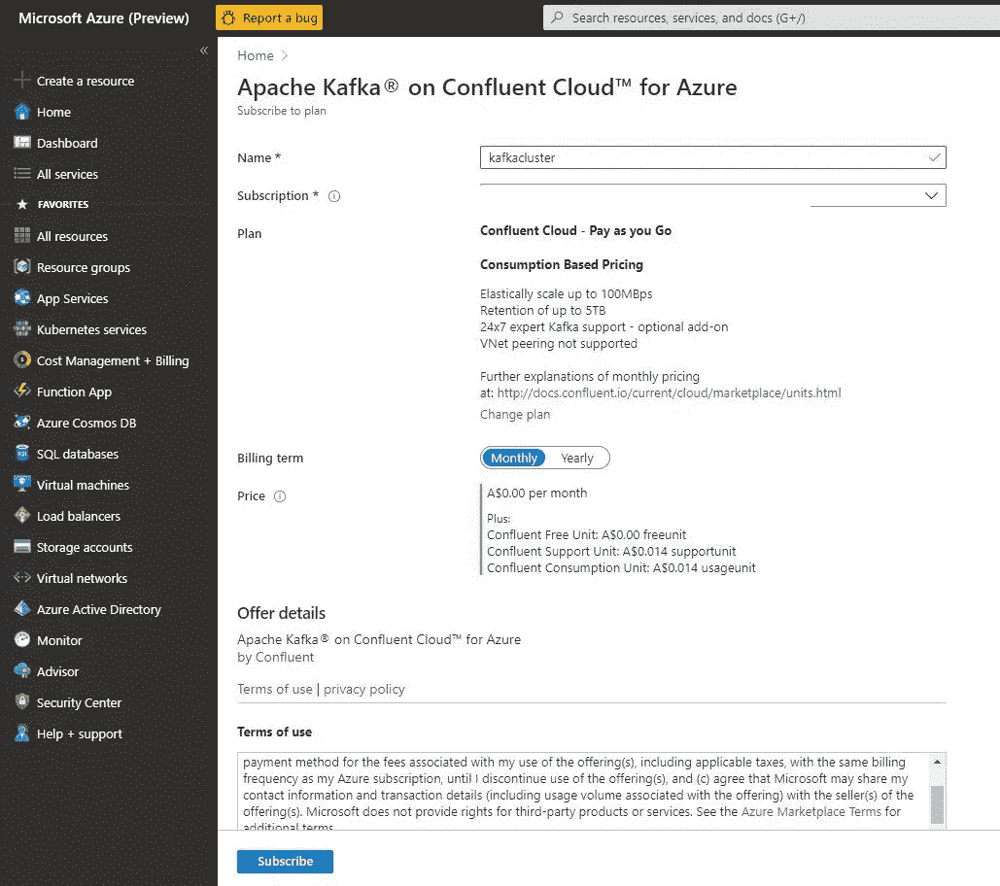

使用 Azure Marketplace 创建融合订阅

你确实需要注册一个新账户，并管理不同的用户名和密码，但这是你唯一需要做的额外事情。[融合云快速入门](https://docs.confluent.io/current/quickstart/cloud-quickstart/index.html)确实是进入该平台的一个不错的快速入门——安装`ccloud` cli 并快速创建 Kafka 集群、主题、API-key 等。

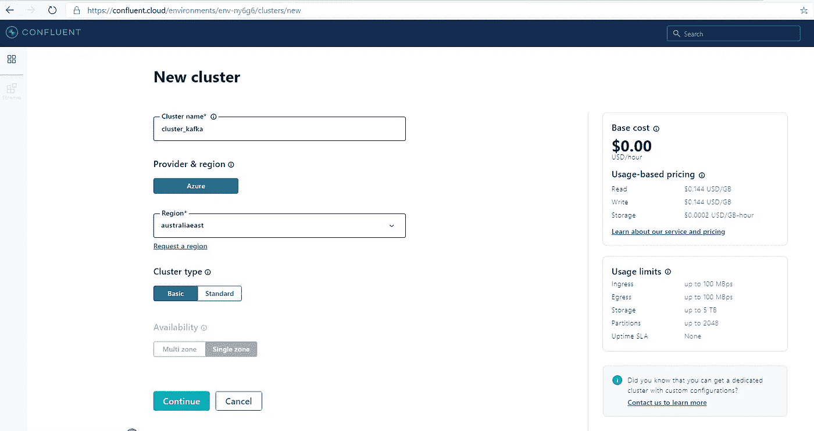

创建新的 Kafka 集群—融合云

一旦你创建了一个基本的 Kafka 集群和 API Key & Secret 来使用，上面链接的[同一个 Spring boot 应用程序](https://github.com/agrajm/spring-boot-kafka)现在可以通过修改`application.yaml`配置文件中的以下内容来使用这个在融合云中创建的集群:

*   引导服务器信息
*   JAAS 配置的用户名和密码:您必须创建 API Key & Secret 并将其与您的 Kafka 集群相关联，然后才能使用它

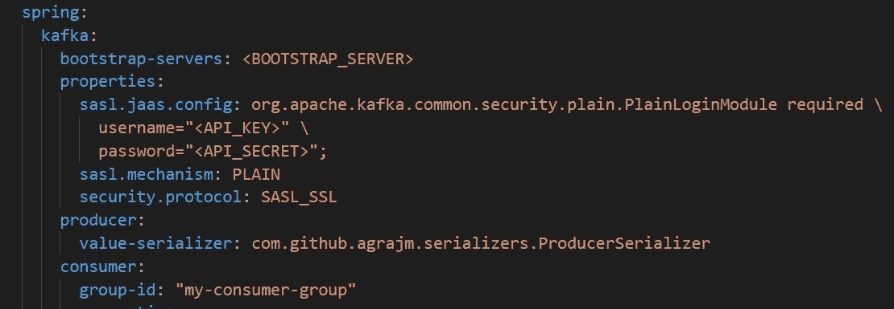

我希望从融合云产品中获得的东西:

1.  创建**专用**集群的能力——无论是基本的&标准集群，您都只能获得大型多租户集群融合的一部分。我确信这一点正在积极开发中，但有时出于合规性原因&诸如此类，客户更喜欢为自己创建一个单租户专用集群。
2.  SSO b/w Azure & Confluent Cloud UI —我真的不想创建另一个帐户，记住另一组用户名/密码，安装另一个 CLI 来管理我的 Kafka 集群，所以如果我们可以使用相同的凭据和相同的工具(az cli)就太棒了。
3.  **用于数据加密的 BYOK**:同样，这主要是受监管行业的客户所需要的，但这是目前一个非常常见的问题，如果融合云能够支持客户管理的密钥，比如通过 Azure Key Vault，那就太好了。

如果出现以下情况，我真的会转向融合云

*   我对 PAYG 的成本模型很满意&寻找可靠的托管服务
*   我依赖于融合生态系统的其他部分:Kafka Connect、KSQL、连接器(源和汇都有)、融合模式注册表、复制器等。在撰写本文时，以下连接器可用

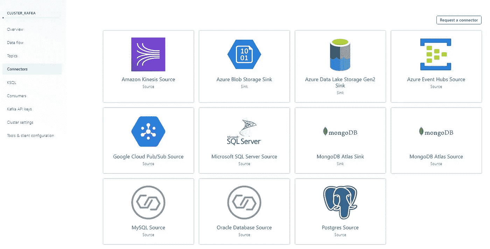

融合的云:卡夫卡的连接器

# Azure 高清洞察

Azure HDInsight 是 Hadoop 组件的完全托管的云分发版。它支持许多开源框架，如 Apache Spark、Hive、Apache Storm、R Server、Apache HBase，当然还有 Apache Kafka。它在 Kafka 正常运行时间上提供 99.99%的 SLA，并使用 Azure 托管磁盘作为 Kafka 代理的后备存储(为每个代理提供高达 16TB 的存储)。

## 企业级安全性

虽然对于任何云提供商来说，安全将始终是[的共同责任](https://docs.microsoft.com/en-us/azure/security/fundamentals/shared-responsibility)，但 Azure HDInsight 拥有几个企业级安全功能，让您的生活变得轻松:

*   **VNet 集成**:Azure HD insight 集群通常部署在虚拟网络中，Kafka 集群完全隔离，无法在 VNet 之外访问。您还可以[使用私有端点](https://azure.microsoft.com/en-us/blog/secure-incoming-traffic-to-hdinsight-clusters-in-a-vnet-with-private-endpoint/)保护传入流量。

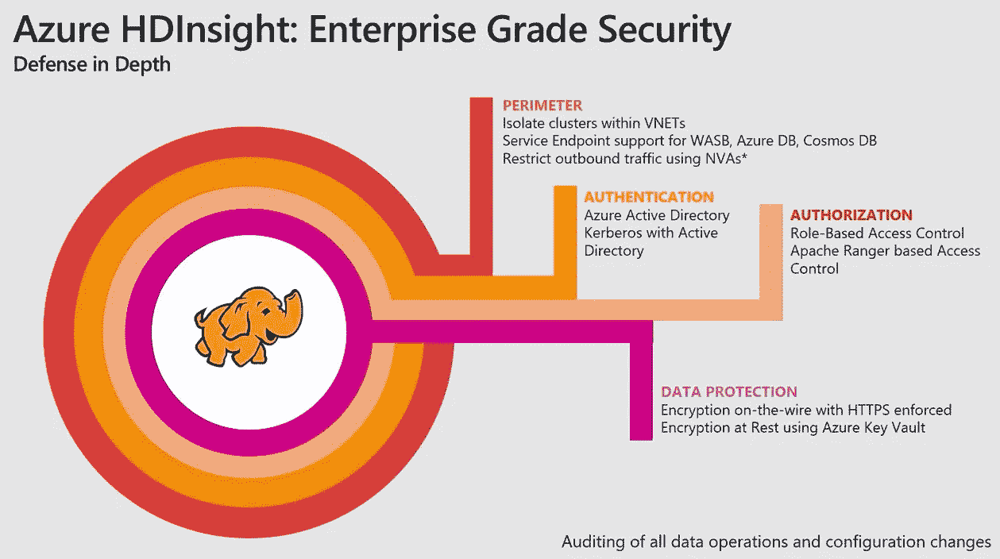

*   **AuthN&AuthZ**:HD insight 巧妙地与 Azure AD 集成在一起，用于身份验证&通过 Apache Ranger 提供主题授权。虽然 HDInsight 不支持 Kafka 通过 ACL 对主题进行授权的方式，但您可以在 Azure AD 中使用用户组&并在 Apache Ranger 中定义安全策略来达到相同的效果。
*   **加入域的虚拟机**:您可以让 HDInsight 集群中的虚拟机加入[域](https://docs.microsoft.com/en-us/azure/hdinsight/domain-joined/apache-domain-joined-architecture)，以便在这些虚拟机上运行的各种服务能够为经过身份验证的用户无缝工作。
*   **BYOK &托管身份** : HDInsight for Kafka 支持使用 Azure Key Vault 中的客户托管密钥来加密 Kafka 代理的 Azure 托管磁盘中存储的数据。这对某些受监管的客户来说是无价的。
*   **监控** : Azure HDInsight 与 Azure Monitor 集成，Azure Monitor 提供单一界面，您可以使用该界面监控所有集群。

Kafka 的典型 HDInsight 集群由以下资源组成:

1.  头节点:您可以进入并管理环境和集群资源的几个头节点
2.  动物园管理员节点:卡夫卡经纪人要求的 3 个 ZK 节点
3.  工作节点:代理运行的位置
4.  Azure 托管磁盘:附加到每个代理的托管磁盘

当您为 Kafka 创建 HDInsight 集群时，您可以选择工作节点的数量&每个工作节点的标准磁盘。头节点和 ZK 节点分别固定为 2 和 3。在创建集群时，它还会为您提供一个大概的成本指示。

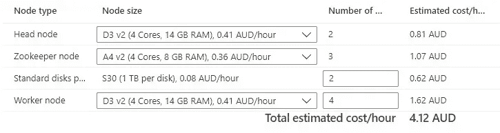

创建群时的成本指示

使用 Azure HDInsight 的 Kafka 集群的典型架构如下所示

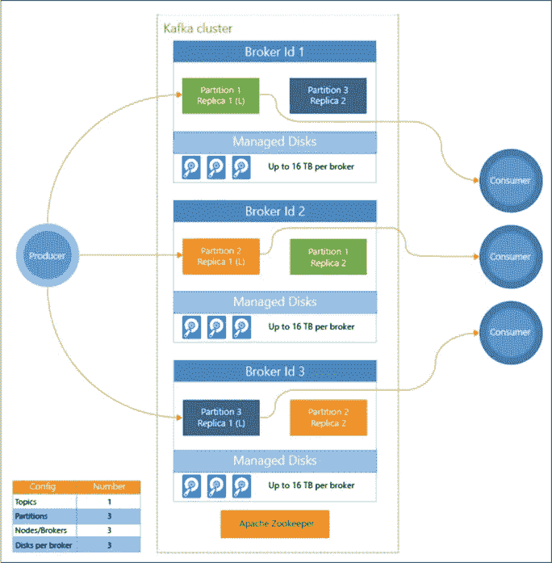

今天，许多企业正在 Azure 中使用 Azure HDInsight for Kafka，最值得注意的是[丰田已经使用 Azure HDInsight 在 Azure 上部署了他们的联网汽车架构](https://azure.microsoft.com/en-au/blog/announcing-public-preview-of-apache-kafka-on-hdinsight-with-azure-managed-disks/)，并利用 Kafka、Storm & Spark 进行事件流传输和决策制定。

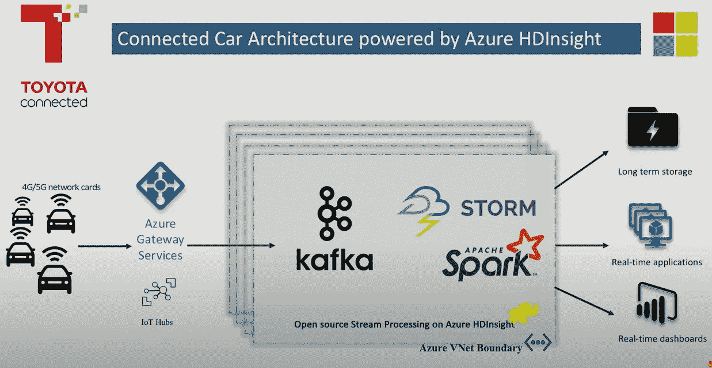

使用 HDInsight Kafka 的丰田联网汽车架构

一个可能的缺点是您会产生成本，这部分是因为您有一个专用的集群(您的头节点、zookeeper 节点、代理和与之相关的受管磁盘不会与任何人共享)，所以您最终要为所有计算和存储支付费用。同样，由于安全性和合规性的提高，我们看到许多企业继续采用这种方式，但您的收益可能会有所不同。

我也找不到任何自动扩展集群的方法——尽管 HDInsight 的[自动扩展是 GA](https://docs.microsoft.com/en-us/azure/hdinsight/hdinsight-autoscale-clusters) ,但可能不适用于“Kafka”类型的集群。

# 结论

这里没有简单的答案——没有放之四海而皆准的答案。几乎从来没有！但是我希望这种比较能够帮助你在 Azure 中部署 Kafka 时选择最适合你的用例的方法。