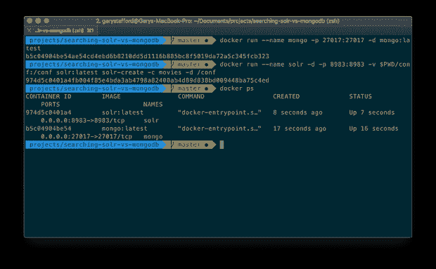
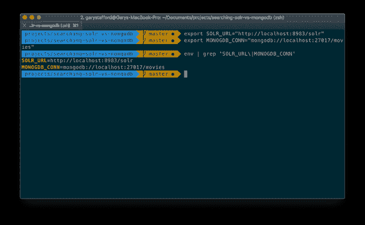
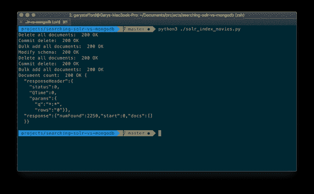
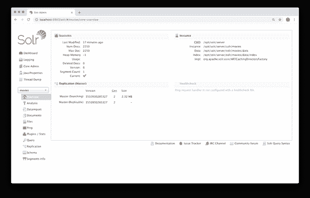
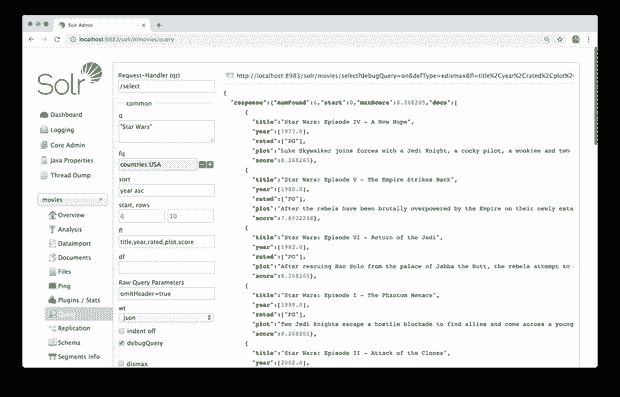
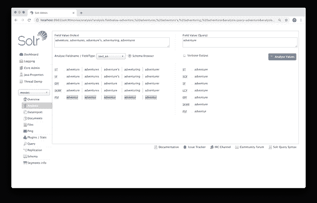
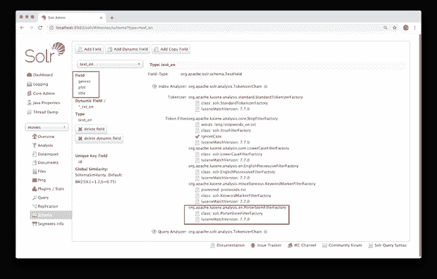
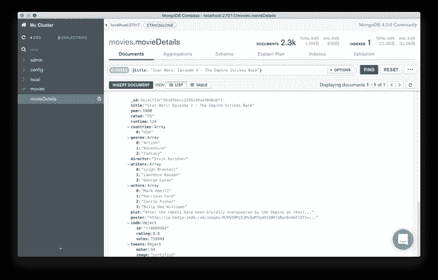
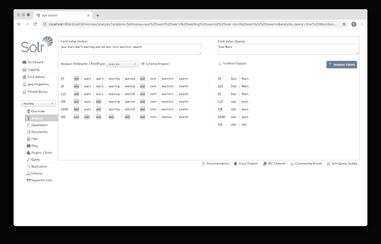
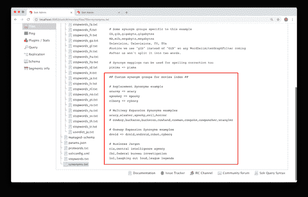

# Apache Solr:因为你的数据库不是搜索引擎

> 原文：<https://itnext.io/apache-solr-because-your-database-is-not-a-search-engine-57705352df8a?source=collection_archive---------0----------------------->

在本帖中，我们将从 MongoDB 等传统数据库中考察 Apache Solr 作为搜索引擎的独特之处。我们将通过分析一系列比较查询来探讨 Solr 和 MongoDB 之间的异同。然后，我们将深入研究 Solr 的一些更高级的搜索功能。


*版权:* [*德扬博济奇*](https://www.123rf.com/profile_varijanta)*(*[*123 RF*](https://www.123rf.com/)*)*

# 为什么要搜索？

搜索信息的能力是许多应用程序的基本要求。局限于传统数据库的架构师和开发人员经常试图通过创建不必要的、过于复杂的基于 SQL 查询的解决方案来满足搜索需求。它们迫使终端用户以不自然或高度结构化的方式进行搜索，或者提供缺乏相关性的结果。最终用户不是数据库管理员，他们不理解 SQL 的细微差别，他们只是希望他们的查询得到相关的响应。

在数据消费者任意搜索特定领域内的相关信息的场景中，为 reads 实现一个搜索优化的、基于 Lucene 的平台，如 [Elasticsearch](https://www.elastic.co/products/elasticsearch) 或 [Apache Solr](https://lucene.apache.org/solr) ，通常是一个有效的解决方案。

将数据库读取与写入分离并不罕见。我曾经参与过许多项目，这些项目的需求提出了一种架构，其中应该实现一种类型的数据存储技术来优化写操作，而应该实现不同类型的数据存储技术来优化读操作。这种情况很常见的架构包括以下几种。

*   CQRS(命令查询责任分离)和事件源；
*   报告、数据分析和大数据；
*   ML(机器学习)和 AI(人工智能)；
*   实时和流数据(如物联网)；
*   搜索:内容、文档、知识；

在这篇文章中，我们将研究 Apache Solr 的搜索能力。我们将比较 Solr 和领先的 NoSQL 数据库 MongoDB 的搜索能力。我们将考虑查询数据和搜索信息之间的区别。


# 阿帕奇 Lucene

据 Apache 介绍， [Apache Lucene](http://lucene.apache.org/) 项目开发开源搜索软件，包括以下子项目:Lucene Core、Solr 和 PyLucene。Lucene 核心子项目提供了基于 Java 的索引和搜索技术，以及拼写检查、点击突出显示和高级分析/标记化功能。

Apache Lucene 7.7.0 和 Apache Solr 7.7.0 是[在 2019 年 2 月刚刚发布的](http://lucene.apache.org/)，并用于所有帖子的示例。


# 阿帕奇索尔

据 Apache 称， [Apache Solr](https://lucene.apache.org/solr) 是一个流行的、速度极快的、开源的企业搜索平台，构建在 [Apache Lucene](http://lucene.apache.org/) 之上。Solr 为许多世界上最大的互联网网站的搜索和导航功能提供了动力。

Apache [Solr](https://en.wikipedia.org/wiki/Apache_Solr) 包括建立 Solr 服务器集群的能力，该集群结合了容错和高可用性。这些功能被称为 [SolrCloud](https://lucene.apache.org/solr/guide/7_6/solrcloud.html) ，由 [Apache Zookeeper](https://zookeeper.apache.org/) 提供支持，提供分布式、分片和复制的索引和搜索功能。

根据维基百科，Solr 于 2004 年在 CNET 网络公司创立，2006 年捐赠给阿帕奇软件基金会，2007 年从他们的孵化器毕业。Solr 版本发布于 2008 年。2010 年， [Lucene](https://en.wikipedia.org/wiki/Lucene) 和 Solr 项目合并；Solr 成为了 Lucene 的子项目。随着 Apache Solr 7.7.0 的发布，Solr 已经有了十多年的开发和企业采用经验。


# MongoDB

领先的 NoSQL 数据库 [MongoDB](https://www.mongodb.com/) 将自己描述为一个文档数据库，它具有用户需要的查询和索引所需的可伸缩性和灵活性。Mongo 的特性包括即席查询、索引和实时聚合，为访问和分析数据提供了强大的方法。

不到一年前发布的 [MongoDB 4.0](https://www.mongodb.com/collateral/mongodb-40-whats-new) 增加了多文档 ACID 事务、数据类型转换、非阻塞辅助副本读取、SHA-2 认证、MongoDB Compass 聚合管道构建器、Kubernetes 集成和 MongoDB Stitch 无服务器平台。MongoDB 4.0.6 是[在 2019 年 2 月刚刚发布的](https://docs.mongodb.com/manual/release-notes/4.0/#feb-7-2019)，并用于所有帖子的示例。

# 比较搜索功能

Solr 和 MongoDB 似乎有许多与搜索相关的共同特性。

*   Solr 和 MongoDB 都是**基于文档的**数据存储；
*   Solr 和 MongoDB 都使用了**非关系型**数据模型；
*   两者都具有先进的**查询和索引**功能；
*   Solr 实现了基于 Lucene 的搜索功能；MongoDB 具有基于文本的搜索能力；
*   Solr 使用 Lucene 评分算法对搜索结果的**相关性**进行评分；MongoDB 能够使用$meta 操作符对**文本搜索结果进行排序；**
*   Solr 能够**在计算分数时有选择地提升**搜索字段和字段中特定值的相对重要性；MongoDB 能够提高使用文本索引的文本搜索中使用的字段的相对重要性；
*   Solr 和 MongoDB 都能够实现**停用词**、**词干**和**标记化**；

# 源代码示例

本文中展示的所有示例都可以作为一系列 Python 3 脚本获得，包含在 GitHub 上的一个开源项目中，[searching-Solr-vs-MongoDB](https://github.com/garystafford/searching-solr-vs-mongodb)。该项目包含脚本 [query_mongo.py](https://github.com/garystafford/searching-solr-vs-mongodb/blob/master/query_mongo.py) ，它使用 MongoDB 的 Python 驱动程序 [pymongo](https://pypi.org/project/pymongo/) ，来执行本文中的所有 MongoDB 查询。该项目还包含脚本 [query_solr.py](https://github.com/garystafford/searching-solr-vs-mongodb/blob/master/query_solr.py) ，它使用 Apache solr 的轻量级 Python 包装器 [pysolr](https://pypi.org/project/pysolr/3.8.1/) ，来执行本文中的所有 Solr 搜索。这两个软件包以及辅助软件包都可以用 pip 安装。

```
pip3 install pysolr pymongo bson.json_util requests
```

# MongoDB 和 Solr 实例

为了跟进，您将需要自己的 MongoDB 和 Solr 实例。使用官方的 [MongoDB](https://hub.docker.com/_/mongo) 和 [Solr](https://hub.docker.com/_/solr) Docker Hub 镜像，两者都可以很容易地在 Docker 上实现。示例`docker run`命令如下所示。

第二个命令 Solr 命令也创建了一个新的 Solr [内核](https://lucene.apache.org/solr/guide/7_6/solr-cores-and-solr-xml.html)。该命令还将本地项目中的“conf”目录绑定到容器中。这将使我们能够修改索引的配置，并将配置存储在源代码控制中。所有数据都是短暂的，使用这些特定的命令，两个容器都不会将数据保存在容器之外。

```
docker run --name mongo -p 27017:27017 -d mongo:latestdocker run --name solr -d \
  -p 8983:8983 \
  -v $PWD/conf:/conf \
  solr:latest \
  solr-create -c movies -d /conf
```



# 环境变量

源代码需要两个环境变量，它们包含 MongoDB 和 Solr 的连接信息。如果下面的值与 Docker 中使用的示例不同，您需要用自己的连接字符串替换它们。

```
export SOLR_URL="http://localhost:8983/solr"
export MONOGDB_CONN="mongodb://localhost:27017/movies"
```



# 将电影导入到 MongoDB

在这篇文章中，我们将使用 MongoDB 上公开的电影数据集。数据集的副本在项目中可用，在 MongoDB 的网站上也可用，[设置并导入数据](https://docs.mongodb.com/charts/master/tutorial/movie-details/prereqs-and-import-data/#download-the-data)。

假设您有一个可访问的 MongoDB 实例，并设置了上面的两个环境变量，使用下面的`mongoimport`命令将 MongoDB 的特殊格式的 JSON 文件 [moviesDetails_mongo.json](https://github.com/garystafford/searching-solr-vs-mongodb/blob/master/data/movieDetails_mongo.json) 直接导入到 movie 数据库的 movieDetails 集合中。

```
mongoimport \
  --uri $MONOGDB_CONN \
  --collection "movieDetails" \
  --drop --file "data/movieDetails_mongo.json"
```


下面是运行在 Docker 容器中的电影数据库的 movieDetails 集合的视图，如 [MongoDB Compass](https://www.mongodb.com/products/compass) 应用程序所示。


# 将电影索引到 Solr

假设您有一个可访问的 Solr 实例，并设置了上面的两个环境变量，通过运行 Python 脚本 [solr_index_movies.py](https://github.com/garystafford/searching-solr-vs-mongodb/blob/master/solr_index_movies.py) ，使用以下命令导入 JSON 文件 [movieDetails.json](https://github.com/garystafford/searching-solr-vs-mongodb/blob/master/data/movieDetails.json) 的内容。

```
python3 ./solr_index_movies.py
```

该命令执行一系列对 Solr 公开的 RESTful API 的 HTTP 调用。



下面是在 Docker 容器中运行的 [Solr 管理用户界面](https://lucene.apache.org/solr/guide/7_6/overview-of-the-solr-admin-ui.html)的视图，显示了新电影[核心](https://lucene.apache.org/solr/guide/7_6/solr-cores-and-solr-xml.html)。运行脚本后，我们应该有 2，250 个电影文档被索引。



Solr Admin UI 提供了许多有用的工具，用于检查索引、检查模式和[字段类型](https://lucene.apache.org/solr/guide/7_6/field-types-included-with-solr.html#field-types-included-with-solr)，以及创建、分析和调试 Solr 查询。下面我们看到显示查询结果的查询界面。



# 调整 Solr 指数

电影索引使用默认模式，该模式是在对电影文档进行索引时创建的。为了优化我们的查询结果，我们需要对默认的 movies 模式进行一些调整。首先，我们希望确保我们的 Solr 搜索考虑单词的复数形式。例如，当我们搜索搜索词' adventure '时，我们希望 Solr 也返回包含诸如 Adventure、adventures、adventuring 和 adventurer 等词的文档，但不返回 misadventure。这就是所谓的[词干](https://en.wikipedia.org/wiki/Stemming)，或者将单词缩减为它们的[词干](https://en.wikipedia.org/wiki/Word_stem)。Solr 分析用户界面中显示了一个例子。



我们想要搜索的字段，例如标题、情节和流派，默认情况下都被索引为“text _ general”Solr 字段类型。“text_general”字段类型在索引或查询时不实现词干。我们需要将标题、情节和类型字段切换到“text_en”(英文文本)字段类型。“text_en”字段类型实现了多个索引和查询过滤器，包括 [PorterStemFilterFactory](https://wiki.apache.org/solr/LanguageAnalysis#Notes_about_solr.PorterStemFilterFactory) 过滤器，它从单词中删除常见的结尾。类似的过滤器包括[英语最小词干过滤器](https://lucene.apache.org/solr/guide/7_6/filter-descriptions.html#english-minimal-stem-filter)和[英语所有格过滤器](https://lucene.apache.org/solr/guide/7_6/filter-descriptions.html#english-possessive-filter)。

此外，Solr 中这些字段的[多值](https://lucene.apache.org/solr/guide/7_6/defining-fields.html#optional-field-type-override-properties)字段属性默认设置为`true`。由于标题和绘图字段以及其他字段只打算保存一个文本值，而不是一个值数组，我们将把`MultiValued`字段属性切换到`false`。这有助于排序和过滤，以及文档的正确反序列化。

solr_index_movies.py 脚本会将标题、情节和流派字段从 text_general '更改为 text_en '并将标题和情节字段从多值更改为单值。由于我们已经更改了索引的模式，脚本将在模式更改后重新导入所有文档。

为了更好地理解模式变化是什么样子，让我们看一下改变模式的等效 cURL 命令。这让您更好地了解我们正在进行的现场级修改。

您可以使用模式 UI 来查看结果，如下所示。请注意标题、情节和类型的新字段类型。另外，请注意“text_en”字段类型使用的索引和查询分析器，包括 PorterStemFilterFactory。



# 比较查询

为了展示 Solr 和 MongoDB 之间的相似之处和不同之处，我们将检查一系列比较查询，然后是一系列 Solr 专用搜索。同样，所有显示的查询和输出都包含在两个项目的 Python 脚本中。您可以在 Solr 查询 UI 中输入每个查询的参数。

## 查询 1a:所有文档

首先，我们将对 MongoDB 集合中的所有电影文档执行一个简单的查询，然后是 Solr 索引。对于 MongoDB，我们使用[查找方法](https://docs.mongodb.com/manual/reference/method/db.collection.find/index.html)。对于 Solr，我们将使用[标准查询解析器](https://lucene.apache.org/solr/guide/7_6/the-standard-query-parser.html#the-standard-query-parser)，通常称为' *lucene* '查询解析器，以及`q` (query)参数。查询的结果应该是相同的，返回所有 2，250 个文档。

MongoDB:

```
Parameters
----------
query: {}

Results
----------
document count: 2250
```

Solr:

```
Parameters
----------
q: *:*
kwargs: {}

Results
----------
document count: 2250
```

## 查询 1b:仅计数

我们可以修改第一个查询，将我们的响应限制为 MongoDB 中给定查询的文档数；不退还任何文件。因为我们的查询是空的，所以我们将获得 MongoDB 数据库集合中所有文档的计数。

```
db.movieDetails.count()
```

类似地，在 Solr 中，我们可以将`rows`参数设置为零，只返回文档数。为了简洁，我们也可以使用`omitHeader`参数省略 Solr 响应头。

```
Parameters
----------
q: *:*
kwargs: {'omitHeader': 'true', 'rows': '0'}Results
----------
document count: 2250
```

## 查询 2:精确搜索

接下来，我们将在 MongoDB 中查询电影的确切名称“星球大战:第五集——帝国反击战”，然后是 Solr。同样，查询的结果应该是相同的，返回一个与标题匹配的文档。



MongoDB:

```
Parameters
----------
query: {'title': 'Star Wars: Episode V - The Empire Strikes Back'}
projection: {'_id': 0, 'title': 1}

Results
----------
document count: 1
{'title': 'Star Wars: Episode V - The Empire Strikes Back'}
```

标题周围的引号是 Solr 将查询视为单个短语而不是一系列搜索词的关键。

Solr:

```
Parameters
----------
q: title:"Star Wars: Episode V - The Empire Strikes Back"
kwargs: {
  'defType': 'lucene', 
  'fl': 'title, score'
}

Results
----------
document count: 1
{'title': 'Star Wars: Episode V - The Empire Strikes Back', 'score': 29.41}
```

注意`'defType': 'lucene'`的使用是可选的。标准的 Lucene 查询解析器是 Solr 使用的默认解析器。我展示这个参数只是为了提高读者的理解。稍后，我们将使用其他查询解析器。

## 查询 3:搜索短语

接下来，我们将对短语“星球大战”进行查询。对于 MongoDB，我们将使用`$regex`和`$options` [评估查询操作符](https://docs.mongodb.com/manual/reference/operator/query/regex/)。MongoDB 和 Solr 查询的结果应该是相同的，返回六部星球大战电影。

MongoDB:

```
Parameters
----------
query: {
  'title': {'$regex': '\\bstar wars\\b', 
  '$options': 'i'}
}
projection: {'_id': 0, 'title': 1}

Results
----------
document count: 6
{'title': 'Star Wars: Episode I - The Phantom Menace'}
{'title': 'Star Wars: Episode II - Attack of the Clones'}
{'title': 'Star Wars: Episode III - Revenge of the Sith'}
{'title': 'Star Wars: Episode IV - A New Hope'}
{'title': 'Star Wars: Episode V - The Empire Strikes Back'}
{'title': 'Star Wars: Episode VI - Return of the Jedi'}
```

使用 Solr，将短语“star wars”括在引号中可以确保 Solr 将查询字符串视为一个精确的短语，而不是单个的搜索词。Solr 的结果被评分，但分数几乎都是一样的，因为所有六部电影都包含完全相同的短语。

Solr:

```
Parameters
----------
q: "star wars"
kwargs: {
  'defType': 'lucene', 
  'df': 'title', 
  'fl': 'title, score'
}

Results
----------
document count: 6
{'title': 'Star Wars: Episode VI - Return of the Jedi', 'score': 8.21}
{'title': 'Star Wars: Episode II - Attack of the Clones', 'score': 8.21}
{'title': 'Star Wars: Episode IV - A New Hope', 'score': 8.21}
{'title': 'Star Wars: Episode I - The Phantom Menace', 'score': 8.21}
{'title': 'Star Wars: Episode III - Revenge of the Sith', 'score': 8.21}
{'title': 'Star Wars: Episode V - The Empire Strikes Back', 'score': 7.55}
```

下面是 Solr 将运行的实际 Lucene 查询(`q`)。

```
title:"star war"
```

## 查询 4:搜索词

接下来，我们将对标题包含搜索词“star”或“wars”而不是短语“star wars”的所有电影执行查询。Solr web 控制台有一个非常强大的分析工具。使用分析工具，我们可以检查与特定字段类型相关联的每个过滤器(在下面最左边的列中缩写)将如何影响 Solr 的匹配能力。要使用分析工具，请将搜索词或短语放在右侧，将索引字段值放在左侧，然后从下拉列表中选择字段或字段类型。

下面，我们将看到如果被搜索的字段是前面讨论过的字段类型“text_en”，搜索词“Star”和“Wars”(显示在右下方)将如何匹配这两个词的一系列变体(显示在左下方)。例如，对' Star '的查询将匹配'**Star[T7 '，'**Star**s '，'**Star**s '，'**Star**ring '，'**Star**red '，'**Star**shaped '，但不匹配' shaped '，' superstars '，' started '。**


下面，我们看到类似的搜索结果，“战争”。



# MongoDB 文本搜索

为了用 MongoDB 完成查询，我们将使用 MongoDB 的$text [评估查询操作符](https://docs.mongodb.com/manual/reference/operator/query/regex/)。MongoDB `$text`操作符能够在用文本索引索引的多个字段中执行文本搜索。MongoDB 的文本索引支持对字符串内容的文本搜索查询。文本索引可以包括其值为字符串或字符串元素数组的任何字段，如 movieDetail 集合的“流派”字段。虽然不如 Solr 的搜索功能强大，但 MongoDB 的文本搜索可以解决许多基本的搜索需求，而不需要用搜索引擎来扩充架构。

对于我们的下一个查询，我们将依赖于 title 字段上的文本索引。当 Python 脚本运行时，它在集合上创建以下三个索引，包括标题文本索引。

有了文本索引，查询的结果应该是相同的，返回 18 个文档。MongoDB 和 Solr 结果集都被评分，但是，两者的评分是不同的，使用不同的算法。

MongoDB:

```
Parameters
----------
query: {
  '$text': {'$search': 'star wars', '$language': 'en', '$caseSensitive': False}, 
  'countries': 'USA'
}
projection: {'score': {'$meta': 'textScore'}, '_id': 0, 'title': 1}
sort: [('score', {'$meta': 'textScore'})]

Results
----------
document count: 18
{'title': 'Star Wars: Episode I - The Phantom Menace', 'score': 1.2}
{'title': 'Star Wars: Episode IV - A New Hope', 'score': 1.17}
{'title': 'Star Wars: Episode VI - Return of the Jedi', 'score': 1.17}
{'title': 'Star Wars: Episode II - Attack of the Clones', 'score': 1.17}
{'title': 'Star Wars: Episode III - Revenge of the Sith', 'score': 1.17}
```

Solr:

```
Parameters
----------
q: star wars
kwargs: {
  'defType': 'lucene', 
  'fq': 'countries: USA' 
  'df': 'title', 
  'fl': 'title, score', 
  'rows': '5'
}

Results
----------
document count: 18
{'title': 'Star Wars: Episode VI - Return of the Jedi', 'score': 8.21}
{'title': 'Star Wars: Episode II - Attack of the Clones', 'score': 8.21}
{'title': 'Star Wars: Episode IV - A New Hope', 'score': 8.21}
{'title': 'Star Wars: Episode I - The Phantom Menace', 'score': 8.21}
{'title': 'Star Wars: Episode III - Revenge of the Sith', 'score': 8.21}
```

下面是 Solr 将运行的实际 Lucene 查询(`q`)。随后应用国家过滤器。

```
title:star title:war
```

## 查询 5a:多个搜索词

接下来，我们将使用电影类型字段中的搜索词“西部片”、“动作片”或“冒险片”来查询美国制作的电影。流派字段可以保存多个流派值。虽然这是一个简单的查询，但我们可以开始看到 Solr 的 Lucene 评分功能的优势，它提供了一种方法来衡量各个结果的相关性。

即使局限于美国电影，这个类型查询也返回大量结果，244 个文档。使用 MongoDB，我们不知道哪些文档比其他文档更相关。与 Solr 结果相比，MongoDB 在匹配所有或大多数类型的基础上，在前五名结果中获得了一些，但不是最相关的。

MongoDB:

```
Parameters
----------
query: {
  'genres': {'$in': ['Adventure', 'Action', 'Western']}, 
  'countries': 'USA'
}
projection: {'_id': 0, 'genres': 1, 'title': 1}

Results
----------
document count: 244
{'title': 'Wild Wild West', 'genres': ['Action', 'Western', 'Comedy']}
{'title': 'A Million Ways to Die in the West', 'genres': ['Comedy', 'Western']}
{'title': 'An American Tail: Fievel Goes West', 'genres': ['Animation', 'Adventure', 'Family']}
{'title': 'Once Upon a Time in the West', 'genres': ['Western']}
{'title': 'How the West Was Won', 'genres': ['Western']}
```

然而，根据 Solr 的评分，我们看到第一个(顶部)结果“The Wild Bunch”的得分为 7.18。它的类型包括“西部片”、“动作片”和“冒险片”。最后一个(底部)结果“S.S. Doomtrooper”的得分为 1.47。最相关的结果比最不相关的结果得分高近 5 倍(488%)。如果你在搜索一部西部动作冒险电影，很明显排名第一的《荒野大镖客》(The Wild Bunch)比排名第二的《末日终结者》(S.S. Doomtrooper)要好得多。事实上，如下图所示，所有五个得分最高的 Solr 结果根据它们的分数、类型和标题看起来都很有希望。

Solr:

```
Parameters
----------
q: adventure action western
kwargs: {
  'defType': 'lucene', 
  'fq': 'countries: USA', 
  'df': 'genres', 
  'fl': 'title, genres, score', 
  'rows': '5'
}

Results
----------
document count: 244
{'title': 'The Wild Bunch', 'genres': ['Action', 'Adventure', 'Western'], 'score': 7.18}
{'title': 'Crossfire Trail', 'genres': ['Action', 'Western'], 'score': 6.26}
{'title': 'The Big Trail', 'genres': ['Adventure', 'Western', 'Romance'], 'score': 5.46}
{'title': 'Once Upon a Time in the West', 'genres': ['Western'], 'score': 5.26}
{'title': 'How the West Was Won', 'genres': ['Western'], 'score': 5.26}
```

下面是 Solr 将运行的实际 Lucene 查询(`q`)。随后应用国家过滤器。

```
genres:adventur genres:action genres:western
```

## 查询 5b:必需的搜索词

有几乎无穷无尽的选项可以用来影响 Solr 的结果。例如，我们可以执行上面相同的 Solr 查询，但是这一次要求单词“western”是流派字段，使用加号(`+` ) [布尔运算符](https://lucene.apache.org/solr/guide/6_6/the-standard-query-parser.html#TheStandardQueryParser-BooleanOperatorsSupportedbytheStandardQueryParser)。前五个结果和分数是相同的，但是相关结果的总数从 244 个减少到仅仅 24 个。这意味着 220 个先前的结果包含“动作”和/或“冒险”，但不包含“西部”。反之亦然，使用减号(`-`)布尔运算符将确保结果不包含特定的单词或短语。

Solr:

```
Parameters
----------
q: adventure action **+western**
kwargs: { 
  'defType': 'lucene', 
  'fq': 'countries: USA', 
  'df': 'genres', 
  'fl': 'title, genres, score', 
  'rows': '5'
} 

Results
----------
document count: 24
{'title': 'The Wild Bunch', 'genres': ['Action', 'Adventure', 'Western'], 'score': 7.18}
{'title': 'Crossfire Trail', 'genres': ['Action', 'Western'], 'score': 6.26}
{'title': 'The Big Trail', 'genres': ['Adventure', 'Western', 'Romance'], 'score': 5.46}
{'title': 'Once Upon a Time in the West', 'genres': ['Western'], 'score': 5.26}
{'title': 'How the West Was Won', 'genres': ['Western'], 'score': 5.26}
```

下面是 Solr 将运行的实际 Lucene 查询(`q`)。随后应用国家过滤器。

```
(genres:adventur genres:action) +genres:western
```

## 查询 6a: eDisMax 查询

对于我们的下一个查询，我们将比较 Solr 的 eDisMax 查询解析器和 MongoDB 的文本搜索功能。

# Solr 扩展 DisMax

根据 Solr 的说法， [DisMax 查询解析器](https://lucene.apache.org/solr/guide/7_6/the-dismax-query-parser.html#the-dismax-query-parser)旨在处理简单的短语，并基于每个字段的重要性使用不同的权重(提升)来搜索几个字段中的单个术语。附加选项使用户能够基于特定于每个用例的规则来影响分数(独立于用户输入)。Solr 的[扩展 DisMax (eDisMax)查询解析器](https://lucene.apache.org/solr/guide/7_6/the-extended-dismax-query-parser.html)是 DisMax 查询解析器的改进版本。

在我看来，除了基于 Lucene 的评分之外，使用 DisMax 和 e DisMax 查询解析器轻松搜索多个字段并有选择地提升结果的能力，是在数据库中查询数据与使用搜索引擎搜索相关结果的区别所在。

# 多字段文本索引

对于我们的下一个查询，Python 脚本将删除 title 字段上以前的 MongoDB 文本索引，并创建一个新的复合文本索引，该索引将包含 title、plot 和流派字段。

下面，我们在 MongoDB Compass 应用程序的 Indexes 选项卡中看到了新的复合文本索引。


我们将在电影标题、情节或类型字段中使用搜索词“西部片”、“动作片”或“冒险片”来查询美国制作的电影。查询的结果应该是相同的，返回 259 个文档。MongoDB 和 Solr 结果集都被评分，但是结果的评分和排序也不相同。在前十个结果中，这两个查询匹配了前十个结果中的六部电影。

MongoDB:

```
Parameters
----------
query: {
  '$text': {'$search': 'western action adventure', '$language': 'en', '$caseSensitive': False}, 
  'countries': 'USA'
}
projection: {'score': {'$meta': 'textScore'}, '_id': 0, 'title': 1}

Results
----------
document count: 259
{'title': 'Zathura: A Space Adventure', 'genres': ['Action', 'Adventure', 'Comedy'], 'score': 3.3}
{'title': 'The Extraordinary Adventures of Adèle Blanc-Sec', 'genres': ['Action', 'Adventure', 'Fantasy'], 'score': 3.24}
{'title': 'The Wild Bunch', 'genres': ['Action', 'Adventure', 'Western'], 'score': 3.2}
{'title': 'The Adventures of Tintin', 'genres': ['Animation', 'Action', 'Adventure'], 'score': 2.85}
{'title': 'Adventures in Babysitting', 'genres': ['Action', 'Adventure', 'Comedy'], 'score': 2.85}
```

Solr:

```
Parameters
----------
q: western action adventure
kwargs: {
  'defType': 'edismax', 
  'fq': 'countries: USA', 
  'qf': 'plot title genres', 
  'fl': 'title, genres, score', 
  'rows': '5'
}

Results
----------
document count: 259
{'title': 'The Secret Life of Walter Mitty', 'genres': ['Adventure', 'Comedy', 'Drama'], 'score': 7.67}
{'title': 'Western Union', 'genres': ['History', 'Western'], 'score': 7.39}
{'title': 'The Adventures of Tintin', 'genres': ['Animation', 'Action', 'Adventure'], 'score': 7.36}
{'title': 'Adventures in Babysitting', 'genres': ['Action', 'Adventure', 'Comedy'], 'score': 7.36}
{'title': 'The Poseidon Adventure', 'genres': ['Action', 'Adventure', 'Drama'], 'score': 7.36}
```

下面是 Solr 将运行的实际 Lucene 查询。

```
+(
  (title:adventur | plot:adventur | genres:adventur) 
  (title:action | plot:action | genres:action) 
  (title:western | plot:western | genres:western)
)
```

## 查询 6b:提升字段

如果你真的想要一部“西部动作冒险”电影，而不是“西部”、“动作”或“冒险”电影，那么 Solr 或 MongoDB 的前五个搜索结果可能都不会让你完全满意。如果正确的字段被提升，并且正或负提升的量是适当的，则提升或加权字段通常可以提供更相关的搜索结果。

MongoDB 的文本索引也允许[加权](https://docs.mongodb.com/manual/core/index-text/#specify-weights)单个字段。索引字段的权重表示该字段相对于其他索引字段的重要性，并直接影响文本搜索分数。加权字段相当于用 Solr 增强字段。下面，我们看到一个应用于我们之前的文本索引的修改，其中标题字段的权重是绘图字段的两倍(默认为 1.0)，类型字段的权重是标题字段的两倍。Python 脚本也会为您应用这个索引。

同样，Solr 也能够提升 DisMax 和 e DisMax 查询解析器的字段。对于我们的下一个查询，我们将重复前面的查询，但是提升 eDisMax 的`qf` ( [查询字段](https://lucene.apache.org/solr/guide/7_6/the-dismax-query-parser.html#qf-query-fields-parameter))参数中的字段，以匹配 MongoDB 加权文本索引中的提升，如上所示。

查询的结果应该是相同的，返回 259 个文档。MongoDB 和 Solr 的结果评分和排序不同。然而，与前面的未加权/提升的 MongoDB 和 Solr 查询结果相比，相对分数更高，返回的电影顺序不同，最重要的是，Solr 结果似乎与原始搜索意图更相关。

以 Solr 为例，以电影《沃尔特·米蒂的秘密生活》(The Secret Life of Walter Mitty)为例，这部电影之前的评分最高，为 7.58 分。在提升后的搜索结果中，电影《荒野大镖客》(The Wild Bunch)现在以 28.71 分排名第一。电影《沃尔特·米蒂的秘密生活》甚至不再排在前 50 名。相比之下，其他电影，如《丁丁历险记》和《保姆历险记》，即使它们的分数成比例变化，也几乎没有移动位置。

MongoDB:

```
Parameters
----------
query: {
  '$text': {'$search': 'western action adventure', '$language': 'en', '$caseSensitive': False}, 
  'countries': 'USA'
}
projection: {'score': {'$meta': 'textScore'}, '_id': 0, 'title': 1}

Results
----------
document count: 259
{'title': 'The Wild Bunch', 'genres': ['Action', 'Adventure', 'Western'], 'score': 12.8}
{'title': 'Zathura: A Space Adventure', 'genres': ['Action', 'Adventure', 'Comedy'], 'score': 10.27}
{'title': 'The Extraordinary Adventures of Adèle Blanc-Sec', 'genres': ['Action', 'Adventure', 'Fantasy'], 'score': 10.14}
{'title': 'The Adventures of Tintin', 'genres': ['Animation', 'Action', 'Adventure'], 'score': 9.9}
{'title': 'Adventures in Babysitting', 'genres': ['Action', 'Adventure', 'Comedy'], 'score': 9.9}
```

Solr:

```
Parameters
----------
q: western action adventure
kwargs: {
  'defType': 'edismax', 
  'fq': 'countries: USA', 
 **'qf': 'plot title^2.0 genres^4.0',**  'fl': 'title, genres, score', 
  'rows': '5'
}

Results
----------
document count: 259
{'title': 'The Wild Bunch', 'genres': ['Action', 'Adventure', 'Western'], 'score': 28.71}
{'title': 'Crossfire Trail', 'genres': ['Action', 'Western'], 'score': 25.05}
{'title': 'The Big Trail', 'genres': ['Adventure', 'Western', 'Romance'], 'score': 21.84}
{'title': 'Once Upon a Time in the West', 'genres': ['Western'], 'score': 21.05}
{'title': 'How the West Was Won', 'genres': ['Western'], 'score': 21.05}
```

下面是 Solr 将运行的实际 Lucene 查询。

```
+(
  ((title:adventur)^2.0 | plot:adventur | (genres:adventur)^4.0) 
  ((title:action)^2.0 | plot:action | (genres:action)^4.0) 
  ((title:western)^2.0 | plot:western | (genres:western)^4.0)
)
```

## 查询 6c: eDisMax 增加了必需/禁止的术语

我们可以使用加号(`+`)和减号(`-`)布尔运算符来获得更相关的搜索结果。让我们重复上一个 Solr 增强的查询，但这一次，也要求任何结果都包含搜索词“western”，并禁止响应包含搜索词“romance”。我认为基于 Solr 查询的这些修改的新搜索结果比以前的结果更符合搜索的初衷。例如，电影“The Big Trail”，一部浪漫的西方冒险电影，根据其类型，不再包含在结果集中。

Solr:

```
Parameters
----------
q: adventure action **+western -romance**
kwargs: {
  'defType': 'edismax', 
  'fq': 'countries: USA', 
 **'qf': 'plot title^2.0 genres^4.0',**
  'fl': 'title, genres, score', 
  'rows': '5'
}Results
----------
document count: 25
{'title': 'The Wild Bunch', 'genres': ['Action', 'Adventure', 'Western'], 'score': 28.71}
{'title': 'Crossfire Trail', 'genres': ['Action', 'Western'], 'score': 25.05}
{'title': 'Once Upon a Time in the West', 'genres': ['Western'], 'score': 21.05}
{'title': 'How the West Was Won', 'genres': ['Western'], 'score': 21.05}
{'title': 'Cowboy', 'genres': ['Western'], 'score': 21.05}
```

下面是 Solr 将运行的实际 Lucene 查询。

```
+(
  ((title:adventur)^2.0 | plot:adventur | (genres:adventur)^4.0) 
  ((title:action)^2.0 | plot:action | (genres:action)^4.0) 
  +((title:western)^2.0 | plot:western | (genres:western)^4.0) 
  -((title:romanc)^2.0 | plot:romanc | (genres:romanc)^4.0)
)
```

## 问题 7a:电影困境

通常，终端用户通过搜索框与搜索引擎(如 Google)进行交互。我们在搜索框中输入一些内容，然后得到相关结果的列表。到目前为止，我们大多数人都已经学会了如何使用谷歌搜索来获得最佳结果。然而，事实是，人们可以并且愿意在搜索框中输入任何内容。

为了尝试并改善最终用户的平均搜索结果，搜索工程师通常会尝试调整查询参数，例如提升某些搜索字段相对于其他字段的重要性，调整[模糊搜索](https://lucene.apache.org/solr/guide/6_6/the-standard-query-parser.html#TheStandardQueryParser-FuzzySearches)参数，或者通过将不相关的词添加到[停用词](https://lucene.apache.org/solr/guide/7_6/filter-descriptions.html#FilterDescriptions-StopFilter)中来忽略这些词。Solr 停用词中的默认英语包括:“a”、“an”、“and”、“are”、“as”、“at”、“be”、“but”、“by”、“for”等。

以“电影”这个词为例。使用搜索框搜索要看的电影的人可能会输入短语“牛仔电影”。术语“A”作为停用词被忽略。这使得搜索词“牛仔”和“电影”只能在标题、情节和类型字段中搜索。正如我们在下面的十大搜索结果中看到的，大多数似乎是关于牛仔的，在标题或情节中有“牛仔”一词。然后是结果，“电视:电影”。这似乎不是一部关于牛仔的电影。单词“cowboy”不在标题、情节或类型中，但在这里它位于第三位，因为它在标题、情节和/或类型中包含单词“movie”。

同样，排名第一的电影结果“星际牛仔:电影”可能不会比排名第二、第三或第四的电影更相关。然而，《星际牛仔:电影》的评分甚至明显高于第二名(11.24 比 7.31)。这是因为电影的标题包含两个搜索词，“牛仔”和“电影”，即使“电影”一词与搜索词的原意无关。

Solr:

```
Parameters
----------
q: A cowboys movie
kwargs: {
  'defType': 'edismax', 
  'fq': 'countries: USA', 
  'qf': 'plot title genres', 
  'fl': 'title, genres, score', 
  'rows': '10'
}

Results
----------
document count: 23
{'title': 'Cowboy Bebop: The Movie', 'genres': ['Animation', 'Action', 'Crime'], 'score': 11.24}
{'title': 'Cowboy', 'genres': ['Western'], 'score': 7.31}
{'title': 'TV: The Movie', 'genres': ['Comedy'], 'score': 6.42}
{'title': 'Space Cowboys', 'genres': ['Action', 'Adventure', 'Thriller'], 'score': 6.33}
{'title': 'Midnight Cowboy', 'genres': ['Drama'], 'score': 6.33}
{'title': 'Drugstore Cowboy', 'genres': ['Crime', 'Drama'], 'score': 6.33}
{'title': 'Urban Cowboy', 'genres': ['Drama', 'Romance', 'Western'], 'score': 6.33}
{'title': 'The Cowboy Way', 'genres': ['Action', 'Comedy', 'Drama'], 'score': 6.33}
{'title': 'The Cowboy and the Lady', 'genres': ['Comedy', 'Drama', 'Romance'], 'score': 6.33}
{'title': 'Toy Story', 'genres': ['Animation', 'Adventure', 'Comedy'], 'score': 5.65}
```

下面是 Solr 将运行的实际 Lucene 查询。

```
+(
  (title:cowboi | plot:cowboi | genres:cowboi) 
  (title:movi | plot:movi | genres:movi)
)
```

## 问题 7b:停用词

为了解决电影困境，我们可以考虑将单词“movie”添加到停用词中，因为单词“movie”似乎与搜索短语“A cowboys movie”或一般的电影搜索引擎无关。但是，这种选择会对其他搜索产生负面影响。有 12 部电影的标题包含“电影”一词。如果你在搜索“乐高电影”，忽略“电影”这个词，会对搜索结果的准确性和相关性产生负面影响。你最终只会在搜索结果中找到两部乐高电影中的一部，也就是标题中没有包含“电影”这个词的那部。注意两个乐高电影中只有一个被返回。

Solr:

```
Parameters
----------
q: The Lego Movie
kwargs: {
  'defType': 'edismax', 
  'fq': 'countries: USA', 
  'qf': 'plot title genres', 
  'fl': 'title, genres, score', 
  'rows': '5'
}

Results
----------
document count: 1
{'title': 'Lego DC Comics Super Heroes: Justice League vs. Bizarro League', 'genres': ['Animation', 'Action', 'Adventure'], 'score': 3.63}
```

下面是 Solr 将运行的实际 Lucene 查询。请注意，术语“a”和“movie”都不是搜索的一部分。

```
+((title:lego | plot:lego | genres:lego)
```

## 查询 7c:负提升

解决电影困境的第二个方法可能是当“电影”一词出现在标题字段时对其进行负面宣传，从而降低其相关性。DisMax 和 e DisMax 查询解析器都可以对字段进行负提升，或者更准确地说，对特定的字段值进行负提升。当单词‘movie’出现在标题字段中时，我们可以通过使用参数`bq` ( [Boost Query](https://lucene.apache.org/solr/guide/7_6/the-dismax-query-parser.html) )对其进行负提升。根据 Solr 的说法，`bq`参数指定了一个附加的、可选的查询子句，该子句将被添加到用户的主查询中以影响分数。作为开发人员，我们可以通过编程将负面提升的术语添加到查询中，而无需直接改变用户的原始搜索短语。同样，像停用词一样，提升也可能对其他搜索产生负面影响。

经过一些实验后，我们将尝试-2 的提升值。我们仍然得到 23 个结果，但是，根据我们搜索短语的意图，前十个结果现在看起来更相关。电影《星际牛仔:电影》和《电视:电影》不在前十名之列；他们的得分被降低了。你可以对更多的搜索词重复这一过程，如“电影”，积极或消极地提高他们的分数，以提高结果的相关性。

Solr:

```
Parameters
----------
q: A cowboys movie
kwargs: {
  'defType': 'edismax', 
  'fq': 'countries: USA', 
  'qf': 'plot title genres', 
 **'bq': 'title:movie^-2.0',** 
  'fl': 'title, genres, score', 
  'rows': '10'
}

Results
----------
document count: 23
{'title': 'Cowboy', 'genres': ['Western'], 'score': 7.31}
{'title': 'Space Cowboys', 'genres': ['Action', 'Adventure', 'Thriller'], 'score': 6.33}
{'title': 'Midnight Cowboy', 'genres': ['Drama'], 'score': 6.33}
{'title': 'Drugstore Cowboy', 'genres': ['Crime', 'Drama'], 'score': 6.33}
{'title': 'Urban Cowboy', 'genres': ['Drama', 'Romance', 'Western'], 'score': 6.33}
{'title': 'The Cowboy Way', 'genres': ['Action', 'Comedy', 'Drama'], 'score': 6.33}
{'title': 'The Cowboy and the Lady', 'genres': ['Comedy', 'Drama', 'Romance'], 'score': 6.33}
{'title': 'Toy Story', 'genres': ['Animation', 'Adventure', 'Comedy'], 'score': 5.65}
{'title': "Ride 'Em Cowboy", 'genres': ['Comedy', 'Western', 'Musical'], 'score': 5.58}
{'title': "G.M. Whiting's Enemy", 'genres': ['Mystery'], 'score': 5.32}
```

下面是 Solr 将运行的实际 Lucene 查询，考虑到负面影响。

```
+((title:cowboi | plot:cowboi | genres:cowboi) 
  (title:movi | plot:movi | genres:movi)) 
**(title:movi)^-2.0**
```

# 函数查询

Solr 的 Lucene 评分是有效的，但是如果我们想使用一个额外的，主观的相关性度量来丰富我们的搜索结果呢？如果我们检查电影索引模式，我们将看到有相当多的分级相关字段提供了电影质量的感觉，由观众和组织进行判断。例如，有一个嵌套的“番茄”对象，包含许多定性数据字段，如番茄等级和番茄用户等级。番茄指的是[烂番茄](https://www.rottentomatoes.com/)。根据他们的网站，烂番茄提供世界上最值得信赖的优质娱乐推荐资源。此外，电影索引模式包括类似的“awards”和“imdb”对象以及“metacritic”评级。这是电影《布奇·卡西迪和圣丹斯小子》中的一段数据，展示了许多定性领域。

```
"imdb": {
    "id": "tt0064115",
    "rating": 8.1,
    "votes": 142642
  },
  "tomato": {
    "meter": 89,
    "image": "certified",
    "rating": 8.2,
    "reviews": 46,
    "fresh": 41,
    "consensus": "With its iconic pairing of Paul Newman and Robert Redford, jaunty screenplay and Burt Bacharach score, Butch Cassidy and the Sundance Kid has gone down as among the defining moments in late-'60s American cinema.",
    "userMeter": 93,
    "userRating": 4,
    "userReviews": 70088
  },
  "metacritic": 58,
  "awards": {
    "wins": 16,
    "nominations": 14,
    "text": "Won 4 Oscars. Another 16 wins & 14 nominations."
  }
```

根据 [Apache](https://lucene.apache.org/core/2_9_4/scoring.html) 的说法，Lucene 评分是信息检索的[向量空间模型(VSM)和](http://en.wikipedia.org/wiki/Vector_Space_Model)[布尔模型](http://en.wikipedia.org/wiki/Standard_Boolean_model)的组合。Lucene 允许通过“提升”来影响搜索结果。使用 Solr 的[函数 Query](https://lucene.apache.org/solr/guide/7_6/function-queries.html) ，我们可以应用一个文档级的乘法提升函数，这将改变查询的搜索结果的分数。

## 查询 8:升压函数

如果你记得在我们之前的例子中，我们查询了“冒险行动+西部爱情片”。如果我们再次运行它，在没有提升字段的情况下，我们得到了 25 个文档，其中“Western Union”排名最高，得分为 7.39。

Solr:

```
Parameters
----------
q: adventure action **+western -romance**
kwargs: {
  'defType': 'edismax', 
  'fq': 'countries: USA', 
  'qf': 'plot title genres', 
  'fl': 'title, awards.wins, score', 
  'rows': '5'
}Results
----------
document count: 25
{'title': 'Western Union', 'awards.wins': [0.0], 'score': 7.39}
{'title': 'The Wild Bunch', 'awards.wins': [5.0], 'score': 7.18}
{'title': 'Western Spaghetti', 'awards.wins': [2.0], 'score': 6.64}
{'title': 'Crossfire Trail', 'awards.wins': [1.0], 'score': 6.26}
{'title': 'Butch Cassidy and the Sundance Kid', 'awards.wins': [16.0], 'score': 6.23}
```

下面是 Solr 将运行的实际 Lucene 查询。

```
+(
  (title:adventur | plot:adventur | genres:adventur) 
  (title:action | plot:action | genres:action) 
  +(title:western | plot:western | genres:western) 
  -(title:romanc | plot:romanc | genres:romanc)
)
```

现在，我们将应用一个增强函数。在下面的函数中，我任意取了每部电影的获奖数，并分成两半。该函数应用于 eDisMax 的`boost`参数。

```
div(field(awards.wins,min),2)
```

这个函数对结果集中的文档的 [Lucene 评分](https://lucene.apache.org/core/3_5_0/scoring.html)有倍增效应，它按照每部电影获得的奖项数量成比例地提高评分。根据我们的搜索短语，我们现在可以得到既有相关结果又有广受好评的电影。

乘法增强功能的影响在顶部结果“布奇·卡西迪和圣丹斯小子”中显而易见。这部广受好评的电影使用 boost 公式，从之前搜索的第五名攀升至第一名。这部名为《布奇·卡西迪和圣丹斯小子》的电影获得了令人惊叹的 16 个奖项，比上一部没有获得任何奖项的第一名电影《西部联盟》多 16 个奖项，在提升后的结果中一路下滑至第 17 名。《狂野西部》(Wild Wild West)是一部甚至没有进入前五名的电影，现在排名第二，获得了十个奖项。

提升功能的影响在分数上最为明显。之前，结果中第一位和第五位之间的分数差为 1.16。第一和第二位置之间的差值平均为 0.21。现在，随着 boost 函数的应用，得分范围以及两个差值显著增加，36.78 比 1.16，23.83 比 0.21。

Solr:

```
Parameters
----------
q: adventure action +western -romance
kwargs: {
  'defType': 'edismax', 
  'fq': 'countries: USA', 
  'qf': 'plot title genres', 
  'fl': 'title, awards.wins, score', 
 **'boost': 'div(field(awards.wins,min),2)',** 
  'rows': '5'
}Results
----------
document count: 25
**{'title': 'Butch Cassidy and the Sundance Kid', 'awards.wins': [16.0], 'score': 49.86}**
{'title': 'Wild Wild West', 'awards.wins': [10.0], 'score': 26.03}
{'title': 'How the West Was Won', 'awards.wins': [7.0], 'score': 18.42}
{'title': 'The Wild Bunch', 'awards.wins': [5.0], 'score': 17.95}
{'title': 'All Quiet on the Western Front', 'awards.wins': [5.0], 'score': 13.08}
```

下面是 Solr 将使用 boost 函数运行的实际 Lucene 查询。

```
FunctionScoreQuery(+((title:adventur | plot:adventur | 
  genres:adventur) (title:action | plot:action | genres:action) 
  +(title:western | plot:western | genres:western) 
  -(title:romanc | plot:romanc | genres:romanc)), 
  **scored by boost(div(double(awards.wins,MIN),const(2))))**
```

Solr 的函数查询提供了大量的[数学函数](https://lucene.apache.org/solr/guide/7_6/function-queries.html#available-functions)，可以组合成复杂的公式。例如，我们也可以计算 IMDB 评分[和奖项提名数量之和的平方根。](https://www.imdb.com/chart/top?ref_=nv_mv_250)

```
sqrt(sum(field(imdb.rating,min),field(awards.wins,min)))
```

# 请再像这样

你找到了一部好电影，现在你想要更多像那部一样的电影。也许你想要更多由某个特定导演，或由某个演员主演，或基于同一主题的电影。Solr 对此有一个解决方案，这个[更像是这个查询解析器](https://lucene.apache.org/solr/guide/7_6/morelikethis.html)。简称 MLTQParser，它能够检索与给定文档相似的文档。它使用 Lucene 现有的 [MoreLikeThis](http://lucene.apache.org/core/7_7_0/queries/org/apache/lucene/queries/mlt/MoreLikeThis.html) 逻辑。要使用解析器，您需要提供想要查找更多相似内容的文档的惟一 Solr ID 和用于比较的字段。例如:

```
q: {!mlt qf="genres"}da54520e-a013-4ea3-9698-230ed02c8cf0
```

## 问题 9a: MLT 流派

在第一个 MLTQParser 查询中，我们将选择电影“星球大战:第一集——幽灵的威胁”。我们将通过寻找类型领域的相似性来寻找更多在美国制作的类似于《星球大战:第一集——幽灵的威胁》的电影。MLTQParser 的`qf`字段指定用于相似性的字段。我们将要求`mintf`(最小术语频率)为 1。这是频率，低于此频率时，源文档中的搜索词将被忽略。我们还将要求`mindf`(最小文档频率)为 1。这是单词在至少这么多文档中不出现时被忽略的频率。

Solr 搜索的结果似乎合乎逻辑，它们是其他五部星球大战电影。请注意，由于前五个结果与《幽灵的威胁》的三个类型“动作”、“冒险”和“幻想”完全匹配，因此它们的得分相同，都是 6.33 分。

Solr:

```
Parameters
----------
**q: {!mlt qf="genres" mintf=1 mindf=1}aaf956a5-afa5-4284-91c1-69455142884f** kwargs: {
  'defType': 'lucene', 
  'fq': 'countries: USA', 
  'fl': 'title, genres, score', 
  'rows': '5'
}

Results
----------
document count: 252
{'title': 'Star Wars: Episode IV - A New Hope', 'genres': ['Action', 'Adventure', 'Fantasy'], 'score': 6.33}
{'title': 'Star Wars: Episode V - The Empire Strikes Back', 'genres': ['Action', 'Adventure', 'Fantasy'], 'score': 6.33}
{'title': 'Star Wars: Episode VI - Return of the Jedi', 'genres': ['Action', 'Adventure', 'Fantasy'], 'score': 6.33}
{'title': 'Star Wars: Episode III - Revenge of the Sith', 'genres': ['Action', 'Adventure', 'Fantasy'], 'score': 6.33}
{'title': 'Star Wars: Episode II - Attack of the Clones', 'genres': ['Action', 'Adventure', 'Fantasy'], 'score': 6.33}
```

下面是 Solr 将运行的实际 Lucene 查询。

```
+(genres:action genres:adventur genres:fantasi) 
-id:652adcfa-c59c-4fa0-ace5-6345fec3cfff
```

## 问题 9b:乔治的问题

在第二个 MLTQParser 查询示例中，我们将再次选择电影“星球大战:第一集——幽灵的威胁”。然而，这一次将根据演员、导演和编剧领域的比较来寻找类似的电影(如下所示)。基本上，我们在寻找与《星球大战:第一集——幽灵的威胁》和其他电影相关的人之间的相似之处。

Solr:

```
Parameters
----------
q: id:"aaf956a5-afa5-4284-91c1-69455142884f"
kwargs: {
  'defType': 'lucene', 
  'fl': 'actors, director, writers'
}

Results
----------
document count: 1
{
  'director': ['George Lucas'], 
  'writers': ['George Lucas'], 
  'actors': ['Liam Neeson', 'Ewan McGregor', 'Natalie Portman', 'Jake Lloyd']
}
```

从下面的 MLTQParser 查询结果可以看出，十个搜索结果中的前九个是有意义的。然而，第十部电影结果“新的《在南街遇见我:JC Dobbs 的故事》”与“星球大战:第一集——幽灵的威胁”没有明显的相似之处。这部电影没有共同的导演、编剧或演员。

Solr:

```
Parameters
----------
**q: {!mlt qf="actors director writers" mintf=1 mindf=1}aaf956a5-afa5-4284-91c1-69455142884f** kwargs: {
  'defType': 'lucene', 
  'fq': 'countries: USA', 
  'fl': 'title, actors, director, writers, score', 
  'rows': '10'
}

Results
----------
document count: 55
{'title': 'Star Wars: Episode III - Revenge of the Sith', 'director': ['George Lucas'], 'writers': ['George Lucas'], 'actors': ['Ewan McGregor', 'Natalie Portman', 'Hayden Christensen', 'Ian McDiarmid'], 'score': 44.84}
{'title': 'Star Wars: Episode II - Attack of the Clones', 'director': ['George Lucas'], 'writers': ['George Lucas', 'Jonathan Hales', 'George Lucas'], 'actors': ['Ewan McGregor', 'Natalie Portman', 'Hayden Christensen', 'Christopher Lee'], 'score': 44.58}
{'title': 'Star Wars: Episode IV - A New Hope', 'director': ['George Lucas'], 'writers': ['George Lucas'], 'actors': ['Mark Hamill', 'Harrison Ford', 'Carrie Fisher', 'Peter Cushing'], 'score': 23.51}
{'title': 'Star Wars: Episode VI - Return of the Jedi', 'director': ['Richard Marquand'], 'writers': ['Lawrence Kasdan', 'George Lucas', 'George Lucas'], 'actors': ['Mark Hamill', 'Harrison Ford', 'Carrie Fisher', 'Billy Dee Williams'], 'score': 11.96}
{'title': 'A Million Ways to Die in the West', 'director': ['Seth MacFarlane'], 'writers': ['Seth MacFarlane', 'Alec Sulkin', 'Wellesley Wild'], 'actors': ['Seth MacFarlane', 'Charlize Theron', 'Amanda Seyfried', 'Liam Neeson'], 'score': 11.72}
{'title': 'Run All Night', 'director': ['Jaume Collet-Serra'], 'writers': ['Brad Ingelsby'], 'actors': ['Liam Neeson', 'Ed Harris', 'Joel Kinnaman', 'Boyd Holbrook'], 'score': 11.72}
{'title': 'I Love You Phillip Morris', 'director': ['Glenn Ficarra, John Requa'], 'writers': ['John Requa', 'Glenn Ficarra', 'Steve McVicker'], 'actors': ['Jim Carrey', 'Ewan McGregor', 'Leslie Mann', 'Rodrigo Santoro'], 'score': 10.97}
{'title': 'The Island', 'director': ['Michael Bay'], 'writers': ['Caspian Tredwell-Owen', 'Alex Kurtzman', 'Roberto Orci', 'Caspian Tredwell-Owen'], 'actors': ['Ewan McGregor', 'Scarlett Johansson', 'Djimon Hounsou', 'Sean Bean'], 'score': 10.97}
{'title': 'Big Fish', 'director': ['Tim Burton'], 'writers': ['Daniel Wallace', 'John August'], 'actors': ['Ewan McGregor', 'Albert Finney', 'Billy Crudup', 'Jessica Lange'], 'score': 10.97}
{'title': 'New Meet Me on South Street: The Story of JC Dobbs', 'director': ['George Manney'], 'writers': ['George Manney'], 'actors': ['Tony Bidgood', 'Peter Stone Brown', 'Stephen Caldwell', 'Tommy Conwell'], 'score': 10.5}
```

下面是实际的 Lucene 查询 Solr 运行。

```
+(**writers:george** **director:george** actors:natalie writers:lucas 
  actors:jake actors:portman actors:ewan actors:mcgregor 
  actors:liam actors:lloyd director:lucas actors:neeson) 
-id:652adcfa-c59c-4fa0-ace5-6345fec3cfff
```

检查查询，我们可以清楚地看到 MLTQParser 的问题。MLTQParser 查询将演员、导演和编剧的名字和姓氏分开，然后分别搜索每个名字，而不是他们的全名。在我看来，这是 MLTQParser 的一个错误，因为 actors、director 和 writers 多值字段中的每个值都用双引号括起来。查询应该将每个值视为一个精确的短语，而不是单个的搜索词。

考虑到 MLTQParser 的查询逻辑，现在很清楚为什么一部看似不相关的电影，如《在南街与我相遇:JC Dobbs 的故事》，会出现在搜索结果中。检查评分解释的调试输出，我们看到以下内容。

```
"544637e5-e96d-4f62-9b22-5174c60ee512":"
10.504457 = sum of:
  10.504457 = sum of:
    5.5608187 = weight(**writers:george** in 649) [SchemaSimilarity], result of:
      5.5608187 = score(doc=649,freq=1.0 = termFreq=1.0
), product of:
        4.226696 = idf, computed as log(1 + (docCount - docFreq + 0.5) / (docFreq + 0.5)) from:
          26.0 = docFreq
          1814.0 = docCount
        1.315642 = tfNorm, computed as (freq * (k1 + 1)) / (freq + k1 * (1 - b + b * fieldLength / avgFieldLength)) from:
          1.0 = termFreq=1.0
          1.2 = parameter k1
          0.75 = parameter b
          4.836273 = avgFieldLength
          2.0 = fieldLength
    4.943639 = weight(**director:george** in 649) [SchemaSimilarity], result of:
      4.943639 = score(doc=649,freq=1.0 = termFreq=1.0
), product of:
        4.6206594 = idf, computed as log(1 + (docCount - docFreq + 0.5) / (docFreq + 0.5)) from:
          20.0 = docFreq
          2081.0 = docCount
        1.069899 = tfNorm, computed as (freq * (k1 + 1)) / (freq + k1 * (1 - b + b * fieldLength / avgFieldLength)) from:
          1.0 = termFreq=1.0
          1.2 = parameter k1
          0.75 = parameter b
          2.3801057 = avgFieldLength
          2.0 = fieldLength"
```

乔治·曼尼是《在南街遇见我:JC·多布斯的故事》的导演和编剧。乔治·曼尼和《星球大战:第一集——幽灵的威胁》的导演兼编剧乔治·卢卡斯同名。这是两部电影中人物之间唯一的相似之处。因此，有两个匹配项，一个是导演字段的匹配项，另一个是编剧字段的匹配项。不幸的是，同名会对 MLTQParser 的结果产生负面影响。

# 同义词

对于最后一个例子，我们将研究同义词与 Solr 的用法。关于电影索引，我们可以在标题、情节和类型字段上执行以下 eDisMax 搜索:“恐怖”或“恐怖片”或“恐怖片”或“邪恶片”或“恐怖片”，或者更简单地“恐怖片恐怖片恐怖片恐怖片恐怖片邪恶片”。基于这个搜索，我们将得到一个真正可怕的 141 部电影的集合。该搜索是有效的，因为它使用多个相似的搜索词来返回相似主题的更大的电影结果集。然而，搜索依赖于每个终端用户每次输入相同的相关搜索词。

借助 Solr 的同义词功能，我们可以通过定义术语之间的同义词关系，在索引中构建一些智能。在 Solr 中有多种方法来定义术语之间的同义关系。 [Lucidworks](https://lucidworks.com/) 有一篇优秀的文章，[同义词文件](https://doc.lucidworks.com/fusion/3.0/Collections/Synonyms-Files.html)，关于不同的同义词关系。我们将研究 Lucidworks 描述的三种类型的关系:替换同义词、单向扩展同义词和多路扩展同义词。

在电影索引的 [synonmys.txt](https://github.com/garystafford/searching-solr-vs-mongodb/blob/master/conf/synonyms.txt) 配置文件中，我已经为三种类型的关系预定义了一些示例。创建新索引时会创建该文件。

```
## Custom synonym groups for movies index ### Replacement Synonyms examples
scarey => scary
ciborg => cyborg# Multiway Expansion Synonyms examples
scary,slasher,spooky,evil,horror# Oneway Expansion Synonyms examples
droid => droid,android,robot,cyborg
```

在这个项目中有一个文件的副本，它将被运行在 Docker 容器中的 movies 索引使用。



## 查询 10a:替换同义词

我们将从替换同义词的例子开始。我为单词“cyborg”的常见拼写错误添加了以下同义词映射。

```
ciborg => cyborg
```

如果我们搜索术语“ciborg ”, Solr 会用术语“cyborg”来代替它。我们可以通过查看查询来确认这一点，如下面的调试片段所示。

```
+(title:cyborg | plot:cyborg | genres:cyborg)
```

执行查询会返回两个文档，包括最著名的电子人——终结者阿诺德·施瓦辛格。

```
Parameters
----------
q: **ciborg**
kwargs: {
  'defType': 'edismax', 
  'qf': 'title plot genres', 
  'fl': 'title, score', 
  'rows': '5'
}Results
----------
document count: 2
{'title': 'Terminator 2: Judgment Day', 'score': 8.17}
{'title': "I'm a **Cyborg**, But That's OK", 'score': 7.13}
```

## 查询 10b:单向扩展同义词

接下来，我们将演示单向扩展同义词。我为单词“droid”添加了以下同义词映射。注意，我们必须在映射右侧和左侧的扩展同义词中包含单词“droid”。

```
**droid** => **droid**,android,robot,cyborg
```

当我们搜索术语“droid”时，Solr 还会搜索同义词“android”、“robot”和“cyborg”。我们可以通过查看搜索词‘droid’的查询 Solr 结构来确认这一点，如下面的调试器代码片段所示。

```
+(
  Synonym(title:android title:cyborg title:droid title:robot) | 
  Synonym(plot:android plot:cyborg plot:droid plot:robot) | 
  Synonym(genres:android genres:cyborg genres:droid genres:robot)
)
```

请注意，反之则不然，因为这是一种单向关系。如果我们在“cyborg”上搜索，Solr 将不会在“droid”、“android”和“robot”上搜索。

```
+(title:cyborg | plot:cyborg | genres:cyborg)
```

执行“droid”edis max 查询返回 15 个文档。

```
Parameters
----------
q: **droid**
kwargs: {
  'defType': 'edismax', 
  'qf': 'title plot genres', 
  'fl': 'title, score', 
  'rows': '5'
}Results
----------
document count: 15
{'title': 'Robo Jî', 'score': 7.67}
{'title': "I'm a **Cyborg**, But That's OK", 'score': 7.13}
{'title': 'BV-01', 'score': 6.6}
{'title': '**Robot** Chicken: DC Comics Special', 'score': 6.44}
{'title': 'Terminator 2: Judgment Day', 'score': 6.23}
```

## 查询 10c:多路扩展同义词

最后，我们将演示多路扩展同义词。我为单词“吓人”添加了以下同义词映射。

```
scary,slasher,spooky,evil,horror
```

如果我们对“吓人”这个词进行搜索，Solr 还会搜索同义词“恐怖分子”、“幽灵”、“邪恶”和“恐怖”。与前面的例子不同，反过来也是正确的，因为这是一种多向关系。如果我们搜索五个同义词中的任何一个，Solr 也会搜索其他四个词并返回相同的结果。我们可以通过查看术语“吓人”的查询 Solr 构造来确认这一点，如下面的调试片段所示。

```
+(Synonym(title:evil title:horror title:scari title:slasher 
  title:spooki) | Synonym(plot:evil plot:horror plot:scari 
  plot:slasher plot:spooki) | Synonym(genres:evil genres:horror 
  genres:scari genres:slasher genres:spooki))
```

执行“吓人的”eDisMax 查询返回 141 个文档。

```
Parameters
----------
q: **scary**
kwargs: {
  'defType': 'edismax', 
  'qf': 'title plot genres', 
  'fl': 'title, score', 
  'rows': '5'
}Results
----------
document count: 141
{'title': 'See No **Evil**, Hear No Evil', 'score': 7.9}
{'title': 'The Evil Dead', 'score': 7.23}
{'title': 'Evil Dead', 'score': 7.23}
{'title': 'Evil Ed', 'score': 7.23}
{'title': 'Evil Dead II', 'score': 6.37}
```

您可能已经注意到了我放在索引的 synonmys.txt 配置文件中的另一个替换同义词映射，如下所示。

```
scarey => scary
```

你可能想知道，如果你输入了一个常见的拼写错误“scarey”作为搜索词，Solr 会将该词替换为“吓人”并搜索“吓人”一词，但还会搜索它的四个同义词，“slasher”、“幽灵”、“邪恶”和“恐怖”。答案是否定的，Solr 只会在‘吓人’上搜索。但是，Solr 不会在同义词映射之间创建间接或次要的关系。您必须纠正拼写并正确输入术语，以利用多路关系。

# 用同义词管理独特的词汇

大公司、垂直行业、政府机构和其他实体经常使用独特的词汇。他们的词汇包括不常用的术语、短语、首字母缩写词、缩略语和其他习语。这些通常代表产品和服务、组织结构和技术术语。同义词是在索引中支持特定领域词汇的一种很好的方式。我们在 Solr 包含在 [synonmys.txt](https://github.com/garystafford/searching-solr-vs-mongodb/blob/master/conf/synonyms.txt) 配置文件中的例子中看到了这一点。下面显示的两个例子演示了如何将多个缩写和技术术语与等量的计算相关联。

```
# Some synonym groups specific to this example
GB,gib,gigabyte,gigabytes
MB,mib,megabyte,megabytes
```

## 10d:同义短语

同义词的一个很大程度上没有记录的特性是能够在常见的首字母缩写词、缩写词、术语和短语之间创建同义关系。下面我提供了一些如何建立这些关系的例子。唯一明显的逻辑限制是，你不能在短语中使用停用词；一个不过度使用停用词的好理由。

```
ai,artificial intelligence
cia,central intelligence agency
fbi,federal bureau investigation
lol,laughing out loud,league legends
```

例如，如果我们在带有' lol '的同义词映射中包含完整的短语'英雄联盟'，当我在' LOL '上搜索时，Solr 会忽略这个短语。但是，如果我们删除停用词“of”，那么 Solr 将创建一个查询，该查询需要两个术语“league”和“legends”，或者两个术语“law”和“loud”，或者单个术语“lol”。

```
+(
  (((+title:laugh +title:out +title:loud) (+title:leagu +title:legend) title:lol)) | 
  (((+plot:laugh +plot:out +plot:loud) (+plot:leagu +plot:legend) plot:lol)) | 
  (((+genres:laugh +genres:out +genres:loud) (+genres:leagu +genres:legend) genres:lol))
)
```

Solr:

```
Parameters
----------
q: lol
kwargs: {
  'defType': 'edismax', 
  'qf': 'title plot genres', 
  'fl': 'title, score', 
  'rows': '5'
}Results
----------
document count: 1
{'title': 'JK LOL', 'score': 9.05}
```

# 结论

通过了解 Apache Solr 的功能、索引中包含的数据的特征以及最终用户的搜索模式，您将能够精心设计查询，以确保响应包含高质量的相关搜索结果。

本文中的查询示例只展示了 Solr 巨大搜索能力的一小部分。这两个 Python 脚本中都有几个额外的查询示例，您可以取消注释并进一步研究它们的结果。

Solr 的文档非常好；要了解更多关于 Solr 的功能，我建议在当前的 Solr 7.6 版文档中查看各种解析器及其选项。

*   [标准查询解析器](https://lucene.apache.org/solr/guide/7_6/the-standard-query-parser.html#the-standard-query-parser)
*   [DisMax 查询解析器](https://lucene.apache.org/solr/guide/7_6/the-dismax-query-parser.html#the-dismax-query-parser)
*   [扩展的 DisMax 查询解析器](https://lucene.apache.org/solr/guide/7_6/the-extended-dismax-query-parser.html#the-extended-dismax-query-parser)
*   [其他解析器](https://lucene.apache.org/solr/guide/7_6/other-parsers.html#other-parsers)

我还建议回顾一下 Solr 的分析器、标记器和过滤器，了解它们如何影响 Solr 索引文档的方式，以及 Solr 在执行搜索时如何解释索引的内容。

*   [分析器、记号赋予器和过滤器](https://lucene.apache.org/solr/guide/7_6/understanding-analyzers-tokenizers-and-filters.html#using-analyzers-tokenizers-and-filters)
*   [记号赋予者](https://lucene.apache.org/solr/guide/7_6/tokenizers.html#tokenizers)
*   [滤镜描述](https://lucene.apache.org/solr/guide/7_6/filter-descriptions.html)
*   [语言分析](https://lucene.apache.org/solr/guide/7_6/language-analysis.html#language-analysis)

本文表达的所有观点都是我个人的，不一定代表我现在或过去的雇主或他们的客户的观点。

*特写插图版权:* [*德扬博济奇*](https://www.123rf.com/profile_varijanta)*(*[*123 RF*](https://www.123rf.com/)*)*