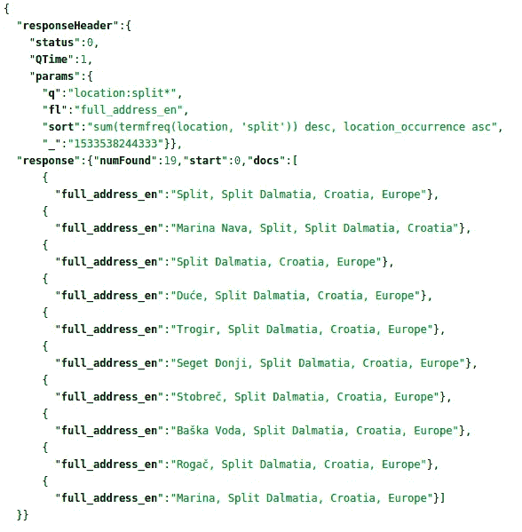
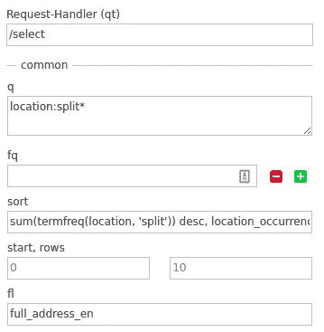

# 对于像我这样的初学者的 Apache Solr 技巧

> 原文：<https://itnext.io/apache-solr-tips-for-beginners-like-me-b27201dcefcf?source=collection_archive---------1----------------------->


## 警告:说到配置 Solr，我还是个初学者

在学习如何使用 Solr 的过程中，我遇到了许多我希望事先知道的事情。所以这篇文章收集了我遇到的(和将要遇到的)事情，你们中的一些人可能会发现找到解决方法也是有帮助的。谈到使用和配置 Solr，我仍然是一个初学者，所以对这些事情要有所保留，并确保自己也做了一些研究。你可以从阅读[文档](http://lucene.apache.org/solr/guide/7_4/)开始，它非常广泛而且写得很好。

# 查询带有空格的字符串

我已经在这个问题上浪费了很多时间。案例:我用一个包含空格的搜索词查询一个字段，一直没有得到任何结果。不含空格的搜索词都能完美运行，所以我很沮丧。要解决这个问题，你需要做的就是避开这个空格。这可以通过两种方式实现:

使用双引号告诉 Solr 这是一个单独的搜索词…

```
field:"string with whitespaces"
```

…或者转义空白

```
field:string\ with\ whitespaces
```

# 存储、索引和文档值字段

存储的字段在查询中是可检索的，这意味着您将能够将它们接收到响应中。任何具有 stored="false "的字段都不会随查询响应一起返回。

索引字段是可搜索、可排序的，并且能够支持分面。这意味着您计划搜索、排序或使用方面的任何字段都应该具有 indexed="true "。

DocValues 字段是将被添加到 Solr 列表中的字段。这意味着如果一个字段具有 docValues 属性，它将作为一个键被添加到一个列表中，整个文档作为一个值。这使得搜索特定的字段非常高效。要启用此功能，请添加 docValues="true "

你可以在文档中看到所有其他的[字段类型定义。](http://lucene.apache.org/solr/guide/7_2/field-type-definitions-and-properties.html#field-default-properties)

# 使用 schema.xml 而不是 managed_scheme

通过更改 solrconfig.xml 中的设置，可以将默认的 managed_scheme 更改为静态 scheme.xml。您可以在与 managed_scheme 文件相同的文件夹中找到该文件。

取消注释或将以下内容添加到 solrconfig.xml 文件中:

```
<schemaFactory class="ClassicIndexSchemaFactory"/>
```

我用它来确保我有我想要的字段，不多也不少。如果您选择使用默认的 managed_scheme，您将能够添加任何您希望添加的字段，这对于非结构化数据来说非常好。但是大多数时候，我确切地知道索引了什么数据，所以在那些场合我不需要那种灵活性。managed_schema 是由 Solr 创建和更新的，而您是在 schema.xml 文件中进行更改的人。所以如果你想完全控制你索引的数据类型，我会选择 schema.xml。

# 基于多值字段中匹配术语的数量对文档进行排序



这是期望的结果，结果按照最高术语密度排列在顶部

经过几个小时的研究，我终于找到了关于堆栈溢出的答案，我可以用它来解决我的问题。要按多值字符串字段中出现的字符串进行排序，必须使用函数查询作为排序文档的方式。

```
sum(termfreq(field, 'search_term')) desc
```

这将按照搜索词的出现次数对文档进行排序，但是为了使其更加相关，您还需要按照多值字段中的词的数量进行排序。因为如果在一个更少单词的集合中有相同数量的匹配，文档就更相关。所以这增加了下面的排序:

```
location_occurrence asc
```

上面这个字段是我在索引时添加的。它表示多值字段中的字符串数量。*我知道我可以用不同的方式来做这件事，通过使用“updateRequestProcessorChain”，但是我还没有想出如何去做。专家们，我很想得到你们的帮助。*所以，在我找到如何做到这一点之前，我会使用这种方法。

在我实现这种排序方法之前，匹配只是:好的，我们找到了一个包含搜索词的记录，给你。*没有办法提高分数** ，因为 Solr 不关心多值字段中匹配项的数量。因此，所有具有该多值字段的文档(包含搜索词)都得到了相同的分数。

**注意:自从写完这一部分，我发现我可以使用一个* [*DisMax 查询解析器*](http://lucene.apache.org/solr/guide/7_2/the-dismax-query-parser.html#qf-query-fields-parameter) *为不同的字段指定不同的提升。我在这里使用的方法对于我的用例来说仍然(大部分)是正确的，但是我将在以后更新它以使用 DisMax 查询解析器。*



这个截图展示了查询在 Solr UI 中的样子。

因此，上面的排序方法有助于将最高的搜索词密度放在顶部，在这种情况下，这就是我们想要的。不同的情况需要不同的相关性规则，但对于这个“简单”的位置关键词建议框，搜索词密度越高，与用户的相关性就越高。

## 一些相关的链接，你可以用来做自己的研究

[StackOverflow:对多值字段的“或查询”中的匹配数进行 Solr 过滤](https://stackoverflow.com/a/16548210)

[Apache Solr Wiki:函数查询，termfreq](https://wiki.apache.org/solr/FunctionQuery#termfreq)

[Apache Solr Lucene:函数查询](https://lucene.apache.org/solr/guide/6_6/function-queries.html)

# 构建不区分大小写的自定义字段类型，并提供转义特殊字符的方法

构建自定义字段类型可能看起来有点吓人，但实际上非常简单。看看下面的配置，你几乎可以猜到字段上的输入会发生什么。

**第一个“过滤器”**是 [KeywordTokenizer](http://lucene.apache.org/solr/guide/7_2/tokenizers.html#keyword-tokenizer) 。这将整个输入字符串视为单个标记，而不是试图将其分成更小的部分。您可以在文档中了解更多信息。

**第二个过滤器**是“[ASCIIFoldingFilterFactory](http://lucene.apache.org/solr/guide/7_2/language-analysis.html#ascii-folding)”过滤器。在这里，我将任何特殊字符映射到不同的、更国际化的字符。这将有助于匹配 primo ten 和 Primosten 以及 Kroati 和 Kroatie。

**第三个过滤器**[TrimFilterFactory](http://lucene.apache.org/solr/guide/7_2/filter-descriptions.html#trim-filter)用于去除输入字符串中任何周围的空白。通常，记号赋予器会在发现空白时将术语分解成小块来处理这个问题。由于我将整个字符串视为单个标记，通过 KeywordTokenizer，我可以很好地利用 trim 过滤器。

**第四个过滤器**使所有输入字符串都是小写的，因此它确保任何搜索都是不区分大小写的。最后一个过滤器确保没有重复的关键字被保存，因为这不是我想要的精确位置计数。

在这种情况下，我将索引过滤规则复制到查询过滤规则中。这不是必需品，我只是觉得有用。在这里你可以改变很多事情。例如，如果您输入一个句子作为查询字符串，您可以将它分解成单个单词，然后搜索最相关的匹配多值字段。

# 工作进展

这仍然是一项进行中的工作，因为我每天都在学习新的东西。当我发现新的东西要记录时，我会更新这篇文章。如果你有任何关于这篇文章的有用资源可以帮助我，请告诉我。我一直在寻找更多关于 Solr 的信息，以及如何更好地使用它。如果你有任何关于 Solr 的问题，我会尽我所能来回答，或者试着给你介绍一些人，他们可能比我更能帮助你。