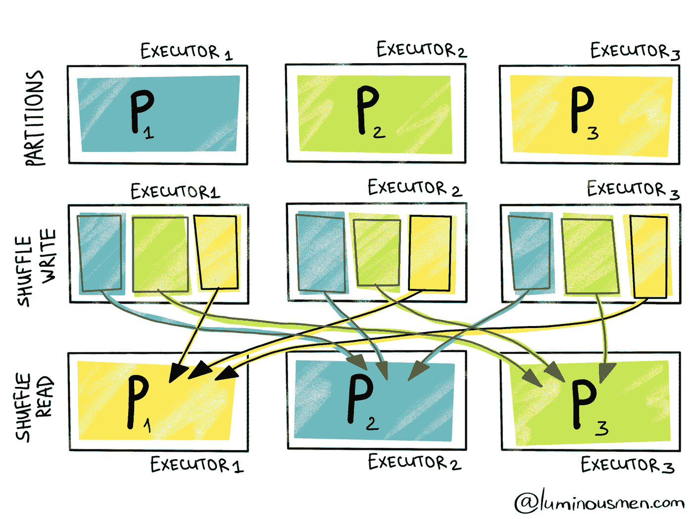
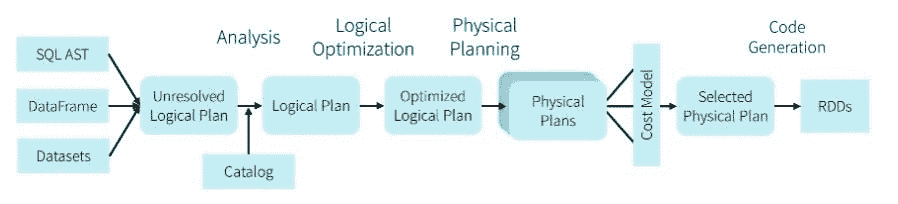
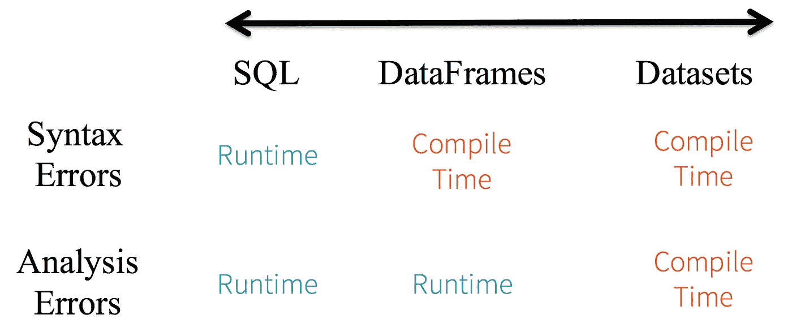

# Apache Spark 内部:技巧和优化

> 原文：<https://itnext.io/apache-spark-internals-tips-and-optimizations-8c3cad527ea2?source=collection_archive---------0----------------------->


由 [Unsplash](https://unsplash.com?utm_source=medium&utm_medium=referral) 上的 [BK GOH](https://unsplash.com/@bkgoh785?utm_source=medium&utm_medium=referral) 拍摄

# 介绍

这篇文章的目标是更深入地挖掘**Apache**[**Spark**](http://spark.apache.org/)的内部，以便更好地理解 Spark 如何工作，这样我们就可以编写**最佳代码，最大化并行性，最小化数据混乱**。

这是我的 [**上一篇文章**](/spark-cassandra-all-you-need-to-know-tips-and-optimizations-d3810cc0bd4e) 的摘录，我推荐在这篇文章之后阅读。我假设您已经对 Spark 有了基本的了解。

# 火花优化

在 Spark 中，您编写转换数据的代码，这些代码被**惰性**评估，并在幕后被转换为**查询计划**，当您调用诸如*收集*()或*写入*)之类的动作时，查询计划被具体化。Spark 将数据分成**个分区**，由**个执行器**处理，每个执行器处理一组分区。在单个分区内执行的操作称为**窄操作**，包括 *map()* 或 *filter()* 等函数。另一方面，聚合是**宽操作**，需要跨节点移动数据，这是非常昂贵的。查询计划本身可以有两种主要类型:逻辑计划和物理计划，我们将在后面讨论。

记住，关于 Spark 性能的主要规则是:**最小化数据混洗**。这是由 Spark 中的 [**宽操作引起的，这种连接或聚合**非常昂贵**因为数据混洗。**](https://medium.com/@dvcanton/wide-and-narrow-dependencies-in-apache-spark-21acf2faf031)


宽依赖性与窄依赖性。来源:[https://medium . com/@ dv canton/wide-and-narrow-dependencies-in-Apache-spark-21 ACF 2 faf 031](https://medium.com/@dvcanton/wide-and-narrow-dependencies-in-apache-spark-21acf2faf031)

总是试图减少数据混洗的次数，实际上，我们将要谈到的大多数优化的目标都是试图这样做:**减少通过网络发送的数据量。**


来源:https://luminousmen.com/

现在让我们回顾一下一些优化…

# 早期过滤

这真的很简单但是**非常重要**。**尽可能早地过滤数据**这样你就不会处理那些以后会被丢弃的数据。越是可以将过滤器下推到数据源，特别是可以通过分区键限制查询的地方，越好。如果可能，在 filter 语句中指定分区键的所有组成部分。此外，如果您打算不止一次地使用来自磁盘的一组数据，请确保使用 ***缓存*** *()* 将其保存在 Spark 内存中，而不是每次都从磁盘中读取。

一个很好的经验是在过滤数据后使用***coalesce****()*方法来减少分区的数量。

# 火花分区和火花连接

这是 Spark 中**关键的**，我真的推荐 [**这篇** **文章**](https://luminousmen.com/post/spark-tips-partition-tuning) 里面详细解释了不同的优化。

## **设置正确的分区数量**

您需要**设置** **正确的分区数量到** **最大化您集群中的并行度**。如果您的分区太少，那么您将无法利用集群中所有可用的核心，从而浪费资源。拥有太多分区将导致管理许多小任务的额外开销，以及降低性能的数据移动。



火花隔板。来源:[https://luminousmen.com/post/spark-tips-partition-tuning](https://luminousmen.com/post/spark-tips-partition-tuning)

对 Spark 的一般建议是让集群中可用于应用的内核数量达到分区数量的 4x，当然，这取决于您的使用案例。当拿不准的时候，最好是**被** **错在更大数量的任务**一边。这需要与执行程序的数量和每个执行程序的内存保持一致，我们将在后面讨论。

## **避免数据偏斜**

一般来说，您希望您的数据在所有节点上平均分布，这在执行连接时特别重要。您的连接键应该均匀分布，以避免数据倾斜。**倾斜的数据会导致并行处理的性能下降**甚至 OOM(内存不足)崩溃，应该避免。

通过查看 **Spark UI** 并检查每项任务花费的时间，您可以**诊断数据的数据偏斜度**。如果一个或多个任务比其他任务花费的时间长，那么就有**不平衡的分区**。

一些**解决方案**可能是:

*   **将数据**重新分区到更均匀分布的密钥上。这是首选选项，使用一个**键，在执行任何宽操作之前自然地将数据**分布到各个分区。
*   使用 [**加盐**](https://medium.com/appsflyer/salting-your-spark-to-scale-e6f1c87dd18) 合成一个额外的随机密钥，以便更好地分配数据。
*   **将数据分为偏斜数据和非偏斜数据**，并通过重新分配偏斜数据来并行处理它们。
*   如果要连接的数据集很小，比如一个事实表，使用 [**广播变量**](https://acadgild.com/blog/broadcast-variables-and-accumulators-in-spark) ，我们将在后面讨论。这对于在事实表上进行查找很有用。
*   使用 [**广播连接**](https://mungingdata.com/apache-spark/broadcast-joins/) 当连接两个数据集且其中一个很小时，这与广播变量具有相同的好处。一个更高级的特性是迭代广播连接，我们分割数据，做许多小的广播连接，而不是大的。

让我们更详细地看看联播吧…

## **火花连接**

默认情况下，Spark user[**Sort Merge****Join**](https://en.wikipedia.org/wiki/Sort-merge_join)非常适合大型数据集。


排序合并联接。来源:[https://towards data science . com/the-art-of-joining-in-spark-dcbd 33d 693 c](https://towardsdatascience.com/the-art-of-joining-in-spark-dcbd33d693c)

这个想法是在连接之前对分区进行排序，以减少数据混乱的数量，但是排序本身是一个昂贵的操作，这个连接的性能会根据连接两端的源数据而有很大的变化，如果数据已经混乱，那么它非常快，如果没有，Spark 将需要执行交换和排序，这将导致数据混乱。


需要交换时排序合并联接。来源:[https://towards data science . com/should-I-repartition-836 f 7842298 c](https://towardsdatascience.com/should-i-repartition-836f7842298c)

当两个数据集都很大时，这种连接技术非常有效，但是当您将一个表与一个小的事实表连接时，这种优势就丧失了。在这种情况下，特别是如果你有一个集群有足够的内存可用，你可以使用**广播加入**。

## **广播加入**

在广播连接的情况下， **Spark 会将数据的副本发送给每个执行器，并保存在内存中**，这可以将性能提高 70%，在某些情况下甚至更高。广播连接的概念类似于我们将在后面讨论的广播变量，但是广播连接是由 Spark 自动处理的，您需要做的只是告诉 Spark 您想要广播哪个表:

```
df = fact_table.join(**broadcast**(dimension_table),                        fact_table.col("dimension_id") === dimension_table.col("id"))
```

请注意，当使用广播连接时，数据在内核之间共享，但每个执行器都有自己的副本，因此平衡内核和执行器很重要，我们将在后面讨论这一点。


广播加入。来源:[https://towards data science . com/the-art-of-joining-in-spark-dcbd 33d 693 c](https://towardsdatascience.com/the-art-of-joining-in-spark-dcbd33d693c)

有关 Spark joins 的更多信息，请查看本文。

## **在昂贵或多重连接之前重新分区**

***repartition()*** 方法允许我们更改集群上的数据分布。这将导致数据混乱，代价很高，但是如果在某些类型的连接之前或者在多个连接之前进行，只要指定列名，就可以**提高性能。正如我们之前看到的，Spark 需要知道数据分布，以便在排序合并连接之前使用它。这可以使用**存储桶**来完成，它以预混洗和可能预排序的状态存储数据，其中关于存储桶的信息存储在 metastore 中。但是，即使您的数据已经排序并在磁盘上对其中一个表进行了混洗，Spark 也不会知道，仍然会对两个表进行重新排序和完全混洗。这就是为什么需要**对数据进行重新分区，以匹配连接**一端的分区，并且可以减少数据混乱，因此只有连接的一端(表)分布在网络上。其思想是，通过指定列，Spark 将元数据添加到逻辑计划中，因此它知道不需要移动数据。例如，如果一个表按 ID 划分为 100 个分区。通过重新划分数据，您可以避免数据混乱:**

```
df**.repartition(100, "id")**.join(..., "id")
```

目标是在连接的两端有相同数量的分区，以避免数据交换。如果分区数量与此属性不同，也会发生数据混洗:

```
spark.sql.shuffle.partitions // default 200
```

它控制 shuffle 期间的**个分区，**个分区，排序合并连接使用它在连接之前对数据进行重新分区和排序。我非常推荐阅读 [**这篇** **文章**](https://towardsdatascience.com/should-i-repartition-836f7842298c) ，它更详细地介绍了连接和数据分区是如何工作的。

一个很好的经验法则是在多次连接或非常昂贵的连接之前尝试重新分区，以避免一次又一次的排序合并连接重新洗牌。

如果您需要减少分区的数量，请使用**联合**而不是*重新分区()*方法，因为它可以最大限度地减少数据混乱，并且不会触发数据交换。在一个过滤器之后，记得使用 *coalesce()，*，因为你会有更少的数据，这比 *repartition()* 更有效，因为它最小化了数据混乱。此外，在重新分区后，始终保持或缓存您的数据，以最大限度地减少数据混乱。但是请记住，重新分区本身是一项开销很大的操作，它会在整个集群中移动数据，所以尽量只在完全必要时使用一次；并且永远记得先做窄操作。

重要的是要记住**一些宽操作，比如 group by，会改变分区的数量**。

## **写入存储前重新分区**

以一种优化阅读的方式编写数据总是一个好主意。在 HDFS，当执行基于列的操作时，您希望使用列格式，如 [**Parquet**](https://parquet.apache.org/) 来提高读取操作的性能。这个我在 [**这个** **篇**](https://towardsdatascience.com/big-data-file-formats-explained-dfaabe9e8b33) 里讲过。其思想是，如果使用正确的文件夹结构创建分区，那么读操作不需要扫描磁盘中的所有数据，而只需要扫描指定的文件夹/分区。

您可以使用以下方法在写入时对数据进行分区:

```
df.write.partitionBy('key').json('/path...')
```

通过将数据存储在不同的文件夹中， [**查询引擎**](/olap-query-engines-for-big-data-5f17b88d6ebc) 可以跳过从磁盘扫描的大量数据，提高读取**性能**。例如，在 **Spark SQL** 中，如果您按日期分区，如果您在 *where* 子句中指定日期，那么只读取一个文件夹，而不是整个数据集，因此查询将花费不到一秒钟而不是几分钟。

如果文件夹结构是这样的:

```
/mydata/2020-02-02/...
/mydata/2020-02-03/...
/mydata/2020-02-04/...
/mydata/2020-02-05/...
```

然后，通过运行以下命令:

```
SELECT * from mydata WHERE date = '2020-02-03'
```

仅读取*2020–02–03*的数据，而不是整个数据集。

## **避免磁盘溢出**

当加入大型数据集时，Spark 需要在数据洗牌期间存储中间数据，如果执行器没有足够的内存，它会将其移动到磁盘，然后加入将变得非常慢，请确保为每个执行器设置正确的内存量( *spark.executor.memory* )，并减少您的数据大小。您也可以通过设置来更改缓冲区的大小:*spark . shuffle . file . buffer*

## 设置正确数量的执行器、内核和内存

重要的是**根据分区数量**设置执行人数量。你的目标是最大化并行性，并且**确保你的 Spark 执行器在整个任务期间都很忙，并且所有的内核都在节点中使用**。

记住，每个执行器处理一个数据子集，也就是一组分区。此外，每个执行器使用一个或多个内核，如属性所设置:

```
spark.executor.cores
```

带纱运行时设置为 1。

在 Spark 中，我们通过将数据分割成分区来实现并行性，这是 Spark 分割数据的方式。分区分布在不同的节点上，每个节点都有一组执行器。然后每个执行器管理一个或多个分区。请注意，在计算级别，每个执行器执行一组任务，因此每个执行器将向同一个分区应用一组函数。所以，这就是为什么您可能希望每个执行器有**多个内核，这样您就可以并行运行独立的任务。重要的是要明白，每个执行器在内存中都有自己的本地和独立数据，包括广播变量(将在后面讨论)和累加器，这两者都使用相当多的内存；但是，这些在内核之间共享。因此，每个执行器只有一个内核意味着需要为每个执行器复制所有数据。此外，I/O 操作，尤其是对可拆分文件格式的 I/O 操作，可以在读写分区时利用多个内核，从而最大限度地提高吞吐量。**

总之，当您使用广播变量、累加器或者您读取/写入大量数据时，您希望每个执行器有多个内核，但不能太多，否则一些内核将无法使用。更多信息请查看[****篇****](https://spoddutur.github.io/spark-notes/distribution_of_executors_cores_and_memory_for_spark_application.html) **。**

**根据经验，每个执行器 3-5 个内核是一个不错的选择**。当然，这取决于分区的数量和分区的大小。如果您有非常小的分区，并且不像广播变量那样使用很多内存，那么建议使用较少的内核。****

**你的目标是找到执行器和内核数量之间的平衡，以及每个执行器的合适内存量。您可以在运行 [spark-submit](https://spark.apache.org/docs/latest/submitting-applications.html) 时设置执行器内存、执行器数量和内核数量。**

```
*# Run on a Spark standalone cluster in cluster deploy mode with supervise*
./bin/spark-submit **\**
  **--class** org.apache.spark.examples.SparkPi **\**
  **--master** spark://207.184.161.138:7077 **\**
  **--deploy-mode** cluster **\**
  **--supervise** **\**
  **--executor-memory** 20G **\**
  **--total-executor-cores** 100 **\**
  /path/to/examples.jar **\**
  1000
```

**也可以将它们作为 Spark 属性传递。**

**为每个执行器设置正确的**内存**也很重要，这需要基于您使用的累加器、广播变量以及在执行连接时数据的大小，正如我们之前看到的，数据是无序的。确保你**设置了警报**，这样你就知道数据溢出是非常低效的。**

## **广播变量**

**我们已经讨论过广播连接，它非常有用并且非常受欢迎，例如，因为连接小数据集和大数据集是很常见的；当您用从 *CSV* 文件上传的小事实表连接您的表时。**

**在这种情况下，想法是**将数据复制到每个执行器**，因此不需要移动任何数据，并且连接是在本地完成的，因为连接的一端完全存储在每个节点的内存中。这是 Spark 中广播的思想，对于连接和变量都是如此。**

**连接由 Spark 在幕后为您管理，因此易于使用。需要在代码中创建广播变量。您可以存储任何 *JVM* 对象，只要它是可序列化的。我们将在下一节讨论序列化。**

**要创建广播变量:**

```
val df = spark.sparkContext.broadcast(data)
```

**注意，数据不能是数据帧或数据集，需要是一个常规对象，所以需要调用 *collect()* 方法获取所有数据，然后发送给执行者。**

## **Spark 序列化**

**有几篇文章和几本书教你如何优化你的 Spark 代码，然而，你能做的提高所有代码的 Spark 性能的最有效的事情就是**去除 Java 序列化。****

**Java 序列化效率很低，也不安全；会拖慢你的工作。**

**您需要了解 Spark 如何运行应用程序。简而言之，驱动程序需要序列化您的代码并将其发送到所有节点，因此广播变量和作业本身需要通过网络传输，此外，中间数据和元数据也需要序列化。这种情况在发动机罩下经常发生，对于您的应用来说，它可能是一个瓶颈**。****

**如果您在 Spark 中遇到过著名的“*任务不可序列化*”错误，那么您应该知道我在说什么。理解代码的哪些部分需要序列化，哪些不需要是至关重要的。您的目标是识别这些对象，并通过使用另一种可序列化的格式来优化它们。要解决连载问题，我真的建议看一看 [**这篇** **文章**](https://medium.com/swlh/spark-serialization-errors-e0eebcf0f6e6) 。一般来说，**确保传递给闭包的所有对象都是可序列化的。****

**Java 序列化最著名的 Spark 替代方案是 [**Kryo 序列化**](https://github.com/EsotericSoftware/kryo) ，可以将序列化性能提高几个数量级。**

****

**Kryo 性能 vs Java，来源:[https://docs . mulesoft . com/mule-runtime/3.9/用 kryo 序列化器提高性能](https://docs.mulesoft.com/mule-runtime/3.9/improving-performance-with-the-kryo-serializer)**

**许多 Spark 开发人员选择不使用它，因为您需要使用以下方法注册您使用的每个类:**

```
Kryo kryo = new Kryo();
kryo.register(SomeClass.class);
```

**但是我真的建议你从项目一开始就启用 Kryo 来利用性能提升。**注意**如果你依赖数据集 API，那么你可能不需要 Kryo，因为你的类将使用比 Kryo 更有效的钨编码器，我们将在后面讨论它们。**

## **火花催化剂**

**我把最好的优化留到了最后。Spark 有一个秘密武器，可以极大地提高你的工作效率，最棒的是你几乎不用做任何事情就可以使用它，它在引擎盖下运行。我们之前已经接触过这个特性: [**火花催化发动机**](https://databricks.com/glossary/catalyst-optimizer) **。它基本上以一种最佳的方式重写了你的代码。****

**Catalyst 在数据框 API 和部分数据集 API 中可用。**RDD API**中没有。它是 [**Spark SQL**](https://spark.apache.org/sql/) 层的一部分，其背后的想法是使用 RDBMS 世界多年来完成的所有优化，并将它们带到 [**Spark SQL**](https://spark.apache.org/sql/) 。由于 SQL 提供了一个已知的数学模型，Spark Catalyst 可以理解数据，做出假设并优化代码。在引擎盖下，Spark 运行一个复杂的工作流程，将你的代码完全改写成一个更难理解但更有效的代码。**

**把 Spark 数据框架 API 想象成一种声明性的语言，而不是真正的代码。你就像是在这个引擎上写东西，这个引擎会解释你的代码并优化它。这是在 Spark 中触发动作时发生的过程:**

****

**催化剂工作流程**

**简而言之，**它创建了一个优化的逻辑计划，并将其划分为多个物理计划**。然后，它为物理计划生成代码，并将代码分发给执行者(还记得为什么序列化很重要吗？).Catalyst 通过在逻辑查询计划上应用一系列转换，如谓词下推、列修剪和常量折叠，从逻辑查询计划生成优化的物理查询计划。**

**Catalyst Optimizer 有两种类型的优化:**

*   ****基于成本的优化器**:由于数据帧是基于 SQL 的，Catalyst 可以计算每条路径的成本并分析哪条路径更便宜，然后执行那条路径来提高查询执行。**
*   ****基于规则的优化器**:包括常量合并、谓词下推、投影修剪、空传播、布尔简化和其他规则。**

**Catalyst 还会**自动执行广播连接**当连接的一端很小时，可以使用该属性设置阈值:**

```
spark.sql.autoBroadcastJoinThreshold
```

## **钨项目**

**数据帧和数据集 API 也有利于 [**项目** **钨**](https://databricks.com/blog/2015/04/28/project-tungsten-bringing-spark-closer-to-bare-metal.html) ，该项目旨在修复我们之前提到的**序列化**问题、内存管理和**性能**。它使用优化的内存格式和不需要垃圾收集的堆外内存。**

**它通过执行以下操作来优化 Spark 作业的 CPU 和内存效率:**

1.  **堆外内存管理使用二进制内存数据表示，这是钨行格式。**
2.  **高速缓存局部性，这是关于高速缓存感知计算和高速缓存感知布局，以实现高高速缓存命中率。**
3.  **全阶段代码生成(CodeGen)。**

**这就是为什么在使用数据集 API 时需要使用 [**编码器**](https://spark.apache.org/docs/latest/api/java/org/apache/spark/sql/Encoders.html) 的原因，这些负责堆外优化。您可以在数据框和数据集 API 中免费获得，但数据集会得到更好的优化。更多信息请查看这篇 [**伟大的** **文章**](https://www.linkedin.com/pulse/catalyst-tungsten-apache-sparks-speeding-engine-deepak-rajak/?articleId=6674601890514378752) 。**

*   *****RDDs 呢？*** 催化剂毫无办法，这是自我实现的方法。实际上 Catalyst 生成 RDD 代码，这是最终结果。此外，您需要管理序列化。**
*   *****Catalyst 是否优化数据集 API？*** 是和否。最初，数据集 API 较慢，因为 Catalyst " *看不到*"您在代码中做了什么，因为数据集语法比固定的 SQL 语法更广泛。但是如果你用的是最新版本的 Spark ( *3.0* )，那么大部分优化都是可用的。尽管如此，数据框架 API 在优化您的查询方面会更有效一些；对于数据集，你需要更加小心，但是如果你写了好的 Spark 代码，差别是很小的。此外，数据集具有[更好的空间和速度性能](https://databricks.com/blog/2016/07/14/a-tale-of-three-apache-spark-apis-rdds-dataframes-and-datasets.html)，数据集钨优化优于数据帧。我的建议是 **Spark SQL 和数据帧**应该由**数据科学家**使用，他们对 Spark 没有深入的了解，Catalyst 会为他们优化代码。**数据集 API 是 Scala 工程师的理想选择**,他们对 Spark 内部有很好的了解。**

****

**Spark APIs 比较。来源:[https://databricks . com/blog/2016/07/14/a-tale-of-three-Apache-spark-APIs-rdds-data frames-and-datasets . html](https://databricks.com/blog/2016/07/14/a-tale-of-three-apache-spark-apis-rdds-dataframes-and-datasets.html)**

*   *****如果使用数据集 API，需要 Kryo 吗？*** 是也不是。钨将使用编码器管理你的 case 类，但仍有其他部分的代码需要序列化，启用 Kryo 会有所帮助。如果你使用数据集 API，我建议跳过 Kryo，除非你需要最大化性能。**

## **其他 Spark 优化**

*   **尽可能使用***reduce by/aggregate by***方法，而不是 ***groupBy*** ，因为它们减少了数据混乱。它工作得更快，因为 Spark 在混合数据之前知道每个分区上的公共键的组合输出。**
*   **避免 ***reduceByKey*** 当输入输出值类型不同时，用 use `**aggregateByKey**` 代替；**如果类型相同，使用 *reduceByKey* 如果不相同*aggregate by key*。****
*   **在重新分区和写入之前，使用***local check point****()*方法。这是为了在混洗阶段和写入操作之间创建阶段屏障。**
*   **不要用 ***收*** *()* 的方法。它会尝试将所有数据移动到驱动程序中，在那里它可能会耗尽内存并崩溃。仅将它用于调试目的或创建定义为小尺寸的广播变量。**
*   **使用正确的 [**文件格式**](https://towardsdatascience.com/big-data-file-formats-explained-dfaabe9e8b33) 。 [**Avro**](https://avro.apache.org/) **用于行级操作** [**用于列级操作**](https://parquet.apache.org/) **或 ORC**等 Spark SQL。压缩数据并确保格式是可拆分的，这样它就可以被 Spark 阅读器并行读取。**可拆分格式有 lso、bzip2、snappy** 等。不可分割的 gzip，zip，lz4…**
*   ****监控和可观察性**关键是火花。在写入磁盘之前，作为最后一步，使用 ***explain()*** 方法来验证我们谈到的所有优化都发生了。检查预期的 Catalyst 优化是否已完成，过滤器是否已推送到源，查询是否已重新安排，数据混乱是否已最小化，等等。启用 [**Spark 历史服务器**](https://supergloo.com/spark-monitoring/spark-performance-monitoring-history-server/) 来分析和观察您的作业的进展，并检测任何可能导致性能问题的变化。**

**如您所见，所有这些优化的目标都是减少数据移动。为此，总是**尽可能多地过滤**数据。尝试**最小化宽操作**。如果数据集将被多次使用，则缓存这些数据集。在执行连接或写入磁盘之前，确保您的**数据被均匀分区**。注意数据局部性，记得使用 **Spark UI** 和 *explain()* 方法来理解 Spark 逻辑和物理计划。**

# **结论**

**在本文中，我们展开了 Spark 的**内部，以便能够理解它如何工作以及如何优化它。关于 Spark，我们可以用两个要点来总结我们的经验:****

*   ****最小化数据洗牌，最大化数据局部性。****
*   ****使用数据帧或数据集高级 API 来利用 Spark 优化。****

**如果你是 Scala 开发人员，请记住 Spark 高阶函数与 Scala 中的不同，你真的需要理解 Spark 和 Catalyst 引擎是如何工作的。**

*****祝您大数据之旅好运！*****

***如果你喜欢这篇文章，记得鼓掌，并关注我的更多更新！***

**我希望你喜欢这篇文章。欢迎发表评论或分享这篇文章。跟随[***me***](https://twitter.com/JavierRamosRod)**进行未来岗位。****