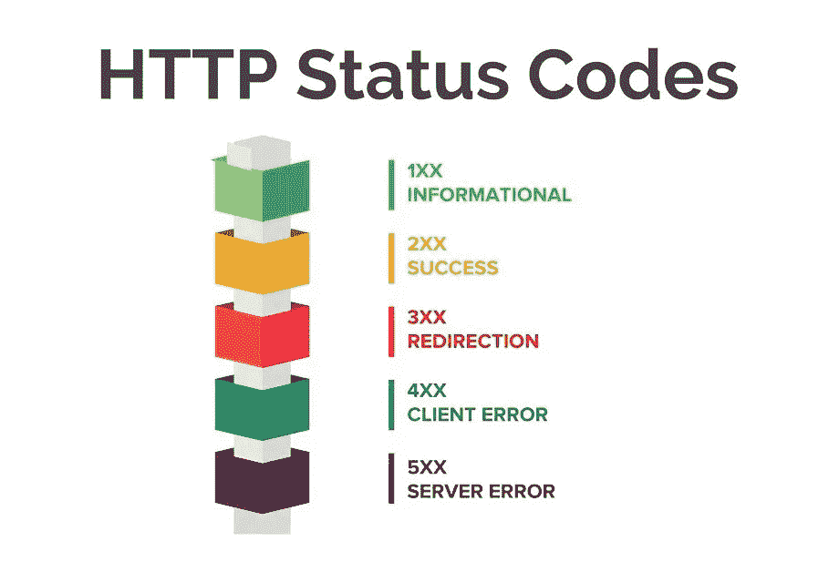

# API 调用和 HTTP 状态代码

> 原文：<https://itnext.io/api-calls-and-http-status-codes-e0240f78f585?source=collection_archive---------0----------------------->

## 为什么你不应该在几乎所有事情上使用状态 200



来源:https://www.youtube.com/watch?v=LtNSd_4txVc

这是一个我已经谈过很多次的话题，它通常以争论结束，因为它非常固执己见。

## 使用案例

假设您有一个运行在某个 web 服务器上的 API，不管是哪一个。除非您已经登录到 web 应用程序，否则无法访问登录端点和其他一些资源。要请求这些资源，您需要输入一些凭证、用户和密码，登录会被拒绝。

## 服务器应该返回什么状态代码？

*   *200* 请求是**成功的**，因为端点确实存在并进行一些内部验证，但是响应必须包括一些关于为什么访问被拒绝的信息。
*   *401* 访问**未授权。**回应中不需要额外信息。
*   *403* 访问被**禁止**并且响应包括关于访问被拒绝的信息。
*   *503* 不能做任何事情，除非用户登录被验证和授权(**服务不可用**)。
*   其他状态代码(让我们发挥创意)

我在一些工作申请的技术测试中见过这种问题。

通常的答案在 200 和 401 状态代码之间有所不同，在两者之间也有一些变化。起初我回答说这取决于 API 实现，所以这两个代码都是有效的，但是第二个想法导致我的回答是 401 状态代码，带有一些额外的信息，尽管代码本身就足够了。

为了解释这一点，我将使用 404 代码作为参考，并用一个例子来说明。

# 图像服务器

假设您正在开发一个必须从 API 访问一些图像的应用程序。每个图像都保存在一个/img 文件夹中，但是一些文件名带有“ *protected-* ”前缀的图像需要用户密码授权。

不管这些限制是如何实现的，你的应用程序都可以正常工作。(粗体字表示重要)

直接使用 nginx 配置，它会是*类似于*的东西:

```
location ~* \.(protected-.*\.)(jpg|gif|png)$ {
  auth_basic “Restricted”;
  auth_basic_user_file /etc/nginx/.htpasswd;
}
```

Nginx 配置就是这样，并不是说它和上面的代码一模一样，或者说代码会工作。
基本上，它在所有匹配 *protected-*的图像上应用一个基本的认证"*安全*"层。** 如果需要这些图像中的任何一个，询问用户/密码对。Apache web 服务器也有类似的东西。更多信息请访问:

*   [https://docs . nginx . com/nginx/admin-guide/security-controls/configuring-http-basic-authentic ation/](https://docs.nginx.com/nginx/admin-guide/security-controls/configuring-http-basic-authentication/)
*   [https://www . journal dev . com/26342/nginx-location-directive # 4-nginx-location-regex-example](https://www.journaldev.com/26342/nginx-location-directive#4-nginx-location-regex-example)

因此，如果应用程序请求文件[https://image-server/img/house . jpg](http://image-server/img/house.jpg)，它应该返回 200 状态和请求的文件 house.jpg

如果应用程序请求文件[https://image-server/img/protected-secret . png](https://image-server/img/protected-secret.png)，它应该返回一个 401 代码并要求用户凭证。如果给定了用户凭证(作为授权头),但登录失败，则返回 401 代码。如果登录成功，请求将返回 200 代码和请求的 protected-secret.png 文件(如果文件存在，否则应该返回 404)。

假设应用程序请求文件 *yoda.gif* ，而服务器上没有 yoda 文件。你会得到一个 404 代码，文件/资源没有找到。

对于一个不存在的*protected-vader.jpg*文件的请求呢？它将首先要求凭证(这是一个 401 代码)，如果凭证被成功验证，一个 404 代码，因为没有找到资源。

# API 调用是资源请求

对于服务器来说，每个端点都是一个资源，所以每个 API 调用也是一个资源请求。所以最后，你的资源是如何被服务的并不重要，除非你想对每件事都使用错误的代码，比如成功的请求使用 400(***请不要…*** )。

为了解释这一点，我将展示另一个同样的实现。为此，我将使用 NodeJS 和 Express，你可以用任何其他语言做同样的事情。

```
// […]
// Libraries, requires and else above this lines
// WARNING: This is not a complete copy & pastable codeconst validatePwd = (req, res, next) => {
  // do validation pseudo-code ahead
  // check if file has to be protected
  if((req.param[‘imgfile’]).indexOf(‘protected-’) === 0){
    // validate user and password
    if( user:password are not authorized) {
      res.status(401)
       .json({
         statusCode: 401,
         error: true,
         msg: ‘Invalid credentials’
      });
    } }
  // else continue
  next();};app.get(‘/img/:imgfile’, validatePwd, (req, res) => {
  // if the endpoint flow has continued here it means the file 
  // is not protected, or that user:password are valid // Build a real file path to get the image file. storagepath 
  // is the real folder where images are stored
  let imgpath = path.join(storagepath, req.params[‘imgfile’]); // Return the image file only if it exists, otherwise return a 404
  if(fs.existsSync(imgpath)){
    res.writeHead(200, {‘content-type’:’image’});
    fs.createReadStream(img).pipe(res);
  } else {
    // File does not exist
    res.status(404)
      .json({
        statusCode: 404,
        error: true,
        msg: `File ${req.params[‘imgfile’]} not found` }); }
});
```

*但是请等待，即使凭证被正确验证并且访问被授权，如果对不存在的文件(如 protected-vader.jpg)发出请求，该请求将通过现有的 API 端点提供服务。那不应该返回一个 200 的代码吗？API 端点确实存在，并且它已经执行了所有必需的操作来验证凭据和文件是否存在。*


没错。我一直都是这个意思。端点(在这个上下文中我更喜欢称它们为资源)**确实存在**。

如果你对 HTTP 状态码的理解仅限于:

*   *200 资源存在(并处理请求)*
*   资源不存在

关于后端 web 开发，至少有一些东西是你不明白的。

***/img/:imgfile*** 端点会一直存在，它会一直发送响应。但是，如果文件不存在，那么这种带有额外信息的 200 代码的响应是没有意义的，这就像成功和失败都有相同的答案一样:

*200:拇指好，你的请求成功* 

这同样适用于服务器授权，并且想不出任何 HTTP 状态代码可以避开这个逻辑。对您的 *API* 正在处理的每个请求都响应 200 是没有意义的。


如果发生这种情况，每个客户端应用程序都应该在内部处理错误，就像它们是成功的请求一样，并且代码立即变得紧密耦合，以至于更改 *API* (考虑到 ***图像服务器*** 部分的基本要求)将需要为 *API* 调用重写应用程序的代码。

对于您正在编写的任何代码来说，紧耦合都不是一个好兆头。

大多数时候，如果我必须设计一个 API，我会考虑如何使用简单的服务器配置来解决这个问题；如果需要任何额外的信息作为响应，我通常会发送一些内部状态代码和消息，以及请求正在应答的任何额外数据。

对于每个请求来说，code 200 可能是有效响应代码的唯一场景是，当您不介意紧密耦合，也不介意重写客户端应用程序代码，或者您是负责开发 API、应用程序等的唯一开发人员(并且您不介意吃自己的 sh*t)。即使这样，我仍然不同意编写蹩脚的、紧耦合的代码；我永远也不会实施糟糕的开发实践。

仔细考虑你的 API 响应代码；你身边的每一个使用你开发的 API 的开发者，都会为此感谢你(或者不会恨你，更少恨你，更爱你，等等)。)

关于 https://www.restapitutorial.com/httpstatuscodes.html[的进一步参考和说明](https://www.restapitutorial.com/httpstatuscodes.html)