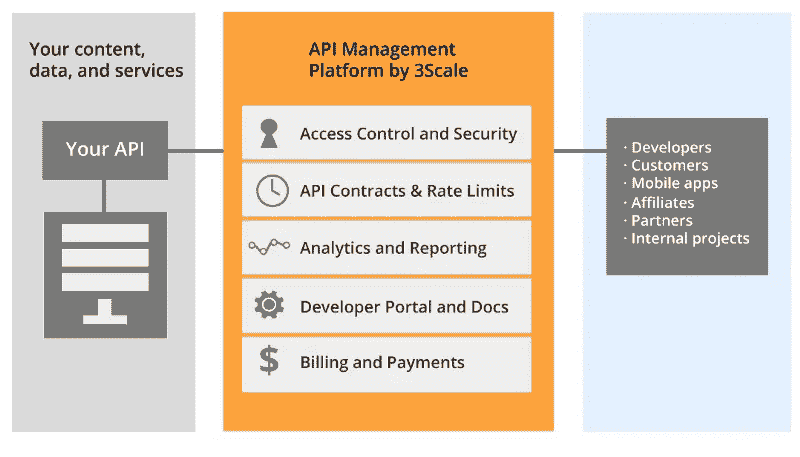
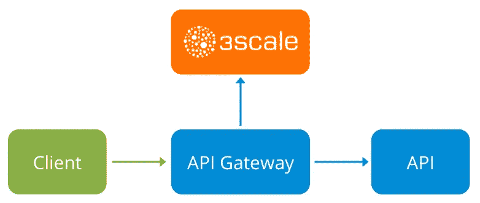
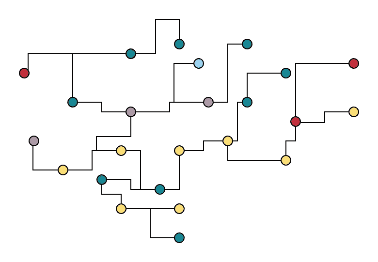
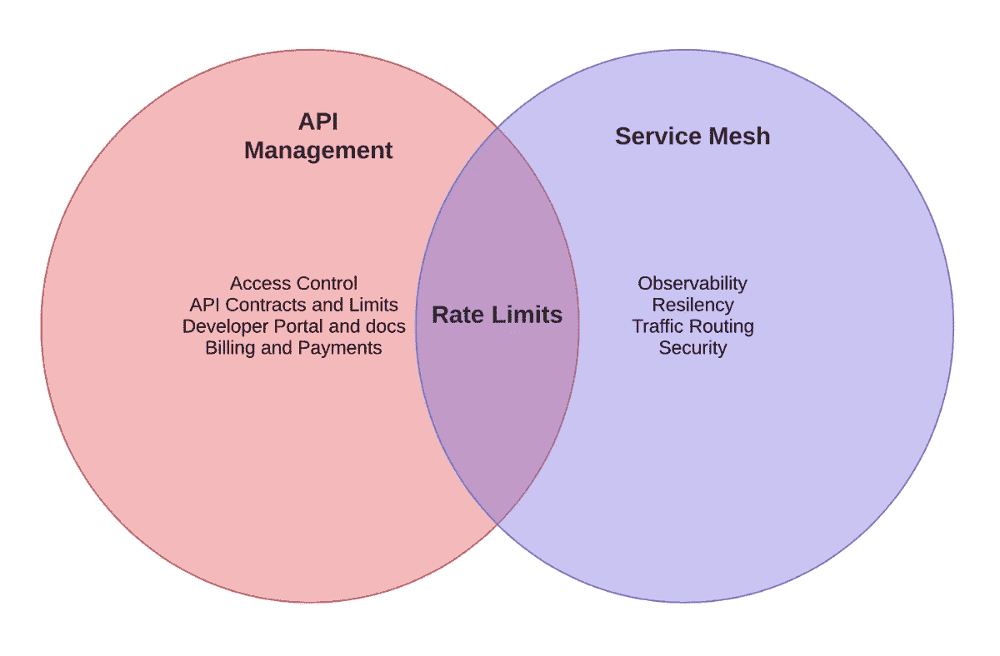

# API 管理和服务网格

> 原文：<https://itnext.io/api-management-and-service-mesh-e7f0e686090e?source=collection_archive---------0----------------------->

为什么服务网格不能替代 API 管理

作为免责声明，我在 Red Hat 工作，更确切地说，在 3scale 团队(2 年前收购)开发 3scale API 管理解决方案。最近，在与我们的客户交谈时，一个问题越来越多地出现了:

> "如果我使用 Istio，为什么我需要 API 管理？"

要回答这个问题，首先我们要明白什么是什么，但如果你想要一个剧透: *3scale API 管理和 Istio 在一起很惊艳。*

我将尝试描述这两个解决方案旨在解决什么问题，重点是 3scale API 管理和 Istio 服务网格(这是我比较了解的两个)。

# 什么是 API 管理解决方案？

如果我们看一看维基百科:

> API 管理是创建和发布 web APIs、实施其使用策略、控制访问、培育订户社区、收集和分析使用统计数据以及报告性能的过程

这是个很好的定义。*作为一家已经创建了某种**内部服务**的*公司，我现在想**通过**向外部用户**提供 API 来围绕它建立一项业务**。当然，我希望**通过提供几个**具有不同**使用限制、范围**的订阅计划**来将其货币化**，并且能够**自动向我的客户**开具发票。

此外，**外部开发者应该很容易找到我的 API**,**用他们的信用卡自助注册一个计划**，所有这些对我的 API 代码应该是**透明的**

如果我们分析这些需求，我们可以将它们分为以下几类:

*   **访问控制和安全**:控制谁可以访问我的 API 以及如何访问。
*   **API 合同&费率限制**:一个用户基于订阅可以做多少请求。
*   **分析和报告**:你的 API 做得怎么样？哪些方法用的最多？有错误吗？哪些是热门/趋势 API？
*   **开发者门户，文档**:让开发者找到你的 API 并注册订阅计划
*   **开票**:发送发票，向开发商收费。

API 管理解决方案如何实施所有这些？多亏了一个叫做的**关键组件****API 网关**。

这是一个位于流量中间的组件，因此客户端的请求通过它，保护您的 API 端点，并与其他 API 管理组件进行通信，以允许用户访问或不访问您的 API。

这通常是通过对用户请求进行身份验证和“速率限制”来实现的，想象一下这个场景:

*   **用户 A** 订购了**“基本”**计划
*   **“基本”计划为几个 API 操作** (HTTP 方法+ HTTP 路径)定义了一些限制，例如:“获取/产品”和“过帐/发货”
*   这些限制可以被定义，每秒，每分钟，每月…
*   “获取/产品”被限制为每分钟最多 10 个请求。

在这种情况下，当用户 A 试图在一分钟内发出 10 个以上的请求时，这些额外的请求将受到 429(太多请求)的速率限制，或者如果身份验证无效，用户将得到 403(禁止)，身份验证可以作为 OAuth 的一部分、一些查询参数或标头提供。

速率限制是 API 管理的关键部分。这就是 API 网关对最终用户实施业务规则的方式，但有必要了解，速率限制可能非常复杂，基于多个规则，也可能非常简单，如每个客户端 IP。定义真正复杂的速率限制场景(业务规则)的能力使得 API 管理如此强大。

所以，让我大声说出来:

> API 管理不(仅仅)限制速率。

# 什么是服务网格？

以前，我们谈论 API，我们不谈论服务、应用程序、端口、连接、重试…因为在 API 管理层，我们并不真正关心这些，但我们现在会关心。

你牛逼的 API 背后到底是什么？多个服务相互对话，相互作用，形成一个单一的大 API，每个 API 都用不同的编程语言编写，由一个大组织内世界各地的不同团队维护和操作。这有印象吗？是啊！微服务！

微服务。或者是相连的点。

因此，我们有了由多种服务组成的大型 API，这听起来很不错，但是越来越多的团队正在为新功能和/或新需求推出新服务，在某个时间点，由于您的架构的运营复杂性不断增加而产生的疑问和问题将会出现:

*   如果服务间的任何**内部请求失败**会发生什么
*   我的**请求在哪里失败了**？
*   为什么这个 **API 端点这么慢**？**哪个服务有问题？**
*   这项服务很容易出错……如果失败了，我们能重试这些电话吗??
*   有人每天都在同一时间敲打这个服务，我们应该增加一些**速率限制**来避免这种情况！
*   那个服务应该不能联系另一个服务

这些问题是服务网格可以帮助解决的。并且属于这些类别类型:

*   **弹性**:超时、重试、断路器、故障处理、负载平衡
*   **速率限制**:基于多源的基础设施速率限制。
*   **流量路由**:路径、主机、头、cookie 库、源服务等路由能力
*   **可观察性**:度量、日志、分布式跟踪
*   **安全** : mTLS，RBAC…

所有这些对应用程序来说都是透明的。

让我们看看 **Istio** 是如何工作的 **:**

Istio 组件图

Istio 使用“sidecar container”模式，通过在同一个 [POD](https://docs.openshift.com/online/architecture/core_concepts/pods_and_services.html#pods) 中运行第二个容器来扩展“主”容器的功能。“主”容器是我们的应用程序，sidecar 容器是 Istio 代理，这是基于“特使”的。

一旦注入，所有进出主容器的流量都将被代理“劫持”(使用 Iptables 魔术),正如您在前面的图表中看到的。

这允许 Istio 控制流量，并向控制平面报告正在发生的情况。更具体地说是*混合器*，遥测和策略引擎。

# 他们有什么共同点？

我们已经定义了这两种技术，您看到了什么共同点？他们试图解决不同的问题，但使用一些类似的技术…

这两种解决方案有一个共同点:

但是重要的是要记住，速率限制是用来执行不同的事情的:商业规则 T21 或基础设施限制。

因此，它们并不相互排斥，我们应该将它们视为基础架构中的不同层:

1.  **API 管理:**根据开发者、订阅计划、应用程序、发票等处理对您的 API 的访问
2.  **服务网格**:让你的 API 服务安全、易于监控、灵活。

# 我们如何结合 3scale API 管理和 Istio 服务网格？

请继续关注一系列关于 **3scale 如何通过使用我们的 [API 网关 APIcast](https://github.com/3scale/apicast) 或**使用 [3scale Istio 适配器](https://github.com/3scale/istio-integration/tree/master/3scaleAdapter)对 Istio 进行本机**扩展来为 Istio 服务网格**添加完整的 API 管理功能的技术文章。