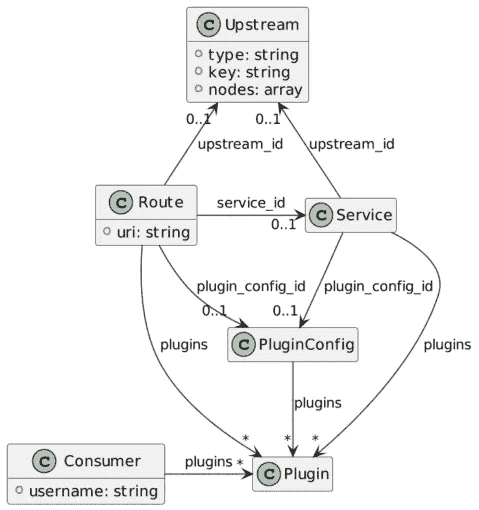

# APISIX，Apache 方式的 API 网关

> 原文：<https://itnext.io/apisix-api-gateway-f5650ab86be4?source=collection_archive---------5----------------------->


在万维网的先驱领域，内容是静态的。为了服务它，一组开发人员创建了一个 web 服务器，现在被称为 [Apache Web 服务器](https://httpd.apache.org/)。

Apache Web 服务器是围绕模块架构构建的。开发人员创建了一个模块来运行 CGI 脚本，以便向批次添加动态内容。用户用 Perl 编写早期的 CGI 脚本。过了一段时间，很明显从头开始生成一个完整的 HTML 页面并不是最好的方法，而模板化——提供一个带有占位符的 HTML 页面——是一个更好的方法。PHP 语言就是这样开始的，作为一个由模块解释的简单模板引擎。

然后，人们开始认为 web 服务器的核心职责不是生成内容，而是提供服务。这种关注点的分离将单一的 web 服务器分成了两个部分:前端的 web 服务器提供静态内容，应用服务器生成动态内容，通常是从存储在数据库中的数据生成的。

# 反向代理

尽管应用服务器可以提供静态内容，但是组织仍然保留了这种架构。我记得在 2007 年左右，我读过一篇文章，对 Apache Web 服务器和 Apache Tomcat(一种基于 Java 的应用服务器)的性能进行了基准测试:为了提供纯静态内容，后者与前者不相上下，甚至更快。

理论上，移除网络服务器是合理的。我甚至向我当时工作的公司经理倡议过一次。组织惯性减缓了主动性，然后我就走了。当时，我感到失望。事后看来，这并不是明智之举。

原因是除了直接提供内容，web 服务器还必须将请求路由到其他组件。在这方面，他们也成为路由专家，基于一些属性:域，当然，路径，甚至一个 HTTP 头。因此，web 服务器的职责不再是提供内容，而是成为基础设施其余部分的单一入口点。

与此同时，专注于交流的网站发展成了成熟的网络交易应用。网络应用在公司与其周围生态系统——潜在客户、客户、提供商等——的互动中占据了越来越大的份额。当您的企业依赖于某个基础设施时，您需要将其停机时间保持在最低限度:这意味着配置关键组件的冗余，并将请求定向到可用的组件。路由不再是简单的路由，而是几个相同服务器之间的负载平衡。

引入负载平衡后，添加越来越多的功能变得很容易。入口点开始处理跨领域的职责:身份验证(但不总是授权)、缓存、IP 阻塞等。网络服务器变成了一个反向代理服务器。

# 原料药的兴起

随着时间的推移，服务的数量随着它们相互通信的需求呈指数级增长。在同一个组织中，长期以来的传统是保持尽可能少的技术堆栈，具体数量取决于组织的规模。

然而，当服务必须与来自另一个组织的服务通信时，事情变得一团糟，因为拥有不同技术堆栈的可能性变得更高了。SOAP 诞生于微软，后来成为 W3C 标准(或标准的集合)，是第一个提出堆栈中立方法的严肃尝试。

虽然它在企业世界中变得广泛，但它在自己的重压下崩溃了。在企业中，标准的添加成了一个泥潭。在企业外部，前端开发人员(即 JavaScript)发现处理 HTTP 和 JSON 要容易得多。越多的前端开发者进入市场，他们就越不想和 SOAP 打交道。

当 SOAP 的流行减弱时，HTTP 的流行(我不敢写 REST)却增强了。HTTP 成为了在互联网上集成异构信息系统的事实标准。公司开始通过 HTTP:Web API 提供对他们系统的访问。很快，大多数都放弃了 Web 部件，API 隐式地暗示了 Web with time。

考虑到这一点，我们忠实的 web 服务器发展成了它现在的形式，API gateway。这很有意义:web 服务器已经作为反向代理的中心入口点。现在，我们只需要添加特定于 API 的功能。他们是哪几个？

# 对 API 网关的需求

这里有两个基本功能，它们强调了对 API 的需求，而这是常规 web 服务器无法提供的。

*   复杂的速率限制:速率限制是一种通用功能，用于保护信息系统免受 DDoS 攻击。然而，当您区分消费者时，例如，免费与付费，您需要从简单的费率转移到更复杂的业务逻辑规则。
*   付费:如果你支付了订阅费，你就可以访问常规内容的资源。然而，当你的业务是出售数据时，你可能会根据数据量来出售数据。虽然服务本身有可能嵌入计费功能，但它会阻止更多依赖于几个服务来提供所需数据的分布式体系结构。在这一点上，只有中央接入点可以可靠地测量和收费使用。

# 阿帕奇 APISIX

最广泛使用的 API 网关的非详尽列表包括:

*   阿帕奇 APISIX
*   孔门户
*   Tyk
*   格洛
*   大使
*   重力仪

请注意，我故意忽略了云提供商的网关，因为他们将您锁定在他们的生态系统中。

APISIX 在刘彘技术公司开发后，于 2019 年 6 月捐赠给[阿帕奇基金会](https://www.apache.org/)，并于 2020 年 7 月成为顶级项目。作为 ASF [精英管理](https://www.apache.org/foundation/how-it-works.html#meritocracy)方法的一部分，你必须首先成为一名积极的贡献者，才能获得提交者的权利。

在技术方面，APISIX 基于流行的 Nginx web 服务器，顶部有 Lua 引擎(OpenResty)和插件架构。

APISIX 提供了几个核心对象:

*   上游:“根据配置规则在一组给定的服务节点上执行负载平衡的虚拟主机抽象”
*   消费者:客户的身份
*   route:“route 通过定义规则匹配客户端的请求，然后根据匹配结果加载并执行相应的插件，将请求转发到指定的上游。”
*   服务:绑定一组插件和一个上游插件的可重用对象。



对象存储在 [etcd](https://etcd.io/) 中，这是一个分布式键值存储，Kubernetes 也使用它。Apache APISIX 公开了一个 REST API，这样您就可以以一种与技术无关的方式访问配置。在此，我们请求所有现有路线:

```
curl [http://apisix:9080/apisix/admin/routes](http://apisix:9080/apisix/admin/routes) -H 'X-API-KEY: xyz' # 1
```

1.  默认情况下，配置访问受到保护。需要传递 API 密钥。

使用其他对象的对象可以定义它们或指向现有引用。例如，可以将独立的`Route`定义为:

```
curl [http://apisix:9080/apisix/admin/routes/1](http://apisix:9080/apisix/admin/routes/1) -H 'X-API-KEY: xyz' -X PUT -d '
{
  "uri": "/foo",
  "upstream": {
    "type": "roundrobin",
    "nodes": {
      "127.0.0.1:8080": 1
    }
  }
}'
```

或者，首先定义一个`Upstream`:

```
curl [http://apisix:9080/apisix/admin/upstreams/1](http://apisix:9080/apisix/admin/upstreams/1) -H 'X-API-KEY: xyz' -X PUT -d '
{
  "type": "roundrobin",
  "nodes": {
    "127.0.0.1:8080": 1
  }
}'
```

我们现在可以在新的`Route`中引用新创建的`Upstream`:

```
curl [http://apisix:9080/apisix/admin/routes/2](http://apisix:9080/apisix/admin/routes/2) -H 'X-API-KEY: xyz' -X PUT -d '
{
  "uri": "/bar",
  "upstream_id": 1
}'
```

# 弄湿你的脚

试用 Apache APISIX 的最快方法是通过 Docker。Apache APISIX 的配置依赖于 etcd，所以让我们使用 Docker Compose:

```
version: "3"services:
  apisix:
    image: apache/apisix:2.12.1-alpine                           # 1
    command: sh -c "/opt/util/wait-for etcd:2397 -- /usr/bin/apisix init && /usr/bin/apisix init_etcd && /usr/local/openresty/bin/openresty -p /usr/local/apisix -g 'daemon off;'"            # 2
    volumes:
      - ./apisix_log:/usr/local/apisix/logs
      - ./apisix_conf/config.yaml:/usr/local/apisix/conf/config.yaml:ro
      - ./util:/opt/util:ro                                      # 2
    ports:
      - "9080:9080"
      - "9091:9091"
      - "9443:9443"
    depends_on:
      - etcd
  etcd:
    image: bitnami/etcd:3.5.2                                    # 3
    environment:
      ETCD_ENABLE_V2: "true"
      ALLOW_NONE_AUTHENTICATION: "yes"
      ETCD_ADVERTISE_CLIENT_URLS: "http://0.0.0.0:2397"          # 4
      ETCD_LISTEN_CLIENT_URLS: "http://0.0.0.0:2397"             # 4
    ports:
      - "2397:2397"
```

1.  Apache APISIX 图像
2.  技巧等待，直到 etcd 完全初始化，而不是只开始。`depends_on`属性不够
3.  etcd 图像
4.  如果您激活了 Kubernetes，Docker Desktop 将启动自己的 etcd。为了避免端口冲突，让我们更改默认端口。

我们在`config.yaml`文件中配置 Apache APISIX。最小的配置文件如下所示:

```
apisix:
  node_listen: 9080                           
  allow_admin:
    - 0.0.0.0/0
  admin_key:
    - name: "admin"
      key: edd1c9f034335f136f87ad84b625c8f1
      role: admin
etcd:
  host:
    - "http://etcd:2397"
  prefix: "/apisix"
  timeout: 30
```

我们现在可以创建一个简单的路线。我们将代理 httpbin.org 服务:

```
#!/bin/sh
curl [http://localhost:9080/apisix/admin/routes](http://localhost:9080/apisix/admin/routes) -H 'X-API-KEY: edd1c9f034335f136f87ad84b625c8f1' -X POST -d '
{
  "name": "Route to httpbin",
  "uris": ["/*"],
  "upstream": {
    "type": "roundrobin",
    "nodes": {
      "httpbin.org": 1
    }
  }
}'
```

我们现在可以测试路线。`httpbin`提供了几个端点。名副其实的`/anything`端点返回请求数据中传递的任何内容。我们可以使用这个端点来检查一切是否按预期工作:

```
curl 'localhost:9080/anything?foo=bar&baz' -X POST -d '{ "hello": "world" }' -H 'Content-Type: application/json'
```

输出应该非常类似于以下内容:

```
{
  "args": {
    "baz": "", 
    "foo": "bar"
  }, 
  "data": "{ \"hello\": \"world\" }", 
  "files": {}, 
  "form": {}, 
  "headers": {
    "Accept": "*/*", 
    "Content-Length": "20", 
    "Content-Type": "application/json", 
    "Host": "localhost", 
    "User-Agent": "curl/7.79.1", 
    "X-Amzn-Trace-Id": "Root=1-6239ae8e-633a33fb0d5fe44e354c9149", 
    "X-Forwarded-Host": "localhost"
  }, 
  "json": {
    "hello": "world"
  }, 
  "method": "POST", 
  "origin": "172.21.0.1, 176.153.7.175", 
  "url": "http://localhost/anything?foo=bar&baz"
}
```

# 结论

在这篇文章中，我解释了 web 服务器的发展。一开始，他们唯一的职责是提供静态内容。然后，他们增加了路由和负载平衡功能，并成为反向代理。在这一点上，添加额外的横切特性是一个简单的步骤。

在 API 时代，web 服务器已经到了另一个阶段:API 网关。Apache APISIX 就是这样一个网关。它不仅具有友好的 Apache v2 许可；这是阿帕奇基金会投资组合的一部分。

从 Apache APISIX 开始非常容易。使用 Docker，使用 APISIX 和 etcd 图像，然后就可以开始了。

你可以在 GitHub 上找到这篇文章的来源。

**更进一步**:

*   [阿帕奇 APISIX 网站](https://apisix.apache.org/)
*   [阿帕奇 APISIX 架构](https://apisix.apache.org/docs/apisix/architecture-design/apisix)
*   [GitHub 上的 Apache API six](https://github.com/apache/apisix)

*原载于 2022 年 3 月 25 日* [*一个 Java 极客*](https://blog.frankel.ch/apisix-api-gateway/)