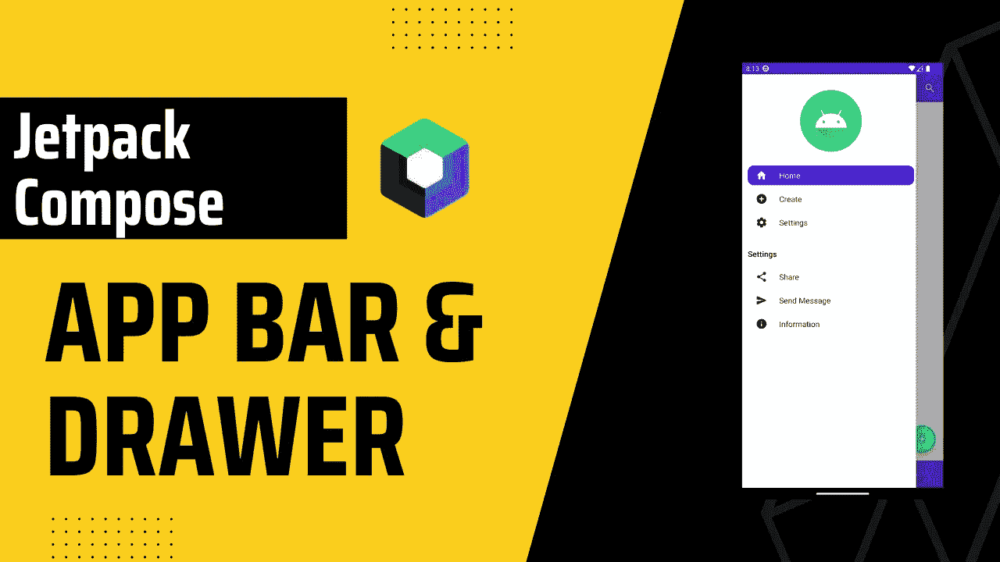
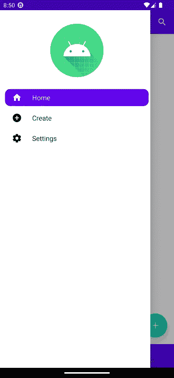

# Jetpack Compose 中的应用程序栏和导航抽屉

> 原文：<https://itnext.io/app-bar-and-navigation-drawer-in-jetpack-compose-dc799417e459?source=collection_archive---------0----------------------->



## 开始之前

如果你不知道 Jetpack Compose 中的导航是如何工作的，我建议你先看看这篇博客。

[](https://burakdev.medium.com/navigation-with-arguments-in-jetpack-compose-bb98999aa49f) [## 在 Jetpack 撰写中使用参数导航

### 在 Jetpack Compose 中使用参数导航非常简单。您可以轻松地在可组合视图之间导航。

burakdev.medium.com](https://burakdev.medium.com/navigation-with-arguments-in-jetpack-compose-bb98999aa49f) 

## 目录

*   [应用程序栏](#e21a)
*   [导航抽屉](#cc41)
*   [搜索应用栏](#3241)

# 开始获取

> 顶部应用程序栏提供与当前屏幕相关的内容和操作。它用于品牌、屏幕标题、导航和动作。欲了解更多信息，您可以点击[链接。](https://m2.material.io/components/app-bars-top)
> 
> 导航抽屉提供对目的地和应用程序功能的访问，如切换帐户。它们可以永久显示在屏幕上，也可以由导航菜单图标控制。

在这篇博客中，我们将实现应用程序栏，以前的工具栏，和导航抽屉。

# 先说 App Bar


现在，我们已经创建了我们的`TopAppBar`,让我们检查一下每个参数的作用。

`navigationIcon`显示在应用程序栏的开头。这应该是典型的`IconButton`。

`actions`显示在应用程序栏的末尾。像`navigationIcon`，这个大多是`IconButton`。默认情况下，`actions`中的布局是`Row`，因此您可以设置多个`IconButton`。

`title`显示在应用程序栏的中央。我们通常使用`Text`，但是我们也可以使用不同的可组合视图。

App Bar 到此为止。

# 导航抽屉时间！

让我们一部分一部分来，首先我们创建了`scaffoldState`和`coroutineScope`对象。你可以阅读下面的文字，看看我们为什么需要这些。

**别忘了把** `**scaffoldState**` **递到脚手架上。处理抽屉状态很重要。**

> 以编程方式打开和关闭抽屉是通过`[*ScaffoldState*](https://developer.android.com/reference/kotlin/androidx/compose/material/ScaffoldState)`完成的，它包括一个`[*DrawerState*](https://developer.android.com/reference/kotlin/androidx/compose/material/DrawerState)`属性，该属性应该通过`*scaffoldState*`参数传递给`*Scaffold*`。`*DrawerState*`提供对`[*open*](https://developer.android.com/reference/kotlin/androidx/compose/material/DrawerState#open)`和`[*close*](https://developer.android.com/reference/kotlin/androidx/compose/material/DrawerState#close)`功能的访问，以及与当前抽屉状态相关的属性。这些暂停函数需要一个`*CoroutineScope*`——例如，使用`[*rememberCoroutineScope*](https://developer.android.com/reference/kotlin/androidx/compose/runtime/package-summary#remembercoroutinescope)`——并且可以在响应 UI 事件时被调用。

在我们的`Scaffold`中，我们在`drawerContent`中设置抽屉的内容。这部分大部分由你自己决定，你可以根据自己的需求来改变。

`drawerGesturesEnabled`用于抽屉页是否可以手势交互。



这就是我们的用户界面。我们已经完成了 UI，所以让我们检查一下如何打开抽屉。

我们已经创建了应用程序栏并设置了`navigationIcon`，但是`onClick`方法为空。现在我们将添加上面的代码，它将打开我们的抽屉。由于`open`和`close`方法是挂起函数，我们需要`launch`和`courutineScope`在里面调用那些函数。

就是这样！现在，我们有功能的应用程序栏和导航抽屉。

# 号外！如何实现搜索 App 栏？

这其实很简单，但有点棘手。我们需要利用国家。

首先，我们将创建 enum 类来处理搜索应用程序栏状态。

```
enum class SearchWidgetState {
    OPENED,
    CLOSED
}
```

现在我们可以在 App Bar 的类中创建我们的 mutableState 对象。

```
var searchWidgetState by remember{ mutableStateOf(SearchWidgetState.CLOSED) }
var searchTextState by remember { mutableStateOf("") }
```

`searchWidgetState`是管理搜索应用栏的状态。

`searchTextState`是获取/设置搜索文本。

在我们的`topBar`中，我们检查`searchWidgetState`值并据此显示应用程序栏。要打开`SearchAppBar`，我们只需将`searchWidgetState`改为`SearchWidgetState.OPENED`

现在，让我们检查一下`SearchAppBar`功能。

我们没有使用 TopAppBar，因为我们需要更多的灵活性和定制。所以在我们的`Surface`中，我们有`TextField`，它需要从用户那里获得输入。我强烈建议您将`singleLine`设置为 true，将`maxLines`设置为 1，以防止多行输入。

在`onValueChange`内部，我们将`searchTextState`的值设置为用户输入。每当用户输入或删除一些东西时，这个就会被更新。

`trailingIcon`有 1 个按钮，用于取消搜索。这个实现取决于你，我更喜欢先检查`searchTextState`是否为空，这意味着用户是否输入了任何东西。如果有，我们将把`searchTextState`设置为空字符串，否则我们将把`searchWidgetState`改为`SearchWidgetState.CLOSED`并显示我们的主应用程序栏。

就是这样。我希望这是有用的，如果你有任何问题，请随时询问。👋👋

来源:

*   [材料成分和布局](https://developer.android.com/jetpack/compose/layouts/material)
*   [应用程序栏](https://m2.material.io/components/app-bars-top/android)
*   [文档](https://developer.android.com/reference/kotlin/androidx/compose/material/package-summary#TopAppBar)

你可以联系我，

*   [领英](https://www.linkedin.com/in/burak-fidan/)
*   [Github](https://github.com/MrNtlu)
*   [推特](https://twitter.com/BurakFNtlu)