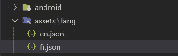

# 颤振中的 App 本地化

> 原文：<https://itnext.io/app-localization-in-flutter-2f00f812bf08?source=collection_archive---------0----------------------->

## 颤动容易定位


应用程序本地化在移动应用程序开发中非常常见，我想写一个我最喜欢的 flutter 包。App 国际化用[***easy _ localization***](https://pub.dev/packages/easy_localization)包快速轻松。

## 为什么易 _ 本地化？

*   🚀多种语言的简单翻译
*   🔌使用 [Easy Localization Loader](https://github.com/aissat/easy_localization_loader) 加载翻译为 JSON、CSV、Yaml、XML
*   💾对区域设置更改做出反应并保持不变
*   ⚡支持复数、性别、嵌套、RTL 地区等等
*   ↩️回退区域设置密钥重定向
*   缺少翻译的⁉️错误小部件
*   `Text`和`BuildContext`上的❤️扩展方法
*   💻本地化文件和密钥的代码生成。
*   🛡️零安全
*   🖨️可定制的记录器。

## 入门指南

*   让我们把这个包添加到我们的`pubspec.yaml`

```
dependencies:
  easy_localization: ^3.0.0
```

*   然后，让我们创建一个文件夹，并像这样添加翻译文件👇👇



*   在`pubspec.yaml`中申报您的资产本地化目录:

```
flutter:
  assets:
    - assets/lang/
```

*   要在 iOS 上进行翻译，您需要将支持的区域设置添加到`ios/Runner/Info.plist`中，如前所述

```
<key>CFBundleLocalizations</key>
<array>
	<string>en</string>
	<string>fr</string>
</array>
```

*   之后，让我们这样编辑我们的`main.dart`👇👇

现在我们的应用程序已经准备好改变和保存选择的语言。您可以将 HomePage 类创建为一个有状态的小部件，带有您想要的小部件和首选的 Ui 设计。在你的语言 JSON 文件中添加你需要翻译的单词。添加尽可能多的 JSON 文件，并将该语言添加到支持的语言环境中。我在演示中使用的键如下。

## 恩。JSON

## 法郎 JSON

*   要得到的话，只需导入包，并添加如下例的关键。

```
**'title'**.tr()
```

*   您可以创建自己的下拉菜单、单选按钮或任何小部件来更改语言。我只是使用了自定义样式的下拉菜单。您也可以保存最后更改的语言，将其设置为默认语言。
*   在创建我们的下拉菜单之前，让我们先创建我们的基本语言类，这样我们可以在将来使用它。

*   并添加让我们用我们的类创建我们的`langList`。

*   通过这一行代码，我们可以得到下拉菜单中最后保存的语言。

```
Language? selectedLang;selectedLang = languageList.singleWhere((e) => e.locale == context.locale);
```

*   让我们像这样创建下拉列表。

*   然后在我们的`homepage.dart`中，让我们使用之前创建的 JSON 文件进行翻译。

仅此而已！！！运行应用程序，改变语言，看看。因为这是一个简单的例子，你可以通过下面的链接找到更多关于这个包的信息。

[](https://github.com/SncOne/localization) [## GitHub—SNC one/本地化

### 此时您不能执行该操作。您已使用另一个标签页或窗口登录。您已在另一个选项卡中注销，或者…

github.com](https://github.com/SncOne/localization) 

## 奖金

**论据示例**

```
{
   "msg":"{} are written in the {} language",
   "msg_named":"Easy localization are written in the {lang} language",
   "msg_mixed":"{} are written in the {lang} language",
   "gender":{
      "male":"Hi man ;) {}",
      "female":"Hello girl :) {}",
      "other":"Hello {}"
   }
}*// args*
Text('msg').tr(args: ['Easy localization', 'Dart']),*// namedArgs*
Text('msg_named').tr(namedArgs: {'lang': 'Dart'}),*// args and namedArgs*
Text('msg_mixed').tr(args: ['Easy localization'], namedArgs: {'lang': 'Dart'}),*// gender*
Text('gender').tr(gender: _gender ? "female" : "male"),
```

🔥**复数** `**plural()**`

你可以用复数来翻译。要在翻译后的字符串中插入一个数字，请使用`{}`。支持数字格式，更多信息请阅读 [NumberFormat](https://pub.dev/documentation/intl/latest/intl/NumberFormat-class.html) 类文档。

您可以使用[String]或[Text] widget 的扩展方法，也可以使用`plural()`作为静态函数。

示例:

```
{
  "day": {
    "zero":"{} дней",
    "one": "{} день",
    "two": "{} дня",
    "few": "{} дня",
    "many": "{} дней",
    "other": "{} дней"
  },
  "money": {
    "zero": "You not have money",
    "one": "You have {} dollar",
    "many": "You have {} dollars",
    "other": "You have {} dollars"
  }
}
```

**感谢您的阅读！**👏👏

如果你喜欢这篇文章，请点击👏按钮(你知道你可以升到 50 吗？)

另外，别忘了关注我，在你的社交网站上分享这篇文章！也让你的朋友知道吧！！