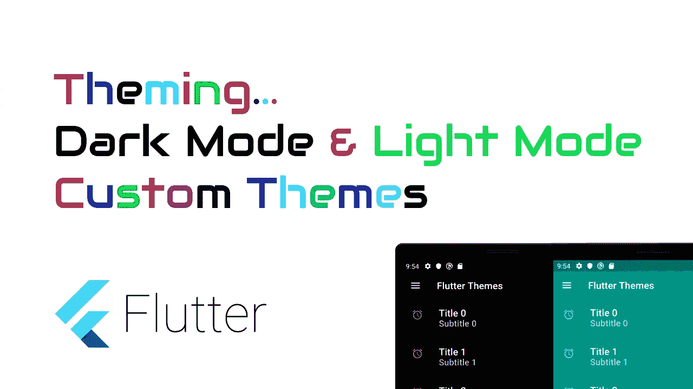

# 颤振模式下的应用程序主题——暗模式/亮模式

> 原文：<https://itnext.io/app-theming-in-flutter-dark-mode-light-mode-27d9adf3cee?source=collection_archive---------0----------------------->



颤动中的动态主题

在这篇文章中，我们将看到如何在 Flutter 中对我们的应用进行主题化。
如你所知，谷歌和苹果在他们最新发布的 Android 10 和 iOS 13 操作系统中发布了黑暗模式和光明模式。因此，我们必须确保当用户在设备中切换模式时，我们的应用程序能够完美运行。

# 观看 Youtube 教程

我们这里有一个简单的屏幕，只有一个列表视图。因此，我们将尝试根据设备主题对该屏幕进行主题化。

```
import 'package:flutter/material.dart';
import 'package:provider/provider.dart';
import 'AppNotifier.dart';

class ThemeDemo extends StatefulWidget {
  [@override](http://twitter.com/override)
  ThemeDemoState createState() => ThemeDemoState();
}

class ThemeDemoState extends State<ThemeDemo> {

  [@override](http://twitter.com/override)
  Widget build(BuildContext context) {
    return Scaffold(
      appBar: AppBar(
        elevation: 0,
        title: Text('Flutter Themes'),
        leading: Icon(Icons.menu),
      ),
      body: Container(
        child: ListView.builder(
          itemCount: 10,
          itemBuilder: (context, pos) {
            return Card(
              elevation: 0,
              child: ListTile(
                title: Text(
                  "Title $pos",
                ),
                subtitle: Text(
                  "Subtitle $pos",
                ),
                leading: Icon(
                  Icons.alarm,
                ),
                trailing: Icon(
                  Icons.chevron_right,
                ),
              ),
            );
          },
        ),
      ),
    );
  }
}
```

现在我们将在 main.dart 中添加这个屏幕作为“home”。

```
void main() {
  runApp(
    HomeApp(),
  );
}

class HomeApp extends StatelessWidget {
  [@override](http://twitter.com/override)
  Widget build(BuildContext context) {
    return MaterialApp(
      title: 'Flutter Tutorials',
      debugShowCheckedModeBanner: false,
      home: ThemeDemo(),
    );
  }
}
```

如果你现在运行这个应用程序，你会看到默认的主题，也就是**灯光主题**。

现在让我们给我们的父组件' **MaterialApp** '添加一个主题。

```
MaterialApp(
      title: 'Flutter Theming Tutorials',
      debugShowCheckedModeBanner: false,
      theme: ThemeData.light(),
      home: ThemeDemo(),
);
```

即使指定了 ThemeData.light()主题，UI 也不会改变，因为应用的默认主题是 **light** 主题。

现在让我们应用**黑暗主题。**

```
MaterialApp(
      title: 'Flutter Theming Tutorials',
      debugShowCheckedModeBanner: false,
      theme: ThemeData.light(),
      darkTheme: ThemeData.dark(),
      home: ThemeDemo(),
);
```

这里我们已经应用了黑暗主题，所以如果我们在设置中将设备主题从明亮切换到黑暗，我们的 UI 将会更新。默认情况下，所有白人都会变成黑人，所有黑人都会变成白人，这是由 Flutter 框架提供的。

# 自定义主题

现在我们知道“主题”属性接受了 ThemeData 对象。因此，让我们继续创建一个自定义主题数据。

为此，我创建了一个名为“AppTheme.dart”的新文件，并为亮暗主题创建了两个主题。

```
import 'package:flutter/material.dart';

class AppTheme {
  //
  AppTheme._();

  static final ThemeData lightTheme = ThemeData(
    scaffoldBackgroundColor: Colors.teal,
    appBarTheme: AppBarTheme(
      color: Colors.teal,
      iconTheme: IconThemeData(
        color: Colors.white,
      ),
    ),
    colorScheme: ColorScheme.light(
      primary: Colors.white,
      onPrimary: Colors.white,
      primaryVariant: Colors.white38,
      secondary: Colors.red,
    ),
    cardTheme: CardTheme(
      color: Colors.teal,
    ),
    iconTheme: IconThemeData(
      color: Colors.white54,
    ),
    textTheme: TextTheme(
      title: TextStyle(
        color: Colors.white,
        fontSize: 20.0,
      ),
      subtitle: TextStyle(
        color: Colors.white70,
        fontSize: 18.0,
      ),
    ),
  );

  static final ThemeData darkTheme = ThemeData(
    scaffoldBackgroundColor: Colors.black,
    appBarTheme: AppBarTheme(
      color: Colors.black,
      iconTheme: IconThemeData(
        color: Colors.white,
      ),
    ),
    colorScheme: ColorScheme.light(
      primary: Colors.black,
      onPrimary: Colors.black,
      primaryVariant: Colors.black,
      secondary: Colors.red,
    ),
    cardTheme: CardTheme(
      color: Colors.black,
    ),
    iconTheme: IconThemeData(
      color: Colors.white54,
    ),
    textTheme: TextTheme(
      title: TextStyle(
        color: Colors.white,
        fontSize: 20.0,
      ),
      subtitle: TextStyle(
        color: Colors.white70,
        fontSize: 18.0,
      ),
    ),
  );
}
```

在上面的代码中，正如你所看到的，我们有两个变量分别用于亮主题和暗主题，我们定制了它的一些属性，如“scaffoldBackgroundColor”、“appBarTheme”等。

scaffoldBackgroundColor 将改变屏幕的背景颜色，appBarTheme 将改变你的 AppBar 的颜色，类似的还有其他风格。

# 手动切换主题

这里的想法是当用户改变时广播主题改变。现在我们需要一个可以做到这一点的软件包。

因此，打开您的 **pubspec.yaml** 文件并添加“provider”包。

运行 **flutter packages get** 到你的项目里面的终端，安装这个包。

现在我们必须写一个类和一个方法来广播主题的变化。因此，让我们创建一个名为“AppStateNotifier”的新类

```
import 'package:flutter/material.dart';

class AppStateNotifier extends ChangeNotifier {
  //
  bool isDarkMode = false;

  void updateTheme(bool isDarkMode) {
    this.isDarkMode = isDarkMode;
    notifyListeners();
  }
}
```

现在，我们将在 UI 中添加一个切换小部件，以便在主题之间进行切换。

```
Switch(
    value: Provider.of<AppStateNotifier>(context).isDarkMode,
    onChanged: (boolVal) {
        Provider.of<AppStateNotifier>(context).updateTheme(boolVal);
    },
)
```

现在我们需要添加一个监听器来监听变化和更新主题。我们必须转到最上面的小部件，像这样更新代码。

```
void main() {
  runApp(
    ChangeNotifierProvider<AppStateNotifier>(
      builder: (context) => AppStateNotifier(),
      child: HomeApp(),
    ),
  );
}

class HomeApp extends StatelessWidget {
  [@override](http://twitter.com/override)
  Widget build(BuildContext context) {
    return Consumer<AppStateNotifier>(
      builder: (context, appState, child) {
        return MaterialApp(
          title: 'Flutter Theming Tutorials',
          debugShowCheckedModeBanner: false,
          theme: AppTheme.lightTheme, // ThemeData(primarySwatch: Colors.blue),
          darkTheme:
              AppTheme.darkTheme, // ThemeData(primarySwatch: Colors.blue),
          home: ThemeDemo(),
          themeMode: appState.isDarkMode ? ThemeMode.dark : ThemeMode.light,
        );
      },
    );
  }
}
```

在这里，HomeApp 被 ChangeNotifierProvider 小部件包围，该小部件接收更改并将其发送到“消费者”小部件，以消费它并使用它来进行更改。在上面的代码中，您可以看到基于 appState 变量更新的“themeMode”属性。当 Switch 小部件打开时，它会将布尔值 true 发送给监听器，最后发送给消费者小部件。

`themeMode: appState.isDarkMode ? ThemeMode.dark : ThemeMode.light,`

# 更新文本主题

现在我们知道了在应用程序中设置的主题，它是在继承的小部件的帮助下设置的。

因此，要更新文本主题或在我们的自定义主题中声明的任何其他主题，您可以在 Theme.of(context)的帮助下访问它。

比如说。文本小部件可以像这样应用样式。

```
Text(
    "Title $pos",
    style: Theme.of(context).textTheme.title,
),
```

图标可以这样设置。

```
Icon(
    Icons.alarm,
    color: Theme.of(context).iconTheme.color,
),
```

# 完整的源代码

完整的源代码可在以下位置获得

[https://bit bucket . org/vipinvijayan 1987/tutorial projects/src/master/fluttertutorial projects/flutter _ demos/lib/widgets/theme demo/](https://bitbucket.org/vipinvijayan1987/tutorialprojects/src/master/FlutterTutorialProjects/flutter_demos/lib/widgets/ThemeDemo/)

请在下面留下您的宝贵意见。

如果你觉得这篇文章有用，请点击拍手按钮。

感谢阅读。

关注我的 [Youtube](https://www.youtube.com/watch?v=yxoKGaDE8cA&feature=emb_logo) 频道获取更多教程。

如果你觉得这篇文章有用，请给我一些掌声。

***你知道你可以鼓掌 50 次。如果是我应得的，请照做。***