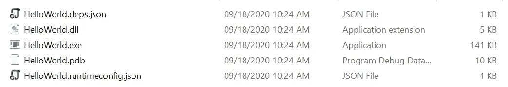
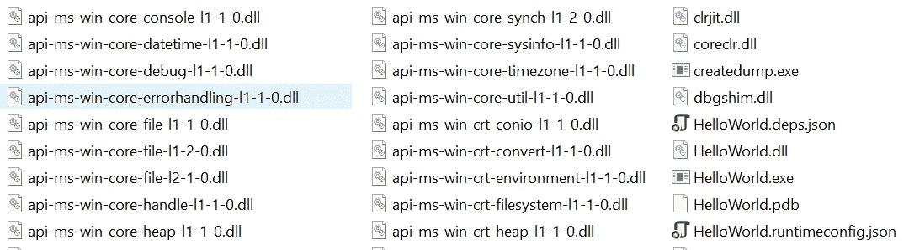
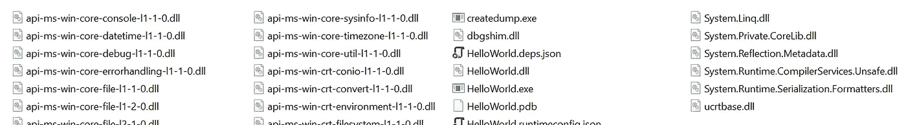
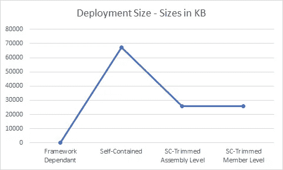

# 应用修剪。NET 5:大幅缩减应用程序的大小

> 原文：<https://itnext.io/app-trimming-in-net-5-reduce-your-app-sizes-dramatically-39891e2bedc1?source=collection_archive---------1----------------------->

O ne 的主要区别来自。NET 框架和。网芯就是那个。NET Core 支持自包含部署；一切都捆绑在一起，包括运行时和应用程序。这带来了简单的部署，但是也有缺点:因为包含了运行时，所以增加了应用程序的大小。

假设您有一个小型的桌面或 web 应用程序，但是部署大小是 200MB，这听起来不太好，对吗？

在**里。NET Core 3** ，为了解决这个问题。NET 团队引入了一个[工具](https://docs.microsoft.com/en-us/dotnet/core/deploying/trim-self-contained)，它可以找到未使用的程序集，并将其从最终部署中移除。在**中。NET 5** 他们向前走了一步；它不仅可以**移除未使用的程序集**，而且**还可以通过打开程序集并移除应用程序未使用的类型和成员来移除程序集**中未使用的代码

有一个大问题:修剪使用静态分析来查找未使用的成员、组件等。例如，使用反射来处理方法或加载程序集，微调器不知道是否需要这些类型，所以它只是丢弃它们。


应用程序修剪是来自的一个很好的功能。NET，我真的很高兴在本文的不同例子中使用它。

> 在写这篇文章的时候。NET RC1 几天前刚刚发布，我用它来做所有的例子。

## 应用程序大小缩减

没有什么比一个简单的控制台 hello-world 应用程序更好的了，对吗？

```
dotnet new console -o HelloWorld
```

上面简单的一行在`HelloWorld`文件夹中创建了一个新的控制台应用程序。让我们尝试将框架依赖部署作为基线，并将其与自包含部署进行比较。

```
dotnet publish -c Release
```



只有五个文件和 154KB。让我们做一个独立的。

```
dotnet publish -r win10-x64 -c Release
```

`-r runtime`参数告诉 dotnet 编译器进行独立发布。



输出将是 **222** 文件和 **65.5MB** 大小。

不要惊讶，因为这是正常的。NET 5 运行时包含在输出中，这就是应用程序调整器发挥作用的地方。

```
dotnet publish -r win10-x64 -c Release -p:PublishTrimmed=True -p:TrimMode=CopyUsed
```

《T2》和《T3》讲述了。NET publisher 裁剪应用程序，只移除未使用的程序集。



72 档和 **25.2 MB** 。就尺寸而言，这是一个巨大的缩减，几乎比原来小了 62%。

会员级修剪怎么样？

```
dotnet publish -r win10-x64 -c Release -p:PublishTrimmed=True -p:TrimMode=Link
```

相同的结果，这是有意义的，因为我们的应用程序只是一个`Console.WriteLine("HelloWorld")`。



## 更复杂的应用程序

举个例子，我有一个 web API 项目；结果相当有趣:

*   自带: **88.4MB**
*   自带汇编级微调: **35.6MB**
*   自带成员级微调: **35.1MB**

在成员修剪中，虽然差别很小，但 app trimmer 完成了工作！

> 成员级调整还从程序集中去除了 [ReadyToRun](https://docs.microsoft.com/en-us/dotnet/core/whats-new/dotnet-core-3-0#readytorun-images) (R2R)代码——结果更小，但是应用程序启动会更慢。

您也可以在 csproj 文件中定义这些参数，如下例所示:

```
<Project Sdk="Microsoft.NET.Sdk">
    <PropertyGroup>
        <OutputType>Exe</OutputType>
        <TargetFramework>net5.0</TargetFramework>
        <RuntimeIdentifier>win10-x64</RuntimeIdentifier>
        <PublishTrimmed>true</PublishTrimmed
        <TrimMode>Link</TrimMode>
    </PropertyGroup>
</Project>
```

## 动态代码怎么样？

在开始，我们谈到了静态分析器，以及它如何找到未使用的部分，它可以修剪部分代码的动态加载反射。

在的早期版本中。NET 中，很容易通过在 csproj 中定义特定的程序集来告诉链接器不要移除它们。如下图所示:

```
<ItemGroup>
  <LinkerRootAssemblies Include="MyAssembly" />
</ItemGroup>
```

英寸 NET 5 中，有一个新的更好的解决方法，使用类注释:

**[** [**动态访问成员**](https://github.com/dotnet/aspnetcore/blob/404d81767784552b0a148cb8c437332ebe726ae9/src/Shared/CodeAnalysis/DynamicallyAccessedMembersAttribute.cs#L29) **]**

> 应用于系统的实例。Type(或包含类型名的字符串)告诉微调器该类型的哪些成员将被动态访问。

**[** [**无条件支持消息**](https://github.com/dotnet/runtime/blob/a5159b1a8840632ad34cf59c5aaf77040cb6ceda/src/libraries/System.Private.CoreLib/src/System/Diagnostics/CodeAnalysis/UnconditionalSuppressMessageAttribute.cs#L21) **]**

> 如果用例已知是安全的，用于抑制来自修剪器的警告消息。例如，如果一个“等于”方法是通过检索一个类型的所有字段并循环比较每个字段来编写的。如果一个字段未被使用，并因此被修整，则不需要比较该字段是否相等。

**[**[**requires un referenced code**](https://github.com/dotnet/runtime/blob/6072e4d3a7a2a1493f514cdf4be75a3d56580e84/src/libraries/System.Private.CoreLib/src/System/Diagnostics/CodeAnalysis/RequiresUnreferencedCodeAttribute.cs#L15)**】**

> 告诉微调器该方法与微调不兼容，因此在调用该方法的地方应该出现警告。这将取消对此方法调用的代码路径的警告，从而减少噪音，并使开发人员更清楚他们调用的哪些方法有问题。

**[**动态依赖性**](https://github.com/dotnet/runtime/blob/6072e4d3a7a2a1493f514cdf4be75a3d56580e84/src/libraries/System.Private.CoreLib/src/System/Diagnostics/CodeAnalysis/DynamicDependencyAttribute.cs#L21)**

> ****指定从一个方法到其他代码的显式依赖关系，如果该方法被保留，其他代码也将被保留。在依赖项不是由方法表达，而是由外部因素(如本机代码)表达的情况下使用。****

****我强烈推荐阅读文章[定制修剪。NET 5](https://devblogs.microsoft.com/dotnet/customizing-trimming-in-net-core-5/) 由[萨姆·斯潘塞](https://devblogs.microsoft.com/dotnet/author/samspmicrosoft-com/)(项目经理，。NET 核心团队)关于控制 app 修剪器。****

## ****概述****

****应用程序微调是一个神奇的功能。NET **，其中**添加了真正强大的功能。NET Core 3，但总是有一个陷阱:通过使用 app-trimmer，您的应用程序可能会因为错误的调整而表现不同。****

****如何避免这种情况？****

****通过不同的测试场景，特别是 e2e 测试。****