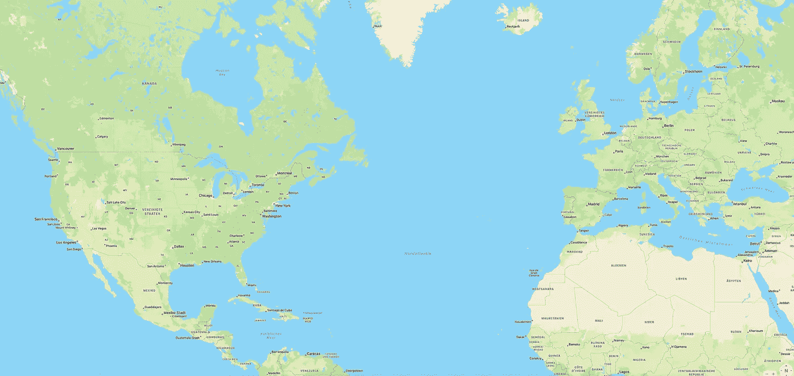

# 苹果地图网址方案

> 原文：<https://itnext.io/apple-maps-url-schemes-e1d3ac7340af?source=collection_archive---------0----------------------->



在这篇文章中，我将向你解释苹果地图的网址方案，并告诉你如何使用它们。

# URL 方案

Apple Maps 应用程序有三种 URL 方案，用于打开应用程序(如果已安装)。

```
map://
maps://
mapitem://
```

URL 方案表示系统应在何处打开 URL，例如，`https://`或`http://`表示应在浏览器中打开的网站的 URL。

# 苹果地图网址

您也可以通过 web URLs 打开苹果地图:

```
https://maps.apple.com/ 
https://collections.apple.com/
https://guides.apple.com/
```

如果在 URL 路径中没有输入参数(在最后一个斜杠后面)，URL 将重定向到苹果地图网站，[https://www.apple.com/maps/](https://www.apple.com/maps/)。

# 因素

有多个参数可以添加到苹果地图网址和`https://maps.apple.com/`网址。苹果的解释在[苹果开发者文档档案](https://developer.apple.com/library/archive/featuredarticles/iPhoneURLScheme_Reference/MapLinks/MapLinks.html)上。多个参数可以用一个`&`串在一起。第一个参数之前必须是一个`?`。参数和数值之间有一个`=`。空格用`+`或`%`代替，坐标用小数值定义为`latitude,longitude`。

## t

定义地图类型。使用`m`表示标准，`k`表示卫星，`r`表示中转。`h`对于混合视图已弃用。缺失时，使用当前地图类型。

```
t=k
```

## q

搜索查询。值字符串的处理类似于搜索。当位置由`ll`或`address`明确定义时，它向位置添加一个自定义标题。

```
q=Chinese+Restaurants
```

## 地址

当字符串是有效位置时，Apple Maps 会在该位置添加一个大头针。如果没有，则执行字符串搜索。

```
address=United+States
```

## 近的

应该在哪里执行搜索的提示。如果`sll`缺失或不完整，这是一个后备方案。

```
near=90.312,44.2231
```

## 陆线 （landlines 的缩写）

地图中心的位置。当使用`q`作为标签时，`ll`也可以代表一个管脚位置。当它丢失时，要么使用最后一个位置，要么使用互联网服务器的位置(当应用程序启动时)。

```
ll=17.313,74.1932
```

## z

一个介于 2 和 22 之间的十进制值，用于定义缩放级别(越高越接近)。只能与`ll`参数一起使用。

```
z=5.0
```

## spn

围绕`ll`中心点的区域或跨度。不能和`z`一起使用。该值由描述纬度和经度增量的两个十进制数字组成。

```
spn=40.0,40.0
```

## 萨德勒

方向的起点。一个完整的方向由`saddr`、`daddr`、`dirflg`组成，但只需要`daddr`。空的时候，我用“这里”。

```
saddr=Cupertino
```

## daddr

方向的目的地。这是应得的。

```
daddr=Palo+Alto
```

## 迪尔弗格

方向的运输类型。汽车用`d`，步行用`w`，骑自行车用`c`，公共交通用`r`。默认情况下，选择汽车。

```
dirflg=d
```

## sll

应该执行搜索查询的搜索位置。

```
sll=41.0,61.0
```

## sspn

指定`sll`位置周围的跨度。它不能与`z`一起使用。

```
sspn=50.0,50.0
```

## 地下（underground 的缩写）

Apple 地图指南的参数。下面将进一步解释。

## **_mvs**

由加号分隔的两个字母数字字符串，添加它们是为了查看链接。这些包含加密的位置数据，因此，没有必要指定地址/位置。当输入错误的字符串时(例如 *maps://？_mvs=0* )，苹果地图在 0 N/S 0 E/W 打开空白环视视图。

## auid

可能是分配给每个苹果地图项目的随机 ID。当您共享一个位置时，它位于路径中，并且仅由数字组成。

## _ext

从 Apple Maps 共享的 URL 中的字符串。

# 例子

这里有一些例子，关于你可以用苹果地图网址方案做什么。

```
maps://?address=One+Apple+Park+Way,Cupertino,United+States
```

*在苹果地图中打开地址“美国库比蒂诺市苹果公园路 1 号”。*

```
maps://?q=Museums&sll=-100.0,30&sspn=145.0,145.0
```

*搜索地点周围跨度为 145 的博物馆。*

```
maps://?saddr=Santa+Teresa+Country+Park&daddr=Windy+Hill+Open+Space+Reservate&dirfgl=c
```

*返回圣塔特蕾莎国家公园和大风山开放空间保护区之间的骑行路线。*

这里有一个关于如何在 Swift 中创建它的例子。确保用`+`替换空格。

# 苹果地图指南网址

苹果地图指南(iOS 14 之前叫收藏)可以分享。语法是:

```
https://guides.apple.com/?ug=GUIDE-SPECIFIC-CHARACTERS%3D
```

旧的语法是:

```
https://collections.apple.com/collection?_col=GUIDE-SPECIFIC-CHARACTERS%3D
```

两者都打开苹果地图指南/收藏门户网站。点击[这里](https://guides.apple.com/?ug=CgVHdWlkZRINCNkyENuVr4POz8aMcBIOCNkyEIGF9u3plOmIpQE%3D)看看是什么样子。但你也可以在苹果地图应用程序中打开指南，语法如下:

```
maps://?ug=GUIDE-SPECIFIC-CHARACTERS=
```

到目前为止，我还没有弄清楚，如何通过代码而不是通过创建向导和复制 URL 来创建`GUIDE-SPECIFIC-CHARACTERS`。我唯一发现的是，当 Base64 解码字符串时，结果包含指南的标题。本指南的结果是:

```
maps://?ug=CgVHdWlkZRINCNkyENuVr4POz8aMcBIOCNkyEIGF9u3plOmIpQE=
```

是:

```
░Guide░
░░2░░�����░�p░░░░2░��░░░�░��░
```

“指南”是指南的标题。当我找到一个方法，我会把它添加到这篇文章中。该字符串表示指南中的所有项目，而不是存储在苹果服务器上并连接到指南的随机字符串。首先可以看到这一点，因为字符串会变长，这取决于指南中有多少项；其次，两个指南都包含相同的两个位置，一个指南包含另一个额外的位置，这两个指南包含相同的子字符串:

```
// Guide 1CgVHdWlkZRI 
**NCNkyENuVr4POz8aMcBIOCNkyEIGF9u3plOmIpQE**// Guide 2CgVHdWlkZRI 
**NCNkyENuVr4POz8aMcBIOCNkyEIGF9u3plOmIpQE** *SDQjZMhCVzJ7M6b3NuBQ*
```

第一个子字符串包含指南的标题，第二个子字符串包含元素 1(旧金山)和元素 2(库比蒂诺)，最后一个子字符串包含元素 3(帕洛阿尔托)。

> 如果你可能找到了一种方法来完全解码该指南并查看 string，或任何其他 Apple Maps URL 方案或参数，请随意将它们发布到这里的注释中，我会将它们添加到文章中(当然要注明)。