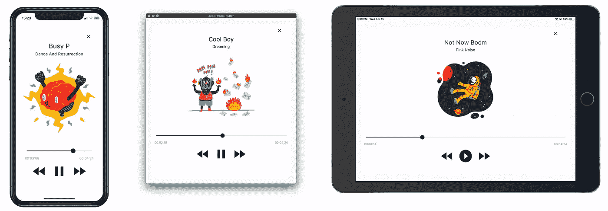

# Apple Music / Tidal 风格的音频播放器。

> 原文：<https://itnext.io/apple-music-tidal-style-audio-player-for-flutter-decdbae01890?source=collection_archive---------2----------------------->

*跨平台 Apple Music / Tidal 风格音频播放器，支持 Dart、Streams、Value Types 和 BLoC。*

几个月前，我为我的一个 Flutter 项目开发了一个跨平台的音频播放器。在这些奇怪的时间和家庭隔离，我有一些空闲时间。所以我决定开源这个项目。也许能对某个人有帮助。如果你觉得有价值，别忘了鼓掌分享。尽情享受吧！

源代码在 MIT 许可下分发，可在 GitHub 上获得:

 [## minikin/audio_player_flutter

### Apple Music / Tidal 风格的音频播放器，由 Dart、Streams、Value Types 和 BLoC 驱动。

github.com](https://github.com/minikin/audio_player_flutter) 

# 🎉特征

*   苹果音乐/潮流风格音频播放器
*   支持的平台:iOS、iPadOS、macOS、Android
*   iOS/Android 的背景音频播放
*   从[远程服务器](https://github.com/minikin/json_server_for_audio_player_flutter)获取和传输音频文件
*   响应屏幕尺寸的变化
*   由[构建值](https://pub.dev/packages/built_value)和[构建集合](https://pub.dev/packages/built_collection)驱动
*   由[集团](https://pub.dev/packages/flutter_bloc)管理国家
*   后台 JSON 解析

# 📹演示

Apple Music / Tidal Style 音频播放器的演示。

# 🧠岛

*   添加对 Web 和 PWA 的支持
*   添加测试
*   整合 [codecov.io](https://codecov.io/)
*   错误修复和改进

# 🙌捐助

如果你有一些想法或者发现了一个 bug，请随时[为这个项目贡献](https://github.com/minikin/audio_player_flutter/blob/develop/CONTRIBUTING.md)。