# Apple 预置描述文件尽可能简单

> 原文：<https://itnext.io/apple-provisioning-profile-as-simple-as-possible-b2db0af94e5?source=collection_archive---------0----------------------->

A 几年前，我还是一个 iOS 开发新手，对苹果开发者控制台中的一些术语感到困惑。**、【供应简档】、【证书签名请求】、**开发证书**、**分发证书**就是其中的一些。一旦添加了新的应用程序功能，或者我的测试设备被另一个替换，我就需要更新我的配置文件。**

供应配置文件实际上是三方——应用程序所有者、开发人员和测试人员——之间的合同。简而言之，应用程序所有者初始化应用程序，并批准**某些**开发人员将测试应用程序部署到一组**有限的**测试人员的设备上。

如果你对上面突出显示的术语感到困惑，你会发现这篇文章很有趣。在这篇文章中，我将用简单的方式讲述底层的理论，不需要编码。希望非技术读者(商人/应用程序所有者)可以很容易地理解它！

# 应用程序所有者

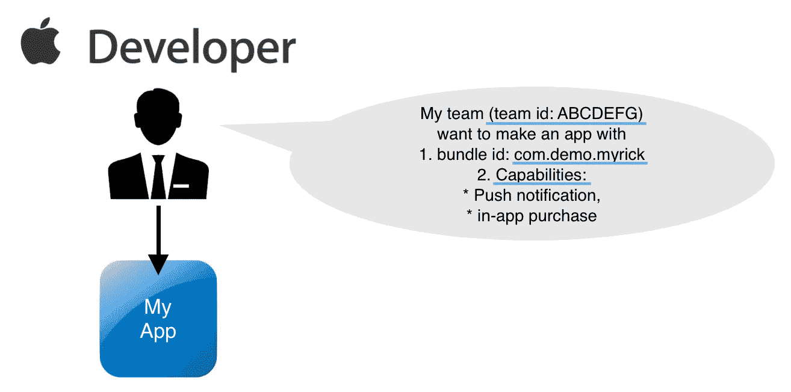

应用程序所有者必须初始化应用程序

首先，公司所有者/个人在[苹果开发者控制台](https://idmsa.apple.com/IDMSWebAuth/signin?appIdKey=891bd3417a7776362562d2197f89480a8547b108fd934911bcbea0110d07f757&path=%2Faccount%2F&rv=1)创建一个苹果开发者团队，该团队有**一个唯一的团队 id** 。他/她可以定义**他/她想开发什么样的 app** 。详细信息包括包 id 和功能列表。

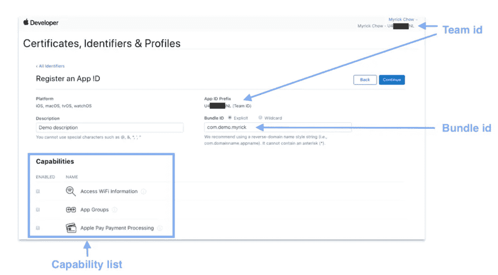

2020 年苹果开发者控制台布局 5 月

**Bundle ID** 是苹果区分不同 app 的唯一标识符。Apple 建议它是反向域名样式字符串(即 com.domainname.appname)。

**功能**是应用的特性，例如推送通知、应用内购买和 NFC 标签读取等。

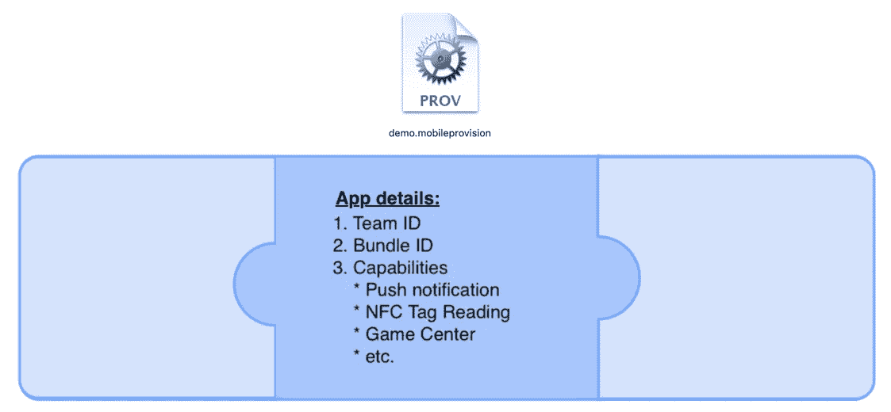

预置描述文件的第 1 部分是应用程序详细信息

# 设备所有者/质量保证测试人员

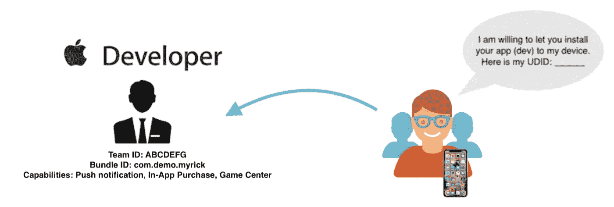

测试人员必须向应用程序所有者提供他/她的设备 UDID，以授予安装开发应用程序的权限

苹果的目标是非常保护每一个苹果设备(iPhone，iPad，Apple TV 和 Apple Watch)用户。未经用户同意，任何 app 都不能安装到苹果设备上！因此，设备所有者必须通过提供设备的 **UDID** 来授权应用所有者安装他/她的测试应用。

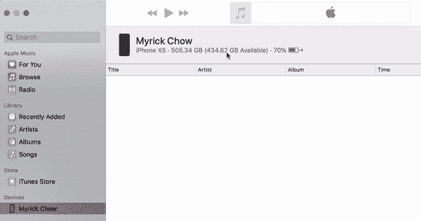

找回 UDID 的 iTunes(版本 12.8.2)界面和步骤

**UDID** 代表“唯一设备标识符”。可以通过 iTunes 检索。将设备(例如 iPhone)连接到 MacBook 后， **iTunes** 将弹出，并显示一行设备详细信息。点击该行，详细信息将发生变化，显示序列号、UDID 和型号。虽然不能高亮显示它，但可以右键单击来复制它😅。

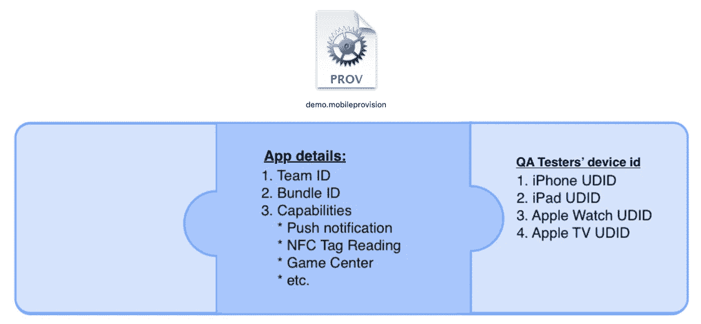

配置文件的第 2 部分是测试人员的设备 UDID

# 应用开发者

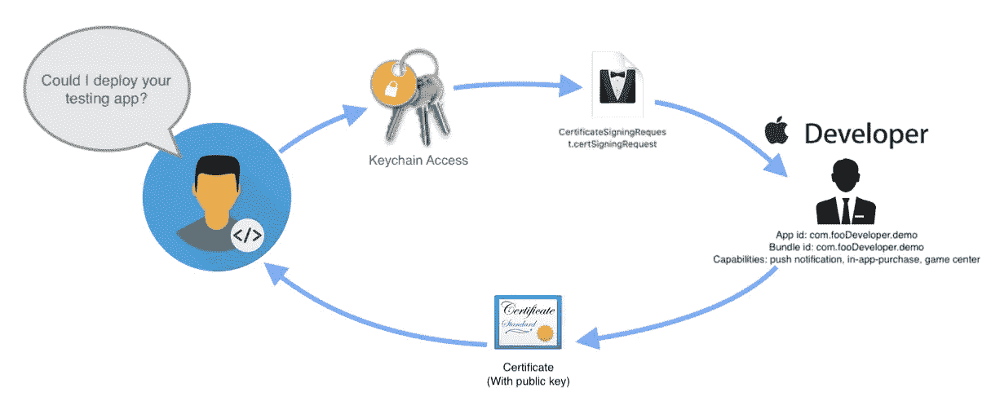

应用程序开发人员必须向应用程序所有者提供证书签名请求，以申请证书文件，从而部署测试应用程序

以便保护设备用户不安装来自未知开发者的恶意代码。在步骤 2 中，只有那些得到应用所有者信任和批准的开发人员才能将测试应用部署到注册的设备上。开发者必须通过发送从**钥匙串访问**生成的 CSR 文件向应用所有者请求证书。

钥匙串访问应用程序图标

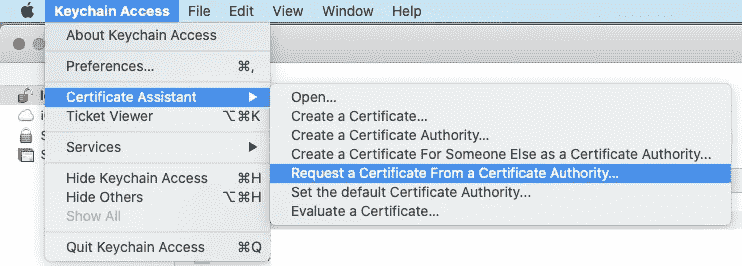

从“钥匙串访问”创建证书签名请求文件的步骤

**“钥匙串访问”**是苹果公司制作的默认 MacOS 应用。开发人员可以通过上面截图所示的步骤创建一个“**证书签名请求** (CSR)”文件。然后，开发者可以将这个`.certSigningRequest`文件发送给应用程序所有者进行审批。

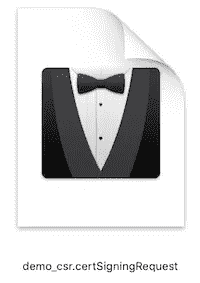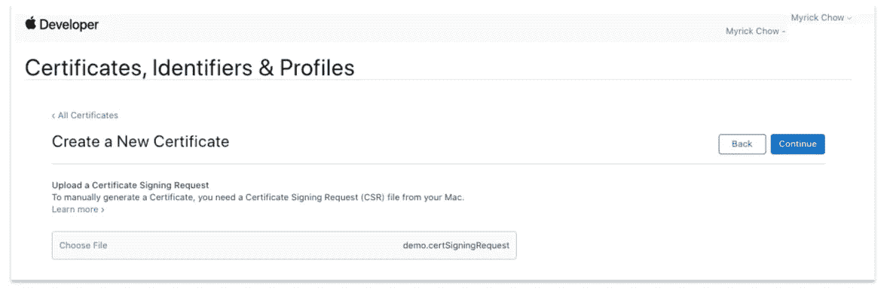

将 CSR 文件添加到 Apple 开发人员控制台以生成证书

收到 CSR 文件后，应用程序所有者可以将此`.certSigningRequest`上传到苹果开发者控制台，并生成一个开发或分发签名证书`.cer`文件，以表明该开发者是其团队中的批准开发者。

**开发证书**用于将测试应用部署到测试人员的设备上，而**分发证书**用于将生产应用存档以提交至应用商店。

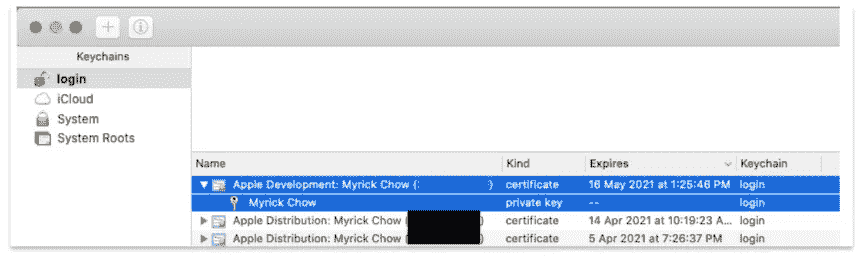

在应用程序所有者将`.cer`文件发送回开发者后，开发者只需双击即可在**钥匙串访问**处安装证书。私钥显示在证书记录下。它应该尽可能的安全**,因为拥有这个私钥的每个人都可以代表你部署测试应用！**

**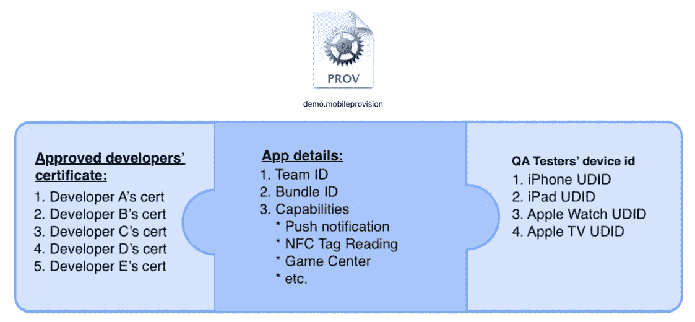**

**预配描述文件的第 3 部分—批准的开发人员证书**

# **预配配置文件**

****

**预置描述文件的应用程序图标**

**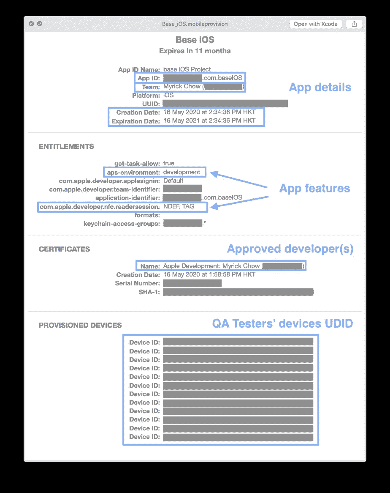**

**预配配置文件的详细信息**

**配置文件可以被认为是应用程序开发中的一个法则。签发后 1 年内有效。它包括前几届会议收集的所有信息。它分为 4 个部分:**

1.  ****应用详情** —应用 ID、团队 ID 和有效日期范围(1 年)**
2.  ****权利****
3.  ****证书** —批准和信任的开发者证书列表**
4.  ****提供的设备** —测试人员设备 UDID 列表**

# **Xcode 签名流程**

**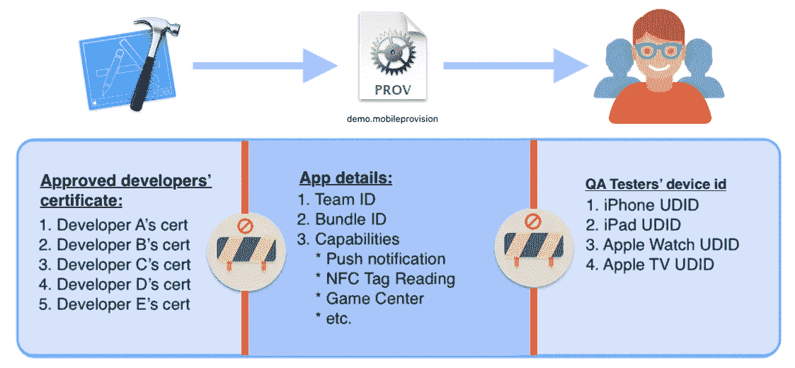**

**每次 Xcode 签署应用程序时，它都会检查以下标准:**

1.  **应用程序详细信息(**捆绑包 ID &功能**)是否与预置描述文件中所述的一致？**
2.  **当前开发人员是预置描述文件中提到的**批准的**开发人员吗？**
3.  **目标设备是否是预配描述文件中规定的**预配设备**之一？**

**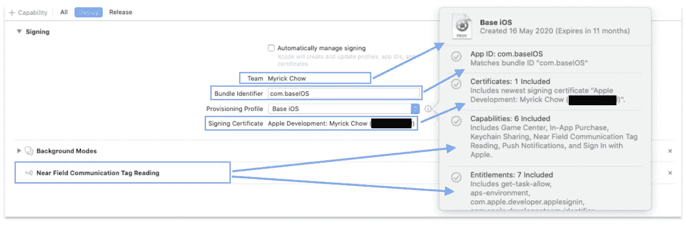**

**Xcode 签名和功能检查**

**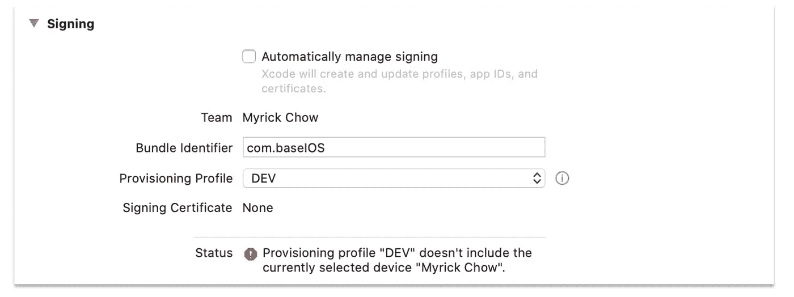**

**当连接的设备不是预配设备时**

# **摘要**

1.  **预配描述文件定义了测试应用程序详细信息、可信开发人员列表和预配设备 UDID 列表。**
2.  **应用程序所有者必须在苹果开发者控制台上声明应用程序的详细信息。每个应用程序的捆绑包 id 都是唯一的，功能是应用程序中使用的重要功能。**
3.  **测试设备所有者必须向应用所有者提供 UDID，以便授予开发人员部署测试应用的权限。UDID 可以在 iTunes 中找到。**
4.  **开发者必须将由**钥匙串访问**生成的 CSR 文件发送给应用所有者，以请求部署他/她的测试应用的许可。一个私钥是由苹果开发者控制台上的 app own 生成的。开发人员必须将其安装到“钥匙串访问”来构建应用程序。**
5.  **在将测试应用从开发者部署到测试设备之前，Xcode 会检查应用详细信息、开发者证书和测试设备 UDID 的正确性。这可以防止测试设备被黑客安装恶意代码。**

# **阅读材料:**

1.  ****关于预置描述文件的 Apple 官方文档****

 **[## 轮廓

### 该资源代表允许您在 iOS 设备或 Mac 上安装应用程序的预置描述文件。你可以…

developer.apple.com](https://developer.apple.com/documentation/appstoreconnectapi/profiles)** 

**2.**证书理念****

 **[## 证书

### 数字证书是用于安全分发公钥/私钥对的公共部分的数据集合…

developer.apple.com](https://developer.apple.com/documentation/security/certificate_key_and_trust_services/certificates)** 

**3.**应用 ID 与捆绑包 ID 和团队 ID****

** [## 什么是应用 id 和捆绑包标识符

### 每个刚接触 Cocoa 和 Swift development 的开发人员都需要熟悉苹果的行话和流程。在…

cocoacasts.com](https://cocoacasts.com/what-are-app-ids-and-bundle-identifiers/) 

4.**代码签名身份与预置描述文件**

 [## 代码签名身份和预置描述文件之间有什么区别？

### 答案:1。代码签名身份是 Apple 认证您身份的安全机制。它允许用户信任…

www.quora.com](https://www.quora.com/What-is-the-difference-between-Code-Signing-Identities-and-Provisioning-Profiles) 

# 您可能对以下内容感兴趣:

 [## 快速 UIView 可爱的动画和过渡

### iOS 应用程序通常利用大量平滑的动画来使应用程序看起来更漂亮，以改善整体用户…

itnext.io](/swift-uiview-lovely-animation-and-transition-d34bd623391f)  [## 尽可能快的 Swift CoreNFC

### NFC 代表“近场通信”。当两个电子设备相距很远时，它们可以通过 NFC 传输数据…

itnext.io](/swift-corenfc-as-quick-as-possible-79544796cd0a)  [## 尽可能深的快速文本到语音转换

### 有没有想过把文字转换成语音供盲人使用 app？AVFoundation 框架可以帮到你很多！

itnext.io](/swift-avfoundation-framework-text-to-speech-tool-f3e3bfc7ecf7) 

*欢迎关注我*[*Twitter @ myrik _ chow*](https://twitter.com/myrick_chow)*了解更多信息。感谢您阅读这篇文章。祝您愉快！*😄**