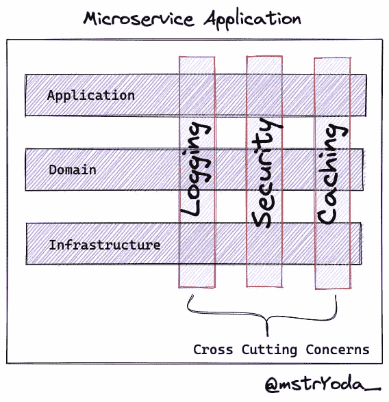
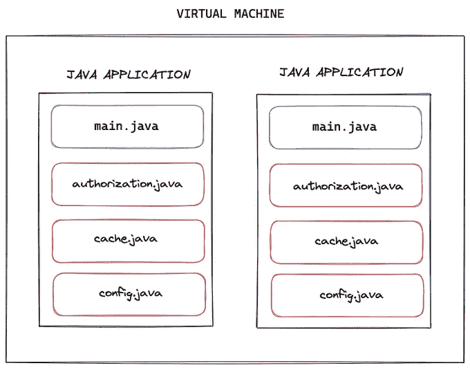
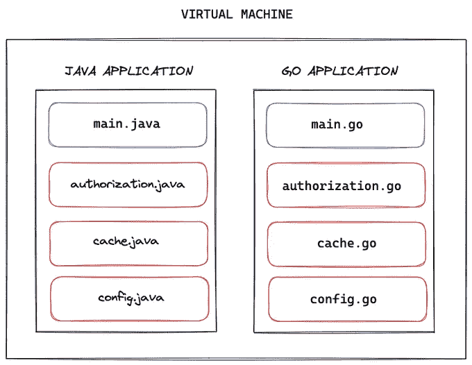
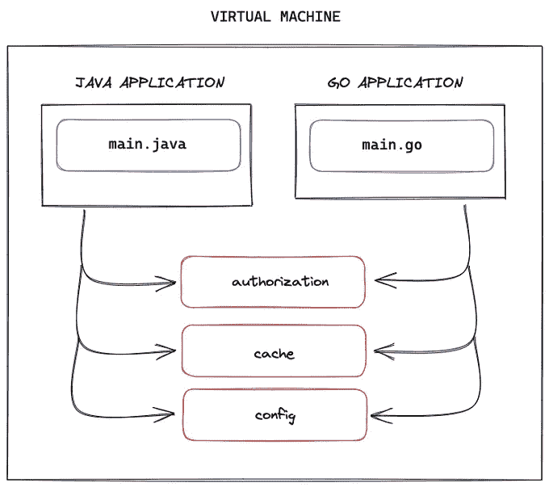
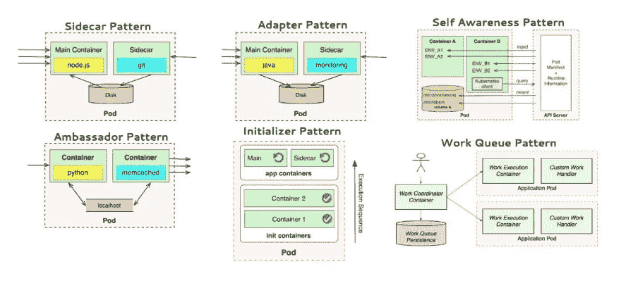
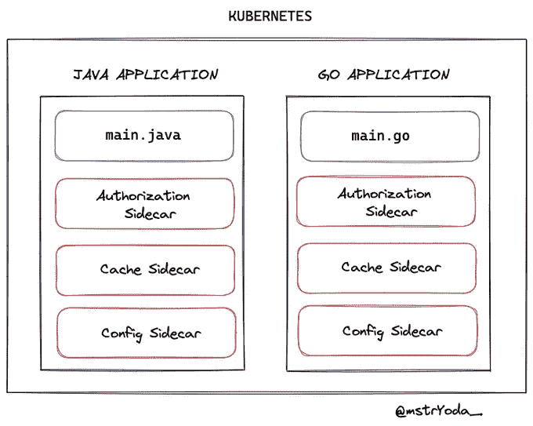
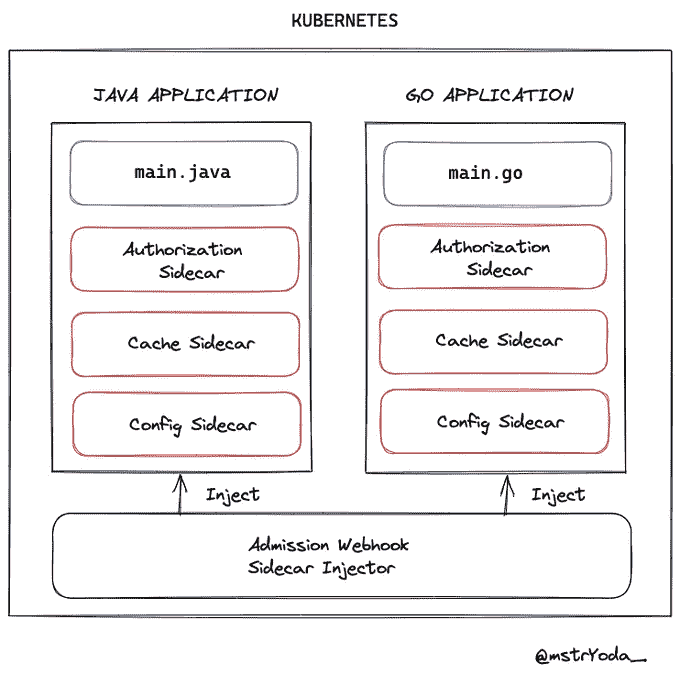
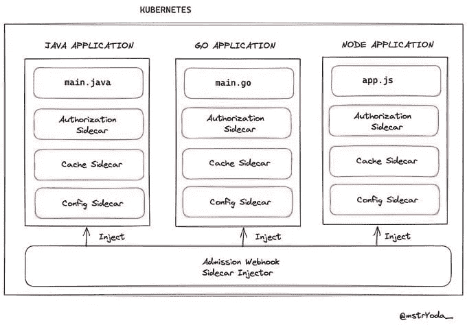
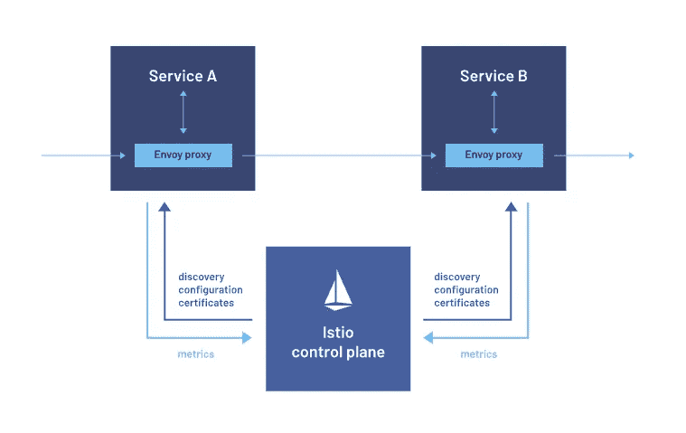
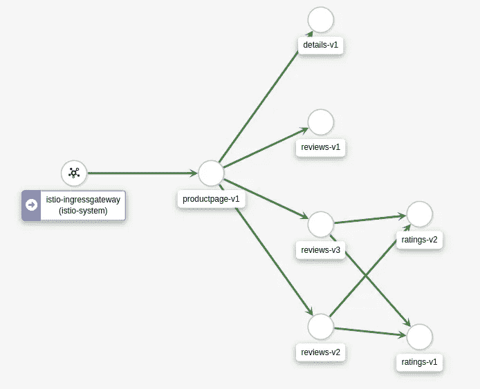

# 微服务的应用架构:Sidecar 模式

> 原文：<https://itnext.io/application-architecture-for-microservices-sidecar-pattern-c5c0074e8f1d?source=collection_archive---------0----------------------->

我们的微服务应用架构应该是什么样的？

让我们一起来看看我们如何使用 sidecar 来解决跨领域的问题，例如授权、缓存、配置秘密管理和可观察性。

# 贯穿各领域的问题

让我们从解释横切关注点开始。

应用程序的不同层需要应用程序业务代码之外的一些需求。

例如日志记录、配置、缓存、授权、可观察性…

# 传统发展

传统的方法是在我们的开发服务中编码和使用所有这些工具。如果我们用同一种语言编写不同的服务，我们可以在服务之间共享这些代码，并在服务之间将它们用作包/库。

那么什么是糟糕的情况呢？

在用多种语言编写服务的环境中，这些需求必须用每种语言重新实现。

想象一下，你(或你的团队)用不同的语言一遍又一遍地编写相同的功能…

这种情况下有没有解决方案，而不是写同样的代码？

首先想到的是为那些需求编写单独的 API 服务。

那么这是正确的解决方案吗？

能遇到什么问题？

当消费者服务数量增加时，如何扩展这些共享服务？

将应用程序代码移动到另一个通过网络访问的服务会导致应用程序的网络延迟。这会减慢我们的应用程序。

那么，如果您不想用不同的语言重写相同的故事，或者面临网络延迟，您会怎么做呢？

**答**:我们会用边车模式。

# 边车模式

这个边车是什么？

我们可以在 Kubernetes 上运行多个容器。我们可以把运行在主应用程序容器旁边的容器称为 sidecars。

这些附加功能可以用一种语言开发，然后我们可以将它们“注入”到我们的应用程序中。我们用 Go 语言开发我们的 sidecars，并将它们注入到微服务中。

这个“**注入**操作是由 Kubernetes 基于一个名为**的动态接纳 Webhook** 的概念执行的。详情我会在文末留下源码链接。

当一个 pod 升级时，附加的边斗也会随之升级。

此外，由于专门为跨边柜共享的 pod 创建的网络接口，网络延迟可以忽略，因为它是在本地主机上。

用边车还能做什么？

*   Pod 网络配置
*   Pod 网络请求/响应可以被中断/操纵
*   可以制作服务网格
*   微服务运行时实现可以完成

例如，Istio 服务网可以作为边车使用。pod 的整个网络控制由作为侧车的传入 istio-proxy 接管，并且可以操纵传入和传出的请求/响应。

可以写各种网络规则。当整个网络通过 istio-proxy sidecar 时，所有网络进程都有度量数据，我们可以可视化微服务内部服务调用。

我想在这里完成我的帖子。我们带您快速了解一下边车方法。下一篇文章再见。

## **资源**

 [## 动态接纳控制

### 除了编译好的许可插件，许可插件可以被开发成扩展并作为 webhooks 运行…

kubernetes.io](https://kubernetes.io/docs/reference/access-authn-authz/extensible-admission-controllers/)  [## 了解 Kubernetes 多容器 Pod 模式

### Sidecar、Ambassador 和 Adapter 模式指南，并附有实践示例

better 编程. pub](https://betterprogramming.pub/understanding-kubernetes-multi-container-pod-patterns-577f74690aee)  [## 伊斯迪奥

### 一个可观察性、深度安全性和管理的服务网格，可加快部署周期。

istio.io](https://istio.io/) 

## 让我们连接

[推特](https://twitter.com/mstrYoda_)
Github

可以在 Github 上支持我:[在 Github 上支持 mstrYoda](https://github.com/sponsors/mstrYoda/)