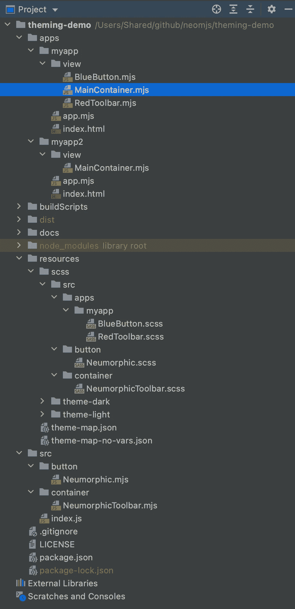
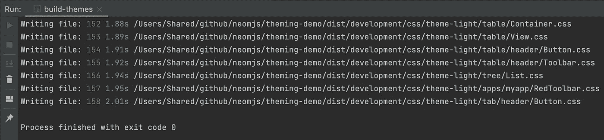
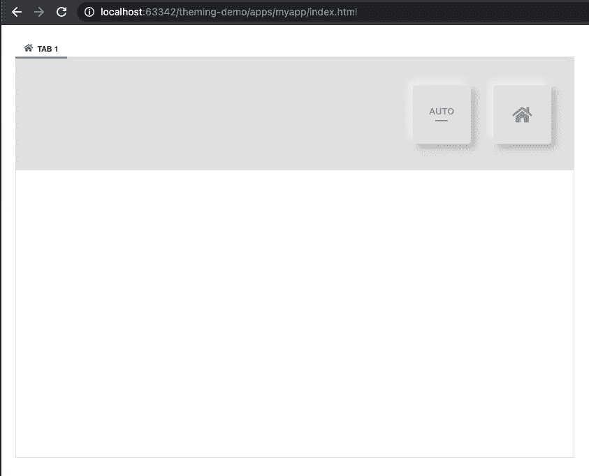
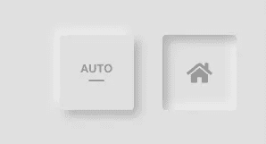
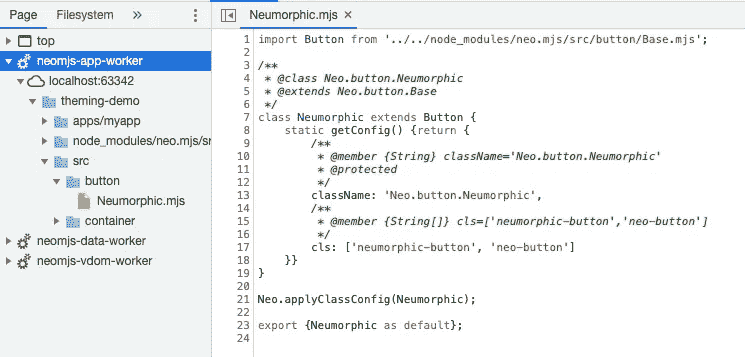

# 基于应用程序的组件主题样式

> 原文：<https://itnext.io/application-based-themed-styling-for-your-components-d8becd1217a9?source=collection_archive---------6----------------------->

更准确地说:基于工作空间的样式

# 内容

1.  介绍
2.  背景信息
3.  如何创建新的工作区？
4.  主题演示
5.  创建神经按钮和工具栏
6.  在 MyApp1 中加入神经形态成分
7.  创建蓝色按钮和红色工具栏
8.  我们能做得更多吗？
9.  neo.mjs 是什么？

# 1.介绍

在很长一段时间里，可以将新组件添加到 [neo.mjs](https://github.com/neomjs/neo) 框架中，并使用基于 SCSS 的主题引擎为每个主题设计不同的组件样式。

有了新的主题引擎，我们现在得到了一个粒度 CSS 输出，我们可以根据需要自动延迟加载 CSS 文件，我们甚至可以为多窗口应用程序范围获得跨浏览器窗口增量 CSS 更新。

然而，缺少了一件重要的事情:如果您想要创建不适合框架范围的新组件，或者您(或您的公司)不想与社区共享它们，我们需要在您的工作区内设计组件样式的能力。

本文将介绍如何做到这一点。

# 2.背景信息

如果你想了解更多关于新的主题引擎，以及不同的模式(可选的 CSS 变量):

 [## 如何创建一个文件由文件自定义 SCSS 建立包括依赖关系，使用 postcss 和可选的…

### 虽然这听起来像是一个常见的问题，但我无法在网上找到一个好的解决方案。所以我想写作…

itnext.io](/how-to-create-a-file-by-file-custom-scss-build-including-dependencies-using-postcss-and-optional-c83f8e5677d8) 

本文涵盖了跨多个浏览器窗口的增量 CSS 更新:

 [## 将单页应用扩展到多个浏览器窗口——第 2 部分

itnext.io](/expanding-single-page-apps-into-multiple-browser-windows-part-2-2619ab40361d) 

# 3.如何创建新的工作区？

[neo.mjs CLI](https://github.com/neomjs/create-app) 为您提供保障。只需在您的终端(或 cmd)中输入以下内容:

> npx 新应用程序

所有问题都可以按回车键。

这个视频有点过时(主题构建不再使用 webpack)，但结果还是一样的。

如果在本地使用 npx 脚本时**没有**为您工作，您可以克隆/派生以下 repo:

 [## neom js/工作空间

### 此存储库包含 npx neo-app 的默认输出。如果 npx 脚本有任何问题，请感觉…

github.com](https://github.com/neomjs/workspace) 

只需运行:

> npm 安装

# 4.主题演示

我创建了一个新的存储库，在这里向您展示一些示例用例:

 [## neom js/主题-演示

### 示例应用程序，展示如何使用基于工作空间的主题化

github.com](https://github.com/neomjs/theming-demo) 

在这个回购中，我创建了第二个应用程序。让我们快速浏览一下 package.json 文件:

我们也可以在一个工作区内使用所有的 [neo.mjs](https://github.com/neomjs/neo) 程序。

要创建第二个应用程序，我们不需要再次使用 npx 调用，而是使用

> npm 运行 create-app

演示结构的快速概述:

# 5.创建神经按钮和工具栏

我们想在 MyApp1 和 MyApp2 中使用 neumorphic 按钮和工具栏。虽然我们可以在 MyApp1 中创建组件，并在 MyApp2 中导入文件，但从架构的角度来看，这是非常错误的。

干净的方法是在工作区 src 文件夹中创建这两个组件。

src/button/neuromatic . mjs

src/container/neuromophictoolbar . mjs

如果已经有了一个新主题，我们就不需要这些类扩展了。有可能做到。如果你喜欢这个想法，在这里加一条评论:【https://github.com/neomjs/neo/discussions/2049
T3

对于按钮类，我们想扩展[按钮。Base](https://github.com/neomjs/neo/blob/dev/src/button/Base.mjs) ，对于工具栏类，基类[容器。工具栏](https://github.com/neomjs/neo/blob/dev/src/container/Toolbar.mjs)最适合。我们只是为两个自定义组件添加了一个额外的 CSS 类，就是这样。

我们还在 resources/scss 文件夹中创建了两个 SCSS 文件。重要提示:我们需要使用相同的名称空间。

resources/scss/src/button/neuro morphic . scss

resources/scss/src/container/neuromophictoolbar . scss

我们对按钮状态使用了双框阴影，并坚持只使用 CSS(我们将在第 7 节讨论 SCSS 变量)。

# 6.在 MyApp1 中加入神经形态成分

这一部分很简单，我们只需要将新的项目导入并添加到我们的 MainContainer JS 模块中。

此时，我们需要运行一个主题构建:

> npm 运行构建主题

我们的演示应用程序的默认主题是“主题灯”，所以你可以选择建立选项

1.  主题:主题-灯光
2.  环境:发展
3.  使用 CSS 变量:是

这个版本在我的机器上需要 2.01 秒。

让我们在您的浏览器中打开开发模式版本:

按下按钮:

查看开发工具:

应用程序工作范围内的真实代码(没有源代码映射)。

# 7.创建蓝色按钮和红色工具栏

我们将只在 MyApp1 中使用这两个文件，所以让我们在那里创建文件。

apps/myapp/view/BlueButton.mjs

apps/myapp/view/RedToolbar.mjs

和以前一样。

resources/scss/src/apps/myapp/view/blue button . scss

resources/scss/**src**/apps/myapp/view/red toolbar . scss

如果您需要关于 v()方法的更多信息，背景信息中的第一篇文章将对此进行深入讨论。

简而言之:如果我们使用 CSS 变量构建主题，我们将获得匹配的 CSS 变量作为值。不使用 CSS 变量，我们将获得 SCSS 变量的普通值。

所以，我们需要定义这个:

resources/scss/**theme-light**/apps/myapp/view/red toolbar . scss

`neo($key)`只是`map-get($neoMap, $key)`的一个快捷方式。

现在这里真正酷的部分是，你可以使用所有存在于 neo 主题中的**T4 SCSS 变量。**

示例:

例如，我们可以使用`textfield-border-color`，它与类的层次结构完全无关。

[旁注]看看工作区主题文件夹中的 _all.scss 文件。对于“var”文件，我们需要按照依赖关系的顺序手动包含它们。例如，如果您在工作区内创建一个组件，该组件使用不同工作区组件的变量。

apps/myapp/view/main container . mjs

> npm 运行构建-全部

我们希望得到主题的增强，以及发行版本。

在`dist/production`中，我们现在将我们的交叉应用程序分割成块。

# 8.我们能做得更多吗？

如果你一直在关注 neo.mjs 博客，你很可能已经看到我们可以延迟加载标签。所需的容器项目。这也包括延迟加载所需的 CSS。为了使文章更短，我在这里跳过了这一部分。

除了使用 SCSS 引擎，您还可以为组件指定内联样式。

您可以在虚拟 dom 的任何级别上应用新主题，因此让您的应用程序的各个部分使用不同的主题是小菜一碟。您也可以将主题放入组件的`cls`配置中(无论是在类级还是实例级)。看一下 docs 应用程序(开发模式→示例)来了解这个想法。

如果您考虑在 workspace src 文件夹中创建组件，您可能会想到一个时髦的词**微前端**。

这实际上是一个目标。准备一篇后续文章，我们将把一个工作区作为依赖项添加到另一个工作区中:)

# 9.neo.mjs 是什么？

我刚刚为 Javascript 开源奖励计划制作了一个只有 33s 的视频(截止日期是 5 月 16 日):

你可以在这里找到麻省理工学院完全授权的项目:

 [## 近地天体

### neo.mjs 使您能够使用一个以上的 CPU 创建可扩展的高性能应用程序。不需要照顾一个…

github.com](https://github.com/neomjs/neo) 

最重要的设计目标是让应用程序工作人员成为主角:

这篇博文标志着 v2.1.0 的发布。

问候&快乐编码，
托拜厄斯