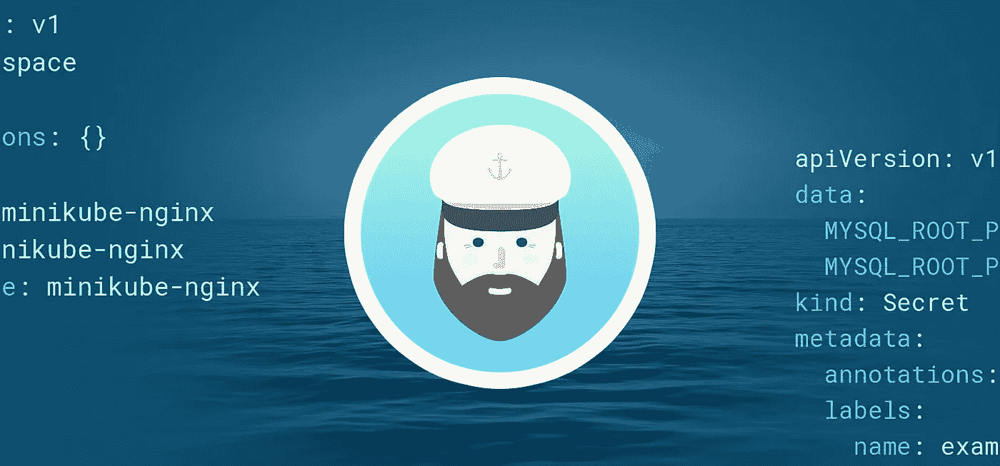
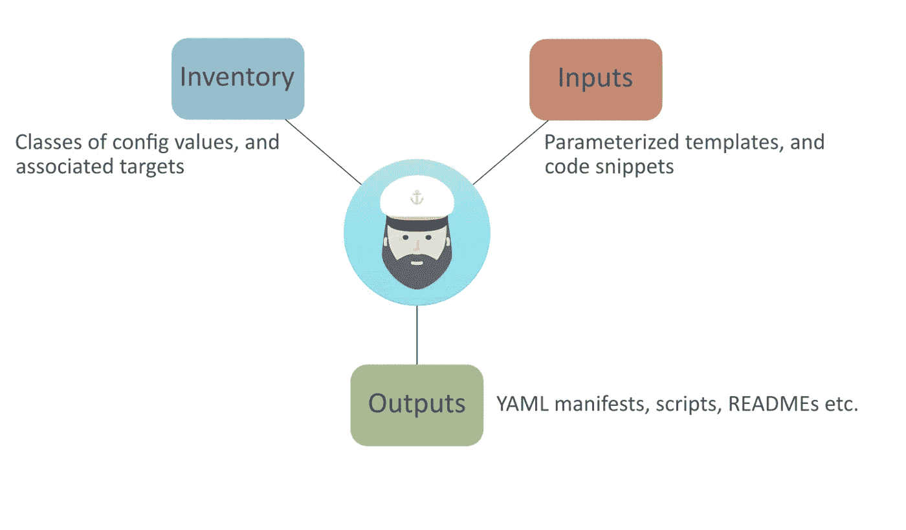

# 使用 Kapitan 进行应用配置管理

> 原文：<https://itnext.io/application-configuration-management-with-kapitan-40cb44dc4bf8?source=collection_archive---------4----------------------->

[](http://www.giantswarm.io)

如果您一直在关注 Kubernetes 中关于应用程序配置管理的这个[系列](https://blog.giantswarm.io/application-configuration-management-in-kubernetes/)，那么您应该已经对其中的一些挑战有所了解。我们已经报道了[掌舵人](https://www.giantswarm.io/blog/application-configuration-management-helm)和[草见](https://www.giantswarm.io/blog/application-configuration-management-with-kustomize)如何寻求应对这些挑战。在本文中，我们将了解另一个社区解决方案， [Kapitan](https://kapitan.dev/) 。

# 卡皮坦是什么？

Kapitan 于 2017 年开源，源于 DeepMind Health 公司(在被谷歌收购之前)，随后获得了相当大的追随者。GitHub 星级可能不是开源软件项目受欢迎程度的最可靠衡量标准，但 Kapitan 的 1150+星级表明该项目有一些切实的可信度。它可能没有 Helm 和 Kustomize 那么多的明星或贡献者，但也没有这些项目与 Kubernetes 项目的密切联系。

Kapitan 最初是作为一个技术无关的配置管理工具而设计的，但后来作为对 Helm 的明显缺点的一种补救，它开始关注 Kubernetes。虽然主要焦点是呈现 Kubernetes 资源的 YAML 配置，但它也可以呈现模板化的脚本、文档(即 READMEs)或任何其他可以表示为模板的人工制品。这种灵活性允许它同时应用于许多不同的领域。

# 卡皮坦是如何工作的

最初，Kapitan 很难让人理解，所以让我们用一个图表来帮助解释它是如何工作的。



Kapitan 是一个基于 Python 的工具，它将库存配置项与一组模板和代码融合在一起，以所需的输出来呈现工件。清单只是一组用 YAML 表示的值，可以按层次划分成类，能够引用 [Jinja](https://palletsprojects.com/p/jinja/) 模板和/或 [Jsonnet](https://jsonnet.org/) 代码。除了类之外，库存目标是为许多不同的配置元素提供关联的抽象实体。对于 Kubernetes 环境，目标是 Kubernetes 名称空间的同义词。类定义配置值，目标将这些值组合在一起。

创建 Kapitan 的动机之一是希望将所有配置保存在一个中心位置。不只是针对单个项目，而是针对所有项目。这与 Helm 形成对比，例如，在 Helm 中，所有值都倾向于特定于图表，并且不容易在不同的应用程序之间共享。因此，Kapitan 的清单可以配置为包含多个应用程序和许多不同的目标环境(例如开发、测试、生产)。不同的目标决定了在 Kapitan 编译渲染输出的过程中哪些组件会发挥作用。

使用 Jsonnet 作为模板机制也是 Kapitan 与 Kubernetes 中的应用程序配置管理相关的一个关键因素。虽然 Kapitan 最初是为了使用 Jinja 模板而开发的(并且今天仍然支持它们的使用)，但是 Jsonnet 为模板提供了一个更具表现力的环境。Jsonnet 是一种数据模板语言，它实际上是 JSON 的扩展，提供了开发人员熟悉的编程结构；库导入、函数、条件分支、变量等等。Jsonnet 语言一直被视为解决 Kubernetes 中应用程序配置管理问题的潜在因素。

让我们揭开 Kapitan 的一些关键属性。

# 可组合性

Kapitan 的一大优势是它使用了配置定义的可组合单元。通过减少为不同环境或场景复制配置的需求，这极大地有助于提高效率。可以定义不同的目标来使用与其目的相关的配置，并且可以快速配置新的应用程序或环境目标，而不必重新发明轮子。以这种方式将配置组件化有利于组合和重用。YAML 的这个片段详细描述了一个在目标中定义的假设层次结构:

```
classes: - common - component.env.qa-common - component.payment-common - component.payment-jsonnet parameters: target_name: payment-qa
```

classes 键下的每个定义都引用一个包含参数定义的单独的 YAML 文件。在呈现其输出之前，Kapitan 将库存参数组装到单个实体中进行处理(‘kapi tan inventory’命令可以在不呈现输出的情况下提供此输出)。子类定义或目标可以覆盖类中定义的参数。

显然，参数值的层次结构比等效的平面结构要好得多。此外，它可以确保在定义配置项时遵守组织策略和约定。这对团队和组织来说是一个巨大的好处，但是它需要一定程度的初始规划和持续维护。

# 模板

Kapitan 允许您编写和组织配置，这很好，但是模板是如何工作的呢？模板化是 Kapitan 的一个关键特性，也是应用程序配置管理解决方案的一个普遍接受的需求。

```
parameters: namespace: payment-qa kapitan: compile: - output_path: manifests input_type: jsonnet output_type: yaml input_paths: - components/namespace/namespace.jsonnet
```

在这个 inventory 类组件中，在所示的输入路径中引用了一些 Jsonnet 代码。该语法通知 Kapitan 期待 Jsonnet 类型的输入，并且它需要生成 YAML 作为输出，该输出将放在一个名为“manifests”的目录中(该目录位于一个以目标命名的目录下)。

```
local kube = import "lib/kube.libjsonnet"; local kap = import "lib/kapitan.libjsonnet"; local inventory = kap.inventory(); local p = inventory.parameters; { "namespace": kube.Namespace(p.namespace), }
```

相应的 Jsonnet 代码片段从两个库中导入一些代码；一个与 Kapitan 有关，另一个与模板化 Kubernetes 资源有关。在名称空间参数(' payment-qa ')被传递给' kube '之前，库存参数被分配给一个变量。“Namespace”函数，它呈现资源的 YAML。密钥“namespace”是 Kapitan 为 YAML 定义创建的文件的基本名称。假设目标名为“payment_service”，呈现的名称空间资源位于以下路径:

`./compiled/payment_service/manifests/namespace.yml`

# 输入类型

Jsonnet 是 Kapitan 的输入类型之一，让我们看看其他一些输入类型。

# 文档和脚本

除了使用 Jsonnet 代码创建 YAML 或 JSON 输出，Kapitan 还可以使用 Jinja 模板呈现工件。考虑到一个项目也可能由脚本、文档、docker 文件以及更多的东西组成。能够使用模板基于单个源产生多种细微差别的输出是非常引人注目的。

# 舵图

Kapitan 还在 2019 年下半年发布的 v0.24 中添加了对使用[舵图](https://helm.sh/)的支持，作为输入。输入类型需要指定为“helm ”,并且可以附带一个“helm _ values”YAML 对象和一个“helm _ params”YAML 对象。前者允许覆盖 Helm 图表的默认值，后者允许设置名称空间、版本名称等等。Kapitan 的舵图渲染相当于运行“舵模板”命令，但没有舵二进制本身。

定制的舵图可以存储在指定的输入路径之一，但第三方提供的现成舵图呢？这些通常位于远程仓库或[舵毂](https://hub.helm.sh/)上。Kapitan 如何处理这种情况？嗯，Kapitan 有一个内置的依赖管理器，它处理远程内容的[检索](https://kapitan.dev/external_dependencies/)。如果库存参数指定了远程图表依赖项的位置，则在“kapitan compile”命令中使用“— fetch”标志将导致 kapitan 下载图表，以供以后在呈现输出时使用。

增加掌舵人的投入是很重要的，这在成熟度方面目前被认为是 alpha。Kubernetes 的云原生应用程序提供商通常使用 Helm 作为打包他们的应用程序进行分发的首选方式。在创建消费和定制这些现成应用程序的能力时，Kapitan 为 Kubernetes 提供了消费打包应用程序的当前标准。没有它，卡皮坦将是一个远没有吸引力的提议。

# 结论

Kapitan 是应用程序配置管理领域真正的竞争对手，它提供了可靠的技术来解决围绕这个问题的各种问题。它还有其他有趣的特性，本文没有涉及到；例如，清单验证和机密管理。然而，尽管它有功能上的优势，还是有一些采用的障碍。

首先，有一个相对陡峭的学习曲线需要克服。Kapitan 使用一个目录结构，其中包含分布在许多类和目标中的配置值片段。对于门外汉来说，当你在不同的目录中添加不同的输入(Jsonnet 代码、Jinja 模板、Helm charts)时，很难看出所有不同的组件是如何联系和组合在一起的。然而，如果你能克服这个感知问题，卡皮坦对构图的运用就能带来巨大的收益。如果您希望从一个位置管理不同应用程序和环境的所有配置，这一点尤其正确。

其次，需要学习如何用 Jsonnet 编程。他们说，没有痛苦就没有收获。毕竟，如果您正在寻找应用程序配置管理的高级体验，那么有必要进行技能投资来实现它。值得指出的是，Jsonnet 作为一种语言相对简单，不应该对现有的开发人员提出太多挑战。这也是试图解决同样问题的一些其他解决方案的一个特征。

最后，值得指出的是，Kapitan 不像其他同行项目那样享有同等水平的采用和贡献。我们已经提到过，它没有通过特殊兴趣小组(SIG)或其他渠道与 Kubernetes 项目结合，它不是云原生计算基金会(CNCF)项目，似乎也没有任何大型云原生公司的贡献支持。这与其他解决方案形成了鲜明的对比，并最终可能决定其采用的程度。我们很想听听你在 Kapitan 的经历— [请保持联系](https://twitter.com/giantswarm)！

ICYMI: [第一部分——库伯尼特斯](https://www.giantswarm.io/blog/application-configuration-management-in-kubernetes/)、[第二部分——赫尔姆](https://www.giantswarm.io/blog/application-configuration-management-helm)，以及[第三部分——库斯托米泽。](https://www.giantswarm.io/blog/application-configuration-management-with-kustomize)

由 [Puja Abbassi](https://twitter.com/puja108) 撰写:开发者拥护者@ [巨型群体](https://twitter.com/giantswarm)