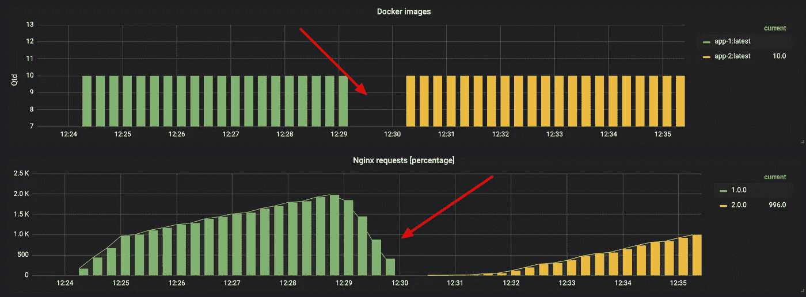
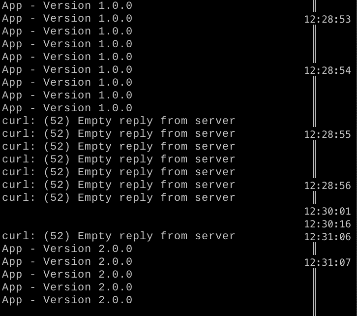
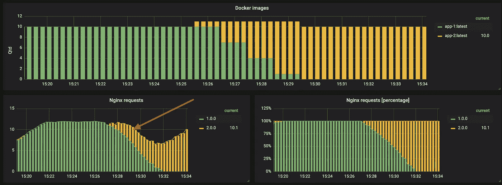
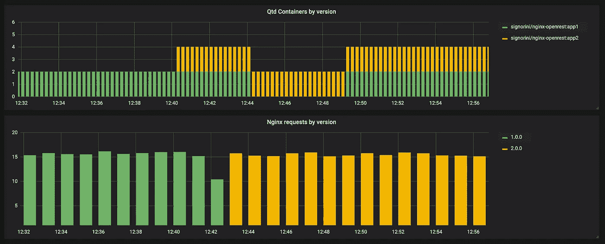
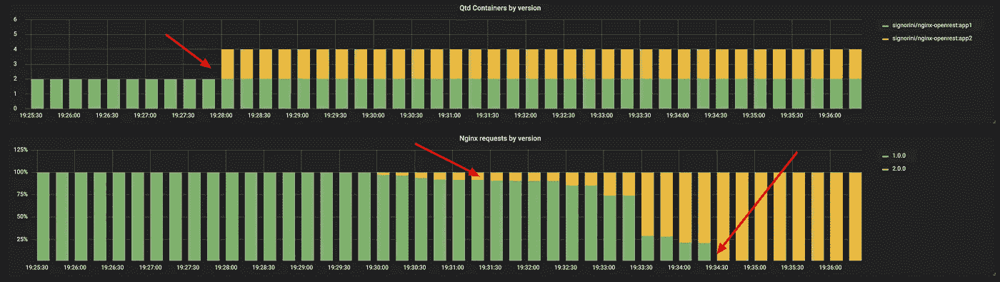
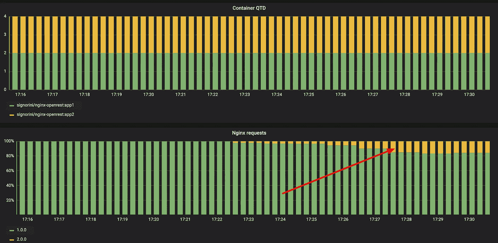
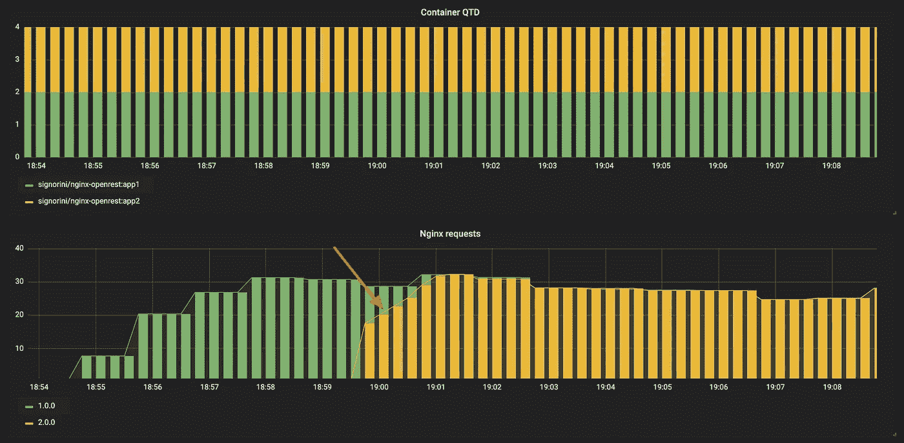

# 完整指南 Kubernetes 上的部署策略

> 原文：<https://itnext.io/application-deployment-strategies-on-kubernetes-e3f2f63e0f31?source=collection_archive---------1----------------------->

部署和管理发布的最佳策略是什么？有很多工具、方法和风格，在云上使用 *api* 或在数据中心使用简单的 *ftp* ，不同的类型和大小，大的单片或简单的 lambda 函数，一个重要的问题是为什么？为什么是现在，为什么是这个？我们有没有因为货物崇拜的感觉而痛苦？过早优化？工具？还是成熟程度？今天我们将从 kubernetes 的角度来讨论部署策略，我使用了一个简单的 minikube 环境来展示每个策略是如何工作的。

此外，指出一个版本和部署它是两码事。发布是指当您推广一个新环境并将其固有部署到 CD 管道时，发布其时间和部署方式。

**帮你选择，你可以做一些问题:**
1 —你的生命周期多久发布一次？你想说什么？
2 —这是一个紧张的系统吗？
3 —对客户的影响？
4——实施战略需要多少努力？
5 —如果发生故障，我需要多长时间进行回滚？

第一点，部署看起来很简单，然而难的部分是在现有文化上采取策略，改变工具很快，改变人很慢，大多数时候决定它的实施，相应地成熟和每个团队如何工作，然后开始一步一步地改进。

第二点是，通常我们会同时使用 2 到 3 种策略，并根据具体情况相应地改变策略。

## 大家说说吧。

*   **重建**:销毁旧版本，升级新版本。
*   **滚动更新**:版本 **b** 缓慢推出，取代版本 **a** 。
*   **蓝色/绿色**:新版本与旧版本一起发货，流量关闭。
*   **金丝雀发布**:新版 its 部署到一部分用户，并逐渐增加所有用户。
*   **A/B 版本**:金丝雀版本，由特定条件定义的子集。
*   **屏蔽**:流量发送到两个版本，版本 **b** 不影响响应。

> 你可以在[GitHub-Kubernetes 部署](https://github.com/Signorini/k8s-deployment-strategies)中查看每个例子的代码

使用 naive k8s 策略策略重新创建

## [再造**【走马更新】** :](https://github.com/Signorini/k8s-deployment-strategies/tree/master/recreated)

这是一个虚拟版本，包括关闭版本 a 和打开版本 b，使用相同的资源，导致停机，这在今天很奇怪，但这种策略非常常用，安排维护时间和关闭应用程序[记住通过 ftp 复制和传递文件]。这是部署服务最便宜的方式。
我们建议不要进行这种部署。通常情况下，停机时间会使您的客户长期无法使用您的服务。

**为**效力

-开发环境

**为坏**

*   嗯，swift off v1 到 v2 之间有停机时间。

[**您可以使用策略类型重建其内置的 Kubernetes**](https://github.com/Signorini/k8s-deployment-strategies/tree/master/recreated) 来重建部署

使用简单的 k8s 部署进行首次展示

## [滚动更新【更少的资源而不中断】:](https://github.com/Signorini/k8s-deployment-strategies/tree/master/rolling)

在此过程中，您会慢慢地将一个服务替换为一个新版本，通常是移除池中的一台机器，用新版本更新软件，然后放回池中。当系统有状态时非常有用，重新平衡数据，可以获得 0 停机时间，并且不像 blue 或 canary 版本那样请求双重资源，担心难以测试多个版本，难以处理数据模式和主要版本。

**与**一样好

*   升级第三方服务
*   错误修复版本
*   不要有额外的资源成本。

> AWS Code Deploy、spinnaker、kubernetes 等工具默认使用滚动更新来切换版本。
> 
> 滚动发布的主要缺点是，在发布过程中，你会遇到不一致的情况。

[**这是进行部署的直接方式，请看这个例子**](https://github.com/Signorini/k8s-deployment-strategies/tree/master/rolling)

使用 naive k8s 选择器的蓝色/绿色

## [蓝色/绿色【最适合主要版本】:](https://github.com/Signorini/k8s-deployment-strategies/tree/master/blue-green)

版本 **b** 与版本 **a** 一起部署，之后所有流量 a 需求将切换到新版本，这是一个更安全的部署，您可以进行测试，回滚将很简单，关注点归结为每次部署时资源利用率翻倍，这取决于部署发生的频率，此策略可能很昂贵。

**与**一样好

*   避免版本问题。
*   适用于主要版本。

一个诀窍是，蓝/绿部署不限于机器，可以在任何级别完成，从群集到服务，在过去，在同一台机器和交换机端口上运行两个版本是很常见的。

**坏于:**

*   如果部署生命周期很短，那么每次发布都要花费双倍的资源。
*   与滚动/重新创建版本相比，更新通常需要时间。
*   要求工程师努力引导蓝/绿部署。

[**实现蓝/绿部署的最快方法是使用选择器，勾选此处。**](https://github.com/Signorini/k8s-deployment-strategies/tree/master/blue-green)

使用 k8s 入口的金丝雀释放

## [金丝雀发布【低风险更新版本】](https://github.com/Signorini/k8s-deployment-strategies/tree/master/canary):

canary 版本包括与版本 a 一起部署版本 b，但是将用户子集路由到新版本，您可以从很小的百分比开始，1%到新版本，99%到旧版本，并相应地增加该值，当您不知道新版本的影响时，此版本是非常好的，需要时间来完成部署，处理部署流程可能很昂贵，并且通常部署非常慢，通常比首次展示部署慢。

**与**一样好

*   不可预测的行为
*   压力系统

这在工程工作中可能非常昂贵，并且如果没有诸如服务网格之类的协调平台，很难进行金丝雀部署。

你可以用 nginx ingress 做一个金丝雀释放，点击这里。

使用 k8s 入口的 A/B 测试

## [A/B 发布【最佳测试新功能】](https://github.com/Signorini/k8s-deployment-strategies/tree/master/dark-release/ingress):

A/B 测试非常类似于金丝雀发布，通常用于基于统计和数据的业务决策，而不是部署本身。从技术角度来看，实现与 canary 版本相同，a/b 版本包括基于一些参数标记用户池，使用 cookie/header 等进行跟踪并发送特定版本，每组可以有两个或更多。

像 [Istio](https://www.istio.io/) 这样的服务网格提供了一种更细粒度的方法，通过基于 HTTP 头的动态请求路由来细分服务实例。

**好于:**

*   强大的商业
*   几个版本并行运行
*   完全控制流量分配

[**实现 a/b 部署最快的方法是使用 nginx ingress，查看这里。**](https://github.com/Signorini/k8s-deployment-strategies/tree/master/canary)

使用 Istio 在两个应用程序之间创建阴影

## [影子版本【无影响/无风险测试高关键服务】:](https://github.com/Signorini/k8s-deployment-strategies/tree/master/shadow)

流量阴影是一种部署模式，其中生产流量被异步复制到非生产服务进行测试。它可以适用于测试关键应用程序的情况，或者难以恢复的应用程序(如支付网关)适用于持续服务、性能测试和/或没有 swift 数据的行为，或者在没有影响的情况下控制流程。

**为好:**

*   在没有任何影响的情况下测试关键服务，如支付。
*   不需要同步/快速数据。
*   完全控制流量分配

[**使用镜像功能找出 Istio，可以得到一个影子部署。**](https://github.com/Signorini/k8s-deployment-strategies/tree/master/shadow)

## 最后，迎头赶上

我们有多种策略，各有利弊，早期的预算和时间投入通常是一个重要的使用价值。然而，Kubernetes 和 Istio/App Mesh 等工具的出现使每个公司的实施变得更加容易，现在我们可以根据不同的情况为相同的应用程序选择多种类型的部署，小的更改可以通过滚动发布来完成，大的更改可以通过蓝色/绿色来完成，新的功能可以通过 A/B 来处理，新的提供商可以使用影子发布来测试。

## 来源

集装箱解决方案做得很好

*   [关于部署策略的博客](https://blog.container-solutions.com/kubernetes-deployment-strategies)
*   [K8s 部署策略](https://blog.container-solutions.com/kubernetes-deployment-strategies)

开发到

*   [岗位部署策略](https://dev.to/mostlyjason/intro-to-deployment-strategies-blue-green-canary-and-more-3a3)

容器周，我得到了 openrest 的例子

*   [Github — Openrest 与 prometheus](https://github.com/badtuxx/k8s-canary-deploy-example)

谢谢大家！费利佩·克勒克·西格诺里尼