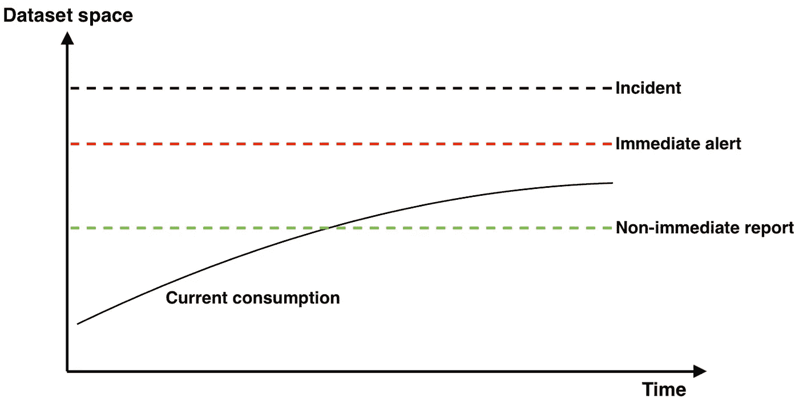

# 我希望以前有过的应用程序监控

> 原文：<https://itnext.io/application-monitoring-i-wish-i-had-before-ce9b305c636c?source=collection_archive---------4----------------------->

***免责声明:*** *故事涵盖了一般概念，构成了方便监控系统的基础。像 Prometheus/Grafana 设置属性这样的实现细节不在讨论范围之内。*

Tobias Jussen 在 [Unsplash](https://unsplash.com/?utm_source=unsplash&utm_medium=referral&utm_content=creditCopyText) 上拍摄的照片

最近，我为几个生产服务重新设计和实现了应用程序监控。我对结果很满意，以下是我的要点:

# #0:收集足够的数据

## 从内外观察你的系统

根据设计，应用程序无法完全监控自身。例如，web 应用程序路由器不希望出现特殊符号，并且在不增加错误计数器的情况下安静地崩溃。除非您有可以从外部观察服务器的东西(反向代理、负载平衡器、客户端)，否则您不会注意到问题。另一方面，你不能只从外部观察系统，因为一些细节是内在隐藏的。

## 将最重要的传感器集中在一个地方

很有可能在发生事故时，你会得到一个警报，它很少或根本没有提到原因，因此不会帮助你找出如何稳定你的系统。这就是为什么将重要的传感器集中在一个容易看到的地方非常重要。

慢慢来，思考可能出现的问题，回顾以前的事件，组装相应的传感器。随着你的系统和相关知识的增长，不要忘记重温它。

# #1:当事情变糟需要立即采取行动时，发送通知

## 提高警报的反应能力

发生事故时，应尽快发送警报—更快的反应意味着更短的事故持续时间。这在很大程度上取决于 alert 的表达式，例如，计算平均值会降低反应速度，计算大窗口的指标也会降低反应速度。

相对较小窗口上的百分位数应该是您的首选。

## 警报应代表被破坏的 SLO/用户体验

不要对一些隐藏的潜在前兆发出警报，比如 GC 计时的轻微增加。GC 本身是无害的，**除非你的服务 SLO 因为它而被攻破。**

如果您的 SLO 警报是反应性的，并且 GC 降级到足以影响用户——无论如何您都会收到通知。**但当用户不受影响时，问题可以等一等。**

# #2:当不需要立即行动时，不要发送通知

## 过度信息谬误

有时候，人们决定他们想得到每一件事情的通知。最终你会开始忽略它们，并且会错过一个重要的，这就是大脑的工作方式。不要上当。

[@ chairufajar _](https://unsplash.com/@chairulfajar_?utm_source=unsplash&utm_medium=referral&utm_content=creditCopyText)在 [Unsplash](https://unsplash.com/?utm_source=unsplash&utm_medium=referral&utm_content=creditCopyText) 上的照片

## 重新设计假阴性警报

警告没有严重原因的哔哔声是最糟糕的。这分散了工程师的注意力，使他们不愿意对警报做出反应。这发生在我身上一次，这是我一生中最愚蠢的事件。

通常，当至少有一种情况属实时，警报是不可靠的:

*   单个阈值违规时触发警报
*   首先评估指标，然后汇总
*   在非峰值期间，可测量值向尾部移动

评估一个窗口内的数据(非高峰时数据会变大)或等待几个连续的结果应该可以解决问题。

请记住，这与反应性完全相反**:更大的窗口意味着更低的反应性，更小的窗口意味着更多的假阴性警报。**达到平衡需要时间，但值得。

## 考虑警报范围粒度

如果您部署了许多无状态实例，比如每个可用性区域有 3 个以上的实例，那么当其中一个出现故障时，您不需要得到通知。系统本身应该容许微小的误差。进行适当的容量规划，设置足够的超时、重试和断路器应该可以做到。

针对每个实例配置的警报是彻底审查的主题。

## 独立的警报通道

虽然我批评了广泛的警报，但了解您的系统发生了什么是至关重要的(我怎么强调都不为过！)，你只是不需要直接了解它——使用异步通道。

# #3:观察趋势并提前采取必要行动的能力

远距离趋势，如 cpu 消耗、连接池大小和数据库中存储的数据量，不需要立即采取措施，可以通过以下方式进行检查:

1.  人工:每天/每周重新查看所有仪表板。无法随着传感器和应用数量的增加而很好地扩展
2.  半自动:克隆相应的警报并设置较低的阈值。然后将其附加到单独的通道，在那里进行重复数据删除，汇总到单个报告中，并每天/每周发送

不同的警报如何相互关联

当我把这些整合在一起时，我发现做一名随叫随到的工程师并不一定是一场噩梦:)

感谢阅读，希望你学到了有用的东西！