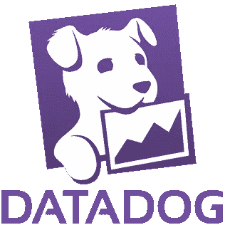
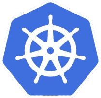
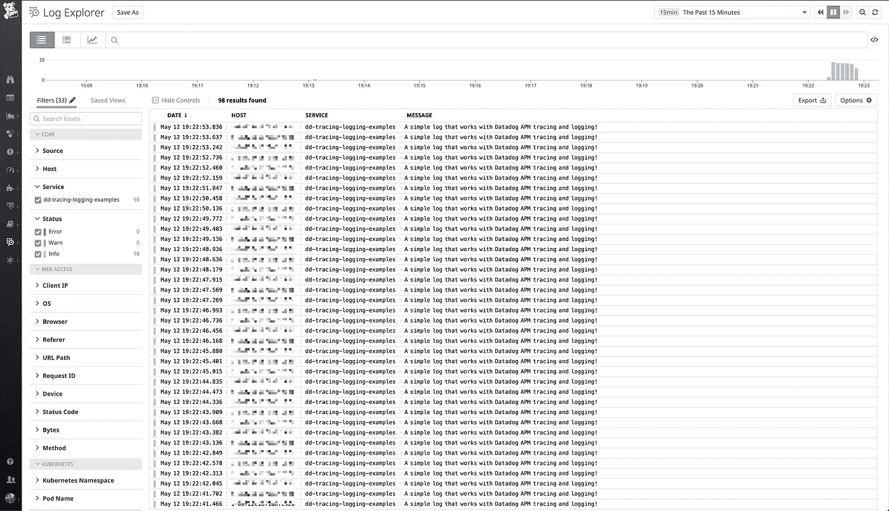
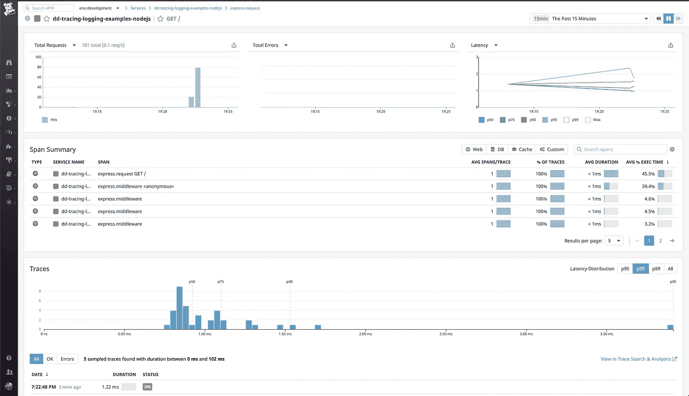
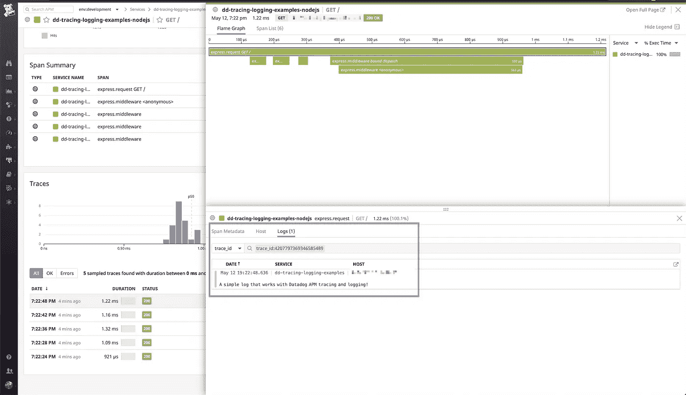

# 使用 Datadog APM 和日志记录在 Kubernetes 中观察应用程序——一个简单可行的示例

> 原文：<https://itnext.io/application-observability-in-kubernetes-with-datadog-apm-and-logging-a-simple-and-actionable-790ee8aefe29?source=collection_archive---------6----------------------->



去年我与 Istio 和 Jaeger 分享了一个如何在 Kuberntes 中实现[应用追踪的例子。在那之后，业界在这方面取得了一些实质性的进展，结果我们看到了更多的供应商支持。在 Buffer 中，由于我们主要使用](/when-istio-meets-jaeger-an-example-of-end-to-end-distributed-tracing-2c136eb335eb) [Datadog](https://www.datadoghq.com/) 进行 Kubernetes 和应用程序监控，因此只需要使用 [Datadog APM](https://docs.datadoghq.com/tracing/) 和[日志](https://docs.datadoghq.com/logs/)来完成这个循环。我有机会为团队创造了一个小例子，并非常乐意与社区分享。

好了，事不宜迟，我们开始吧！

# 安装 Datadog 代理

首先，为了从 Kubernetes 收集指标和日志，必须在集群中安装一个 Datadog 代理。Datadog 团队为我们简化了这一过程。除了遵循本指南中的[之外，别无他法。我建议](https://docs.datadoghq.com/agent/kubernetes/)[部署为守护集](https://docs.datadoghq.com/agent/kubernetes/daemonset_setup/?tab=k8sfile)，因为这就是我们所需要的。主机级部署不在本文讨论范围之内。如果您真的想知道，它会使用`[kube_state_metrcis](https://github.com/kubernetes/kube-state-metrics)`在集群级别监控更多指标。

因为我们需要启用 APM 和日志记录，所以需要在 DaemonSet 上设置两个环境变量。

## 对于 APM(跟踪)

在容器环境变量部分下，添加以下内容

```
- name: DD_APM_ENABLED
  value: 'true'
```

## 用于记录

与 APM 类似，我们需要打开标志来告诉 Datadog 代理捕获日志

```
- name: DD_LOGS_ENABLED 
  value: 'true'
```

目前为止非常简单是吗？让我们试着保持下去！现在我们可以有把握地假设 Datadog 代理将完成它的工作。让我们转到应用程序检测。

# APM 和日志记录的工具

我有一个梦想，有一天这个重要的步骤可以被完全跳过。想象一下，如果有一种方法可以让监控代理接入另一个运行时，而无需担心安全性。不幸的是，尽管事情已经有了很大的改善，但现在这还不太可能。在这个例子中，我致力于提供最简单的方法来开始工作。这是我对你的承诺。

现在，让我们看看代码(在 node.js 中)

## 对于 APM

这就是我们所需要的！第 1–7 行告诉软件包将跟踪发送到当前安装在主机(`process.env.DD_AGENT_HOST`)端口 8126 上的 Datadog 代理。稍后，我将向您展示如何设置环境变量。恭喜你发现了这个！

5 号线在我看来相当神奇。该标志将跟踪与其执行期间生成的相关日志结合起来。它们将在 Datadog 接口上很好地表现出来。有了这个，我们将能够更有效地进行诊断。

第 6 行将把痕迹放到[分析](https://docs.datadoghq.com/tracing/trace_search_and_analytics/)中，这样它们就可以被标记，方便搜索。

APM 部分到此为止。我希望它足够简单。现在让我们继续记录。

## 用于记录

你猜怎么着？根本不需要任何仪器。只需使用您选择的记录器(我用的是[温斯顿](https://www.npmjs.com/package/winston))，Datadog 代理就会很高兴地自动采集数据。在我的例子中，我甚至没有在文件级别记录事情。我所要做的就是从第 10–13 行创建一个格式，为每个日志添加一个标记。这将帮助我们更容易地过滤感兴趣的日志。

到目前为止还好吗？现在我们来谈谈对 Kubernetes 的实际部署。

# 部署应用程序

我喜欢简单。我希望我们仍然在同一页上。Kubernetes 部署文件也非常简单。

如果您还记得告诉`dd-trace`应该将指标发送到哪里的环境变量。这就是奇迹发生的地方。第 17 - 21 行将主机 IP 设置为应用程序可以使用的环境变量。

# 尝试新事物

我了解到 Datadog APM 并不总是为每个请求生成一个跟踪。相反，对[请求进行采样](https://docs.datadoghq.com/tracing/guide/trace_sampling_and_storage/)。正因为如此，我们不能指望几次点击一个端点就能看到生成的痕迹。然而，如果我们使用一个简单的基准测试工具，这是可以解决的。在这里，让我们使用 [Apache 基准](https://httpd.apache.org/docs/2.4/programs/ab.html)

这将向应用程序抛出 100 个请求，以确保生成一些跟踪。根据我的经验，结果会生成大约 6–10 条跟踪。这对于一个概念验证来说已经足够了。

# 利润

现在，一切都设置正确。让我们看看我们将在 Datadog UI 上看到什么。



酷！原木大量涌入。来看看痕迹吧！



厉害！他们也在这里。最棒的是，它们已经与运行时生成的日志相关联。就是这样！很好很容易！



# 结束语

我们都喜欢 Kubernetes 的应用程序和资源管理能力。然而，如果没有良好的应用程序可观察性，它可能会损害开发人员的速度，充其量使它成为一个时髦的词。这甚至会给开发人员和产品工程团队增加不必要的压力。幸运的是，随着生态系统的成熟，我们看到了更多的供应商支持，因此诞生了这篇文章。我对正在进行的轨迹感到非常兴奋。

你可以在 https://github.com/bufferapp/dd-tracing-logging-examples 找到这篇文章的完整源代码。干杯！

*最初发表于*[T5【http://github.com】](https://gist.github.com/stevenc81/918207547ca22b8c86ff34e8e79e953a)*。*